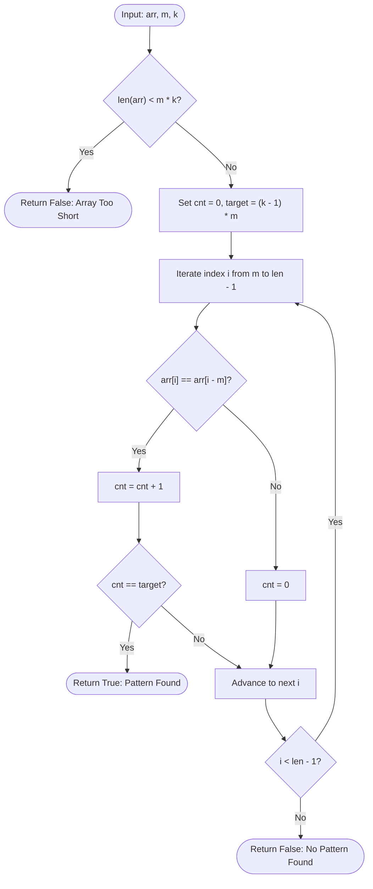

# Guided Example: Detect Pattern of Length M Repeated K or More Times

## 1. Instance & Teaching Goal

We are given an integer array $\text{arr}$, a pattern block length $m$, and a required repetition count $k$. We must determine whether there exists any starting index $s$ such that a contiguous subarray of length $m$ appears at least $k$ times consecutively without gaps or alterations:
$$\text{arr}[s + r \cdot m + p] = \text{arr}[s + p] \quad \text{for all } 0 \le p < m \text{ and } 0 \le r < k$$

We choose the representative instance:
$$\text{arr} = [1, 2, 1, 2, 1, 1, 1, 3], \quad m = 2, \quad k = 2$$

Here $N = 8$, block length $m = 2$, and required repetitions $k = 2$. The expected return value is:
$$\text{true}$$

Our teaching goal is to walk through the periodic differential streak algorithm. Instead of repeatedly slicing and comparing blocks of size $m \cdot k$ costing $\mathcal{O}(N \cdot m \cdot k)$, we demonstrate how periodic repetition is mathematically equivalent to a continuous streak of $(k - 1) \cdot m$ equality checks between elements separated by offset $m$: $\text{arr}[i] == \text{arr}[i - m]$. This reduces pattern detection to a single-pass $\mathcal{O}(N)$ linear scan.

## 2. Conceptual Foundation & Invariants

A sequence of $k$ adjacent identical blocks of length $m$ occupies a total contiguous span of $L = k \cdot m$ elements starting at index $s$.
For every index $i$ in the range $[s + m, s + k \cdot m - 1]$:
$$\text{arr}[i] = \text{arr}[i - m]$$
The number of elements in this index interval is:
$$\text{target} = (s + k \cdot m - 1) - (s + m) + 1 = (k - 1) \cdot m$$

```
+-------------------------------------------------------------------------+
|                  OFFSET-M PERIODIC STREAK DETECTOR                      |
|                                                                         |
| Array: [ 1,  2,  1,  2,  1,  1,  1,  3 ]                                |
| idx:     0   1   2   3   4   5   6   7                                  |
|          ^   ^                                                          |
|          |   |   Offset m = 2 comparisons:                              |
|          +---|--- arr[2] == arr[0] ?  1 == 1  (streak = 1)              |
|              +--- arr[3] == arr[1] ?  2 == 2  (streak = 2)              |
|                                                                         |
| Required streak: target = (k - 1) * m = (2 - 1) * 2 = 2                 |
| Streak reaches 2 at index 3 ==> Valid pattern [1, 2] repeated 2 times! |
| Return True immediately.                                                |
+-------------------------------------------------------------------------+
```

### State Parameter Reference

| Parameter | Type | Domain | Significance in Linear Scanner |
|---|---|---|---|
| $m$ | Integer | $[1, 100]$ | Periodic stride (pattern block length) |
| $k$ | Integer | $[2, 100]$ | Repetition factor required |
| $\text{target}$ | Integer | $(k - 1) \cdot m$ | Threshold count of consecutive offset matches required |
| $i$ | Integer | $[m, N-1]$ | Active comparison index |
| $\text{arr}[i - m]$ | Integer | Element value | Reference value from previous period |
| $\text{cnt}$ | Integer | $[0, \text{target}]$ | Active contiguous streak of matching pairs $\text{arr}[i] == \text{arr}[i - m]$ |

> [!IMPORTANT]
> **Streak Equivalence Invariant**:
> A contiguous streak of $(k - 1) \cdot m$ consecutive matches $\text{arr}[i] == \text{arr}[i - m]$ ending at index $i^*$ guarantees that the subarray spanning $[i^* - k \cdot m + 1, i^*]$ consists of exactly $k$ consecutive copies of the length-$m$ block $\text{arr}[i^* - k \cdot m + 1 \dots i^* - (k - 1) \cdot m]$. If any comparison fails ($\text{arr}[i] \neq \text{arr}[i - m]$), the streak resets to $0$.



## 3. Step-by-Step Worked Execution

We trace $\text{arr} = [1, 2, 1, 2, 1, 1, 1, 3]$ with $m = 2, k = 2$:
- Length $N = 8 \ge m \cdot k = 4$.
- Target streak threshold: $\text{target} = (2 - 1) \cdot 2 = 2$.
- Initial state: $\text{cnt} = 0$.

### Iteration $i = 2$ (First Valid Comparison Index)
- Compare $\text{arr}[2]$ against $\text{arr}[2 - 2] = \text{arr}[0]$:
  - $\text{arr}[2] = 1$, $\text{arr}[0] = 1$.
  - Match: $1 == 1$.
- Increment streak: $\text{cnt} = 0 + 1 = 1$.
- Check target: $\text{cnt} = 1 < \text{target} = 2$.
- Status: Ongoing streak of length 1.

### Iteration $i = 3$
- Compare $\text{arr}[3]$ against $\text{arr}[3 - 2] = \text{arr}[1]$:
  - $\text{arr}[3] = 2$, $\text{arr}[1] = 2$.
  - Match: $2 == 2$.
- Increment streak: $\text{cnt} = 1 + 1 = 2$.
- Check target: $\text{cnt} = 2 == \text{target} = 2$.
- Condition satisfied!
- Early termination: A valid pattern of length $m = 2$ repeated $k = 2$ times is detected across indices $[0 \dots 3]$, corresponding to $[1, 2]$ followed by $[1, 2]$.
- Return $\text{true}$.

### Comparative Non-Matching Example Trace (Example 3)
To observe streak resetting, consider $\text{arr} = [1, 2, 1, 2, 1, 3]$ with $m = 2, k = 3$:
- Target $= (3 - 1) \cdot 2 = 4$.
- $i = 2$: $\text{arr}[2] == \text{arr}[0] \implies 1 == 1 \implies \text{cnt} = 1$.
- $i = 3$: $\text{arr}[3] == \text{arr}[1] \implies 2 == 2 \implies \text{cnt} = 2$.
- $i = 4$: $\text{arr}[4] == \text{arr}[2] \implies 1 == 1 \implies \text{cnt} = 3$.
- $i = 5$: $\text{arr}[5] == \text{arr}[3] \implies 3 == 2$ is False!
  - Mismatch: $\text{cnt}$ resets to $0$.
- Loop finishes with no streak reaching $4$. Returns $\text{false}$.

## 4. Complete Execution Trace

The table below catalogs every step of the evaluation on the primary instance $\text{arr} = [1, 2, 1, 2, 1, 1, 1, 3]$ with $m = 2, k = 2$.

| Step / Index $i$ | $\text{arr}[i]$ | Offset Index $i - m$ | $\text{arr}[i - m]$ | Equality Test | Previous Streak $\text{cnt}$ | New Streak $\text{cnt}$ | Target Threshold | Condition $(\text{cnt} == \text{target})$ | Action |
|---|---|---|---|---|---|---|---|---|---|
| Start | - | - | - | - | 0 | 0 | 2 | False | Initialize scanner |
| $i = 2$ | 1 | 0 | 1 | $1 == 1$ (True) | 0 | 1 | 2 | False | Continue |
| $i = 3$ | 2 | 1 | 2 | $2 == 2$ (True) | 1 | 2 | 2 | **True** | **MATCH CONFIRMED: Return True** |

### Verified Subarray Structure

$$\text{Subarray}[0 \dots 3] = [\underbrace{1, 2}_{\text{Block 1}}, \underbrace{1, 2}_{\text{Block 2}}]$$
- Block 1: $\text{arr}[0 \dots 1] = [1, 2]$
- Block 2: $\text{arr}[2 \dots 3] = [1, 2]$
Both blocks have length $m = 2$ and are identical.

## 5. Algorithmic Correctness

### Soundness (Streak Sufficiency)

Suppose at index $i^*$, the streak counter reaches $\text{cnt} = (k - 1) \cdot m$.
This implies that for all indices $j$ such that $i^* - (k - 1) \cdot m < j \le i^*$:
$$\text{arr}[j] = \text{arr}[j - m]$$
Let $s = i^* - k \cdot m + 1$.
Consider any position $p \in \{0, \dots, m - 1\}$.
By definition, for any repetition index $r \in \{1, \dots, k - 1\}$:
The index $j = s + r \cdot m + p$ satisfies $s + m \le j \le i^*$.
Therefore, $\text{arr}[s + r \cdot m + p] = \text{arr}[s + (r - 1) \cdot m + p]$.
By transitivity of equality across $r = 1, 2, \dots, k - 1$:
$$\text{arr}[s + r \cdot m + p] = \text{arr}[s + p] \quad \text{for all } r \in \{0, \dots, k - 1\} \text{ and } p \in \{0, \dots, m - 1\}$$
This proves that the block of length $m$ starting at $s$ is repeated exactly $k$ consecutive times, satisfying the definition of a valid pattern.

### Completeness (Streak Necessity)

Suppose there exists a valid pattern of length $m$ repeated $k$ times starting at index $s^*$.
Then for every $r \in \{1, \dots, k - 1\}$ and every $p \in \{0, \dots, m - 1\}$:
$$\text{arr}[s^* + r \cdot m + p] = \text{arr}[s^* + (r - 1) \cdot m + p]$$
Every index in the contiguous range $[s^* + m, s^* + k \cdot m - 1]$ satisfies $\text{arr}[i] == \text{arr}[i - m]$.
This range contains exactly $(k - 1) \cdot m$ consecutive matching indices.
As the loop traverses through these indices without any mismatch, $\text{cnt}$ will strictly increment by $1$ at each step, reaching $(k - 1) \cdot m$ at index $s^* + k \cdot m - 1$.
Therefore, the streak counter is guaranteed to reach the target, ensuring no valid pattern is missed.

## 6. Traps This Instance Exposes

1. **Quadratic Slicing Overhead**:
   Comparing slices of size $m \cdot k$ at every starting index $i$ requires $\mathcal{O}(N \cdot m \cdot k)$ operations. When $N = 100, m = 100, k = 100$, slicing creates unnecessary array copies. The single-pass comparison executes in $\mathcal{O}(N)$ without allocations.

2. **Allowing Gaps or Phase Shifts**:
   Patterns must be contiguous and adjacent. If one tests whether pattern $P$ appears at $s_1$ and then at $s_2$ with an arbitrary gap ($s_2 > s_1 + m$), the repetition is invalid. Maintaining a contiguous streak $\text{cnt}$ guarantees strict adjacency without gaps.

3. **Insufficient Length Pre-check**:
   If $\text{len}(\text{arr}) < m \cdot k$, no valid pattern can possibly fit. Bypassing this check may cause subtle index out-of-bounds or zero-target anomalies.

4. **Target Calculation Off-by-One**:
   The number of equality checks between adjacent blocks is $(k - 1) \cdot m$, not $k \cdot m$. The first block does not compare against any preceding block; $k$ blocks require only $k - 1$ transition shifts of length $m$.

## 7. Complexity Derivation

### Time Complexity

Let $N$ be the length of $\text{arr}$ ($N \le 100$).
- Initial guard check $\text{len}(\text{arr}) < m \cdot k$ takes $\mathcal{O}(1)$ time.
- The single loop begins at index $m$ and finishes at index $N - 1$, executing at most $N - m \le N$ iterations.
- In each iteration, comparing $\text{arr}[i] == \text{arr}[i - m]$ and adjusting the integer counter $\text{cnt}$ takes $\mathcal{O}(1)$ time.

Total time complexity is strictly:
$$\mathcal{O}(N)$$
For $N = 100$, the scan executes in less than 1 millisecond.

### Auxiliary Space Complexity

- The algorithm maintains scalar integer counters for $\text{cnt}$, $\text{target}$, and loop index $i$.
- No subarrays, strings, hash sets, or recursion stacks are allocated.

Total auxiliary space complexity is strictly:
$$\mathcal{O}(1)$$
Optimal in both time and space.
