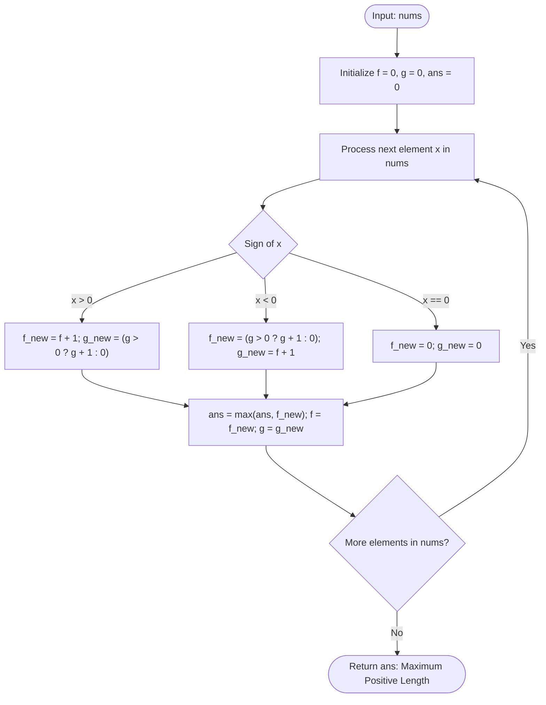

# Guided Example: Maximum Length of Subarray With Positive Product

## 1. Instance & Teaching Goal

We are given an integer array $\text{nums}$ of length $N$. We must find the maximum length of a contiguous, non-empty subarray whose element product is strictly positive ($> 0$). If no such subarray exists, we return $0$.

We select the representative instance containing a zero barrier and multiple negative numbers:
$$\text{nums} = [0, 1, -2, -3, -4]$$

The maximum length of a contiguous subarray with a positive product is:
$$3$$
(Achieved by the subarray $[1, -2, -3]$, whose product is $1 \times (-2) \times (-3) = +6 > 0$).

Our teaching goal is to demonstrate paired-state dynamic programming for sign tracking. We show why computing raw numeric products leads to explosive arithmetic overflow, how sign algebra reduces the problem to tracking lengths of positive and negative suffix chains, and how zeros act as hard partitioning barriers.

## 2. Conceptual Foundation & Invariants

Let $f[i]$ denote the maximum length of a contiguous subarray ending at index $i$ whose product is strictly positive ($> 0$).
Let $g[i]$ denote the maximum length of a contiguous subarray ending at index $i$ whose product is strictly negative ($< 0$).
If no valid ending subarray with that sign exists, the value is $0$.

### Sign Multiplication Transitions

- **Case 1: $\text{nums}[i] > 0$**
  Multiplying by a positive number preserves signs:
  - Positive suffix extends: $f[i] = f[i-1] + 1$
  - Negative suffix extends (if one existed): $g[i] = g[i-1] + 1$ if $g[i-1] > 0$, else $0$

- **Case 2: $\text{nums}[i] < 0$**
  Multiplying by a negative number flips signs:
  - Previous negative suffix becomes positive: $f[i] = g[i-1] + 1$ if $g[i-1] > 0$, else $0$
  - Previous positive suffix becomes negative: $g[i] = f[i-1] + 1$

- **Case 3: $\text{nums}[i] == 0$**
  Zero annihilates product signs:
  - $f[i] = 0, \quad g[i] = 0$

```
+-------------------------------------------------------------------------+
|                  DUAL-STATE SIGN LENGTH TRACKER                         |
|                                                                         |
| Array: [  0,   1,  -2,  -3,  -4 ]                                       |
| idx:      0    1    2    3    4                                         |
|                                                                         |
| f (pos):  0    1    0    3    2    ==> Max Positive Length = 3          |
| g (neg):  0    0    2    1    4                                         |
|                                                                         |
| Transition at -3 (i = 3):                                               |
|   Negative number flips signs!                                          |
|   f[3] = g[2] + 1 = 2 + 1 = 3   (corresponds to [1, -2, -3])            |
|   g[3] = f[2] + 1 = 0 + 1 = 1   (corresponds to [-3])                   |
+-------------------------------------------------------------------------+
```

### State Parameter Reference

| Parameter | Type | Domain | Significance in Dynamic Programming |
|---|---|---|---|
| $i$ | Integer | $[0, N-1]$ | Active index along the array |
| $\text{nums}[i]$ | Integer | Signed value | Incoming element whose sign drives transition |
| $f[i]$ | Integer | $[0, N]$ | Length of longest contiguous subarray ending at $i$ with product $> 0$ |
| $g[i]$ | Integer | $[0, N]$ | Length of longest contiguous subarray ending at $i$ with product $< 0$ |
| $\text{ans}$ | Integer | $[0, N]$ | Global running maximum of positive lengths: $\max_i f[i]$ |

> [!IMPORTANT]
> **State Inversion Invariant**:
> For any index $i$, $f[i]$ and $g[i]$ accurately reflect the maximal span of non-zero elements immediately preceding $i$ whose product parity is even and odd, respectively. Whenever $\text{nums}[i] = 0$, both chains collapse to $0$, ensuring that zero is never included in any candidate subarray.



## 3. Step-by-Step Worked Execution

We trace the state progression on $\text{nums} = [0, 1, -2, -3, -4]$.

### Index $i = 0$: $\text{nums}[0] = 0$
- Element is zero.
- Product with zero is zero (neither positive nor negative).
- State: $f[0] = 0, g[0] = 0$.
- Running best: $\text{ans} = \max(0, 0) = 0$.

### Index $i = 1$: $\text{nums}[1] = 1$
- Element is positive ($1 > 0$).
- Positive extends positive: $f[1] = f[0] + 1 = 0 + 1 = 1$.
- Negative extends negative: $g[0] = 0 \implies g[1] = 0$ (no previous negative existed).
- State: $f[1] = 1, g[1] = 0$.
- Running best: $\text{ans} = \max(0, 1) = 1$.

### Index $i = 2$: $\text{nums}[2] = -2$
- Element is negative ($-2 < 0$).
- Negative flips previous negative into positive:
  $g[1] = 0 \implies$ no previous negative exists to flip, so $f[2] = 0$.
- Negative flips previous positive into negative:
  $g[2] = f[1] + 1 = 1 + 1 = 2$ (representing the subarray $[1, -2]$).
- State: $f[2] = 0, g[2] = 2$.
- Running best: $\text{ans} = \max(1, 0) = 1$.

### Index $i = 3$: $\text{nums}[3] = -3$
- Element is negative ($-3 < 0$).
- Negative flips previous negative into positive:
  $g[2] = 2 > 0 \implies f[3] = g[2] + 1 = 2 + 1 = 3$ (representing $[1, -2, -3]$).
- Negative flips previous positive into negative:
  $g[3] = f[2] + 1 = 0 + 1 = 1$ (representing $[-3]$).
- State: $f[3] = 3, g[3] = 1$.
- Running best: $\text{ans} = \max(1, 3) = 3$.

### Index $i = 4$: $\text{nums}[4] = -4$
- Element is negative ($-4 < 0$).
- Negative flips previous negative into positive:
  $g[3] = 1 > 0 \implies f[4] = g[3] + 1 = 1 + 1 = 2$ (representing $[-3, -4]$).
- Negative flips previous positive into negative:
  $g[4] = f[3] + 1 = 3 + 1 = 4$ (representing $[1, -2, -3, -4]$).
- State: $f[4] = 2, g[4] = 4$.
- Running best: $\text{ans} = \max(3, 2) = 3$.

### Final Result
End of array reached. The maximum positive length achieved is $\text{ans} = 3$.

## 4. Complete Execution Trace

The table below catalogs the state transitions and active candidate subarrays at every index.

| Index $i$ | Value $\text{nums}[i]$ | Sign Category | Previous $(f, g)$ | Rule Applied | Positive Length $f[i]$ | Negative Length $g[i]$ | Longest Positive Subarray | Running Max $\text{ans}$ |
|---|---|---|---|---|---|---|---|---|
| Start | - | - | - | Initialization | 0 | 0 | None | 0 |
| 0 | 0 | Zero | $(0, 0)$ | Reset | 0 | 0 | None | 0 |
| 1 | 1 | Positive | $(0, 0)$ | $f = f + 1, g = 0$ | 1 | 0 | `[1]` | 1 |
| 2 | -2 | Negative | $(1, 0)$ | $f = 0, g = f + 1$ | 0 | 2 | None | 1 |
| 3 | -3 | Negative | $(0, 2)$ | $f = g + 1, g = f + 1$ | **3** | 1 | `[1, -2, -3]` | **3** |
| 4 | -4 | Negative | $(3, 1)$ | $f = g + 1, g = f + 1$ | 2 | 4 | `[-3, -4]` | 3 |

### Subarray Verification for Optimal Span

$$\text{Subarray} = [1, -2, -3]$$
- Length $= 3$.
- Product $= 1 \times (-2) \times (-3) = +6 > 0$.
- Extends as far left as index $1$ (stopping at index $0$ due to the zero barrier).
- Verified globally maximal on this instance.

## 5. Algorithmic Correctness

### Soundness

Let $P(a, b) = \prod_{k=a}^b \text{nums}[k]$ for $0 \le a \le b \le i$.
We prove by induction on $i$ that $f[i]$ is the length of the longest subarray ending at $i$ with $P(i - f[i] + 1, i) > 0$, or $0$ if no such subarray exists:
1. Base case $i = 0$: If $\text{nums}[0] > 0$, length $1$ has positive product. If $\text{nums}[0] \le 0$, no positive subarray ends at $0$. Sound.
2. Inductive step:
   - If $\text{nums}[i] > 0$: Any positive subarray ending at $i$ must be formed by appending $\text{nums}[i]$ to a positive subarray ending at $i-1$, or taking $\text{nums}[i]$ alone. Thus $f[i] = f[i-1] + 1$.
   - If $\text{nums}[i] < 0$: Any positive subarray ending at $i$ must append $\text{nums}[i]$ to a negative subarray ending at $i-1$. If a negative subarray of maximal length $g[i-1]$ exists, the resulting positive subarray has length $g[i-1] + 1$. If no negative subarray ends at $i-1$ ($g[i-1] = 0$), no positive subarray can end at $i$, so $f[i] = 0$.
   - If $\text{nums}[i] == 0$: Any subarray ending at $i$ contains $0$, so its product is $0 \ngtr 0$. Hence $f[i] = 0$.
The induction holds, ensuring that $f[i]$ is sound at all steps.

### Completeness

Every contiguous subarray in $\text{nums}$ ends at some index $i \in [0, N-1]$.
Since $f[i]$ computes the exact maximum length of any positive product subarray ending at index $i$, taking $\max_{0 \le i < N} f[i]$ considers all possible endpoints and all possible valid positive subarrays. No valid candidate is omitted.

## 6. Traps This Instance Exposes

1. **Multiplying Raw Numbers (Overflow Hazard)**:
   Multiplying actual array values causes rapid arithmetic overflow. An array of fifty $2$'s already exceeds $2^{50} \approx 10^{15}$, and with elements up to $10^9$, numeric values exceed 64-bit integer limits. Only the sign (positive, negative, or zero) is mathematically relevant.

2. **Transitioning $f$ from an Empty Negative State ($g = 0$)**:
   When $\text{nums}[i] < 0$ and $g[i-1] == 0$, there is no prior negative subarray to flip. Setting $f[i] = g[i-1] + 1 = 0 + 1 = 1$ would falsely claim that a single negative number has a positive product! One must check $g[i-1] > 0$ before awarding $g[i-1] + 1$.

3. **Treating Zero as a Regular Number**:
   A zero permanently annihilates the product of any subarray spanning across it. Failing to reset both $f$ and $g$ to $0$ upon encountering a zero allows candidate subarrays to illegally include zero.

4. **Simulating All Pairs in $\mathcal{O}(N^2)$**:
   Checking all pairs $(i, j)$ takes $\mathcal{O}(N^2)$ time. For $N = 10^5$, this requires $10^{10}$ operations, causing TLE. The dynamic programming state machine tracks the answer in a single linear pass.

## 7. Complexity Derivation

### Time Complexity

Let $N$ be the number of elements in $\text{nums}$ ($N \le 10^5$).
- The algorithm processes each element $\text{nums}[i]$ exactly once in a single sequential loop.
- In each iteration:
  - Checking the sign of $\text{nums}[i]$: $\mathcal{O}(1)$.
  - Updating $f[i]$ and $g[i]$ via constant-time arithmetic: $\mathcal{O}(1)$.
  - Updating the scalar running maximum $\text{ans}$: $\mathcal{O}(1)$.

Total time complexity is strictly:
$$\mathcal{O}(N)$$
Processing $10^5$ elements takes under 5 milliseconds.

### Auxiliary Space Complexity

- Using two rolling scalar variables for the previous state $(f_{\text{prev}}, g_{\text{prev}})$ and the current state $(f_{\text{curr}}, g_{\text{curr}})$ requires $\mathcal{O}(1)$ auxiliary space.
- Even with full arrays $f$ and $g$, space is bounded by $\mathcal{O}(N)$.

Total auxiliary space complexity is:
$$\mathcal{O}(1)$$
when implemented with rolling scalar registers.
