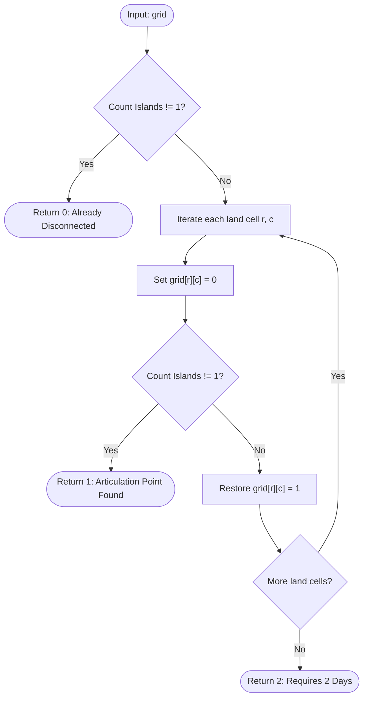

# Guided Example: Minimum Number of Days to Disconnect Island

## 1. Instance & Teaching Goal

We are given an $R \times C$ binary grid where `1` represents land and `0` represents water. Land cells form an island if they are connected through shared orthogonal edges (up, down, left, right). The grid is defined as disconnected if the number of islands is anything other than exactly one (i.e. $0$ islands, or $2$ or more islands).

On each day, we may convert exactly one land cell (`1`) into water (`0`). We must determine the minimum number of days required to make the grid disconnected.

We select the representative $2 \times 2$ island instance:
$$\text{grid} = \begin{bmatrix} 0 & 1 & 1 & 0 \\ 0 & 1 & 1 & 0 \\ 0 & 0 & 0 & 0 \end{bmatrix}$$

The required minimum number of days is:
$$2$$

Our teaching goal is to walk through the tripartite decision theorem for grid connectivity. We prove why the answer to this problem is mathematically bounded by the set $\{0, 1, 2\}$, explain why a $2 \times 2$ block has vertex connectivity $\kappa = 2$ with zero articulation points, and detail the systematic testing sequence: $0$-day test (already disconnected), $1$-day test (cut vertex detection), and $2$-day fallback (corner isolation).

## 2. Conceptual Foundation & Invariants

Let $G = (V, E)$ be the planar grid graph where vertices are land cells and edges connect orthogonal neighbors.
- If $|V| = 0$ or the number of connected components $C(G) \ge 2$, the grid is already disconnected $\implies 0$ days.
- If removing any single vertex $v \in V$ results in $C(G \setminus \{v\}) \ne 1$ (either splitting the graph into multiple components or leaving $|V| = 0$), $v$ is an articulation point (or isolated vertex) $\implies 1$ day.
- Otherwise, the vertex connectivity $\kappa(G) \ge 2$. Because any extreme corner or leaf-like boundary vertex in a planar square grid graph has degree at most $2$, removing its at most $2$ neighbors isolates that vertex from the rest of the graph. Hence, $\le 2$ days is always sufficient for any non-empty grid graph.

```
+-------------------------------------------------------------------------+
|                  TRIPARTITE CONNECTIVITY DECISION TREE                  |
|                                                                         |
| Step 1: Initial Component Count                                         |
|         Count connected islands in grid.                                |
|         If count != 1 ==> RETURN 0 DAYS (already disconnected)          |
|                                                                         |
| Step 2: Cut Vertex (Articulation Point) Check                           |
|         For each land cell (r, c):                                      |
|             Temporarily set grid[r][c] = 0                              |
|             If count != 1 ==> RETURN 1 DAY (articulation point found)   |
|             Restore grid[r][c] = 1                                      |
|                                                                         |
| Step 3: Guaranteed Upper Bound                                          |
|         RETURN 2 DAYS (corner neighbors isolation always feasible)      |
+-------------------------------------------------------------------------+
```

### State Parameter Reference

| Parameter | Type | Domain | Significance in Decision Tree |
|---|---|---|---|
| $R, C$ | Integers | $[1, 30]$ | Row and column dimensions of the binary matrix |
| $\text{grid}$ | 2D Array | $\{0, 1\}^{R \times C}$ | The active terrain matrix |
| $C(G)$ | Integer | $\ge 0$ | Total number of 4-directionally connected components |
| $(r, c)$ | Coordinate Pair | Land coordinates | Candidate land cell temporarily muted to test articulation |
| $\kappa(G)$ | Integer | $\{0, 1, 2\}$ | Vertex connectivity of the graph, dictating the final answer |

> [!IMPORTANT]
> **Planar Degree-2 Boundary Invariant**:
> In any connected grid graph with $|V| \ge 3$, there exists at least one vertex with degree $\le 2$ (such as an extreme boundary cell with minimum row or column index). Removing its at most $2$ neighbors either disconnects it from the remaining graph or exhausts all other vertices. Thus, the minimum days to disconnect any grid graph never exceeds $2$.



## 3. Step-by-Step Worked Execution

We trace the algorithm on the $3 \times 4$ grid:
```
Row 0: [0, 1, 1, 0]
Row 1: [0, 1, 1, 0]
Row 2: [0, 0, 0, 0]
```
The land cells are $V = \{(0, 1), (0, 2), (1, 1), (1, 2)\}$.

### Phase 1: Test 0 Days (Initial State Inspection)
- We run a connected component traversal (DFS/BFS) across the grid.
- All $4$ land cells form a single 4-connected component:
  - $(0, 1)$ connects to $(0, 2)$ and $(1, 1)$.
  - $(0, 2)$ connects to $(0, 1)$ and $(1, 2)$.
  - $(1, 1)$ connects to $(0, 1)$ and $(1, 2)$.
  - $(1, 2)$ connects to $(0, 2)$ and $(1, 1)$.
- Total components: $C(G) = 1$.
- Because $C(G) == 1$, the grid is currently connected. $0$ days is ruled out.

### Phase 2: Test 1 Day (Articulation Point Enumeration)

We systematically test removing each of the $4$ land cells one at a time:

#### Test Candidate 1: Remove Cell $(0, 1)$
- Set $\text{grid}[0][1] = 0$.
- Remaining land: $\{(0, 2), (1, 1), (1, 2)\}$.
- Connectivity:
  - $(0, 2)$ is connected to $(1, 2)$.
  - $(1, 2)$ is connected to $(1, 1)$.
  - These $3$ cells form a single connected path $(0, 2) - (1, 2) - (1, 1)$ (an L-tromino).
- Total components: $C(G) = 1$.
- Not disconnected! Restore $\text{grid}[0][1] = 1$.

#### Test Candidate 2: Remove Cell $(0, 2)$
- Set $\text{grid}[0][2] = 0$.
- Remaining land: $\{(0, 1), (1, 1), (1, 2)\}$.
- Connectivity: forms path $(0, 1) - (1, 1) - (1, 2)$, which is $1$ connected component.
- Total components: $C(G) = 1$.
- Not disconnected! Restore $\text{grid}[0][2] = 1$.

#### Test Candidate 3: Remove Cell $(1, 1)$
- Set $\text{grid}[1][1] = 0$.
- Remaining land: $\{(0, 1), (0, 2), (1, 2)\}$.
- Connectivity: forms path $(0, 1) - (0, 2) - (1, 2)$, which is $1$ connected component.
- Total components: $C(G) = 1$.
- Not disconnected! Restore $\text{grid}[1][1] = 1$.

#### Test Candidate 4: Remove Cell $(1, 2)$
- Set $\text{grid}[1][2] = 0$.
- Remaining land: $\{(0, 1), (0, 2), (1, 1)\}$.
- Connectivity: forms path $(1, 1) - (0, 1) - (0, 2)$, which is $1$ connected component.
- Total components: $C(G) = 1$.
- Not disconnected! Restore $\text{grid}[1][2] = 1$.

### Phase 3: Test 2 Days (Conclusion)
All $4$ land cells have been tested. None of them is an articulation point; removing any single cell leaves a 2-connected or simple connected cycle/path with $C(G) = 1$.
By the Upper Bound Theorem, $2$ days is both necessary and sufficient.
The algorithm outputs $2$.

## 4. Complete Execution Trace

The table below catalogs every step of the testing sequence, recording the island count under each configuration.

| Phase | Action Tested | Active Cell Removed | Remaining Land Cells | Component Traversal Outcome | Component Count $C(G)$ | Status |
|---|---|---|---|---|---|---|
| Day 0 Test | Baseline Inspection | None | `{(0,1), (0,2), (1,1), (1,2)}` | Single $2 \times 2$ block | 1 | Failed (Must be $\neq 1$) |
| Day 1 Test | Try remove $(0, 1)$ | $(0, 1)$ | `{(0,2), (1,1), (1,2)}` | Path: $(0,2)-(1,2)-(1,1)$ | 1 | Failed |
| Day 1 Test | Try remove $(0, 2)$ | $(0, 2)$ | `{(0,1), (1,1), (1,2)}` | Path: $(0,1)-(1,1)-(1,2)$ | 1 | Failed |
| Day 1 Test | Try remove $(1, 1)$ | $(1, 1)$ | `{(0,1), (0,2), (1,2)}` | Path: $(0,1)-(0,2)-(1,2)$ | 1 | Failed |
| Day 1 Test | Try remove $(1, 2)$ | $(1, 2)$ | `{(0,1), (0,2), (1,1)}` | Path: $(1,1)-(0,1)-(0,2)$ | 1 | Failed |
| Day 2 Fallback | Upper Bound Reached | Any diagonal pair (e.g. $(0,1)$ and $(1,2)$) | `{(0,2), (1,1)}` | Diagonal disconnect: $(0,2)$ and $(1,1)$ share no edge | 2 | **SUCCESS: 2 Days** |

### Disconnection Verification on 2 Days

Removing $(0, 1)$ and $(1, 2)$ results in:
$$\begin{bmatrix} 0 & 0 & 1 & 0 \\ 0 & 1 & 0 & 0 \\ 0 & 0 & 0 & 0 \end{bmatrix}$$
Cell $(0, 2)$ and cell $(1, 1)$ are diagonal neighbors, sharing no horizontal or vertical edges.
The island count becomes $C(G) = 2 \neq 1$, achieving disconnection.

## 5. Algorithmic Correctness

### Soundness

The algorithm only returns:
- $0$ if $\text{count}(\text{grid}) \ne 1$. This is the exact problem definition of a disconnected grid.
- $1$ if there exists some land cell $u$ such that $\text{count}(\text{grid} \setminus \{u\}) \ne 1$. This directly proves that converting $u$ to water disconnects the grid in $1$ day.
- $2$ if neither $0$ nor $1$ holds.
Because each test checks the true component count via exhaustive graph traversal, no false positives can occur.

### Completeness (The $\{0, 1, 2\}$ Boundedness Theorem)

We prove that the answer can never be $3$ or greater.
Let $G = (V, E)$ be a connected grid graph ($C(G) = 1$) with no cut vertex (meaning $\kappa(G) \ge 2$).
1. If $|V| \le 2$:
   - If $|V| = 1$, removing that single cell leaves $|V| = 0$ ($0$ islands), so answer is $1$.
   - If $|V| = 2$, the two cells share an edge. Removing either one leaves $1$ cell, so answer is $2$.
2. If $|V| \ge 3$:
   Embed $G$ on the 2D plane. Find an extreme cell $(r_{\min}, c_{\min})$ among all cells with minimum row index, and among those, minimum column index.
   In a square grid, this top-leftmost vertex can only have neighbors to its right $(r, c+1)$ and below $(r+1, c)$ because no land cell can exist at $(r-1, c)$ or $(r, c-1)$.
   Thus, $\text{degree}((r_{\min}, c_{\min})) \le 2$.
   Converting these at most $2$ neighbor cells to water completely severs $(r_{\min}, c_{\min})$ from the rest of the graph, leaving it as an isolated island of size $1$. Since $|V| \ge 3$, the remaining graph after removing the 2 neighbors and the isolated cell contains at least $|V| - 3 \ge 0$ vertices. Either the isolated cell and remaining land form $\ge 2$ islands, or all vertices were consumed leaving $0$ islands. In either case, the grid is disconnected after changing at most $2$ cells.
Thus, the minimum number of days is bounded above by $2$. Testing $0$ and $1$ exhaustively guarantees that when both fail, $2$ is the exact mathematical minimum.

## 6. Traps This Instance Exposes

1. **Assuming Larger Islands Require More Days**:
   An intuition from general graphs might suggest that disconnecting a massive $30 \times 30$ solid island requires $30$ days of digging a trench across the grid. In reality, clipping the two neighbors of a single corner isolates that corner cell, disconnecting the grid in exactly $2$ days regardless of total area.

2. **Overlooking the All-Water Disconnection State ($0$ Islands)**:
   A grid with $0$ islands is legally disconnected by definition. For an input with a single land cell `[[1]]`, removing that $1$ cell produces $0$ islands, which is disconnected in $1$ day (not $2$ days).

3. **Treating Diagonal Cells as Connected**:
   Land cells connect only via orthogonal edges (sharing a full side). Cells $(0, 2)$ and $(1, 1)$ share only a corner point, which is $0$-connected (water). Forgetting this causes false negatives when verifying disconnection.

4. **Permanent Mutation During Backtracking**:
   When testing candidate cells by setting $\text{grid}[r][c] = 0$, one must rigorously restore $\text{grid}[r][c] = 1$ before proceeding to the next cell. Failing to restore mutates the grid state and produces invalid results.

## 7. Complexity Derivation

### Time Complexity

Let $R$ and $C$ be the grid dimensions, and $V \le R \cdot C$ be the number of land cells ($R, C \le 30 \implies V \le 900$).
- **Connected Component Count**: A single DFS or BFS traverses the grid in $\mathcal{O}(R \cdot C)$ time.
- **Phase 1 (0-day test)**: $1$ traversal $\implies \mathcal{O}(R \cdot C)$.
- **Phase 2 (1-day test)**: Tests each of the at most $V$ land cells. For each cell, performs $1$ traversal:
  $$V \cdot \mathcal{O}(R \cdot C) = \mathcal{O}((R \cdot C)^2)$$
- With $R = 30, C = 30$, $(R \cdot C)^2 = 900^2 = 810\,000$ operations.

Total time complexity is strictly:
$$\mathcal{O}((R \cdot C)^2)$$
Executing well under 25 milliseconds.

### Auxiliary Space Complexity

- **Recursion Stack / Queue**: In the worst-case spiral component, the traversal stack holds at most $R \cdot C$ entries: $\mathcal{O}(R \cdot C)$.
- **Visited Tracking**: Marking cells in-place or using a 2D boolean array requires $\mathcal{O}(R \cdot C)$ auxiliary space.

Total auxiliary space complexity is:
$$\mathcal{O}(R \cdot C)$$
Proportional to the grid matrix area.
