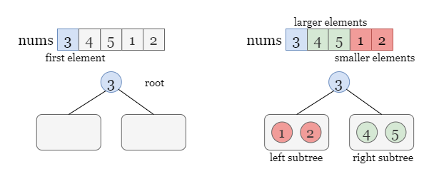
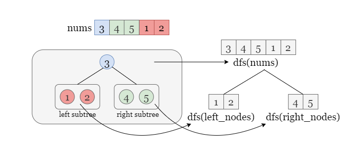
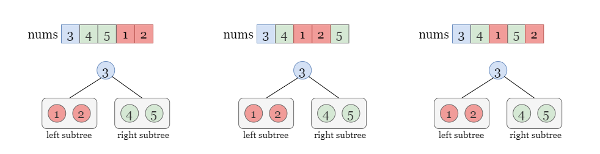
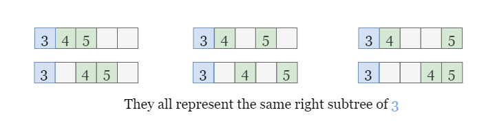
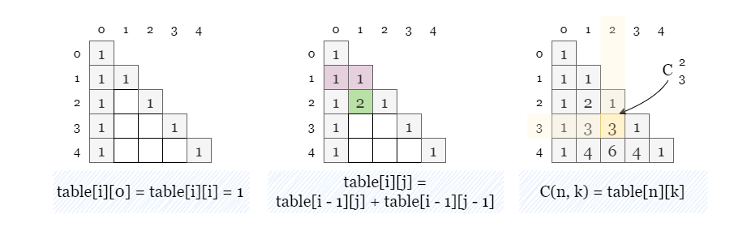
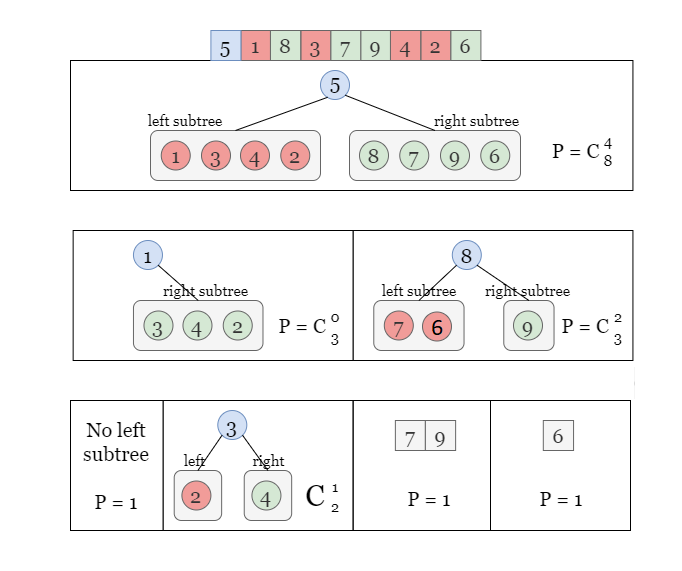

[TOC]

## Solution

---

### Approach: Recursion

#### Intuition

We can make the following conclusions:

- The first element of `nums` always corresponds to the root node of the corresponding BST.

- According to the definition of a binary search tree (BST), all elements less than the root value belong to the left subtree, while all elements greater than the root value belong to the right subtree (as shown in the figure below). Let's temporarily ignore the specific structure of the left and right subtrees for now.



Let `dfs(nums)` denote the number of permutations of `nums` that result in the same BST as `nums`. When iterating over the elements of `nums[1:]`, we can construct two subtrees using the subsequences $\text{left}_{nodes} = [1, 2]$ and $\text{right}_{nodes} = [4, 5]$ by adding each element to either the left or right subtree of the root. As long as the **relative position** of the elements within `[1, 2]` or `[4, 5]` remains unchanged, rearranging their positions in `nums` does not affect the construction of the subtrees.

> It should be noted that maintaining the relative positions of the numbers in each sequence does not necessarily mean that rearranging the order will always result in a different BST. However, this issue will be addressed in the next level of the subproblem, which will be considered in $dfs(\text{left}_{nodes})$ or $dfs(\text{right}_{nodes})$ by allowing the order to be changed. In the current level of recursion `dfs(nums)`, we do not consider the issue of the next level.



Therefore, we obtain the following recursive relation:
$\text{dfs(nums)} = \text{dfs(left\\\_nodes)} \cdot \text{dfs(right\\\_nodes)}$

However, it is important to note that the actual number of valid permutations may exceed the calculated number from above. This is because there are some permutations that do not alter the relative order of the nodes in $\text{left}_{nodes}$ and $\text{right}_{nodes}$ thus resulting in the same BST.

<br>

For instance, let's consider the original array `[3,4,5,1,2]`. Here, we use `[1, 2]` to construct the left subtree and `[4, 5]` to construct the right subtree. If we only change the positions of `1` and `2` in `nums[1:]` without altering their relative order, the subsequences used to construct the left and right subtree will still be `[1, 2]` and `[4, 5]`, resulting in the same left subtree.



This implies that we need to adjust the formula by multiplying it with a coefficient ($P$) that represents the number of permutations that preserve the relative order of nodes in the two subsequence $\text{left}_{nodes}$ and $\text{right}_{nodes}$. This leads to the modified equation:

$\text{dfs(nums)} = P\cdot \text{dfs(left\\\_nodes)} \cdot \text{dfs(right\\\_nodes)}$

It is possible to arbitrarily select two cells to hold the nodes of the left subtree, and there are 6 permutations that generate the same $\text{left}_{nodes}$ and $\text{right}_{nodes}$. Therefore, we set $P=6$ in the above equation.



In general, for an array of length `m` with `left` nodes in the left subtree, then the number of valid permutations is equal to the number of ways of selecting `k` cells from $m - 1$ cells (excluding the first cell that represents the root). This can be expressed using the binomial coefficient formula:

$C_{m-1}^\text{left} = \binom{m-1}{\text{left}} = \frac{(m-1)!}{\text{left}!(m-1-\text{left})!}$

<details> <summary>
        <b>   If you are not aware of the binomial coefficient, let's get a brief idea about it (click to expand) We have hidden this section in order to keep the main content coherent. Our focus is on practical applications rather than on specific implementations and theories. </b> </summary>

<br>

To efficiently compute the binomial coefficients, we can use Pascal's triangle and precompute a table to avoid repetitive calculations. To build this table, we first determine the number of rows we need based on the size of `nums`, denoted as `m`. We create a $m \times m$ table to represent the first $m - 1$ rows of Pascal's triangle.

The numbers in Pascal's triangle are generated by summing the two numbers directly above it. We initialize the first column and the main diagonal as `1`. We then iterate over the lower-left half of the table, starting from $\text{table}[2][1]$, and compute $\text{table}[i][j]$ as the sum of $table[i - 1][j - 1]$ and $table[i - 1][j]$.



After building the table, we can efficiently compute the value of $C_n^k$ by directly looking up $\text{table}[n][k]$.

</details>

<br>

Now we can recursively solve this problem by dividing `nums` into two subsequences $\text{left}_{nodes}$ (of length `k`) and $\text{right}_{nodes}$, and the number of valid permutations is denoted as
$\text{dfs(nums)} \\= P\cdot \text{dfs(left\\\_nodes)} \cdot \text{dfs(right\\\_nodes)} \\= C_{n}^{k}\cdot \text{dfs(left\\\_nodes)} \cdot \text{dfs(right\\\_nodes)}$.

where $C_{n}^{k}$ can be obtained by using the precomputed table we discussed before or built-in functions. We treat the calls to `dfs` on the two subsequences as subproblems, and recursively solve them. The algorithm always selects the first element as the root value, and the size of the input array gradually decreases as the recursion progresses.

If the input array `nums` contains one or two elements, it only has one permutation that constructs the same BST (which is `nums` itself). Thus we have $dfs(nums) = 1$ when `nums.length < 3`, which are the base cases.

<br>

Take the picture below as a detailed example.

- For `nums = [5, 1, 8, 3, 7, 9, 4, 2, 6]`, we need to keep the relative order in `[1, 3, 4, 2]` and `[8, 7, 9, 6]` unchanged, there could be $C_8^4$ different permutations.

- Now we move on to the left subtree constructed by `[1, 3, 4, 2]`, there is no left subtree for $root = 1$ so we have the coefficient as $C_3^0$.

- For the right subtree constructed by `[3, 2, 4]`, we have the coefficient as $C_2^1$.

and so on.



Therefore, the number of permutations is equal to the product of all coefficients, which is $\text{answer} = C_8^4 \cdot C_3^0 \cdot C_3^2 \cdot C_2^1  \cdot 1 \cdot 1 \cdot 1$.

Lastly, don't forget to return $(\text{answer} - 1) \% ($10^{9}$+7)$ as we don't count the original `nums` as a valid permutation.

<br>

#### Algorithm

1) Define a function `dfs(nums)` as the number of valid permutations.
- If the size of `nums` is less than 3, meaning there are 0, 1, or 2 nodes, the function returns 1, as there is only one possible permutation in each of these cases.
- Otherwise, the function selects the first element of `nums` as the value of the root node. It then partitions the remaining elements `nums[1:]` into two subsequences, $\text{left}_{nodes}$ and $\text{right}_{nodes}$, representing the values of the nodes in the left and right subtrees, respectively.
- Let `m` be the size of `nums` and `k` be the size of $\text{left}_{nodes}$. Return the product of $dfs(\text{left}_{nodes}) * dfs(\text{right}_{nodes})$ and $C_n^k$.

2) In Java or C++, we need to build a table of Pascal's of size $m \times m$, since there are at most $m - 1$ nodes in a subtree,
- Initialize the first column and the main diagonal of the table to `1`.
- Iterate over each empty cell in the lower left triangle of `table` from top to bottom and from left to right. Set $\text{table}[i][j]$ as $table[i - 1][j] + table[i - 1][j - 1]$.

    Return $\text{table}[n][k]$ if we need to compute $C_n^k$.

3) Return $(dfs(nums) - 1) \% (1_{000\_000\_007})$.

#### Implementation

```python
class Solution:
    def numOfWays(self, nums: List[int]) -> int:
        mod = 10 ** 9 + 7

        def dfs(nums):
            m = len(nums)
            if m < 3:
                return 1
            left_nodes = [a for a in nums if a < nums[0]]
            right_nodes = [a for a in nums if a > nums[0]]
            return dfs(left_nodes) * dfs(right_nodes) * comb(m - 1, len(left_nodes)) % mod

        return (dfs(nums) - 1) % mod
```

#### Complexity Analysis

Let $m$ be the size of `nums`.

* Time complexity: $O(m^2)$
- In Java or C++, a table of Pascal's triangle of size $m \times m$ is built, which takes $O(m^2)$ time.
- `dfs(nums)` recursively calls itself to process the left and right subtrees of the current node $\text{nums}[0]$. Since the total size of the subtrees decreases by 1 at each level of the recursion, the maximum height of the recursion tree is $m$. Thus the total time complexity of the recursive solution is $O(m^2)$ because in each call we are doing $O(m)$ work creating the subsequences.

* Space complexity: $O(m^2)$ or $O(m)$

- In Java or C++, a table of Pascal's triangle of size $m \times m$ is built.
- The recursive solution uses the call stack to keep track of the current subtree being processed. The maximum depth of the call stack is equal to the height of the BST constructed from the input array. In the worst case, `nums` may form a degenerate BST (e.g., a sorted array), which has a height of $m - 1$, and the stack can hold up to $m - 1$ calls, resulting in a space complexity of $O(m)$.

<br/>