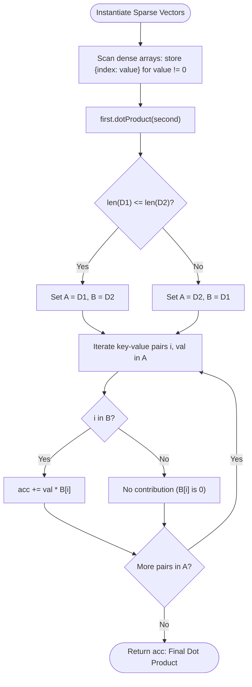

# Guided Example: Dot Product of Two Sparse Vectors

## 1. Instance & Teaching Goal

We are given two dense numerical vectors of identical dimension $N$:
$$\vec{u} = \text{nums1}, \quad \vec{v} = \text{nums2}$$

We must design an efficient `SparseVector` data structure that compresses the dense arrays by storing only non-zero coordinates and computes their dot product:
$$\vec{u} \cdot \vec{v} = \sum_{i=0}^{N-1} u_i \cdot v_i$$
without traversing the $N$ dimensions in full during calculation.

We select the representative instance:
$$\text{nums1} = [1, 0, 0, 2, 3], \quad \text{nums2} = [0, 3, 0, 4, 0]$$

Dimension is $N = 5$. The dot product is:
$$(1 \times 0) + (0 \times 3) + (0 \times 0) + (2 \times 4) + (3 \times 0) = 8$$

Our teaching goal is to walk through index-value sparse representation and asymmetric dictionary iteration. We show why dense $\mathcal{O}(N)$ multiplication wastes operations when $N \gg K$, how indexing only non-zero coordinates reduces storage to $\mathcal{O}(K)$, and why iterating over the smaller sparse dictionary achieves optimal $\mathcal{O}(\min(K_1, K_2))$ query time.

## 2. Conceptual Foundation & Invariants

In linear algebra, the product $u_i \cdot v_i$ is non-zero if and only if both $u_i \neq 0$ and $v_i \neq 0$. Any coordinate where either vector has value zero contributes exactly $0$ to the summation:
$$u_i \cdot v_i = 0 \quad \text{if } u_i = 0 \text{ or } v_i = 0$$

Therefore, the summation restricts strictly to the intersection of their non-zero coordinate supports:
$$\text{supp}(\vec{u}) = \{i \mid u_i \neq 0\}, \quad \text{supp}(\vec{v}) = \{i \mid v_i \neq 0\}$$
$$\vec{u} \cdot \vec{v} = \sum_{i \in \text{supp}(\vec{u}) \cap \text{supp}(\vec{v})} u_i \cdot v_i$$

```
+-------------------------------------------------------------------------+
|                  SPARSE VECTOR SUPPORT INTERSECTION                     |
|                                                                         |
| Dense u: [ 1,  0,  0,  2,  3 ]  -->  supp(u) = {0: 1, 3: 2, 4: 3}       |
| Dense v: [ 0,  3,  0,  4,  0 ]  -->  supp(v) = {1: 3, 3: 4}             |
|                                                                         |
| Intersection: supp(u) INTERSECT supp(v) = {3}                          |
|                                                                         |
| Query Execution (iterate over smaller support):                         |
|   |supp(v)| = 2 < |supp(u)| = 3 ==> Iterate over v:                    |
|     Index 1: v[1] = 3, u[1] = 0 (absent) ==> 3 * 0 = 0                  |
|     Index 3: v[3] = 4, u[3] = 2 (present) ==> 4 * 2 = 8                 |
|                                                                         |
| Total Dot Product = 8                                                   |
+-------------------------------------------------------------------------+
```

### State Parameter Reference

| Parameter | Type | Domain | Significance in Sparse Dot Product |
|---|---|---|---|
| $N$ | Integer | Dimension | Total length of the dense vectors |
| $K_1$ | Integer | $[0, N]$ | Count of non-zero entries in $\text{nums1}$ ($\lvert \text{supp}(\vec{u}) \rvert$) |
| $K_2$ | Integer | $[0, N]$ | Count of non-zero entries in $\text{nums2}$ ($\lvert \text{supp}(\vec{v}) \rvert$) |
| $D_1$ | Hash Map | $\text{Index} \to \text{Value}$ | Sparse mapping of non-zero entries for $\vec{u}$ |
| $D_2$ | Hash Map | $\text{Index} \to \text{Value}$ | Sparse mapping of non-zero entries for $\vec{v}$ |
| $A, B$ | Pointers to Maps | References | $A$ references the smaller map ($\min(K_1, K_2)$), $B$ the larger |
| $\text{acc}$ | Integer | Accumulated sum | Running summation of $u_i \cdot v_i$ products |

> [!IMPORTANT]
> **Asymmetric Iteration Invariant**:
> By assigning $A$ to be the sparse dictionary with the smaller cardinality ($|A| = \min(K_1, K_2)$) and looking up corresponding indices in the larger dictionary $B$ in $\mathcal{O}(1)$ average time, the loop executes exactly $\min(K_1, K_2)$ times. This guarantees that dot product computation time depends strictly on the sparser of the two vectors.



## 3. Step-by-Step Worked Execution

We trace the entire lifecycle of vector instantiation and dot product evaluation on $\text{nums1} = [1, 0, 0, 2, 3]$ and $\text{nums2} = [0, 3, 0, 4, 0]$.

### Phase 1: Construction of Sparse Representations

1. **Construct Vector 1 ($\vec{u}$)**:
   - Index $0$: $1 \neq 0 \implies$ insert $(0 \to 1)$.
   - Index $1$: $0 == 0 \implies$ skip.
   - Index $2$: $0 == 0 \implies$ skip.
   - Index $3$: $2 \neq 0 \implies$ insert $(3 \to 2)$.
   - Index $4$: $3 \neq 0 \implies$ insert $(4 \to 3)$.
   - Sparse Map $D_1 = \{0: 1, 3: 2, 4: 3\}$. Non-zero count $K_1 = 3$.

2. **Construct Vector 2 ($\vec{v}$)**:
   - Index $0$: $0 == 0 \implies$ skip.
   - Index $1$: $3 \neq 0 \implies$ insert $(1 \to 3)$.
   - Index $2$: $0 == 0 \implies$ skip.
   - Index $3$: $4 \neq 0 \implies$ insert $(3 \to 4)$.
   - Index $4$: $0 == 0 \implies$ skip.
   - Sparse Map $D_2 = \{1: 3, 3: 4\}$. Non-zero count $K_2 = 2$.

### Phase 2: Dot Product Evaluation

We invoke $\vec{u}.\text{dotProduct}(\vec{v})$:
- Size comparison: $|D_1| = 3$, $|D_2| = 2$.
- Because $|D_2| < |D_1|$, we swap roles to iterate through $D_2$:
  - Driving map $A = D_2 = \{1: 3, 3: 4\}$.
  - Target map $B = D_1 = \{0: 1, 3: 2, 4: 3\}$.
- Initialize accumulator: $\text{acc} = 0$.

#### Iteration 1: Key-Value Pair $(i = 1, \text{val} = 3)$ in $A$
- Query index $1$ in target map $B$:
  $1 \notin B \implies B[1] = 0$.
- Product: $\text{val} \times B[1] = 3 \times 0 = 0$.
- Accumulator: $\text{acc} = 0 + 0 = 0$.

#### Iteration 2: Key-Value Pair $(i = 3, \text{val} = 4)$ in $A$
- Query index $3$ in target map $B$:
  $3 \in B \implies B[3] = 2$.
- Product: $\text{val} \times B[3] = 4 \times 2 = 8$.
- Accumulator: $\text{acc} = 0 + 8 = 8$.

### Termination
All pairs in $A$ have been processed. Final dot product returned is $8$.

## 4. Complete Execution Trace

The table below catalogs every step of the vector construction and the subsequent sparse dot product evaluation.

| Stage | Operation | Dimension / Key $i$ | Source Value $\vec{u}[i]$ | Source Value $\vec{v}[i]$ | Representation Change | Map $D_1$ State | Map $D_2$ State | Query Result | Accumulator $\text{acc}$ |
|---|---|---|---|---|---|---|---|---|---|
| Init 1 | Scan $\text{nums1}$ | 0 | 1 | - | Insert $(0, 1)$ | `{0: 1}` | `{}` | - | - |
| Init 1 | Scan $\text{nums1}$ | 1, 2 | 0, 0 | - | Skip zeros | `{0: 1}` | `{}` | - | - |
| Init 1 | Scan $\text{nums1}$ | 3 | 2 | - | Insert $(3, 2)$ | `{0: 1, 3: 2}` | `{}` | - | - |
| Init 1 | Scan $\text{nums1}$ | 4 | 3 | - | Insert $(4, 3)$ | `{0: 1, 3: 2, 4: 3}` | `{}` | - | - |
| Init 2 | Scan $\text{nums2}$ | 0 | - | 0 | Skip zero | `{0: 1, 3: 2, 4: 3}` | `{}` | - | - |
| Init 2 | Scan $\text{nums2}$ | 1 | - | 3 | Insert $(1, 3)$ | `{0: 1, 3: 2, 4: 3}` | `{1: 3}` | - | - |
| Init 2 | Scan $\text{nums2}$ | 2 | - | 0 | Skip zero | `{0: 1, 3: 2, 4: 3}` | `{1: 3}` | - | - |
| Init 2 | Scan $\text{nums2}$ | 3 | - | 4 | Insert $(3, 4)$ | `{0: 1, 3: 2, 4: 3}` | `{1: 3, 3: 4}` | - | - |
| Init 2 | Scan $\text{nums2}$ | 4 | - | 0 | Skip zero | `{0: 1, 3: 2, 4: 3}` | `{1: 3, 3: 4}` | - | - |
| Dot | Compare sizes | - | - | - | $\|D_2\| < \|D_1\|$ | Driver: $D_2$ | Target: $D_1$ | - | 0 |
| Dot | Query entry 1 | 1 | 0 | 3 | $1 \notin D_1$ | - | - | $3 \times 0 = 0$ | 0 |
| Dot | Query entry 3 | 3 | 2 | 4 | $3 \in D_1$ | - | - | $4 \times 2 = 8$ | **8** |
| Finish | Complete | - | - | - | Termination | - | - | Return 8 | 8 |

## 5. Algorithmic Correctness

### Soundness

The mathematical definition of the dot product over dimension $N$ is:
$$\vec{u} \cdot \vec{v} = \sum_{i=0}^{N-1} u_i \cdot v_i$$
We can partition the index set $\{0, \dots, N-1\}$ into four disjoint sets:
1. $I_{00} = \{i \mid u_i = 0 \land v_i = 0\}$
2. $I_{10} = \{i \mid u_i \neq 0 \land v_i = 0\}$
3. $I_{01} = \{i \mid u_i = 0 \land v_i \neq 0\}$
4. $I_{11} = \{i \mid u_i \neq 0 \land v_i \neq 0\} = \text{supp}(\vec{u}) \cap \text{supp}(\vec{v})$

For any index $i \in I_{00} \cup I_{10} \cup I_{01}$, at least one factor is $0$, so $u_i \cdot v_i = 0$.
The sum over these three subsets is identically $0$.
Therefore:
$$\vec{u} \cdot \vec{v} = \sum_{i \in I_{11}} u_i \cdot v_i$$
Our algorithm iterates over all indices in $\text{supp}(\vec{v})$ (the smaller support). For each $i \in \text{supp}(\vec{v})$, it multiplies $v_i$ by $u_i$ (retrieved from $D_1$, or $0$ if absent).
Indices in $I_{01}$ evaluate to $v_i \cdot 0 = 0$.
Indices in $I_{11}$ evaluate to $v_i \cdot u_i$.
Summing these contributions produces the exact algebraic dot product without any omitted or spurious terms.

### Completeness

Every non-zero product originates from an index $i \in I_{11}$. Since $I_{11} \subseteq \text{supp}(\vec{v})$, iterating through all keys of $\text{supp}(\vec{v})$ is guaranteed to visit every index in $I_{11}$. Hash table retrieval in $D_1$ accurately returns $u_i$ for all $i \in I_{11}$. Hence, the result is complete.

## 6. Traps This Instance Exposes

1. **Iterating Over the Full Dense Vector ($N$ Operations)**:
   A standard loop `for i in range(N): acc += nums1[i] * nums2[i]` defeats the primary design requirement. If $N = 10^5$ but each vector has only $2$ non-zero elements, the dense loop performs $10^5$ operations instead of $2$. Sparse representations must operate in time proportional to non-zero count, not dimension.

2. **Always Iterating Over `self` (Ignoring Asymmetry)**:
   If vector $\vec{u}$ has $10^5$ non-zero elements and vector $\vec{v}$ has $1$ non-zero element, calling `u.dotProduct(v)` without comparing sizes would iterate $10^5$ times. Comparing lengths and driving the loop with the smaller dictionary guarantees $\mathcal{O}(\min(K_1, K_2))$ performance.

3. **Memory Overhead of Storing Zero Coordinates**:
   Storing explicit `(index, 0)` entries in the sparse map defeats the memory compression objective. Only values where $\text{val} \neq 0$ may be inserted into the sparse collection.

4. **Defaulting Hash Lookups to Non-Zero**:
   When index $i$ from the driving map is absent in the target map, the implied value is strictly $0$. Using safe lookups (`b.get(i, 0)`) avoids key errors and properly computes $v_i \cdot 0 = 0$.

## 7. Complexity Derivation

### Time Complexity

Let $N$ be the dimension of the vectors, and let $K_1$ and $K_2$ be the number of non-zero elements in $\text{nums1}$ and $\text{nums2}$, respectively.
- **Construction ($\text{\_\_init\_\_}$)**:
  Scanning the dense array of size $N$ and inserting non-zero elements into the hash table takes:
  $$\mathcal{O}(N) \text{ time}$$
- **Dot Product Query ($\text{dotProduct}$)**:
  - Determining the smaller map takes $\mathcal{O}(1)$ time.
  - The loop iterates over the smaller map of size $\min(K_1, K_2)$.
  - Each hash table query and multiplication takes $\mathcal{O}(1)$ average time.
  Query time complexity is strictly:
  $$\mathcal{O}(\min(K_1, K_2))$$
  When $K_1, K_2 \ll N$, queries execute in microseconds.

### Auxiliary Space Complexity

- The sparse hash table $D_1$ stores $K_1$ key-value pairs.
- The sparse hash table $D_2$ stores $K_2$ key-value pairs.

Total auxiliary space complexity is:
$$\mathcal{O}(K_1 + K_2)$$
Strictly proportional to the number of non-zero entries, achieving massive memory savings over $\mathcal{O}(N)$ when vectors are highly sparse.
