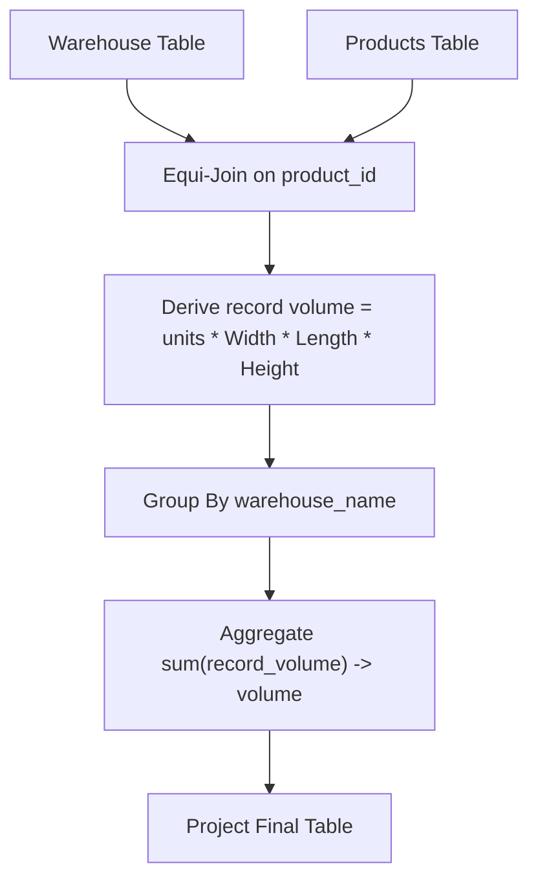

# Guided Example: Warehouse Manager

## 1. Instance & Teaching Goal

We are given two relational tables:
1. $\text{Warehouse}(\text{name}, \text{product\_id}, \text{units})$ recording the quantity of each product stored across various warehouses.
2. $\text{Products}(\text{product\_id}, \text{product\_name}, \text{Width}, \text{Length}, \text{Height})$ detailing the physical rectangular dimensions (in cubic units) of a single unit of each product.

We must calculate the total cubic volume occupied by all stored inventory in each warehouse and return each warehouse's identifier alongside its aggregated volume.

We choose the representative instance:
- **Relation $\text{Warehouse}$**:
  - $(\text{"LCHouse1"}, 1, 10)$
  - $(\text{"LCHouse1"}, 2, 5)$
  - $(\text{"LCHouse2"}, 1, 20)$
- **Relation $\text{Products}$**:
  - $(1, \text{"BoxSmall"}, 2, 3, 4)$
  - $(2, \text{"BoxLarge"}, 10, 20, 30)$

The expected output relation is:
- $(\text{"LCHouse1"}, 30240)$
- $(\text{"LCHouse2"}, 480)$

Our teaching goal is to walk through the relational transformation pipeline using relational algebra. We demonstrate attribute-level dimension multiplication, primary-foreign key equi-joining between inventory records and catalog dimensions, and partitioned summation grouping.

## 2. Conceptual Foundation & Invariants

Each stored product item possesses a unit volume determined by the geometric formula for a rectangular cuboid:
$$V_{\text{unit}}(\text{product\_id}) = \text{Width} \times \text{Length} \times \text{Height}$$

The total volume occupied by an inventory record $(\text{name}, \text{product\_id}, \text{units})$ is:
$$V_{\text{record}} = \text{units} \times V_{\text{unit}}(\text{product\_id}) = \text{units} \times \text{Width} \times \text{Length} \times \text{Height}$$

Aggregating across all inventory records assigned to a given warehouse $\text{name}$ yields:
$$\text{volume}(\text{name}) = \sum_{(\text{name}, p, u) \in \text{Warehouse}} u \times (\text{Width}_p \times \text{Length}_p \times \text{Height}_p)$$

```
+--------------------------------------------------------------------------+
|                  RELATIONAL WAREHOUSE VOLUME PIPELINE                    |
|                                                                          |
| Step 1: Equi-Join on product_id                                          |
|         J = Warehouse InnerJoin Products ON Warehouse.product_id         |
|                                           = Products.product_id          |
|                                                                          |
| Step 2: Extended Projection (Volume Derivation)                          |
|         E = Project(name,                                                |
|                     units * Width * Length * Height -> item_volume, J)   |
|                                                                          |
| Step 3: Group Aggregation                                                |
|         Result = GroupBy(name -> warehouse_name,                         |
|                          sum(item_volume) -> volume, E)                  |
+--------------------------------------------------------------------------+
```

### Formal Relational Algebra Formulation

Let the joined relation be:
$$J = \text{Warehouse} \bowtie_{\text{Warehouse.product\_id} = \text{Products.product\_id}} \text{Products}$$

Deriving unit and item volumes via extended projection:
$$E = \Pi_{\text{name}, (\text{units} \cdot \text{Width} \cdot \text{Length} \cdot \text{Height}) \to \text{item\_volume}}(J)$$

Applying partitioned group aggregation by warehouse name:
$$\text{Result} = \gamma_{\text{name} \to \text{warehouse\_name}, \sum(\text{item\_volume}) \to \text{volume}}(E)$$

### State Parameter Reference

| Parameter | Type | Domain | Semantics in Relational Pipeline |
|---|---|---|---|
| $\text{name}$ | String | Warehouse name space | Identifying label of the storage facility |
| $\text{product\_id}$ | Integer | Product key space | Unique identifier linking inventory to catalog dimensions |
| $\text{units}$ | Integer | $\ge 0$ | Count of product units held at the warehouse |
| $W, L, H$ | Integers | Positive dimensions | Width, Length, and Height of a single unit of the product |
| $V_{\text{unit}}$ | Integer | Positive | Unit cubic footprint: $W \cdot L \cdot H$ |
| $V_{\text{record}}$ | Integer | Non-negative | Row contribution: $\text{units} \cdot V_{\text{unit}}$ |
| $\text{volume}$ | Integer | Non-negative | Total warehouse volume: $\sum V_{\text{record}}$ |

> [!IMPORTANT]
> **Cardinality & Key Invariant**:
> The schema specifies that the composite key $(\text{name}, \text{product\_id})$ is unique in $\text{Warehouse}$, and $\text{product\_id}$ is the primary key in $\text{Products}$. Therefore, the equi-join $J = \text{Warehouse} \bowtie \text{Products}$ produces exactly one output tuple for every inventory row without duplication or cartesian expansion.



## 3. Step-by-Step Worked Execution

We trace our dataset through the three relational stages.

### Step 1: Catalog Volume Computation in $\text{Products}$
- Product $1$ (`BoxSmall`):
  $$\text{Width} = 2, \quad \text{Length} = 3, \quad \text{Height} = 4$$
  $$V_{\text{unit}}(1) = 2 \times 3 \times 4 = 24 \text{ cubic units}$$
- Product $2$ (`BoxLarge`):
  $$\text{Width} = 10, \quad \text{Length} = 20, \quad \text{Height} = 30$$
  $$V_{\text{unit}}(2) = 10 \times 20 \times 30 = 6000 \text{ cubic units}$$

### Step 2: Equi-Join and Record Volume Evaluation ($J \to E$)
We join each inventory record with its corresponding catalog dimensions:
1. Inventory row $(\text{"LCHouse1"}, 1, 10)$:
   - Joins with Product $1$ ($V_{\text{unit}} = 24$).
   - Record volume: $10 \times 24 = 240$.
2. Inventory row $(\text{"LCHouse1"}, 2, 5)$:
   - Joins with Product $2$ ($V_{\text{unit}} = 6000$).
   - Record volume: $5 \times 6000 = 30000$.
3. Inventory row $(\text{"LCHouse2"}, 1, 20)$:
   - Joins with Product $1$ ($V_{\text{unit}} = 24$).
   - Record volume: $20 \times 24 = 480$.

### Step 3: Group Aggregation by Warehouse Name
We partition the extended relation $E$ by the grouping key $\text{name}$:

- **Partition $\text{"LCHouse1"}$**:
  - Contributing item volumes: $\{240, 30000\}$.
  - Aggregated sum:
    $$\text{volume} = 240 + 30000 = 30240$$
  - Projected output tuple: $(\text{"LCHouse1"}, 30240)$.

- **Partition $\text{"LCHouse2"}$**:
  - Contributing item volumes: $\{480\}$.
  - Aggregated sum:
    $$\text{volume} = 480$$
  - Projected output tuple: $(\text{"LCHouse2"}, 480)$.

## 4. Complete Execution Trace

The table below catalogs every inventory record, its joined product dimensions, intermediate volume derivations, and final grouped results.

| Warehouse Name | Product ID | Units | Width | Length | Height | Unit Volume $W \cdot L \cdot H$ | Record Volume $\text{units} \cdot V_{\text{unit}}$ | Partition Group | Warehouse Total Volume |
|---|---|---|---|---|---|---|---|---|---|
| LCHouse1 | 1 | 10 | 2 | 3 | 4 | 24 | 240 | LCHouse1 | - |
| LCHouse1 | 2 | 5 | 10 | 20 | 30 | 6000 | 30000 | LCHouse1 | **30240** |
| LCHouse2 | 1 | 20 | 2 | 3 | 4 | 24 | 480 | LCHouse2 | **480** |

### Output Relation

| Warehouse Name | Total Volume |
|---|---|
| LCHouse1 | 30240 |
| LCHouse2 | 480 |

## 5. Algorithmic Correctness

### Soundness

The requirement asks for the sum of volumes of all products stored in each warehouse.
1. The mathematical volume occupied by a single box with rectangular dimensions $W, L, H$ is $W \cdot L \cdot H$.
2. Because each unit of $\text{product\_id}$ has identical dimensions, $u$ units occupy $u \cdot W \cdot L \cdot H$ cubic units.
3. Because $\text{product\_id}$ is the primary key of $\text{Products}$, joining $\text{Warehouse}$ and $\text{Products}$ on $\text{product\_id}$ matches each inventory row with its exact dimensions without producing multiple join matches.
4. Partitioning by warehouse name and summing the computed record volumes correctly evaluates the linear sum of volumes for each warehouse without dropping terms.

### Completeness

Every warehouse present in the `Warehouse` table appears in the output relation because every stored product has a corresponding entry in the `Products` table (referential integrity). If multiple inventory rows exist for the same warehouse, the grouping operator $\gamma_{\text{name}}$ gathers all of them into a single aggregate row. No warehouse with inventory is omitted.

## 6. Traps This Instance Exposes

1. **Summing Dimensions Before Multiplying**:
   A frequent arithmetic blunder is attempting to write $\sum(\text{units}) \times \sum(W) \times \dots$, which violates the distributive law across distinct products. Volume must be computed per inventory row ($u \cdot W \cdot L \cdot H$) before summing across the partition.

2. **Cartesian Product from Non-Unique Join Keys**:
   If `Products` contained duplicate `product_id` entries, an inner join would duplicate `units`, inflating warehouse volumes. The primary key property of `Products(product_id)` guarantees a strict $N:1$ match.

3. **Treating Missing Dimensions as Zero vs. Null**:
   If an outer join is used and a product is missing from `Products`, arithmetic with $\text{NULL}$ dimensions produces $\text{NULL}$ unless guarded. An inner join correctly pairs matching catalog items.

4. **Integer Overflow on Large Inventories**:
   When dimensions reach $100$ and units reach thousands, total volume easily reaches millions. Using 64-bit integer accumulators avoids overflow.

## 7. Complexity Derivation

### Time Complexity

Let $W$ be the number of rows in `Warehouse` and $P$ be the number of rows in `Products`.
- **Join Execution**: Building a hash table on `Products` takes $\mathcal{O}(P)$ time. Probing with each of the $W$ rows in `Warehouse` takes $\mathcal{O}(W)$ time. Total join time is $\mathcal{O}(W + P)$.
- **Projection and Multiplication**: For each of the $W$ joined tuples, 4 integer multiplications take $\mathcal{O}(1)$ time: $\mathcal{O}(W)$.
- **Group Aggregation**: Grouping by warehouse name using a hash map processes each tuple in $\mathcal{O}(1)$ time: $\mathcal{O}(W)$.

Total time complexity is:
$$\mathcal{O}(W + P)$$
Linear in the combined size of the input relations.

### Auxiliary Space Complexity

- The hash table for `Products` stores $P$ dimension tuples: $\mathcal{O}(P)$.
- The aggregation hash map stores one accumulator entry per distinct warehouse name: $\mathcal{O}(U) \le \mathcal{O}(W)$.

Total auxiliary space complexity is:
$$\mathcal{O}(W + P)$$
Proportional to the input database relations.
