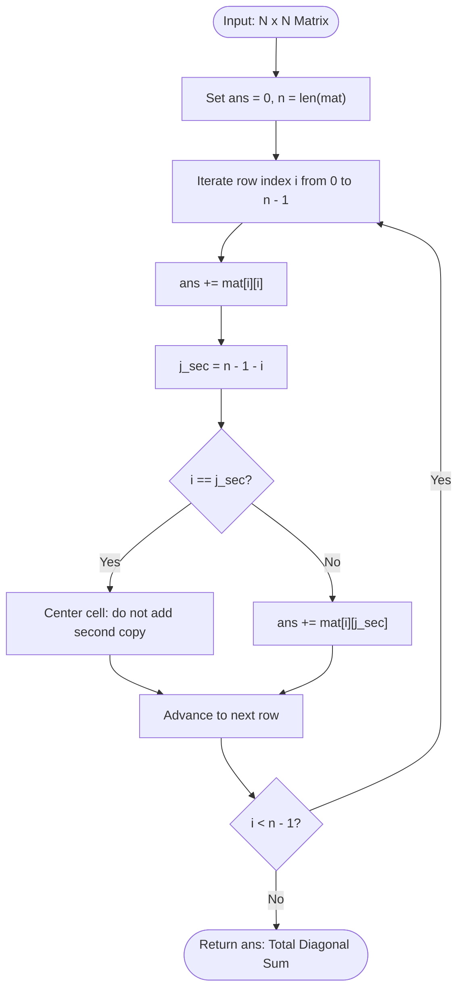

# Guided Example: Matrix Diagonal Sum

## 1. Instance & Teaching Goal

We are given a square matrix $\text{mat}$ of size $N \times N$. We must compute the sum of all matrix elements that lie on either the primary diagonal (running from top-left $(0, 0)$ to bottom-right $(N-1, N-1)$) or the secondary diagonal (running from top-right $(0, N-1)$ to bottom-left $(N-1, 0)$). If an element lies on both diagonals (which occurs at the exact matrix center when $N$ is odd), that element must be included exactly once.

We select the representative $3 \times 3$ instance with an odd dimension:
$$\text{mat} = \begin{bmatrix} 1 & 2 & 3 \\ 4 & 5 & 6 \\ 7 & 8 & 9 \end{bmatrix}$$

The required diagonal sum is:
$$25$$
(Calculated as $1 + 5 + 9 + 3 + 7 = 25$, where the center element $5$ is counted only once).

Our teaching goal is to walk through linear single-pass diagonal accumulation. We explain the index equations for the primary ($j = i$) and secondary ($j = N - 1 - i$) diagonals, demonstrate how symmetry isolates the intersection condition, and show why a full matrix scan of $N^2$ cells is reduced to an optimal $\mathcal{O}(N)$ row-wise traversal.

## 2. Conceptual Foundation & Invariants

In an $N \times N$ grid with row index $i \in [0, N-1]$ and column index $j \in [0, N-1]$:
- A cell $(i, j)$ lies on the primary diagonal if and only if $j = i$.
- A cell $(i, j)$ lies on the secondary diagonal if and only if $i + j = N - 1 \iff j = N - 1 - i$.

```
+-------------------------------------------------------------------------+
|                  DIAGONAL GEOMETRY & CENTER INTERSECTION                |
|                                                                         |
| Primary Diagonal:   (i, i)                                              |
| Secondary Diagonal: (i, N - 1 - i)                                      |
|                                                                         |
| Matrix layout (N = 3):                                                  |
|   [ (0,0):1*   (0,1):2    (0,2):3* ]   row 0: pick (0,0) and (0,2)     |
|   [ (1,0):4    (1,1):5*   (1,2):6  ]   row 1: center (1,1) SHARED       |
|   [ (2,0):7*   (2,1):8    (2,2):9* ]   row 2: pick (2,2) and (2,0)     |
|                                                                         |
| Center Intersection Check:                                              |
|   i == N - 1 - i  <==>  2i == N - 1                                     |
|   Holds only when N is odd, at row i = (N - 1) / 2                      |
|                                                                         |
| Total Sum = (1 + 3) + 5 + (9 + 7) = 25                                  |
+-------------------------------------------------------------------------+
```

### State Parameter Reference

| Parameter | Type | Domain | Significance in Diagonal Extraction |
|---|---|---|---|
| $N$ | Integer | $[1, 100]$ | Side length of the square matrix |
| $i$ | Integer | $[0, N-1]$ | Active row index |
| $j_{\text{sec}}$ | Integer | $N - 1 - i$ | Corresponding column on the secondary diagonal |
| $\text{primary\_val}$ | Integer | $\text{mat}[i][i]$ | Value contributed by the primary diagonal in row $i$ |
| $\text{sec\_val}$ | Integer | $\text{mat}[i][j_{\text{sec}}]$ | Value contributed by the secondary diagonal in row $i$ |
| $\text{ans}$ | Integer | $\ge 0$ | Running cumulative sum of unique diagonal entries |

> [!IMPORTANT]
> **Intersection Deduplication Invariant**:
> For any row $i$, the primary and secondary diagonal cells coincide if and only if $i = N - 1 - i$, which simplifies to $2i = N - 1$. This condition is satisfied if and only if $N$ is odd and $i = \lfloor N / 2 \rfloor$. In that specific row, only one value is added to the accumulator, guaranteeing zero duplicate additions.



## 3. Step-by-Step Worked Execution

We trace the algorithm on the $3 \times 3$ matrix:
$$\text{mat} = \begin{bmatrix} 1 & 2 & 3 \\ 4 & 5 & 6 \\ 7 & 8 & 9 \end{bmatrix}$$
Here dimension $N = 3$. We initialize $\text{ans} = 0$.

### Row $i = 0$
- Primary diagonal cell: $(i, i) = (0, 0)$ with value $\text{mat}[0][0] = 1$.
  Add to accumulator: $\text{ans} = 0 + 1 = 1$.
- Secondary diagonal column: $j_{\text{sec}} = N - 1 - i = 3 - 1 - 0 = 2$.
  Check deduplication: $i \neq j_{\text{sec}}$ ($0 \neq 2$).
  Secondary diagonal cell: $(0, 2)$ with value $\text{mat}[0][2] = 3$.
  Add to accumulator: $\text{ans} = 1 + 3 = 4$.

### Row $i = 1$
- Primary diagonal cell: $(i, i) = (1, 1)$ with value $\text{mat}[1][1] = 5$.
  Add to accumulator: $\text{ans} = 4 + 5 = 9$.
- Secondary diagonal column: $j_{\text{sec}} = N - 1 - i = 3 - 1 - 1 = 1$.
  Check deduplication: $i == j_{\text{sec}}$ ($1 == 1$).
  Condition met: This cell is the shared matrix center!
  Secondary diagonal addition is skipped to prevent double counting.
  Accumulator remains: $\text{ans} = 9$.

### Row $i = 2$
- Primary diagonal cell: $(i, i) = (2, 2)$ with value $\text{mat}[2][2] = 9$.
  Add to accumulator: $\text{ans} = 9 + 9 = 18$.
- Secondary diagonal column: $j_{\text{sec}} = N - 1 - i = 3 - 1 - 2 = 0$.
  Check deduplication: $i \neq j_{\text{sec}}$ ($2 \neq 0$).
  Secondary diagonal cell: $(2, 0)$ with value $\text{mat}[2][0] = 7$.
  Add to accumulator: $\text{ans} = 18 + 7 = 25$.

### Termination
All $N = 3$ rows processed. Final sum is $\text{ans} = 25$.

## 4. Complete Execution Trace

The table below catalogs every row, identifying primary and secondary coordinates, values, deduplication tests, and the running sum.

| Row $i$ | Primary Cell $(i, i)$ | Primary Value | Secondary Col $j_{\text{sec}}$ | Secondary Cell $(i, j_{\text{sec}})$ | Secondary Value | Intersection Check ($i == j_{\text{sec}}$) | Values Added This Row | Running Sum $\text{ans}$ |
|---|---|---|---|---|---|---|---|---|
| Start | - | - | - | - | - | - | None | 0 |
| 0 | $(0, 0)$ | 1 | 2 | $(0, 2)$ | 3 | $0 == 2$ (False) | $1 + 3 = 4$ | 4 |
| 1 | $(1, 1)$ | 5 | 1 | $(1, 1)$ | 5 | $1 == 1$ (**True: Center**) | $5$ (Only once) | 9 |
| 2 | $(2, 2)$ | 9 | 0 | $(2, 0)$ | 7 | $2 == 0$ (False) | $9 + 7 = 16$ | **25** |

### Geometric Cell Classification

- **Primary Diagonal Only**: none (every non-center primary element has a distinct secondary partner in its row).
- **Secondary Diagonal Only**: none.
- **Center Intersection**: cell $(1, 1)$ with value $5$.
- **Disjoint Pairs**: $(0, 0)$ & $(0, 2)$ in row 0; $(2, 2)$ & $(2, 0)$ in row 2.
- **Off-Diagonal Cells (Ignored)**: $(0, 1) = 2, (1, 0) = 4, (1, 2) = 6, (2, 1) = 8$.

## 5. Algorithmic Correctness

### Soundness

The requested value is:
$$S = \sum_{(r, c) \in D_1 \cup D_2} \text{mat}[r][c]$$
where $D_1 = \{(i, i) \mid 0 \le i < N\}$ and $D_2 = \{(i, N - 1 - i) \mid 0 \le i < N\}$.
By the principle of inclusion-exclusion:
$$S = \sum_{(r, c) \in D_1} \text{mat}[r][c] + \sum_{(r, c) \in D_2} \text{mat}[r][c] - \sum_{(r, c) \in D_1 \cap D_2} \text{mat}[r][c]$$
- The set intersection $D_1 \cap D_2$ contains points where $i = N - 1 - i \iff 2i = N - 1$.
  - If $N$ is even, $N - 1$ is odd, so $2i = N - 1$ has no integer solution; $D_1 \cap D_2 = \emptyset$.
  - If $N$ is odd, $2i = N - 1$ has exactly one integer solution $i^* = (N - 1) / 2$; $D_1 \cap D_2 = \{(i^*, i^*)\}$.
Our row-by-row iteration adds $\text{mat}[i][i]$ for every row $i$, and adds $\text{mat}[i][N - 1 - i]$ if and only if $i \neq N - 1 - i$.
When $i = i^*$, the secondary addition is omitted, exactly avoiding the duplicate term. Thus, every element in $D_1 \cup D_2$ is summed exactly once, and no element outside $D_1 \cup D_2$ is visited.

### Completeness

Every row $i \in [0, N-1]$ contains exactly one element on the primary diagonal and exactly one element on the secondary diagonal. Iterating $i$ from $0$ to $N - 1$ covers the entirety of both diagonals without skipping any row.

## 6. Traps This Instance Exposes

1. **Double Counting the Center Cell**:
   Summing both diagonals independently via $\sum \text{mat}[i][i] + \sum \text{mat}[i][N - 1 - i]$ double-counts the center element on odd matrices, returning $30$ instead of $25$ for the $3 \times 3$ matrix. Guarding with $i \neq j_{\text{sec}}$ or subtracting the center cell once corrects the total.

2. **Deduplicating on Even Dimensions**:
   On an even matrix (e.g. $4 \times 4$), the two diagonals cross in the geometric center between four cells and never share a cell ($i \neq N - 1 - i$ for all integer $i$). Attempting to subtract a "center" cell on an even matrix corrupts the sum.

3. **Traversing All $N^2$ Matrix Cells**:
   Nested loops `for i in range(N): for j in range(N): if i == j or i + j == N - 1:` examine all $N^2$ elements. For $N = 100$, this inspects $10\,000$ cells when only $200$ cells are on the diagonals. Computing column indices directly achieves optimal $\mathcal{O}(N)$ performance.

4. **Off-by-One in Secondary Column Calculation**:
   Calculating the secondary column as $N - i$ instead of $N - 1 - i$ causes 1-based index out-of-bounds errors.

## 7. Complexity Derivation

### Time Complexity

Let $N$ be the side length of the square matrix ($N \le 100$).
- The algorithm executes a single loop over the $N$ rows: $i = 0, 1, \dots, N-1$.
- In each iteration:
  - Accessing $\text{mat}[i][i]$: $\mathcal{O}(1)$.
  - Calculating $j_{\text{sec}} = N - 1 - i$: $\mathcal{O}(1)$.
  - Conditional addition of $\text{mat}[i][j_{\text{sec}}]$: $\mathcal{O}(1)$.

Total time complexity is strictly:
$$\mathcal{O}(N)$$
Processing an $N = 100$ matrix requires only $100$ loop cycles, executing in under 0.1 milliseconds.

### Auxiliary Space Complexity

- The algorithm maintains scalar integer accumulators for $\text{ans}$, dimension $N$, and loop variable $i$.
- No auxiliary matrices, sets, or extra arrays are allocated.

Total auxiliary space complexity is strictly:
$$\mathcal{O}(1)$$
Optimal in both time and space.
