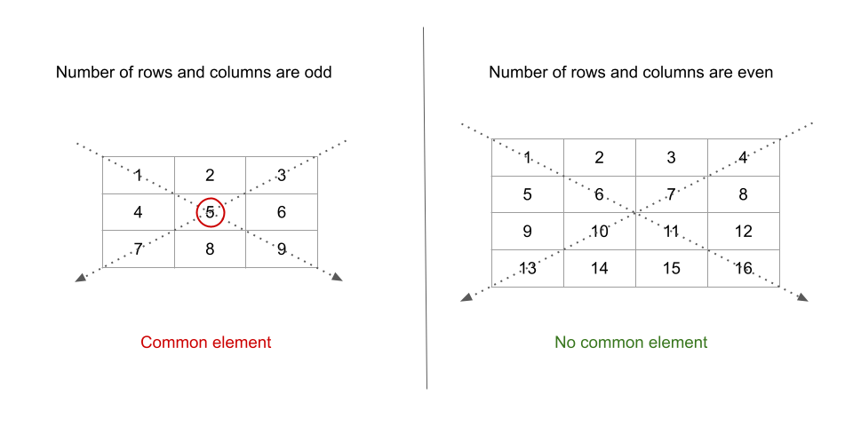

## Solution

---

### Overview

We are given a square matrix `mat`. Our task is to return the sum of the elements on the primary and secondary diagonals without counting any element twice (if it occurs on both the diagonals).

---

### Approach: Iterating over Diagonal Elements

#### Intuition

We can see that elements along the primary diagonals have the same row and column number. So, all elements of the form $\text{mat}[i][i]$ with `i` ranging from $i = 0$ to $i = n - 1$, where `n` is the number of rows (or columns) in `mat`, form the primary diagonal.

Let's form the secondary diagnal starting with the last row and first column, i.e., $mat[n - 1][0]$. $mat[n - 2][1]$ is the next element over the secondary diagonal, one row up and one column ahead. The following element, $mat[n - 3][2]$, is again one row up and one column ahead of the previous element. The final element is $\text{mat}[0][n - 1]$. We can notice that the sum of the row and column numbers is constant ($n - 1$) because the column increases by one but the row decreases by one. As a result, all elements of the form $mat[n - 1 - i][i]$ with `i` ranging from $i = 0$ to $i = n - 1$ constitute the secondary diagonal.

When we compare a square matrix with an odd number of rows to a square matrix with an even number of rows, we notice that there is a common element $mat[n / 2][n / 2]$ at the intersection of the primary and secondary diagonals in the case of the matrix with odd rows:



We add the elements on the primary and secondary diagonals and deduct the common element if number of rows in `mat` is odd.

#### Algorithm

1. Create an integer `n` that stores the number of rows (or columns) in `mat`.
2. Create an answer variable `ans` which will store the sum of elements on the primary and secondary diagonals. Initialize it to `0`.
2. Iterate from $i = 0$ to $i = n - 1$:
- Add elements on the primary diagonal to `ans`. We perform $ans += \text{mat}[i][i]$.
- Add elements on the secondary diagonal to `ans`. We perform $ans += mat[n - 1 - i][i]$.
3. If the number of rows in `mat` is odd, we have a common element between the primary and secondary diagonals. We decrement it from `ans`. We perform $ans -= mat[n / 2][n / 2]$.
4. Return `ans`.

#### Implementation

```python
class Solution:
    def diagonalSum(self, mat: List[List[int]]) -> int:
        n = len(mat)
        ans = 0

        for i in range(n):
            # Add elements from primary diagonal.
            ans += mat[i][i]
            # Add elements from secondary diagonal.
            ans += mat[n - 1 - i][i]
        # If n is odd, subtract the middle element as its added twice.
        if n % 2 != 0:
             ans -= mat[n // 2][n // 2]

        return ans
```

#### Complexity Analysis

Here, $n$ is the number of rows (or columns) in `mat`.

* Time complexity: $O(n)$

- We iterate over primary and secondary diagonals which requires $O(n)$ time each.

* Space complexity: $O(1)$

- Except using few variables like `n` and `ans`, which take constant space, we do not consume any other space.