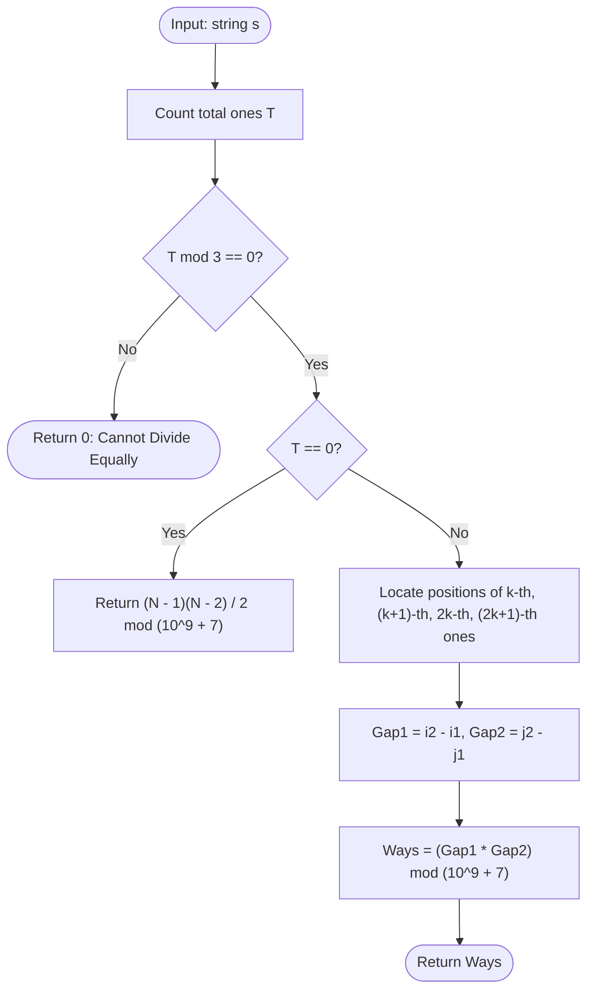

# Guided Example: Number of Ways to Split a String

## 1. Instance & Teaching Goal

We are given a binary string $s$ consisting of `'0'` and `'1'` characters. We must partition $s$ into three non-empty contiguous substrings by placing two cuts between characters such that each of the three resulting parts contains the exact same number of `'1'`s.

We seek the total number of valid cut pairs modulo $10^9 + 7$.

We select the representative instance:
$$s = \text{"10101"}$$

Here length $N = 5$. The total number of valid cut pairs is:
$$4$$

Our teaching goal is to walk through the combinatorics of zero-gap multiplication. We show why the problem reduces to locating the boundaries between required ones, explain why zeros situated between the $k$-th and $(k+1)$-th ones create independent degrees of freedom for cut placement, and demonstrate the closed-form combinatorial formula for the all-zeros edge case.

## 2. Conceptual Foundation & Invariants

Let $T$ be the total count of `'1'`s in string $s$.
To divide the string into $3$ parts with equal numbers of ones:
- If $T \not\equiv 0 \pmod 3$, equal division is mathematically impossible $\implies 0$ ways.
- If $T = 0$, every character is `'0'`. Any two distinct cut positions chosen from the $N - 1$ internal character boundaries create three non-empty substrings, each with $0$ ones:
  $$\text{Ways} = \binom{N - 1}{2} = \frac{(N - 1)(N - 2)}{2} \pmod{10^9 + 7}$$
- If $T > 0$ and $T = 3k$, each partition must contain exactly $k$ ones.

```
+-------------------------------------------------------------------------+
|                  INDEPENDENT ZERO-GAP CUT MULTIPLICATION                |
|                                                                         |
| String:    1    0    1    0    1                                        |
| Index:     0    1    2    3    4                                        |
| 1s count: (1st)     (2nd)     (3rd)                                     |
|                                                                         |
| First cut must lie between 1st '1' (idx 0) and 2nd '1' (idx 2):         |
|   Gap 1 choices: after idx 0, after idx 1 ==> (2 - 0) = 2 choices       |
|                                                                         |
| Second cut must lie between 2nd '1' (idx 2) and 3rd '1' (idx 4):        |
|   Gap 2 choices: after idx 2, after idx 3 ==> (4 - 2) = 2 choices       |
|                                                                         |
| Total valid splits = Gap 1 * Gap 2 = 2 * 2 = 4                          |
+-------------------------------------------------------------------------+
```

### State Parameter Reference

| Parameter | Type | Domain | Significance in Combinatorial Split |
|---|---|---|---|
| $T$ | Integer | $[0, N]$ | Total count of character `'1'` in string $s$ |
| $k$ | Integer | $T / 3$ | Target frequency of `'1'` within each of the three parts |
| $i_1$ | Integer Index | $[0, N-1]$ | 0-indexed position of the $k$-th `'1'` in $s$ |
| $i_2$ | Integer Index | $[0, N-1]$ | 0-indexed position of the $(k+1)$-th `'1'` in $s$ |
| $j_1$ | Integer Index | $[0, N-1]$ | 0-indexed position of the $2k$-th `'1'` in $s$ |
| $j_2$ | Integer Index | $[0, N-1]$ | 0-indexed position of the $(2k+1)$-th `'1'` in $s$ |
| $\text{Ways}$ | Integer | Modulo $10^9 + 7$ | Result of $(i_2 - i_1) \times (j_2 - j_1) \pmod{10^9 + 7}$ |

> [!IMPORTANT]
> **Independent Cut Invariant**:
> Because $k \ge 1$, the first cut must be placed strictly after index $i_1$ and on or before index $i_2 - 1$. The second cut must be placed strictly after index $j_1$ and on or before index $j_2 - 1$. Since $i_2 \le j_1$, the intervals of valid cut positions for the two cuts are completely disjoint. Therefore, any valid first cut position can be independently combined with any valid second cut position without violating substring non-emptiness.



## 3. Step-by-Step Worked Execution

We trace the algorithm on $s = \text{"10101"}$:
- Length: $N = 5$.
- Character scan:
  - Index $0$: `'1'` (1st one)
  - Index $1$: `'0'`
  - Index $2$: `'1'` (2nd one)
  - Index $3$: `'0'`
  - Index $4$: `'1'` (3rd one)
- Total ones: $T = 3$.

### Step 1: Target Quota Verification
- Divisibility test: $T \pmod 3 = 3 \pmod 3 = 0$. Valid.
- Target ones per part: $k = T / 3 = 3 / 3 = 1$.
- Non-zero test: $T = 3 > 0$, so we use the gap multiplication formula.

### Step 2: Boundary Gap 1 Localization
We must separate Part 1 from Part 2.
- Part 1 must contain exactly $k = 1$ one.
- The $k$-th ($1$st) one occurs at index $i_1 = 0$.
- The $(k + 1)$-th ($2$nd) one occurs at index $i_2 = 2$.
- The first cut must occur after index $0$ and before or at index $2 - 1 = 1$.
- Valid first cut indices:
  - After index $0$: prefix is $s[0 \dots 0] = \text{"1"}$.
  - After index $1$: prefix is $s[0 \dots 1] = \text{"10"}$.
- Total choices for Cut 1:
  $$\text{Gap}_1 = i_2 - i_1 = 2 - 0 = 2$$

### Step 3: Boundary Gap 2 Localization
We must separate Part 2 from Part 3.
- Part 2 must contain exactly $k = 1$ one.
- The $2k$-th ($2$nd) one occurs at index $j_1 = 2$.
- The $(2k + 1)$-th ($3$rd) one occurs at index $j_2 = 4$.
- The second cut must occur after index $2$ and before or at index $4 - 1 = 3$.
- Valid second cut indices:
  - After index $2$: suffix starts at index $3$.
  - After index $3$: suffix starts at index $4$.
- Total choices for Cut 2:
  $$\text{Gap}_2 = j_2 - j_1 = 4 - 2 = 2$$

### Step 4: Combinatorial Product
Every choice of Cut 1 pairs freely with every choice of Cut 2:
$$\text{Total Ways} = \text{Gap}_1 \times \text{Gap}_2 = 2 \times 2 = 4$$
$$4 \pmod{10^9 + 7} = 4$$

## 4. Complete Execution Trace

The table below catalogs all 4 valid splits, detailing the cut positions and resulting substrings.

| Split Configuration | First Cut After | Second Cut After | Substring 1 | Substring 2 | Substring 3 | Ones in S1 | Ones in S2 | Ones in S3 | Valid? |
|---|---|---|---|---|---|---|---|---|---|
| Split 1 | Index 0 | Index 2 | `"1"` | `"01"` | `"01"` | 1 | 1 | 1 | **Yes** |
| Split 2 | Index 0 | Index 3 | `"1"` | `"010"` | `"1"` | 1 | 1 | 1 | **Yes** |
| Split 3 | Index 1 | Index 2 | `"10"` | `"1"` | `"01"` | 1 | 1 | 1 | **Yes** |
| Split 4 | Index 1 | Index 3 | `"10"` | `"10"` | `"1"` | 1 | 1 | 1 | **Yes** |

### Cut Feasibility Domain Table

| Boundary Pair | Left Anchor (Inclusive '1') | Right Anchor (Next '1') | Index Span | Available Cut Gaps | Number of Options |
|---|---|---|---|---|---|
| Cut 1 Interval | $i_1 = 0$ ($s[0]=\text{'1'}$) | $i_2 = 2$ ($s[2]=\text{'1'}$) | $[0, 2]$ | Gap after 0, Gap after 1 | $2 - 0 = 2$ |
| Cut 2 Interval | $j_1 = 2$ ($s[2]=\text{'1'}$) | $j_2 = 4$ ($s[4]=\text{'1'}$) | $[2, 4]$ | Gap after 2, Gap after 3 | $4 - 2 = 2$ |
| **Combined** | - | - | - | Cartesian Product $2 \times 2$ | **4** |

## 5. Algorithmic Correctness

### Soundness

1. Let a cut pair be $(c_1, c_2)$ where $0 \le c_1 < c_2 < N - 1$, dividing $s$ into $s[0 \dots c_1]$, $s[c_1 + 1 \dots c_2]$, and $s[c_2 + 1 \dots N - 1]$.
2. By selecting $c_1 \in [i_1, i_2 - 1]$:
   - Since $c_1 \ge i_1$, $s[0 \dots c_1]$ contains at least the first $k$ ones.
   - Since $c_1 < i_2$, $s[0 \dots c_1]$ contains strictly fewer than $k + 1$ ones.
   - Hence $s[0 \dots c_1]$ contains exactly $k$ ones.
3. By selecting $c_2 \in [j_1, j_2 - 1]$:
   - The prefix $s[0 \dots c_2]$ contains exactly $2k$ ones.
   - Therefore, the middle slice $s[c_1 + 1 \dots c_2]$ contains $2k - k = k$ ones.
   - The remaining suffix $s[c_2 + 1 \dots N - 1]$ contains $3k - 2k = k$ ones.
4. Because $i_1 < i_2 \le j_1 < j_2$, we have $c_1 \le i_2 - 1 < j_1 \le c_2$, guaranteeing $c_1 < c_2$ strictly. Thus, neither the first, second, nor third substring can be empty.
Every generated cut pair is guaranteed to produce three valid non-empty substrings with equal numbers of ones.

### Completeness

Any partition with three equal parts must allocate the first $k$ ones to Part 1, the next $k$ ones to Part 2, and the final $k$ ones to Part 3.
- If $c_1 < i_1$, Part 1 has fewer than $k$ ones.
- If $c_1 \ge i_2$, Part 1 has at least $k + 1$ ones.
Thus $c_1$ must satisfy $i_1 \le c_1 < i_2$. By identical logic, $c_2$ must satisfy $j_1 \le c_2 < j_2$.
Every qualifying cut pair $(c_1, c_2)$ is captured by this Cartesian product.

## 6. Traps This Instance Exposes

1. **Forgetting the All-Zeros Edge Case**:
   When $s = \text{"0000"}$, $T = 0$, so $T \pmod 3 = 0$ holds, but $k = 0$. Attempting to search for the "1st" or "2nd" one triggers missing index errors or infinite loops. The all-zeros case requires the closed-form combination $\binom{N-1}{2}$.

2. **Generating Explicit Substring Slices**:
   Trying every possible pair of cuts $(c_1, c_2)$ and counting ones via string slicing takes $\mathcal{O}(N^3)$ or $\mathcal{O}(N^2)$ time, causing TLE when $N = 10^5$. Finding the 4 anchor indices in a single pass takes $\mathcal{O}(N)$ time.

3. **64-Bit Integer Multiplication Overflow Before Modulo**:
   When $N = 10^5$, $\text{Gap}_1$ and $\text{Gap}_2$ can each be on the order of $10^5$, and $\binom{N-1}{2} \approx \frac{10^{10}}{2} = 5 \times 10^9$. This product exceeds 32-bit signed integer capacity ($2 \times 10^9$). Calculations must use 64-bit integer types before applying modulo $10^9 + 7$.

4. **Off-by-One in Gap Length**:
   The number of cut positions between index $i_1$ and $i_2$ is $(i_2 - 1) - i_1 + 1 = i_2 - i_1$. Subtracting 1 from the difference will miss one cut option.

## 7. Complexity Derivation

### Time Complexity

Let $N$ be the length of string $s$ ($N \le 10^5$).
- **One-Pass Counting**: Counting total ones takes a single pass: $\mathcal{O}(N)$ time.
- **Anchor Search**:
  - Scanning $s$ to locate indices $i_1, i_2, j_1, j_2$ takes at most one additional linear pass: $\mathcal{O}(N)$ time.
- **Combinatorial Arithmetic**:
  - Computing $(i_2 - i_1) \times (j_2 - j_1) \pmod{10^9 + 7}$ or $\frac{(N-1)(N-2)}{2} \pmod{10^9 + 7}$ takes $\mathcal{O}(1)$ time.

Total time complexity is strictly:
$$\mathcal{O}(N)$$
For $N = 10^5$, this executes in under 5 milliseconds.

### Auxiliary Space Complexity

- The algorithm only stores scalar integer variables ($N, T, k, i_1, i_2, j_1, j_2$).
- No auxiliary lists, string slices, or tables are allocated.

Total auxiliary space complexity is strictly:
$$\mathcal{O}(1)$$
Optimal in both time and space.
