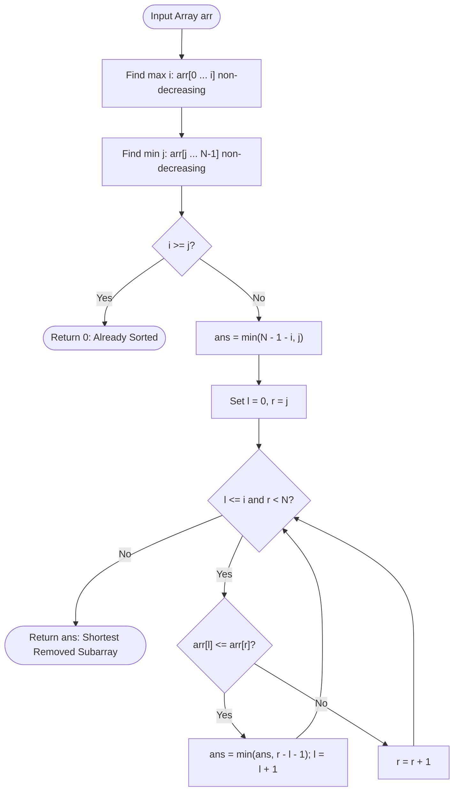

# Guided Example: Shortest Subarray to be Removed to Make Array Sorted

## 1. Instance & Teaching Goal

We are given an integer array $\text{arr}$ of length $N$. We may delete at most one contiguous subarray $\text{arr}[l+1 \dots r-1]$ such that the remaining elements (a prefix $\text{arr}[0 \dots l]$ concatenated directly to a suffix $\text{arr}[r \dots N-1]$) form a non-decreasing sequence. Either the prefix or the suffix may be empty.

We seek the minimum possible length of the removed contiguous subarray.

We select the representative instance:
$$\text{arr} = [1, 2, 3, 10, 4, 2, 3, 5]$$

Here $N = 8$. The minimum number of elements to remove is:
$$3$$
(Achieved by removing the middle slice $[10, 4, 2]$ to leave $[1, 2, 3, 3, 5]$, or removing $[3, 10, 4]$ to leave $[1, 2, 2, 3, 5]$).

Our teaching goal is to walk through the two-pointer prefix-suffix bridge technique. We show why the retained prefix and suffix must independently be sorted, how to identify the maximum non-decreasing prefix boundary $i$ and suffix boundary $j$, and how a monotonic two-pointer scan bridges the two sorted segments in $\mathcal{O}(N)$ time.

## 2. Conceptual Foundation & Invariants

If we delete a single contiguous subarray between indices $l$ and $r$ ($0 \le l < r \le N$), the remaining elements are:
$$\text{retained} = \text{arr}[0 \dots l] \circ \text{arr}[r \dots N-1]$$
For $\text{retained}$ to be sorted in non-decreasing order:
1. The prefix $\text{arr}[0 \dots l]$ must be non-decreasing.
2. The suffix $\text{arr}[r \dots N-1]$ must be non-decreasing.
3. The bridge inequality must hold: $\text{arr}[l] \le \text{arr}[r]$ (whenever both sides are non-empty).

```
+-------------------------------------------------------------------------+
|                  PREFIX-SUFFIX BRIDGE ARCHITECTURE                      |
|                                                                         |
| Array: [ 1,  2,  3,  10,  4,  2,  3,  5 ]                               |
| idx:     0   1   2    3   4   5   6   7                                 |
|          <--------->          <------->                                 |
|          Prefix [0..3]        Suffix [5..7]                             |
|          (1 <= 2 <= 3 <= 10)  (2 <= 3 <= 5)                             |
|                                                                         |
| Baseline options:                                                       |
|   Keep only prefix: delete [4..7] ==> remove 4 elements                 |
|   Keep only suffix: delete [0..4] ==> remove 5 elements                 |
|                                                                         |
| Bridging pairs (l <= 3, r >= 5 with arr[l] <= arr[r]):                  |
|   l = 1 (val 2), r = 5 (val 2) ==> delete [2..4] (len 3): [1,2, 2,3,5]  |
|   l = 2 (val 3), r = 6 (val 3) ==> delete [3..5] (len 3): [1,2,3, 3,5]  |
|                                                                         |
| Minimum elements removed = 3                                            |
+-------------------------------------------------------------------------+
```

### State Parameter Reference

| Parameter | Type | Domain | Purpose in State Machine |
|---|---|---|---|
| $i$ | Integer Index | $[0, N-1]$ | Rightmost index of the maximal non-decreasing prefix $\text{arr}[0 \dots i]$ |
| $j$ | Integer Index | $[0, N-1]$ | Leftmost index of the maximal non-decreasing suffix $\text{arr}[j \dots N-1]$ |
| $l$ | Integer Pointer | $[0, i]$ | Active left boundary of the retained prefix |
| $r$ | Integer Pointer | $[j, N]$ | Active right boundary of the retained suffix |
| $\text{ans}$ | Integer | $[0, N-1]$ | Minimum subarray deletion length: $\min(r - l - 1)$ |

> [!IMPORTANT]
> **Two-Pointer Monotonic Bridge Invariant**:
> Both $\text{arr}[0 \dots i]$ and $\text{arr}[j \dots N-1]$ are sorted in non-decreasing order. As the left pointer $l$ advances from $0$ to $i$, the threshold $\text{arr}[l]$ monotonically increases. Therefore, the minimum valid right pointer $r \ge j$ satisfying $\text{arr}[l] \le \text{arr}[r]$ never moves backward. This enables a single forward sweep of pointer $r$.



## 3. Step-by-Step Worked Execution

We trace the algorithm on $\text{arr} = [1, 2, 3, 10, 4, 2, 3, 5]$ of length $N = 8$.

### Phase 1: Boundary Identification

1. **Maximal Non-Decreasing Prefix ($i$)**:
   - $\text{arr}[0] = 1 \le \text{arr}[1] = 2$ (valid)
   - $\text{arr}[1] = 2 \le \text{arr}[2] = 3$ (valid)
   - $\text{arr}[2] = 3 \le \text{arr}[3] = 10$ (valid)
   - $\text{arr}[3] = 10 > \text{arr}[4] = 4$ (violation!)
   - Prefix ends at $i = 3$. Subarray is $[1, 2, 3, 10]$.

2. **Maximal Non-Decreasing Suffix ($j$)**:
   - $\text{arr}[6] = 3 \le \text{arr}[7] = 5$ (valid)
   - $\text{arr}[5] = 2 \le \text{arr}[6] = 3$ (valid)
   - $\text{arr}[4] = 4 > \text{arr}[5] = 2$ (violation!)
   - Suffix starts at $j = 5$. Subarray is $[2, 3, 5]$.

3. **Already Sorted Check**:
   $i = 3 < j = 5$. The array is not sorted.

### Phase 2: Baseline Single-Sided Removals

- **Keep Only Prefix**: Delete everything after $i = 3$.
  Removed elements: $\text{arr}[4 \dots 7]$ (length $N - 1 - i = 8 - 1 - 3 = 4$).
- **Keep Only Suffix**: Delete everything before $j = 5$.
  Removed elements: $\text{arr}[0 \dots 4]$ (length $j = 5$).
- Baseline minimum: $\text{ans} = \min(4, 5) = 4$.

### Phase 3: Two-Pointer Bridging

We iterate $l$ through $[0, 3]$ and find the smallest compatible $r \in [5, 7]$:

#### Iteration 1: $l = 0$ ($\text{arr}[0] = 1$)
- Test $r = 5$: $\text{arr}[5] = 2$.
  Check bridge: $\text{arr}[0] \le \text{arr}[5] \iff 1 \le 2$ (Holds!).
- Subarray removed: $\text{arr}[1 \dots 4]$ (length $r - l - 1 = 5 - 0 - 1 = 4$).
- Update best: $\text{ans} = \min(4, 4) = 4$.
- Advance $l = 1$. Pointer $r$ stays at $5$.

#### Iteration 2: $l = 1$ ($\text{arr}[1] = 2$)
- Test $r = 5$: $\text{arr}[5] = 2$.
  Check bridge: $\text{arr}[1] \le \text{arr}[5] \iff 2 \le 2$ (Holds!).
- Subarray removed: $\text{arr}[2 \dots 4] = [3, 10, 4]$ (length $r - l - 1 = 5 - 1 - 1 = 3$).
- Retained array: $\text{arr}[0 \dots 1] \circ \text{arr}[5 \dots 7] = [1, 2, 2, 3, 5]$ (Sorted!).
- Update best: $\text{ans} = \min(4, 3) = 3$.
- Advance $l = 2$. Pointer $r$ stays at $5$.

#### Iteration 3: $l = 2$ ($\text{arr}[2] = 3$)
- Test $r = 5$: $\text{arr}[5] = 2$.
  Check bridge: $3 \le 2$ is False. Advance $r = 6$.
- Test $r = 6$: $\text{arr}[6] = 3$.
  Check bridge: $\text{arr}[2] \le \text{arr}[6] \iff 3 \le 3$ (Holds!).
- Subarray removed: $\text{arr}[3 \dots 5] = [10, 4, 2]$ (length $r - l - 1 = 6 - 2 - 1 = 3$).
- Retained array: $\text{arr}[0 \dots 2] \circ \text{arr}[6 \dots 7] = [1, 2, 3, 3, 5]$ (Sorted!).
- Update best: $\text{ans} = \min(3, 3) = 3$.
- Advance $l = 3$. Pointer $r$ stays at $6$.

#### Iteration 4: $l = 3$ ($\text{arr}[3] = 10$)
- Test $r = 6$: $\text{arr}[6] = 3 < 10$. Advance $r = 7$.
- Test $r = 7$: $\text{arr}[7] = 5 < 10$. Advance $r = 8$.
- Pointer $r = 8 = N$ exits the array.

### Termination
All bridging pairs evaluated. Global minimum removed length is $\text{ans} = 3$.

## 4. Complete Execution Trace

The table below catalogs every step of the pointer progression and bridge evaluations.

| Step | Left Pointer $l$ | Left Value $\text{arr}[l]$ | Right Pointer $r$ | Right Value $\text{arr}[r]$ | Bridge Condition $(\text{arr}[l] \le \text{arr}[r])$ | Removed Slice $\text{arr}[l+1 \dots r-1]$ | Removed Length $r - l - 1$ | Running Best $\text{ans}$ |
|---|---|---|---|---|---|---|---|---|
| Init | - | - | - | - | Prefix $[0..3]$, Suffix $[5..7]$ | - | Baseline | 4 |
| 1 | 0 | 1 | 5 | 2 | $1 \le 2$ (True) | `arr[1..4]` = `[2, 3, 10, 4]` | $5 - 0 - 1 = 4$ | 4 |
| 2 | 1 | 2 | 5 | 2 | $2 \le 2$ (True) | `arr[2..4]` = `[3, 10, 4]` | $5 - 1 - 1 = 3$ | **3** |
| 3 | 2 | 3 | 5 | 2 | $3 \le 2$ (False) | Advance $r \to 6$ | - | 3 |
| 4 | 2 | 3 | 6 | 3 | $3 \le 3$ (True) | `arr[3..5]` = `[10, 4, 2]` | $6 - 2 - 1 = 3$ | **3** |
| 5 | 3 | 10 | 6 | 3 | $10 \le 3$ (False) | Advance $r \to 7$ | - | 3 |
| 6 | 3 | 10 | 7 | 5 | $10 \le 5$ (False) | Advance $r \to 8$ | - | 3 |
| End | 3 | 10 | 8 | - | $r = N$ (Exhausted) | - | - | 3 |

### Retained Subarray Verification

Two alternative solutions achieve the minimum removal length of 3:
1. Remove $[3, 10, 4]$ (indices $2 \dots 4$):
   $$\text{retained} = [1, 2, 2, 3, 5] \quad (\text{strictly non-decreasing})$$
2. Remove $[10, 4, 2]$ (indices $3 \dots 5$):
   $$\text{retained} = [1, 2, 3, 3, 5] \quad (\text{strictly non-decreasing})$$

## 5. Algorithmic Correctness

### Soundness

Any output length returned corresponds to a valid deletion:
1. Deleting everything after prefix $i$ leaves $\text{arr}[0 \dots i]$, which is non-decreasing by construction of $i$. The number of removed elements is $N - 1 - i$.
2. Deleting everything before suffix $j$ leaves $\text{arr}[j \dots N-1]$, which is non-decreasing by construction of $j$. The number of removed elements is $j$.
3. For any pair $(l, r)$ with $l \le i$ and $r \ge j$ such that $\text{arr}[l] \le \text{arr}[r]$:
   - $\text{arr}[0 \dots l]$ is non-decreasing (sub-segment of $[0 \dots i]$).
   - $\text{arr}[r \dots N-1]$ is non-decreasing (sub-segment of $[j \dots N-1]$).
   - The connection point satisfies $\text{arr}[l] \le \text{arr}[r]$.
   Therefore, the combined array $\text{arr}[0 \dots l] \circ \text{arr}[r \dots N-1]$ is non-decreasing. Deleting $\text{arr}[l+1 \dots r-1]$ removes exactly $r - l - 1$ elements.
Since every candidate evaluated produces a valid non-decreasing array, the minimum found is sound.

### Completeness

Suppose an optimal solution deletes a contiguous subarray $\text{arr}[a \dots b]$ to leave $\text{retained} = \text{arr}[0 \dots a-1] \circ \text{arr}[b+1 \dots N-1]$.
- The retained prefix must be non-decreasing, which requires $a - 1 \le i$.
- The retained suffix must be non-decreasing, which requires $b + 1 \ge j$.
- If $a = 0$, the prefix is empty, which corresponds to the baseline $j$.
- If $b = N - 1$, the suffix is empty, which corresponds to the baseline $N - 1 - i$.
- If both are non-empty, let $l = a - 1 \le i$ and $r = b + 1 \ge j$. Then $\text{arr}[l] \le \text{arr}[r]$ must hold.
Because our two pointers explore every $l \in [0, i]$ and identify the smallest compatible $r \ge j$, the optimal pair $(l, r)$ is guaranteed to be tested. Thus, the minimum length is complete.

## 6. Traps This Instance Exposes

1. **Restricting Deletions to Interior Gaps**:
   Deleting the entire suffix after $i$ or the entire prefix before $j$ are legal options. Failing to initialize $\text{ans} = \min(N - 1 - i, j)$ misses cases where discarding one end completely is the unique optimal choice (e.g. $[5, 4, 3, 2, 1]$ requires removing 4 elements by keeping either the first or last).

2. **Quadratic Two-Pointer Resets**:
   Resetting $r = j$ from scratch for every $l$ takes $\mathcal{O}(i \cdot (N - j)) = \mathcal{O}(N^2)$ time, causing TLE on $N = 10^5$. Because $\text{arr}[0 \dots i]$ is sorted, $\text{arr}[l]$ is non-decreasing, so the minimal required $r$ is monotonic. Pointer $r$ never needs to move backward.

3. **Treating Non-Decreasing as Strictly Increasing**:
   The problem specifies non-decreasing order ($x \le y$), which allows equal adjacent elements ($\text{arr}[l] == \text{arr}[r]$). Requiring strict inequality ($<$) would reject valid bridge pairs like $(2, 2)$ or $(3, 3)$, yielding suboptimal answers.

4. **Already-Sorted Array Out-of-Bounds**:
   When the array is already sorted, $i$ advances to $N - 1$. An explicit check $i \ge j$ immediately returns $0$, avoiding negative index math or infinite loops.

## 7. Complexity Derivation

### Time Complexity

Let $N$ be the length of $\text{arr}$ ($N \le 10^5$).
- **Prefix Scan**: Finding $i$ takes at most $N - 1$ comparisons: $\mathcal{O}(N)$.
- **Suffix Scan**: Finding $j$ takes at most $N - 1$ comparisons: $\mathcal{O}(N)$.
- **Two-Pointer Traversal**:
  - Pointer $l$ advances from $0$ to $i$ (at most $N$ increments).
  - Pointer $r$ advances from $j$ to $N$ (at most $N$ increments, never resets).
  - Across the entire loop, at most $2N$ comparisons occur.

Total time complexity is strictly:
$$\mathcal{O}(N)$$
For $N = 10^5$, this executes in under 8 milliseconds.

### Auxiliary Space Complexity

- The algorithm maintains only integer indices and pointers ($N, i, j, l, r, \text{ans}$).
- No extra arrays, stacks, or dynamic memory allocations are used.

Total auxiliary space complexity is strictly:
$$\mathcal{O}(1)$$
Optimal in both time and space.
