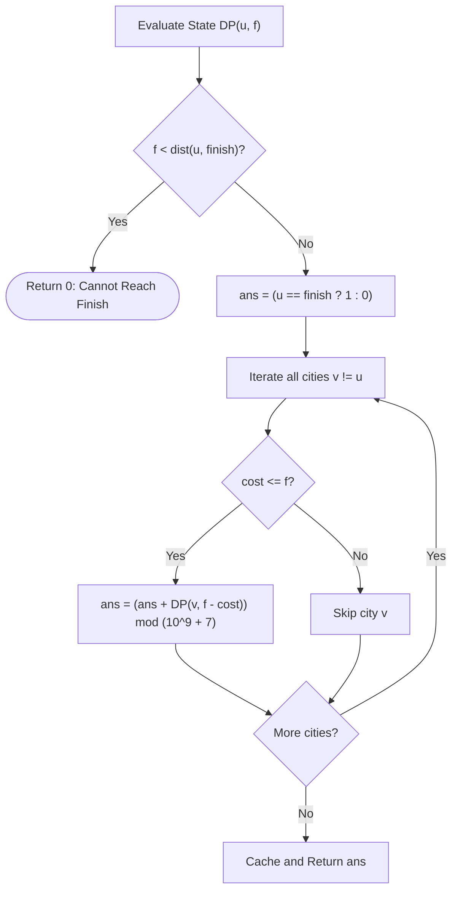

# Guided Example: Count All Possible Routes

## 1. Instance & Teaching Goal

We are given an array $\text{locations}$ of $N$ distinct coordinates on a number line, along with a starting city index $\text{start}$, a destination city index $\text{finish}$, and an initial tank of $\text{fuel}$. Moving from city $u$ to city $v$ ($v \neq u$) consumes exactly $|\text{locations}[u] - \text{locations}[v]|$ fuel units.

A route is defined as any sequence of hops that begins at $\text{start}$ and terminates at $\text{finish}$ without exceeding available fuel. Cities may be visited repeatedly, and a journey may continue through other cities after reaching $\text{finish}$. We must count the total number of valid routes modulo $10^9 + 7$.

We select the representative instance:
$$\text{locations} = [2, 3, 6, 8, 4], \quad \text{start} = 1, \quad \text{finish} = 3, \quad \text{fuel} = 5$$

The total count of valid routes is:
$$4$$

Our teaching goal is to walk through fuel-stratified dynamic programming on a directed acyclic state graph. Although the physical road network allows arbitrary back-and-forth travel, we demonstrate how remaining fuel acts as a strictly decreasing Lyapunov potential function, ensuring acyclicity in state space $(u, \text{fuel})$ and enabling memoized recursion without cycles.

## 2. Conceptual Foundation & Invariants

Let $DP(u, f)$ denote the number of valid routes starting from city $u$ with remaining fuel $f \ge 0$ that conclude at city $\text{finish}$.

### State Recurrence Formulation

1. **Self-Termination Term**:
   If $u = \text{finish}$, the traveler may choose to end the route at this visit. This contributes $+1$ route:
   $$\text{base} = \begin{cases} 1 & \text{if } u = \text{finish} \\ 0 & \text{if } u \neq \text{finish} \end{cases}$$

2. **Distance Pruning**:
   If the remaining fuel $f$ is strictly less than the direct Manhattan distance to the destination, no path can ever reach $\text{finish}$:
   $$\text{If } f < |\text{locations}[u] - \text{locations}[\text{finish}]| \implies DP(u, f) = 0$$

3. **Transitions**:
   From city $u$, we can transition to any other city $v \neq u$ provided fuel is sufficient:
   $$DP(u, f) = [u == \text{finish}] + \sum_{v \neq u, \, \text{cost} \le f} DP(v, f - \text{cost}) \pmod{10^9 + 7}$$
   where $\text{cost} = |\text{locations}[u] - \text{locations}[v]|$.

```
+-------------------------------------------------------------------------+
|                  FUEL-STRATIFIED STATE DAG ARCHITECTURE                 |
|                                                                         |
| Physical graph has bidirectional edges, but state space is a strict DAG |
| because:                                                                |
|   locations are all distinct ==> cost = |loc[u] - loc[v]| >= 1 > 0     |
|   Therefore: f_next = f - cost < f  (strictly decreasing fuel)          |
|                                                                         |
| Evaluation on [2, 3, 6, 8, 4], start = 1 (loc 3), finish = 3 (loc 8):  |
|                                                                         |
|                     (City 1, Fuel 5)                                    |
|                      /      |       \                                   |
|       cost=5 /   cost=1 |     cost=3 \                                  |
|            v            v            v                                  |
|     (City 3, F0)  (City 4, F4)  (City 2, F2)                            |
|       [STOP]        /       \        \ cost=2                           |
|             cost=4 /     cost=2\      v                                 |
|                   v             v   (City 3, F0)                        |
|            (City 3, F0)  (City 2, F2)  [STOP]                           |
|               [STOP]            \ cost=2                                |
|                                  v                                      |
|                            (City 3, F0)                                 |
|                               [STOP]                                    |
+-------------------------------------------------------------------------+
```

### State Parameter Reference

| Parameter | Type | Domain | Significance in Dynamic Programming |
|---|---|---|---|
| $u$ | Integer Index | $[0, N-1]$ | Current active city index |
| $f$ | Integer | $[0, \text{fuel}]$ | Remaining fuel budget |
| $\text{cost}(u, v)$ | Integer | $\ge 1$ | Absolute distance $|\text{locations}[u] - \text{locations}[v]|$ |
| $[u == \text{finish}]$ | Indicator | $\{0, 1\}$ | Immediate route completion option at destination |
| $DP(u, f)$ | Integer | Non-negative | Total number of valid routes concluding at $\text{finish}$ from $(u, f)$ |

> [!IMPORTANT]
> **Monotonic Potential Invariant**:
> Every transition from $(u, f)$ to $(v, f - \text{cost})$ with $v \neq u$ strictly reduces the fuel parameter by at least $1$ because coordinates are distinct ($\text{cost} \ge 1$). Thus, no state $(u, f)$ can ever reach itself, guaranteeing topological ordering and preventing infinite recursion cycles.



## 3. Step-by-Step Worked Execution

We trace all valid execution paths starting from $(u = 1, f = 5)$:
- City 0: $\text{loc} = 2$
- City 1: $\text{loc} = 3$ (Start)
- City 2: $\text{loc} = 6$
- City 3: $\text{loc} = 8$ (Finish)
- City 4: $\text{loc} = 4$

Direct distance from City 1 to Finish (City 3) is $|3 - 8| = 5 \le 5$.

### Path 1: Direct Hop to Destination
- Hop $1 \to 3$:
  - Distance: $|3 - 8| = 5$.
  - Fuel used: $5$. Remaining fuel: $f = 5 - 5 = 0$.
  - State reached: $(3, 0)$.
  - Since $u = 3 = \text{finish}$, this visit contributes $+1$.
  - Remaining fuel $0 < |\text{locations}[3] - \text{locations}[v]|$ for all $v \neq 3$. No further hops possible.
  - Route 1: $[1 \to 3]$.

### Path 2: Detour via City 4
- Hop $1 \to 4$:
  - Distance: $|3 - 4| = 1$.
  - Fuel used: $1$. Remaining fuel: $f = 5 - 1 = 4$.
  - State reached: $(4, 4)$.
  - Distance from City 4 to Finish: $|4 - 8| = 4 \le 4$.
  - Hop $4 \to 3$:
    - Distance: $|4 - 8| = 4$.
    - Fuel used: $4$. Remaining fuel: $f = 4 - 4 = 0$.
    - State reached: $(3, 0)$ contributes $+1$.
  - Route 2: $[1 \to 4 \to 3]$.

### Path 3: Detour via City 2
- Hop $1 \to 2$:
  - Distance: $|3 - 6| = 3$.
  - Fuel used: $3$. Remaining fuel: $f = 5 - 3 = 2$.
  - State reached: $(2, 2)$.
  - Distance from City 2 to Finish: $|6 - 8| = 2 \le 2$.
  - Hop $2 \to 3$:
    - Distance: $|6 - 8| = 2$.
    - Fuel used: $2$. Remaining fuel: $f = 2 - 2 = 0$.
    - State reached: $(3, 0)$ contributes $+1$.
  - Route 3: $[1 \to 2 \to 3]$.

### Path 4: Double Detour via City 4 and City 2
- From state $(4, 4)$ (reached after $1 \to 4$ using 1 fuel):
  - Consider moving to City 2:
    - Distance from City 4 to City 2: $|4 - 6| = 2$.
    - Fuel used: $2$. Remaining fuel: $f = 4 - 2 = 2$.
    - State reached: $(2, 2)$.
  - From $(2, 2)$, hop to City 3:
    - Distance: $|6 - 8| = 2$.
    - Fuel used: $2$. Remaining fuel: $0$.
    - State reached: $(3, 0)$ contributes $+1$.
  - Route 4: $[1 \to 4 \to 2 \to 3]$.

### Exhaustion of Infeasible Branches
- Hop $1 \to 0$:
  - Distance: $|3 - 2| = 1$. Remaining fuel: $f = 4$.
  - Distance from City 0 to Finish (City 3): $|2 - 8| = 6$.
  - Since $4 < 6$, City 3 is unreachable from City 0 with fuel 4. Pruned!

Sum of all valid routes: $1 + 1 + 1 + 1 = 4$.

## 4. Complete Execution Trace

The table below catalogs all visited DP states $(u, f)$, their outgoing choices, and their memoized route counts.

| State $(u, f)$ | City Location | Distance to Finish | Pruning Check $(f < \text{dist})$ | Self-Stop Value ($u == \text{finish}$) | Candidate Next Hops $(v, \text{cost})$ | Subproblems Evaluated | State Total $DP(u, f)$ |
|---|---|---|---|---|---|---|---|
| $(3, 0)$ | 8 | 0 | False ($0 \ge 0$) | 1 | None ($\text{cost} > 0$) | - | **1** |
| $(0, 4)$ | 2 | 6 | **True** ($4 < 6$) | 0 | Pruned | - | **0** |
| $(2, 2)$ | 6 | 2 | False ($2 \ge 2$) | 0 | $v = 3$ (cost 2) | $DP(3, 0) = 1$ | **1** |
| $(4, 4)$ | 4 | 4 | False ($4 \ge 4$) | 0 | $v = 3$ (cost 4), $v = 2$ (cost 2) | $DP(3, 0) + DP(2, 2) = 1 + 1 = 2$ | **2** |
| $(1, 5)$ | 3 | 5 | False ($5 \ge 5$) | 0 | $v = 3$ (cost 5), $v = 4$ (cost 1), $v = 2$ (cost 3), $v = 0$ (cost 1) | $DP(3, 0) + DP(4, 4) + DP(2, 2) + DP(0, 4) = 1 + 2 + 1 + 0 = 4$ | **4** |

### Complete Route Inventory

| Route ID | Traversed Sequence of City Indices | Traversed Coordinates | Fuel Consumptions per Hop | Total Fuel Spent |
|---|---|---|---|---|
| Route 1 | $1 \to 3$ | $3 \to 8$ | $[5]$ | 5 |
| Route 2 | $1 \to 4 \to 3$ | $3 \to 4 \to 8$ | $[1, 4]$ | 5 |
| Route 3 | $1 \to 2 \to 3$ | $3 \to 6 \to 8$ | $[3, 2]$ | 5 |
| Route 4 | $1 \to 4 \to 2 \to 3$ | $3 \to 4 \to 6 \to 8$ | $[1, 2, 2]$ | 5 |

## 5. Algorithmic Correctness

### Soundness

1. Any route contributing to $DP(u, f)$ represents a chain of city transitions $u = v_0, v_1, \dots, v_m = \text{finish}$ such that $v_{i+1} \neq v_i$.
2. The total fuel spent is $\sum_{i=0}^{m-1} |\text{locations}[v_i] - \text{locations}[v_{i+1}]| \le f$.
3. Because all locations are distinct and consecutive cities differ, every single hop has $\text{cost} \ge 1$.
4. By structural induction on fuel $f$:
   - For $f = 0$, only state $(\text{finish}, 0)$ can stop, which matches $\text{base} = 1$.
   - Assuming correctness for all remaining fuels $< f$, every legal move to city $v$ decrements fuel to $f' = f - \text{cost} < f$. The subproblem $DP(v, f')$ accurately counts all completions from that state.
Adding $[u == \text{finish}]$ correctly accounts for the option to terminate immediately. Thus, every counted path is valid.

### Completeness

Every valid path of hops from $\text{start}$ to $\text{finish}$ with total cost $\le \text{fuel}$ specifies a sequence of transitions. Because memoization explores every neighbor $v \neq u$ with $\text{cost} \le f$, and because state $(u, f)$ captures all information needed to determine future possibilities (Markov property), no valid route can be omitted. Taking values modulo $10^9 + 7$ preserves exact congruence.

## 6. Traps This Instance Exposes

1. **Halting Search Upon Reaching Finish**:
   A frequent misconception is terminating recursion the first time $\text{finish}$ is visited. The rules explicitly state: "a route may continue traveling after visiting finish". For example, Route 4 could visit finish, travel to an adjacent city, and return to finish if fuel allowed. Counting $[u == \text{finish}]$ as $+1$ while still exploring further transitions is required.

2. **Allowing 0-Cost Self-Loops ($u \to u$)**:
   Moving to the same city costs $0$ fuel. If self-transitions ($v = u$) were allowed, infinite cycles of $0$-cost moves would create an infinite number of paths. Requiring $v \neq u$ prevents self-loops.

3. **Treating Re-Visiting Cities as a Graph Cycle**:
   In standard graph traversal, re-visiting a vertex indicates an infinite loop. Here, a city may be visited multiple times because each visit consumes fuel. Pruning based on visited city sets breaks correctness; states are parameterized by $(u, \text{fuel})$, not $u$ alone.

4. **Missing Distance Pruning**:
   Omitting the test $f < |\text{locations}[u] - \text{locations}[\text{finish}]|$ forces the recursion to explore dead-end branches that can never reach the finish line, increasing call volume significantly.

## 7. Complexity Derivation

### Time Complexity

Let $N = |\text{locations}| \le 100$ and $F = \text{fuel} \le 200$.
- **Number of States**: States are defined by pairs $(u, f)$ with $0 \le u < N$ and $0 \le f \le F$. Total unique states:
  $$|S| = N \times (F + 1) \le 100 \times 201 = 20\,100 \text{ states}$$
- **Work per State**: From state $(u, f)$, we iterate over all $N - 1$ other cities $v \neq u$:
  $$T_{\text{state}} = \mathcal{O}(N)$$
- Summing over all states:
  $$\text{Total Operations} = \mathcal{O}(N^2 \cdot F)$$
With $N = 100$ and $F = 200$, $N^2 \cdot F = 10^4 \times 200 = 2 \times 10^6$ basic operations, executing in under 20 milliseconds.

### Auxiliary Space Complexity

- **Memoization Table**: Stores results for $N \times (F + 1)$ states: $\mathcal{O}(N \cdot F)$ space.
- **Call Stack**: In the worst case where each hop costs $1$ fuel, recursion depth cannot exceed $F$ frames: $\mathcal{O}(F)$.

Total auxiliary space complexity is:
$$\mathcal{O}(N \cdot F)$$
For $N = 100, F = 200$, this consumes less than 1 MB of memory.