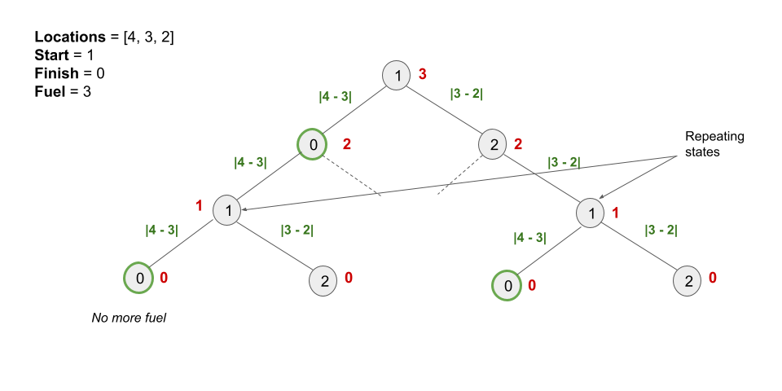

[TOC]

## Solution

---

### Overview

We are given an array of distinct positive integer locations where $\text{locations}[i]$ represents the position of city `i`. We are also given integers `start`, `finish`, and `fuel` representing the starting city, ending city, and the initial amount of fuel you have, respectively.

At each step, if you are at city `i`, you can pick any city `j` such that $j \neq i$ and move to city `j`. Moving from city `i` to city `j` consumes $|\text{locations}[i] - \text{locations}[j]|$ fuel.

Our task is to count the number of possible routes from start to finish without the fuel dropping below `0`. Since the answer may be too large, we have to modulo it by $10^9 + 7$.

---

### Approach 1: Recursive Dynamic Programming

#### Intuition

If you are new to Dynamic Programming, please see our [Leetcode Explore Card](https://leetcode.com/explore/featured/card/dynamic-programming/) for more information on it!

Intuitively, we can consider moving to any city that we have enough fuel to reach. We repeat the process from the city we arrive in with the remaining fuel and travel to all cities we can with the remaining fuel. We keep repeating this process until we run out of fuel increment the answer by `1` each time we arrive at the `finish` city.

Note that we don't necessarily stop at the `finish` city, since we might be able to leave the city and return if we have enough fuel, creating more routes.

We can implement this approach using a recursion to keep moving from the current city to all the other cities with the remaining fuel.

Let the current city be `currCity` and the remaining fuel be `remainingFuel`. We initialize an `answer` variable to store the number of routes to reach `finish` from `currCity`. If $currCity = finish$, we have one way to reach `finish`, so we initialize $answer = 1$. Otherwise, $answer = 0$ is initialized.

We recursively move from `currCity` to all the other cities. For each `nextCity` (not equal to `currCity`), we again call the recursive function with `nextCity` as `currCity` and the `remainingFuel` as $remainingFuel - |\text{locations}[currCity] - \text{locations}[nextCity]|$. If `remainingFuel` drops below `0`, we simply return `0` and don't do anything in the recursive function. The recursive relation can be written as:

> answer = currCity == finish ? 1 : 0
> answer = (answer + solve(locations, nextCity, finish, remainingFuel - |locations[currCity] - locations[nextCity]|)) % 1000000007
> Considering all values of `nextCity`, where $nextCity \neq currCity$.

Our answer would be `solve(locations, start, finish, fuel)`.

The recursion tree of the above relation would look something like this:



The number in the node represents the city, the numbers in red alongside each node represent the remaining fuel, and the calculation on each edge represents the amount of fuel required to move from one city to another. We can see that there are subproblems as indicated in the image that are solved multiple times in the partial recursion tree shown above. If we draw the entire recursion tree, we can see that there are many subproblems that are solved repeatedly.

To avoid this issue, we store the solution of each sub-problem and when we encounter the same subproblem again, we simply refer to the stored result. This is called **memoization**.

As we know the current state of a sub-problem depends on the current city and the remaining fuel, we can use a 2D array here.

#### Algorithm

1. Create an integer variable `n` and initialize it to the size of `locations`.
2. Create a 2D-array called `memo` having `n` rows and $fuel + 1$ columns where $\text{memo}[i][j]$ contains the number of possible routes starting from the city `i` with `j` fuel. We initialize the array to `-1`.
3. Return `solve(locations, start, finish, fuel, memo)` where `solve` is a recursive method with five parameters: `locations`, the current city `currCity` we are at, `finish`, `remainingFuel`, and `memo`. It returns the number of possible routes starting from the `currCity` city with `remainingFuel` fuel. We perform the following in this method:
- If `remainingFuel < 0`, it indicates we cannot enter this city as the fuel is negative, so we return `0`.
- If $\text{memo}[m][n] \neq -1$, it indicates that we have already solved this subproblem, so we return $\text{memo}[m][n]$.
- Create an integer variable `ans`. We initialize it to `1` if $currCity = finish$, else to `0`.
- We iterate over all the cities and for each city, $nextCity \neq currCity$, we recursively compute the number of possible routes that lead to `finish` with $remainingFuel - |\text{locations}[currCity] - \text{locations}[nextCity]|$ fuel. We perform $ans = ans + solve(locations, nextCity, finish, remainingFuel - |\text{locations}[currCity] - \text{locations}[nextCity]|, memo)$ for all the cities. We also take its modulo with $10^9 + 7$ at each step.
- Note that we don't need `long long` variables in languages like `C++` and `Java` because our computations never exceed `Integer` limit. At the most, `ans` and `solve` can be $10^9 + 6$ each (one less than $10^9 + 7$). Adding both of these values in the above step  (($10^9 + 6) + ($10^{9}$ + 6)  = 2 \cdot 10 ^9 + 12$) would still not exceed the `Integer` limits, after which we modulo them with $10^9 + 7$ anyways.
- We store the answer of this sub-problem in $\text{memo}[currCity][remainingFuel]$ and return it.

#### Implementation

```python
class Solution:
    def countRoutes(self, locations: List[int], start: int, finish: int, fuel: int) -> int:
        n = len(locations)

        memo = {}
        def solve(currCity, remainingFuel):
            if remainingFuel < 0:
                return 0
            if (currCity, remainingFuel) in memo:
                return memo[(currCity, remainingFuel)]

            ans = 0
            if currCity == finish:
                ans = 1
            for nextCity in range(n):
                if nextCity != currCity:
                    ans = (ans + solve(nextCity, remainingFuel - abs(
                        locations[currCity] - locations[nextCity]))) % 1000000007

            memo[(currCity, remainingFuel)] = ans
            return ans

        return solve(start, fuel)
```

#### Complexity Analysis

Here, $n$ is the length of `locations`.

* Time complexity: $O(n^2 \cdot \text{fuel})$

- Initializing the `memo` array takes $O(n \cdot \text{fuel})$ time.
- We iterate over all cities for each `currCity, remainingFuel` state. Because there are $n \cdot \text{fuel}$ states and computing each state requires iterating over all the `n` cities (except the current one), it would take $O(n^2 \cdot \text{fuel})$ time.
- The recursive function might be called more than once as we saw in the recursion tree. However, due to memoization each state will be computed only once.

* Space complexity: $O(n \cdot \text{fuel})$

- The `memo` array consumes $O(n \cdot \text{fuel})$ space.
- The recursion stack used in the solution can grow to a maximum size of $O(\text{fuel})$. When we try to form the recursion tree, we see that after each node $n - 1$ branches are formed (visiting all cities except the current city). The recursion stack would only have one call out of the $n - 1$ branches. The height of such a tree will be $O(\text{fuel})$ in the worst case if we consider decrementing the remaining fuel by `1` when going from a city to another. As a result, the recursion tree that will be formed will have $O(\text{fuel})$ height. Hence, the recursion stack will have a maximum of $O(\text{fuel})$ elements.

---

### Approach 2: Iterative Dynamic Programming

#### Intuition

We used memoization in the preceding approach to store the answers to subproblems in order to solve a larger problem. We can also use a bottom-up approach to solve such problems without using recursion. We build answers to subproblems iteratively first, then use them to build answers to larger problems.

In the approach also we create a 2D-array `dp`, where $\text{dp}[i][j]$ contains the number of possible routes starting from the city `i` with `j` fuel. Our answer would be $\text{dp}[start][fuel]$. The value of $\text{dp}[i][j]$ would be initialized with `1` if $i = finish$ (staying at `i` is one way to reach `finish)`, otherwise `0` as we did in the previous approach. We then move to all other cities except `i`. For each city `k`, we reduce the fuel by $|\text{locations}[i] - \text{locations}[k]|$ and add the ways to reach `finish` from `k` using $j - |\text{locations}[i] - \text{locations}[k]|$ to $\text{dp}[i][j]$. The state transition would be as follows:

> dp[i][j] = (dp[i][j] + dp[k][j - |locations[i] - locations[k]|]) % 1000000007

The transition indicates that three nested loops are required to fill the `dp` array. The first loop controls the fuel and will go from $j = 0$ to `fuel`, the second loop controls the start city and runs from $i = 0$ to $n - 1$, and the third loops from $k = 0$ to $n - 1$ to cover all the cities we move to from the city `i`. To compute $\text{dp}[i][j]$, we must know the values for fuel less than `j` because we are decrementing the fuel in its computation while moving to other cities. As a result, the outer loop must control the fuel as we progress from a lower amount of fuel to a higher amount of fuel in a bottom-up manner.

#### Algorithm

1. Create an integer variable `n` and initialize it to the size of `locations`.
2. Create a 2D-array called `dp` having `n` rows and $fuel + 1$ columns where $\text{memo}[i][j]$ contains the number of possible routes starting from the city `i` with `j` fuel. We initialize the values in the row `finish` to `1` because just standing at the city is one way to reach `finish`. It forms the base case for our approach.
3. We iterate using three loops. The first loop controls the fuel and will go from $j = 0$ to `fuel`, the second loop controls the start city and runs from $i = 0$ to $n - 1$, and the third loops from $k = 0$ to $n - 1$ to cover all the cities we move to from the city `i`. We perform the following:
- If $k = i$, we ignore this case and just continue as we cannot move to the same city in the next step.
- If we've enough fuel to move from the city `i` to `k`, i.e., $|\text{locations}[i] - \text{locations}[k]| \le j$, we add $\text{dp}[k][j - |\text{locations}[i] - \text{locations}[k]|]$ to $\text{dp}[i][j]$ and take it modulo with $10^9 + 7$.
4. Return $\text{dp}[start][fuel]$.

#### Implementation

```python
class Solution:
    def countRoutes(self, locations: List[int], start: int, finish: int, fuel: int) -> int:
        n = len(locations)
        dp = [[0] * (fuel + 1) for _ in range(n)]

        for i in range(fuel + 1):
            dp[finish][i] = 1

        for j in range(fuel + 1):
            for i in range(n):
                for k in range(n):
                    if k == i:
                        continue
                    if abs(locations[i] - locations[k]) <= j:
                        dp[i][j] = (dp[i][j] + dp[k][j - abs(
                            locations[i] - locations[k])]) % 1000000007

        return dp[start][fuel]
```

#### Complexity Analysis

Here, $n$ is the length of `locations`.

* Time complexity: $O(n^2 \cdot \text{fuel})$

- Initializing the `dp` array takes $O(n \cdot \text{fuel})$ time.
- We fill the `dp` array which takes $O(n^2 \cdot \text{fuel})$ as we run three nested loops.

* Space complexity: $O(n \cdot \text{fuel})$

- The `dp` array consumes $O(n \cdot \text{fuel})$ space.