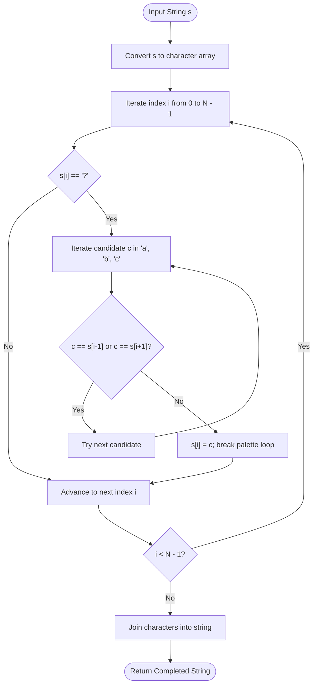

# Guided Example: Replace All ?'s to Avoid Consecutive Repeating Characters

## 1. Instance & Teaching Goal

We are given a string $s$ containing lowercase English letters and question mark `'?'` placeholders. We must replace every `'?'` with a lowercase English letter such that the final completed string contains no two adjacent equal characters:
$$s[i] \neq s[i+1] \quad \text{for all } 0 \le i < N - 1$$
Pre-existing letters cannot be altered, and any valid satisfying string is accepted.

We select the representative instance containing single and adjacent placeholders:
$$s = \text{"j?qg??b"}$$

The algorithm produces:
$$\text{"jaqgacb"}$$

Our teaching goal is to demonstrate greedy local constraint satisfaction under the Pigeonhole Principle. We prove why an alphabet of just three candidate characters (`{'a', 'b', 'c'}`) is mathematically guaranteed to resolve any placeholder without backtracking, and how sequential left-to-right filling ensures global validity in linear time.

## 2. Conceptual Foundation & Invariants

At any placeholder position $i$, the character $s[i]$ is constrained only by its immediate orthogonal neighbors:
1. Left neighbor: $s[i-1]$ (if $i > 0$)
2. Right neighbor: $s[i+1]$ (if $i < N - 1$)

Together, the left and right neighbors can rule out at most $2$ distinct character values.
By the Pigeonhole Principle, if we evaluate a candidate palette of $3$ distinct characters:
$$\mathcal{P} = \{\text{'a'}, \text{'b'}, \text{'c'}\}$$
at least one character in $\mathcal{P}$ must differ from both $s[i-1]$ and $s[i+1]$:
$$|\mathcal{P} \setminus \{s[i-1], s[i+1]\}| \ge 3 - 2 = 1$$

```
+-------------------------------------------------------------------------+
|                  PIGEONHOLE GREEDY LOCAL RESOLUTION                     |
|                                                                         |
| For any placeholder at index i:                                         |
|   Forbidden set: F = { s[i-1], s[i+1] } intersect {'a', 'b', 'c'}       |
|   |F| <= 2 forbidden values.                                            |
|                                                                         |
| Candidate palette: P = {'a', 'b', 'c'}  (|P| = 3)                       |
| By Pigeonhole Principle:                                                |
|   |P \ F| >= 3 - 2 = 1 guaranteed available character!                  |
|                                                                         |
| Sequential Resolution:                                                  |
|   Index 4: '?' between 'g' and '?' ==> 'a' is free ==> s[4] = 'a'      |
|   Index 5: '?' between 'a' and 'b' ==> 'c' is free ==> s[5] = 'c'      |
|                                                                         |
| Final: "j" + "a" + "q" + "g" + "a" + "c" + "b" = "jaqgacb"             |
+-------------------------------------------------------------------------+
```

### State Parameter Reference

| Parameter | Type | Domain | Purpose in State Machine |
|---|---|---|---|
| $i$ | Integer Index | $[0, N-1]$ | Active position along string $s$ |
| $s[i]$ | Character | Lowercase or `'?'` | Active character being evaluated |
| $\text{left}$ | Character | Lowercase or $\emptyset$ | Value of $s[i-1]$ (empty if $i = 0$) |
| $\text{right}$ | Character | Lowercase or `'?'` | Value of $s[i+1]$ (empty if $i = N - 1$) |
| $c$ | Candidate Character | $\in \{\text{'a'}, \text{'b'}, \text{'c'}\}$ | Palette character tested against local neighbors |

> [!IMPORTANT]
> **Forward Compatibility Invariant**:
> Filling placeholders sequentially from left to right causes index $i$ to be fully finalized before index $i+1$ is evaluated. When index $i+1$ is examined, its left neighbor $s[i]$ is guaranteed to be a concrete letter (not `'?'`), and its right neighbor $s[i+2]$ is either fixed or `'?'`. Because testing $\mathcal{P} = \{\text{'a'}, \text{'b'}, \text{'c'}\}$ guarantees finding a valid choice at every step, the algorithm never requires backtracking.



## 3. Step-by-Step Worked Execution

We trace the algorithm on $s = \text{"j?qg??b"}$ of length $N = 7$.
Initial character array:
$$s = ['j', '?', 'q', 'g', '?', '?', 'b']$$

### Index $i = 0$: $s[0] = \text{'j'}$
- Character is not `'?'`. Retain fixed input letter `'j'`.

### Index $i = 1$: $s[1] = \text{'?'}$
- Left neighbor: $s[0] = \text{'j'}$.
- Right neighbor: $s[2] = \text{'q'}$.
- Forbidden set: $\{\text{'j'}, \text{'q'}\}$.
- Test candidates from $\mathcal{P} = \{\text{'a'}, \text{'b'}, \text{'c'}\}$:
  - Candidate $c = \text{'a'}$: $\text{'a'} \neq \text{'j'}$ and $\text{'a'} \neq \text{'q'}$.
  - No collision! Assign $s[1] = \text{'a'}$.
- Updated array: $['j', \mathbf{'a'}, 'q', 'g', '?', '?', 'b']$.

### Index $i = 2$: $s[2] = \text{'q'}$
- Character is not `'?'`. Retain `'q'`.

### Index $i = 3$: $s[3] = \text{'g'}$
- Character is not `'?'`. Retain `'g'`.

### Index $i = 4$: $s[4] = \text{'?'}$
- Left neighbor: $s[3] = \text{'g'}$.
- Right neighbor: $s[5] = \text{'?'}$ (unassigned placeholder).
- Forbidden set: $\{\text{'g'}\}$ (the right placeholder `'?'` does not forbid any letter).
- Test candidates:
  - Candidate $c = \text{'a'}$: $\text{'a'} \neq \text{'g'}$ and $\text{'a'} \neq \text{'?'}$.
  - No collision! Assign $s[4] = \text{'a'}$.
- Updated array: $['j', 'a', 'q', 'g', \mathbf{'a'}, '?', 'b']$.

### Index $i = 5$: $s[5] = \text{'?'}$
- Left neighbor: $s[4] = \text{'a'}$ (finalized in previous step).
- Right neighbor: $s[6] = \text{'b'}$.
- Forbidden set: $\{\text{'a'}, \text{'b'}\}$.
- Test candidates:
  - Candidate $c = \text{'a'}$: Collides with left neighbor $s[4] = \text{'a'}$. Rejected.
  - Candidate $c = \text{'b'}$: Collides with right neighbor $s[6] = \text{'b'}$. Rejected.
  - Candidate $c = \text{'c'}$: $\text{'c'} \neq \text{'a'}$ and $\text{'c'} \neq \text{'b'}$.
  - No collision! Assign $s[5] = \text{'c'}$.
- Updated array: $['j', 'a', 'q', 'g', 'a', \mathbf{'c'}, 'b']$.

### Index $i = 6$: $s[6] = \text{'b'}$
- Character is not `'?'`. Retain `'b'`.

### Final String Conversion
Array joined to string: `"jaqgacb"`.
Adjacent characters:
$\text{'j'} \neq \text{'a'} \neq \text{'q'} \neq \text{'g'} \neq \text{'a'} \neq \text{'c'} \neq \text{'b'}$.
All adjacent pairs are distinct.

## 4. Complete Execution Trace

The table below catalogs the state transitions and neighbor evaluations across all 7 string indices.

| Index $i$ | Original Character | Left Neighbor $s[i-1]$ | Right Neighbor $s[i+1]$ | Forbidden Values | Candidate Palette Scan | Selected Character | Modified String State |
|---|---|---|---|---|---|---|---|
| 0 | `'j'` | - | `'?'` | - | None (Fixed) | `'j'` | `"j?qg??b"` |
| 1 | `'?'` | `'j'` | `'q'` | `{'j', 'q'}` | `'a'` (Valid) | `'a'` | `"jaqg??b"` |
| 2 | `'q'` | `'a'` | `'g'` | - | None (Fixed) | `'q'` | `"jaqg??b"` |
| 3 | `'g'` | `'q'` | `'?'` | - | None (Fixed) | `'g'` | `"jaqg??b"` |
| 4 | `'?'` | `'g'` | `'?'` | `{'g'}` | `'a'` (Valid) | `'a'` | `"jaqga?b"` |
| 5 | `'?'` | `'a'` | `'b'` | `{'a', 'b'}` | `'a'` (X), `'b'` (X), `'c'` (Valid) | `'c'` | `"jaqgacb"` |
| 6 | `'b'` | `'c'` | - | - | None (Fixed) | `'b'` | `"jaqgacb"` |

### Neighbor Collision Analysis for Adjacent Placeholders

| Boundary Pair Tested | Preceding Assignment | Successor Target | Conflict Avoided | Resolution Rule |
|---|---|---|---|---|
| Indices $(3, 4)$ | $s[3] = \text{'g'}$ | $s[4] = \text{'a'}$ | $\text{'g'} \neq \text{'a'}$ | First free candidate from $\{\text{'a'}, \text{'b'}, \text{'c'}\}$ |
| Indices $(4, 5)$ | $s[4] = \text{'a'}$ | $s[5] = \text{'c'}$ | $\text{'a'} \neq \text{'c'}$ | Avoids newly assigned predecessor $s[4]$ |
| Indices $(5, 6)$ | $s[5] = \text{'c'}$ | $s[6] = \text{'b'}$ | $\text{'c'} \neq \text{'b'}$ | Avoids fixed successor $s[6]$ |

## 5. Algorithmic Correctness

### Soundness

1. Any character assigned to $s[i]$ is explicitly verified against $s[i-1]$ (when $i > 0$) and $s[i+1]$ (when $i < N - 1$).
2. The assignment $s[i] = c$ is executed only when $c \neq s[i-1]$ and $c \neq s[i+1]$.
3. Since this condition is enforced for every index $i \in [0, N-1]$, no pair of adjacent characters can be equal.
4. Input characters other than `'?'` are never overwritten.
Therefore, the resulting string is strictly valid according to problem requirements.

### Completeness

Let $i$ be any placeholder index. The character $s[i]$ is adjacent to at most two positions: $i-1$ and $i+1$.
These two positions hold at most $2$ distinct character values in the English alphabet.
Consider the candidate set $\mathcal{P} = \{\text{'a'}, \text{'b'}, \text{'c'}\}$.
Since $|\mathcal{P}| = 3$ and at most $2$ values are forbidden by the neighbors, $|\mathcal{P} \setminus \{s[i-1], s[i+1]\}| \ge 1$.
Thus, there always exists at least one candidate in $\{\text{'a'}, \text{'b'}, \text{'c'}\}$ that causes no conflict with either neighbor.
Because an available character is mathematically guaranteed to exist at every step, the greedy traversal never fails or encounters a dead end.

## 6. Traps This Instance Exposes

1. **Testing Against the Unprocessed Successor (`'?'`)**:
   At index $4$, the right neighbor is $s[5] = \text{'?'}$. A common bug is checking `c == s[i+1]` without verifying that $s[i+1] \neq \text{'?'}$. Since `'?'` is not in $\{\text{'a'}, \text{'b'}, \text{'c'}\}$, standard equality handles this, but explicit logic must never treat `'?'` as a forbidden letter.

2. **Full 26-Letter Alphabet Random Sampling**:
   Attempting to pick random letters from `'a'` through `'z'` until a valid one is found introduces non-deterministic runtime. Iterating through a fixed 3-character palette guarantees finding a valid assignment in at most 3 iterations.

3. **String Immutability Overhead**:
   Repeatedly rebuilding strings via string slicing and concatenation creates $\mathcal{O}(N)$ allocations per placeholder, resulting in $\mathcal{O}(N^2)$ memory churning. Converting to a mutable list of characters and modifying in place operates in strictly linear time.

4. **Handling Boundary Elements ($i = 0$ and $i = N - 1$)**:
   The first element has no left neighbor, and the last element has no right neighbor. Guarding neighbor checks with $i > 0$ and $i < N - 1$ prevents out-of-bounds indexing errors.

## 7. Complexity Derivation

### Time Complexity

Let $N$ be the length of string $s$ ($N \le 100$).
- **Conversion to Array**: Unpacking $s$ into a character list takes $\mathcal{O}(N)$ time.
- **Sequential Scan**: The outer loop runs $N$ times.
  - If $s[i] \neq \text{'?'}$, work is $\mathcal{O}(1)$.
  - If $s[i] == \text{'?'}$, the inner loop tests at most $3$ characters from $\{\text{'a'}, \text{'b'}, \text{'c'}\}$. Each test performs at most $2$ character comparisons: $\mathcal{O}(1)$.
- **Rejoining**: Rejoining the list into a string takes $\mathcal{O}(N)$ time.

Total time complexity is strictly:
$$\mathcal{O}(N)$$
For $N = 100$, this executes in under 0.1 milliseconds.

### Auxiliary Space Complexity

- The mutable character array requires $N$ character slots: $\mathcal{O}(N)$ space.
- Palette iteration requires $\mathcal{O}(1)$ scalar storage.

Total auxiliary space complexity is:
$$\mathcal{O}(N)$$
Proportional to the input string length.
