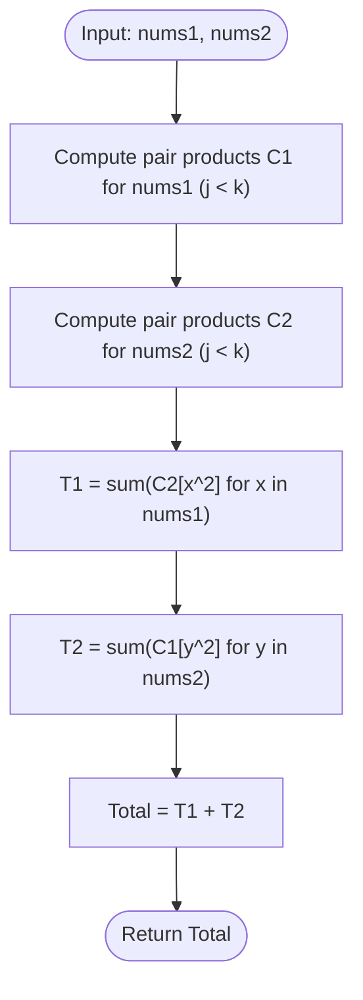

# Guided Example: Number of Ways Where Square of Number Is Equal to Product of Two Numbers

## 1. Instance & Teaching Goal

We are given two integer arrays $\text{nums1}$ and $\text{nums2}$. We must count the number of valid index triplets across two symmetric categories:
- **Type 1**: Index $i$ in $\text{nums1}$ and indices $j < k$ in $\text{nums2}$ such that:
  $$\text{nums1}[i]^2 = \text{nums2}[j] \times \text{nums2}[k]$$
- **Type 2**: Index $i$ in $\text{nums2}$ and indices $j < k$ in $\text{nums1}$ such that:
  $$\text{nums2}[i]^2 = \text{nums1}[j] \times \text{nums1}[k]$$

We seek the combined total of Type 1 and Type 2 triplets.

We select the representative instance:
$$\text{nums1} = [7, 4], \quad \text{nums2} = [5, 2, 8, 9]$$

The required total number of triplets is:
$$1$$
(Formed by the Type 1 triplet $i = 1$ from $\text{nums1}$ where $\text{nums1}[1] = 4$, and $j = 1, k = 2$ from $\text{nums2}$ where $\text{nums2}[1] \times \text{nums2}[2] = 2 \times 8 = 16 = 4^2$).

Our teaching goal is to demonstrate symmetry decomposition and hash-indexed pair frequency precomputation. Instead of running a nested cubic search $\mathcal{O}(N \cdot M^2)$ testing every combination, we precompute pairwise product distributions in $\mathcal{O}(M^2)$ time, enabling $\mathcal{O}(1)$ square frequency lookups.

## 2. Conceptual Foundation & Invariants

Let $A$ and $B$ be two arrays of sizes $N$ and $M$.
The subproblem of finding triplets where $x \in A$ satisfies $x^2 = y \cdot z$ for $y, z \in B$ ($j < k$) can be decomposed into:
1. Constructing a frequency multiset of all unordered pairwise products in $B$:
   $$C_B[P] = |\{(j, k) \mid 0 \le j < k < M \land B[j] \cdot B[k] = P\}|$$
2. Summing the counts of squares for each element in $A$:
   $$\text{Triplets}(A, B) = \sum_{x \in A} C_B[x^2]$$

By symmetry, the global solution is:
$$\text{Total} = \text{Triplets}(\text{nums1}, \text{nums2}) + \text{Triplets}(\text{nums2}, \text{nums1})$$

```
+-------------------------------------------------------------------------+
|                  HASH-INDEXED PAIRWISE PRODUCT FREQUENCY                |
|                                                                         |
| Array nums1 = [7, 4]       Array nums2 = [5, 2, 8, 9]                   |
|                                                                         |
| Phase 1: Type 1 Triplets (nums1[i]^2 == nums2[j] * nums2[k])            |
|   Squares of nums1:                                                     |
|     i = 0: val = 7, 7^2 = 49                                            |
|     i = 1: val = 4, 4^2 = 16                                            |
|                                                                         |
|   Pair products in nums2:                                               |
|     5 * 2 = 10,  5 * 8 = 40,  5 * 9 = 45                                |
|     2 * 8 = 16,  2 * 9 = 18                                             |
|     8 * 9 = 72                                                          |
|     Frequency map C2: {10:1, 40:1, 45:1, 16:1, 18:1, 72:1}              |
|                                                                         |
|   Lookup: C2[49] = 0, C2[16] = 1 ==> Type 1 Count = 1                   |
|                                                                         |
| Phase 2: Type 2 Triplets (nums2[i]^2 == nums1[j] * nums1[k])            |
|   Only one pair in nums1: 7 * 4 = 28 ==> C1: {28: 1}                    |
|   Squares in nums2: 5^2=25, 2^2=4, 8^2=64, 9^2=81 (None is 28)         |
|   Lookup ==> Type 2 Count = 0                                           |
|                                                                         |
| Total Triplets = 1 + 0 = 1                                              |
+-------------------------------------------------------------------------+
```

### State Parameter Reference

| Parameter | Type | Domain | Purpose in State Machine |
|---|---|---|---|
| $N, M$ | Integers | Lengths of arrays | Dimensions of $\text{nums1}$ and $\text{nums2}$ |
| $C_1$ | Hash Map | $\text{Product} \to \text{Count}$ | Frequency of all pairwise products $\text{nums1}[j] \cdot \text{nums1}[k]$ ($j < k$) |
| $C_2$ | Hash Map | $\text{Product} \to \text{Count}$ | Frequency of all pairwise products $\text{nums2}[j] \cdot \text{nums2}[k]$ ($j < k$) |
| $x^2$ | 64-bit Integer | $[1, 10^{10}]$ | Target squared value queried in the complementary product map |
| $T_1$ | Integer | Non-negative | Accumulated count of Type 1 triplets |
| $T_2$ | Integer | Non-negative | Accumulated count of Type 2 triplets |

> [!IMPORTANT]
> **Index Distinction Invariant**:
> Triplets are defined strictly by distinct index tuples $(i, j, k)$. If an array contains duplicate numerical values (e.g. $[1, 1, 1]$), each pair of distinct indices $(j, k)$ with $j < k$ generates an independent entry in the product frequency map. Multiplicities are naturally preserved by integer accumulation in $C[P]$.



## 3. Step-by-Step Worked Execution

We trace the algorithm on $\text{nums1} = [7, 4]$ ($N = 2$) and $\text{nums2} = [5, 2, 8, 9]$ ($M = 4$).

### Phase 1: Precompute Pairwise Product Maps

1. **Map $C_1$ for $\text{nums1} = [7, 4]$**:
   - Pair $(j=0, k=1)$: $\text{nums1}[0] \times \text{nums1}[1] = 7 \times 4 = 28$.
   - Product frequency map: $C_1 = \{28: 1\}$.

2. **Map $C_2$ for $\text{nums2} = [5, 2, 8, 9]$**:
   - $j = 0$ ($\text{val} = 5$):
     - $k = 1$: $5 \times 2 = 10 \implies C_2[10] = 1$
     - $k = 2$: $5 \times 8 = 40 \implies C_2[40] = 1$
     - $k = 3$: $5 \times 9 = 45 \implies C_2[45] = 1$
   - $j = 1$ ($\text{val} = 2$):
     - $k = 2$: $2 \times 8 = 16 \implies C_2[16] = 1$
     - $k = 3$: $2 \times 9 = 18 \implies C_2[18] = 1$
   - $j = 2$ ($\text{val} = 8$):
     - $k = 3$: $8 \times 9 = 72 \implies C_2[72] = 1$
   - Product frequency map:
     $$C_2 = \{10: 1, 40: 1, 45: 1, 16: 1, 18: 1, 72: 1\}$$

### Phase 2: Evaluate Type 1 Triplets ($x \in \text{nums1}, \text{query } C_2$)

We query $C_2[x^2]$ for each element in $\text{nums1}$:
- Element $x = \text{nums1}[0] = 7$:
  - Target square: $x^2 = 7^2 = 49$.
  - Lookup in $C_2$: $49 \notin C_2 \implies C_2[49] = 0$.
- Element $x = \text{nums1}[1] = 4$:
  - Target square: $x^2 = 4^2 = 16$.
  - Lookup in $C_2$: $16 \in C_2 \implies C_2[16] = 1$.
  - Valid triplet: $(i=1, j=1, k=2)$ where $\text{nums1}[1]^2 = 4^2 = 16 = \text{nums2}[1] \cdot \text{nums2}[2] = 2 \cdot 8$.
- Total Type 1 triplets: $T_1 = 0 + 1 = 1$.

### Phase 3: Evaluate Type 2 Triplets ($y \in \text{nums2}, \text{query } C_1$)

We query $C_1[y^2]$ for each element in $\text{nums2}$:
- Element $y = \text{nums2}[0] = 5$: $5^2 = 25 \notin C_1 \implies 0$.
- Element $y = \text{nums2}[1] = 2$: $2^2 = 4 \notin C_1 \implies 0$.
- Element $y = \text{nums2}[2] = 8$: $8^2 = 64 \notin C_1 \implies 0$.
- Element $y = \text{nums2}[3] = 9$: $9^2 = 81 \notin C_1 \implies 0$.
- Total Type 2 triplets: $T_2 = 0 + 0 + 0 + 0 = 0$.

### Phase 4: Final Aggregation
$$\text{Total} = T_1 + T_2 = 1 + 0 = 1$$

## 4. Complete Execution Trace

The table below catalogs every pairwise product computed for both arrays and the corresponding square lookup queries.

| Category | Driver Array | Target Pair Array | Index $i$ | Value | Target Square $v^2$ | Product Pairs $(j, k)$ | Matching Pairs Count | Running Category Total |
|---|---|---|---|---|---|---|---|---|
| Type 1 | `nums1` | `nums2` | 0 | 7 | 49 | All in `nums2` | $C_2[49] = 0$ | 0 |
| Type 1 | `nums1` | `nums2` | 1 | 4 | **16** | $(j=1, k=2): 2 \times 8 = 16$ | $C_2[16] = 1$ | **1** |
| Type 2 | `nums2` | `nums1` | 0 | 5 | 25 | All in `nums1` | $C_1[25] = 0$ | 0 |
| Type 2 | `nums2` | `nums1` | 1 | 2 | 4 | All in `nums1` | $C_1[4] = 0$ | 0 |
| Type 2 | `nums2` | `nums1` | 2 | 8 | 64 | All in `nums1` | $C_1[64] = 0$ | 0 |
| Type 2 | `nums2` | `nums1` | 3 | 9 | 81 | All in `nums1` | $C_1[81] = 0$ | 0 |
| **Combined** | - | - | - | - | - | - | Total: $1 + 0 = 1$ | **1** |

### Verified Triplet Inventory

| Triplet Type | Index $i$ | Index $j$ | Index $k$ | Formula Verified | Numerical Equivalence |
|---|---|---|---|---|---|
| Type 1 | 1 (in `nums1`) | 1 (in `nums2`) | 2 (in `nums2`) | $\text{nums1}[1]^2 = \text{nums2}[1] \cdot \text{nums2}[2]$ | $4^2 = 2 \times 8 \iff 16 = 16$ |

## 5. Algorithmic Correctness

### Soundness

A triplet $(i, j, k)$ is of Type 1 if $i \in [0, N-1]$, $0 \le j < k < M$, and $\text{nums1}[i]^2 = \text{nums2}[j] \cdot \text{nums2}[k]$.
- The hash map $C_2$ iterates over every pair of indices $(j, k)$ with $j < k$ in $\text{nums2}$ and records the frequency of each product $\text{nums2}[j] \cdot \text{nums2}[k]$.
- For any $i \in [0, N-1]$, querying $C_2[\text{nums1}[i]^2]$ returns the exact count of pairs $(j, k)$ in $\text{nums2}$ with $j < k$ whose product equals $\text{nums1}[i]^2$.
- Summing over all $i \in [0, N-1]$ yields the exact number of Type 1 index triplets.
Symmetrically, querying $C_1[\text{nums2}[i]^2]$ for all $i$ yields the exact count of Type 2 index triplets.
Because Type 1 and Type 2 triplets draw their primary index $i$ from different arrays ($\text{nums1}$ vs $\text{nums2}$), their index sets are completely disjoint. Summing $T_1 + T_2$ is strictly sound and introduces zero double counting.

### Completeness

Every valid Type 1 triplet has some primary index $i \in [0, N-1]$ and some pair $(j, k)$ with $0 \le j < k < M$.
Because $C_2$ exhaustively records all $\binom{M}{2}$ pairs and the query loop visits every $i \in [0, N-1]$, every valid triplet is accounted for. The same holds for Type 2. No triplet can be missed.

## 6. Traps This Instance Exposes

1. **32-Bit Integer Multiplication Overflow**:
   Array elements reach $10^5$. Their square is $(10^5)^2 = 10^{10}$, and pair products reach $10^5 \times 10^5 = 10^{10}$. In languages with 32-bit signed integers (maximum $\approx 2.14 \times 10^9$), computing $x \times x$ or $y \times z$ overflows into negative values. Using 64-bit integers (`long long` or Python arbitrary precision) is mandatory.

2. **Allowing $j = k$ (Self-Multiplication)**:
   The problem specifies $j < k$, meaning the two positions in the secondary array must be strictly distinct. Allowing $j = k$ counts $x^2 = y^2$, which violates the triplet definition.

3. **Double Counting Pairs ($j < k$ vs. All Ordered Pairs)**:
   Iterating over all $j \neq k$ would count both $(j, k)$ and $(k, j)$, double-counting every valid pair. Enforcing $k$ strictly greater than $j$ ($k \in [j+1, M-1]$) guarantees each pair is counted exactly once.

4. **Brute Force $\mathcal{O}(N \cdot M^2)$ Search**:
   Directly looping through all $i, j, k$ in nested loops causes $\mathcal{O}(N \cdot M^2 + M \cdot N^2)$ operations. While $N, M \le 100$ is small, precomputing products in hash maps reduces query time to $\mathcal{O}(N + M)$ and easily scales to $N, M \le 1000$.

## 7. Complexity Derivation

### Time Complexity

Let $N = |\text{nums1}|$ and $M = |\text{nums2}|$ ($N, M \le 1000$).
- **Generating $C_1$**: Evaluates all $\binom{N}{2} = \frac{N(N-1)}{2}$ pairs in $\text{nums1}$: $\mathcal{O}(N^2)$ time.
- **Generating $C_2$**: Evaluates all $\binom{M}{2} = \frac{M(M-1)}{2}$ pairs in $\text{nums2}$: $\mathcal{O}(M^2)$ time.
- **Querying Type 1**: Looks up $N$ squared keys in $C_2$: $\mathcal{O}(N)$ average time.
- **Querying Type 2**: Looks up $M$ squared keys in $C_1$: $\mathcal{O}(M)$ average time.

Total time complexity is:
$$\mathcal{O}(N^2 + M^2)$$
For $N, M = 100$, this requires at most $10\,000$ operations, executing in under 2 milliseconds.

### Auxiliary Space Complexity

- The hash map $C_1$ stores at most $\binom{N}{2}$ product entries: $\mathcal{O}(N^2)$.
- The hash map $C_2$ stores at most $\binom{M}{2}$ product entries: $\mathcal{O}(M^2)$.

Total auxiliary space complexity is:
$$\mathcal{O}(N^2 + M^2)$$
For $N, M = 100$, this uses fewer than 100 KB of memory.
