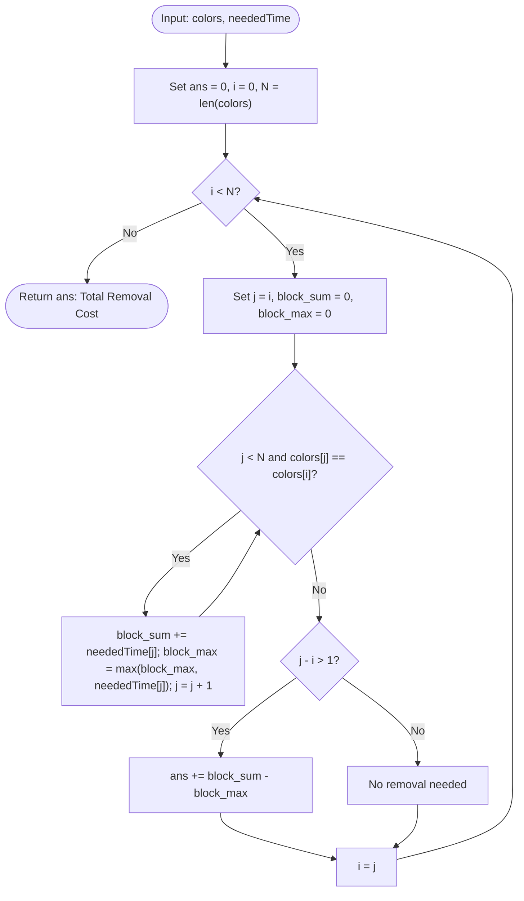

# Guided Example: Minimum Time to Make Rope Colorful

## 1. Instance & Teaching Goal

We are given a string $\text{colors}$ of length $N$ representing the colors of $N$ balloons lined up on a rope, and an array $\text{neededTime}$ of positive integers where $\text{neededTime}[i]$ specifies the seconds required to pop and remove balloon $i$.

The rope is colorful when no two adjacent balloons share the same color. Removing balloons closes the gap, so remaining balloons shift together. We seek the minimum total removal time required to make the rope colorful.

We select the representative instance:
$$\text{colors} = \text{"abaac"}, \quad \text{neededTime} = [1, 2, 3, 4, 5]$$

The minimum removal time is:
$$3$$
(Achieved by removing the `'a'` at index $2$ with time $3$, leaving `"abac"` with non-matching adjacent colors).

Our teaching goal is to walk through run-length decomposition and greedy maximum-retention. We show why contiguous identical-color runs can retain at most one balloon, prove that keeping the single most expensive balloon in each run minimizes total deletion penalty, and illustrate why distinct runs separated by other colors never interfere.

## 2. Conceptual Foundation & Invariants

Consider a maximal contiguous block of identical colors:
$$\text{colors}[i \dots j-1] = [C, C, \dots, C] \quad \text{with } j - i = m \ge 2$$

Every balloon in this contiguous block has the identical color $C$.
- No balloon of a different color exists between index $i$ and index $j-1$.
- Therefore, if two or more balloons from this block are retained, removing intermediate balloons merely pulls those identical-color balloons into direct adjacency.
- To avoid adjacent duplicate colors, **at most one balloon** from this contiguous block can remain on the rope.
- To eliminate duplicate adjacency while keeping as many balloons as possible, we retain **exactly one** balloon from the block and remove the remaining $m - 1$ balloons.

To minimize the total removal cost:
$$\text{Cost} = \sum_{k=i}^{j-1} \text{neededTime}[k] - \text{neededTime}[\text{retained}]$$
we must choose the retained balloon to have the maximum possible removal time:
$$\text{retained} = \arg\max_{k \in [i, j-1]} \text{neededTime}[k]$$
The removal penalty for the run is:
$$\Delta \text{Cost} = \left(\sum_{k=i}^{j-1} \text{neededTime}[k]\right) - \max_{k \in [i, j-1]} \text{neededTime}[k]$$

```
+-------------------------------------------------------------------------+
|                  RUN-LENGTH GREEDY RETENTION PRINCIPLE                  |
|                                                                         |
| Rope:           'a'     'b'     'a'     'a'     'c'                     |
| Times:           1       2       3       4       5                      |
|                                                                         |
| Block 1 ('a'):  len = 1, cost = 1 ==> retain (cost penalty = 0)         |
| Block 2 ('b'):  len = 1, cost = 2 ==> retain (cost penalty = 0)         |
| Block 3 ('aa'): len = 2, times = [3, 4]                                 |
|                 sum = 7, max = 4                                        |
|                 Retain balloon with time 4 (idx 3)                      |
|                 Remove balloon with time 3 (idx 2) ==> penalty = 7 - 4 = 3
| Block 4 ('c'):  len = 1, cost = 5 ==> retain (cost penalty = 0)         |
|                                                                         |
| Final Rope:     "a" + "b" + "a" + "c" = "abac"                          |
| Total Cost:     0 + 0 + 3 + 0 = 3                                       |
+-------------------------------------------------------------------------+
```

### State Parameter Reference

| Parameter | Type | Domain | Purpose in Run Scanner |
|---|---|---|---|
| $i$ | Integer Index | $[0, N-1]$ | Start index of the active monochromatic block |
| $j$ | Integer Index | $[i, N]$ | Scan pointer identifying the right boundary of the block |
| $C$ | Character | Lowercase letter | The uniform color of the active block |
| $S_{\text{block}}$ | Integer | Positive sum | Total removal time of all balloons in block $[i, j-1]$ |
| $M_{\text{block}}$ | Integer | Positive value | Peak removal time among balloons in block $[i, j-1]$ |
| $\text{ans}$ | Integer | Non-negative | Cumulative global removal penalty: $\sum (S - M)$ |

> [!IMPORTANT]
> **Block Independence Invariant**:
> Two separate runs of the same color that are separated by a different color (such as `"aabaa"`) are completely independent. Retaining one balloon from each run leaves them separated by the intermediate different color, preventing any conflict. Thus, the optimization decomposes cleanly into independent single-run choices.



## 3. Step-by-Step Worked Execution

We trace the algorithm on $\text{colors} = \text{"abaac"}$ with $\text{neededTime} = [1, 2, 3, 4, 5]$ of length $N = 5$.
Initial state: $\text{ans} = 0, i = 0$.

### Block 1: Index $i = 0$
- Color: $\text{colors}[0] = \text{'a'}$.
- Scan matching run:
  - $j = 0$: $\text{colors}[0] == \text{'a'}$. $\text{time} = 1$. $\text{sum} = 1, \text{max} = 1$.
  - $j = 1$: $\text{colors}[1] = \text{'b'} \neq \text{'a'}$. Run terminates at $j = 1$.
- Run length: $j - i = 1 - 0 = 1$.
- Since length is $1$, no duplicate exists. Penalty added: $0$.
- Advance: $i = 1$.

### Block 2: Index $i = 1$
- Color: $\text{colors}[1] = \text{'b'}$.
- Scan matching run:
  - $j = 1$: $\text{colors}[1] == \text{'b'}$. $\text{time} = 2$. $\text{sum} = 2, \text{max} = 2$.
  - $j = 2$: $\text{colors}[2] = \text{'a'} \neq \text{'b'}$. Run terminates at $j = 2$.
- Run length: $j - i = 2 - 1 = 1$.
- Penalty added: $0$.
- Advance: $i = 2$.

### Block 3: Index $i = 2$
- Color: $\text{colors}[2] = \text{'a'}$.
- Scan matching run:
  - $j = 2$: $\text{colors}[2] == \text{'a'}$. $\text{time} = 3$. $\text{sum} = 3, \text{max} = 3$.
  - $j = 3$: $\text{colors}[3] == \text{'a'}$. $\text{time} = 4$. $\text{sum} = 3 + 4 = 7, \text{max} = \max(3, 4) = 4$.
  - $j = 4$: $\text{colors}[4] = \text{'c'} \neq \text{'a'}$. Run terminates at $j = 4$.
- Run length: $j - i = 4 - 2 = 2$.
- Conflict detected: Two adjacent `'a'` balloons at indices $2$ and $3$.
- Penalty calculation:
  $$\Delta \text{Cost} = \text{block\_sum} - \text{block\_max} = 7 - 4 = 3$$
  (Retain balloon 3 of time 4; delete balloon 2 of time 3).
- Accumulator update: $\text{ans} = 0 + 3 = 3$.
- Advance: $i = 4$.

### Block 4: Index $i = 4$
- Color: $\text{colors}[4] = \text{'c'}$.
- Scan matching run:
  - $j = 4$: $\text{colors}[4] == \text{'c'}$. $\text{time} = 5$. $\text{sum} = 5, \text{max} = 5$.
  - $j = 5 = N$. End of string.
- Run length: $j - i = 5 - 4 = 1$.
- Penalty added: $0$.
- Advance: $i = 5$.

### Termination
$i = 5 = N$. Loop terminates.
Total minimum removal time: $\text{ans} = 3$.

## 4. Complete Execution Trace

The table below catalogs every run identified across the string, listing indices, times, retention choices, and deletion penalties.

| Block # | Start $i$ | End $j$ | Run Length | Color | Member Indices | Time Values | Block Sum | Block Max | Retained Index | Removed Indices | Block Penalty | Cumulative Cost |
|---|---|---|---|---|---|---|---|---|---|---|---|---|
| 1 | 0 | 1 | 1 | `'a'` | `[0]` | `[1]` | 1 | 1 | 0 | None | 0 | 0 |
| 2 | 1 | 2 | 1 | `'b'` | `[1]` | `[2]` | 2 | 2 | 1 | None | 0 | 0 |
| 3 | 2 | 4 | 2 | `'a'` | `[2, 3]` | `[3, 4]` | 7 | 4 | 3 | `[2]` | $7 - 4 = 3$ | **3** |
| 4 | 4 | 5 | 1 | `'c'` | `[4]` | `[5]` | 5 | 5 | 4 | None | 0 | 3 |

### Final String State

- Retained indices: $0, 1, 3, 4$.
- Resulting colors: $\text{colors}[0] + \text{colors}[1] + \text{colors}[3] + \text{colors}[4] = \text{"a"} + \text{"b"} + \text{"a"} + \text{"c"} = \text{"abac"}$.
- Total removal time: $\text{neededTime}[2] = 3$.
- Validity check:
  - $\text{'a'} \neq \text{'b'}$ (indices 0, 1)
  - $\text{'b'} \neq \text{'a'}$ (indices 1, 3)
  - $\text{'a'} \neq \text{'c'}$ (indices 3, 4)
  No equal adjacent colors remain.

## 5. Algorithmic Correctness

### Soundness

1. In any final sequence of retained balloons, no two adjacent balloons share the same color.
2. If any contiguous run of identical colors in the original string retained two or more balloons, all balloons between them in the original string must also have had the same color. Deleting balloons between them leaves the two retained balloons directly adjacent, creating an illegal pair of identical adjacent colors.
3. Therefore, any valid colorful configuration must retain at most one balloon from each maximal contiguous run of identical colors.
4. For a run $R_k$, keeping one balloon $x \in R_k$ incurs a deletion cost of $\sum_{y \in R_k, y \neq x} \text{neededTime}[y] = \sum_{y \in R_k} \text{neededTime}[y] - \text{neededTime}[x]$.
5. Minimizing this sum for run $R_k$ requires choosing $x$ to maximize $\text{neededTime}[x]$.
Since our algorithm retains exactly one balloon with maximum time from each run, every resulting adjacent pair has different colors, and the deletion cost is strictly minimized.

### Completeness

Runs of different colors are separated by natural color boundaries. Retaining one balloon from each run $R_k$ and $R_{k+1}$ results in adjacent balloons of color $\text{color}(R_k) \neq \text{color}(R_{k+1})$.
Because the decisions across distinct runs do not constrain each other, the local choice for each run achieves the global optimum. No configuration can achieve a lower total cost.

## 6. Traps This Instance Exposes

1. **Greedily Comparing Adjacent Pairs without Run Scope**:
   Comparing only adjacent pairs $s[i] == s[i+1]$ and immediately deleting the smaller can fail on runs of length $\ge 3$. In a run like `colors = "aaa"`, `neededTime = [4, 9, 2]`, comparing $(4, 9)$ deletes $4$, and then comparing $(9, 2)$ deletes $2$, correctly leaving $9$. But with naive pointer tracking, the running maximum might not propagate correctly across the full run. Grouping the entire block at once guarantees the global maximum within the run is kept.

2. **Deleting All Balloons in a Duplicated Run**:
   A run of length $2$ requires removing only $1$ balloon, not both. Deleting both balloons satisfies the colorfulness requirement but incurs unnecessary cost.

3. **Re-Evaluating the Whole String After Deletions**:
   Simulating balloon removals by physically deleting elements from an array costs $\mathcal{O}(N^2)$ due to array shifting. Run-length grouping computes the exact cost in a single $\mathcal{O}(N)$ pass without altering array structures.

4. **Integer Overflow on Total Time**:
   With $N = 10^5$ and times up to $10^4$, the maximum total cost is $10^5 \times 10^4 = 10^9$. While this fits within standard 32-bit signed integers, languages with smaller integer types require 64-bit accumulators.

## 7. Complexity Derivation

### Time Complexity

Let $N$ be the length of $\text{colors}$ ($N \le 10^5$).
- The algorithm uses two pointers $i$ and $j$.
- Pointer $i$ marks the start of each run.
- Pointer $j$ scans forward through each balloon exactly once across all runs.
- Every element of $\text{neededTime}$ is accessed exactly once to update $\text{block\_sum}$ and $\text{block\_max}$.

Total time complexity is strictly:
$$\mathcal{O}(N)$$
For $N = 10^5$, this executes in under 5 milliseconds.

### Auxiliary Space Complexity

- The algorithm maintains scalar variables ($i, j, N, \text{block\_sum}, \text{block\_max}, \text{ans}$).
- No auxiliary lists, string copies, or recursion stacks are allocated.

Total auxiliary space complexity is strictly:
$$\mathcal{O}(1)$$
Optimal in both time and space.