[TOC]

## Solution

---

### Overview

In the problem, we are given a string `colors` representing a rope of balloons, and an array `neededTime` for the removal time of each corresponding balloon. We need to remove some (could be none) of the balloons from the rope, so that there are no two consecutive balloons on the rope that have the same color, as shown in the picture below.

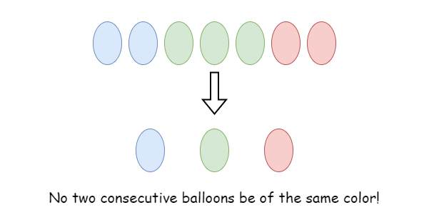

Recall that each balloon has a removal time, our task is to find the minimum total removal time among all such possible removing plans.

---

### Approach 1: Two pointers

#### Intuition

The solution to this problem is quite straightforward: we group the balloons on the rope by their colors. Notice that there shouldn't be two consecutive balloons having the same color, thus we can only keep at most one balloon from each group.

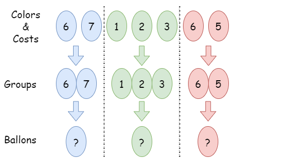

> Sub question 1: Should we delete any entire group?

No, it is never optimal to delete a whole group. Imagine we remove a whole group `group` and end up with a total removal time `t`. Now suppose that we keep one balloon from `group`, the string is still colorful and we end up with a smaller removal time `t'` (`t' < t`), since we remove one less balloon this time.

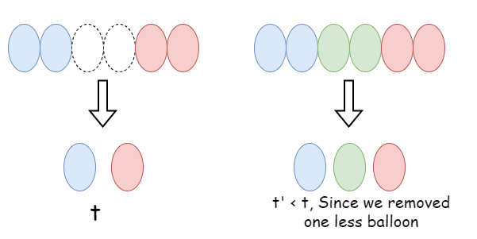

Therefore, we need to keep exactly one balloon from each group.

> Sub question 2: Which balloon shall we keep from each group?

Since we are looking for the minimum removal time, it means that we should keep the balloon with the largest removal time among each group, and remove the rest balloons of the same colors but with a smaller removal time.

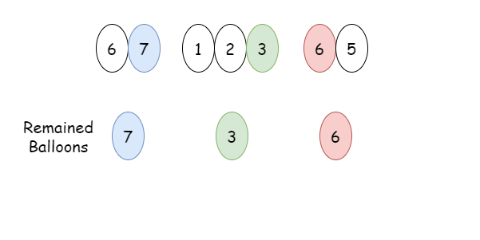

The most intuitive method is to calculate the removal time of each group of balloons separately, we can use a two-pointer method to locate each group.

Take a look at the slides below as an example.

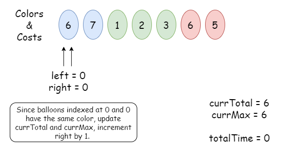

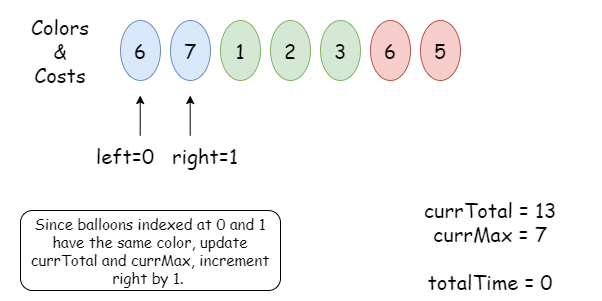

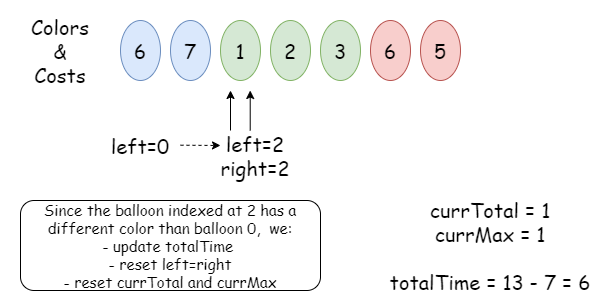

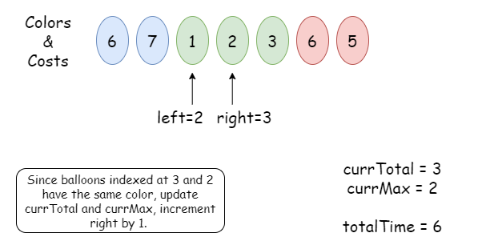

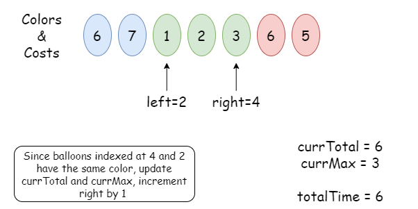

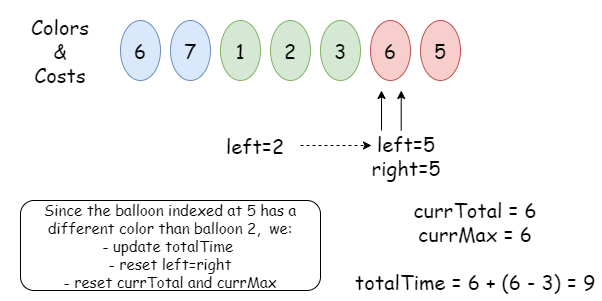

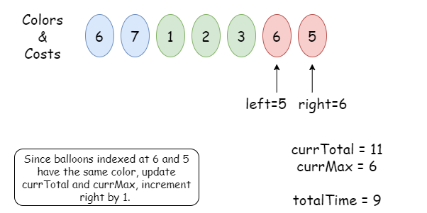

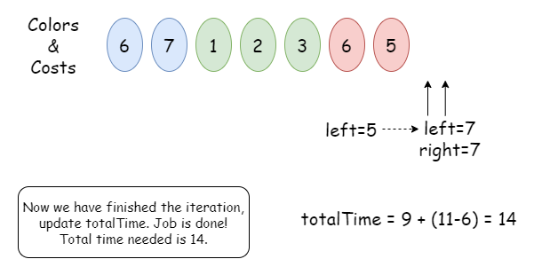

Among each group, we calculate the total removal time `currTotal` and the removal time `currMax` of the balloon that has the maximum removal time. Therefore, we can get the minimum removal time of this group by keeping the balloon with the largest removal time and removing the rest, that is: $t = currTotal - currMax$.

We will calculate the removal time `t` for all of the groups and add them up to make the minimum removal time `totalTime`.

<br>

#### Algorithm

1) Initalize `totalTime`, `left` and `right` as 0.
2) Iterate over balloons, for each group of balloons, we record the total removal time as `currTotal` and the maximum removal time as `currMax`.
3) While the balloon indexed at `right` has the same color as the balloon indexed at `left`, we update `currTotal` and `currMax`, and increment `right` by 1.
4) Otherwise, it means that we have finished iterating this group, we should add the removal time for this group $currTotal - currMax$ to `totalTime`, and reset `left` as `right`.

#### Implementation

```python
class Solution:
    def minCost(self, colors: str, neededTime: List[int]) -> int:
        # Initalize two pointers i, j.
        total_time = 0
        i, j = 0, 0

        while i < len(neededTime) and j < len(neededTime):
            curr_total = 0
            curr_max = 0

            # Find all the balloons having the same color as the
            # balloon indexed at i, record the total removal time
            # and the maximum removal time.
            while j < len(neededTime) and colors[i] == colors[j]:
                curr_total += neededTime[j]
                curr_max = max(curr_max, neededTime[j])
                j += 1

            # Once we reach the end of the current group, add the cost of
            # this group to total_time, and reset two pointers.
            total_time += curr_total - curr_max
            i = j

        return total_time
```

#### Complexity Analysis

Let $n$ be the length of input string $colors$.

* Time complexity: $O(n)$

- We need to iterate over `colors` and `neededTime`. The right index `right` is incremented by $O(n)$ times while the left index `left` is updated by no more than $O(n)$ times. In each step of the iteration, we have some calculations that take constant time.
- To sum up, the overall time complexity is $O(n)$

* Space complexity: $O(1)$

- We only need to update several values: `totalTime`, `currTotal`, `currMax`, `i` and `j`, which takes constant space.

<br/>

---

### Approach 2: Advanced 1-Pass

#### Intuition

In the previous approach, we split balloons into groups with the same color and calculate each group separately. However, we could save one variable `currTotalTime` by adding the smaller removal times directly to the answer `totalTime`.

The key is that: for each group, we always record the largest removal time (Let's still call it `currMaxTime` for convenience) and add the other smaller removal times to `totalTime`. When we have another newly added removal time $t[i]$ that belongs to the current group, we compare $t[i]$ with `currMaxTime`, add the smaller one to `totalTime`, and leave the larger one as `currMaxTime`.

Take a look at the slides below as an example.

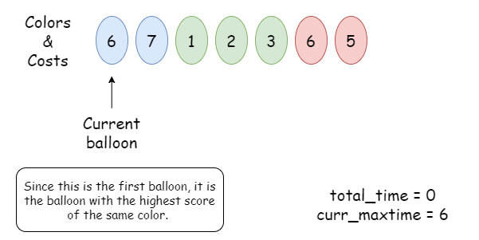

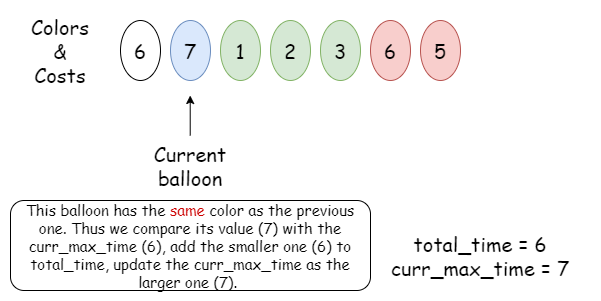

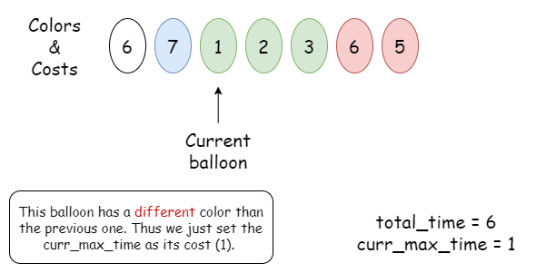

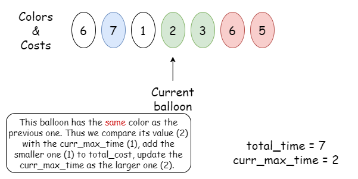

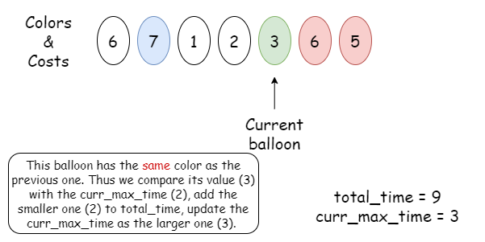

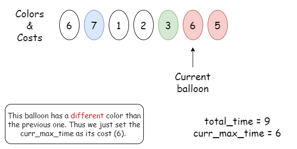

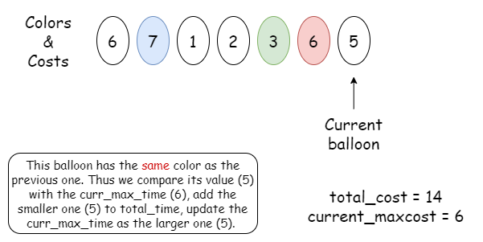

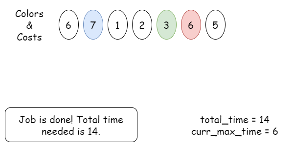

<br>

#### Algorithm

1) Initalize `totalTime`, `currMaxTime` as 0.
2) During the itertion over balloons, for each balloon `i`, it has color of $\text{colors}[i]$ and removal time $\text{neededTime}[i]$.
- If this balloon is the first balloon of a group, we reset `currMaxTime` as 0.
- Increment `totalTime` by the smaller one among $\text{neededTime}[i]$ and `currMaxTime`, since we only remove the balloon with a smaller removal time.
- Update `currMaxTime` as the larger one among $\text{neededTime}[i]$ and `currMaxTime`.
3) Return `totalTime` as the minimum removal time.

#### Implementation

```python
class Solution:
    def minCost(self, colors: str, neededTime: List[int]) -> int:
        # totalTime: total time needed to make rope colorful;
        # currMaxTime: maximum time of a balloon needed in this group.
        total_time = 0
        curr_max_time = 0

        # For each balloon in the array:
        for i in range(len(colors)):
            # If this balloon is the first balloon of a new group
            # set the curr_max_time as 0.
            if i > 0 and colors[i] != colors[i - 1]:
                curr_max_time = 0

            # Increment total_time by the smaller one.
            # Update curr_max_time as the larger one.
            total_time += min(curr_max_time, neededTime[i])
            curr_max_time = max(curr_max_time, neededTime[i])

        # Return total_time as the minimum removal time.
        return total_time
```

#### Complexity Analysis

Let $n$ be the length of input string $colors$.

* Time complexity: $O(n)$

- Similarly, we just need to iterate over `colors` and `neededTime`. In each step of the iteration, we have some calculations that take constant time.
- To sum up, the overall time complexity is $O(n)$

* Space complexity: $O(1)$

- We only need to update two values: `totalTime` and `currMaxTime`, which takes constant space.

<br/>