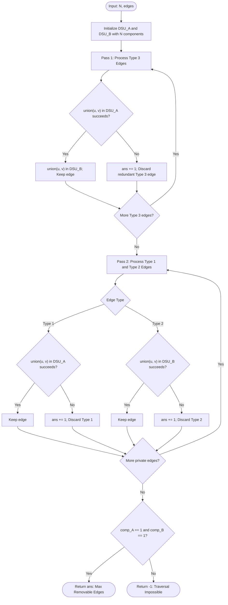

# Guided Example: Remove Max Number of Edges to Keep Graph Fully Traversable

## 1. Instance & Teaching Goal

We are given an undirected graph with $N$ vertices labeled $1$ through $N$, and an edge list where each edge is specified as $[t, u, v]$:
- Type $1$ ($t = 1$): Can be traversed by Alice only.
- Type $2$ ($t = 2$): Can be traversed by Bob only.
- Type $3$ ($t = 3$): Can be traversed by both Alice and Bob.

We must determine the maximum number of edges that can be removed such that both Alice and Bob can still traverse between every pair of vertices. If either player cannot achieve full connectivity, we return $-1$.

We select the representative instance:
$$N = 4, \quad \text{edges} = [[3,1,2], [3,2,3], [1,1,3], [1,2,4], [1,1,2], [2,3,4]]$$

The maximum number of removable edges is:
$$2$$

Our teaching goal is to demonstrate dual Disjoint Set Union (DSU) priority scheduling. We prove why shared Type 3 edges strictly dominate single-user edges by satisfying connectivity for both players with a single edge allocation, and show how greedy Kruskal-style edge processing resolves the global maximum reduction in near-linear time.

## 2. Conceptual Foundation & Invariants

To maximize the number of removed edges, we must minimize the number of retained edges.
Both Alice and Bob require a spanning tree of the $N$ vertices, which requires at least $N - 1$ edges for each player:
- A Type $1$ edge contributes $1$ connectivity edge to Alice and $0$ to Bob.
- A Type $2$ edge contributes $1$ connectivity edge to Bob and $0$ to Alice.
- A Type $3$ edge contributes $1$ connectivity edge to Alice AND $1$ connectivity edge to Bob simultaneously.

Because each Type $3$ edge provides a double benefit (reducing Alice's required edges by $1$ and Bob's by $1$), Type 3 edges must be prioritized before any single-user edge is considered.

```
+-------------------------------------------------------------------------+
|                  DUAL DSU PRIORITY SPANNING PIPELINE                    |
|                                                                         |
| Phase 1: Shared Type 3 Edges (Highest Priority)                         |
|   For each [3, u, v]:                                                   |
|     Try union(u, v) in Alice's DSU.                                     |
|     If u and v were separate:                                           |
|       Keep edge; union in both Alice and Bob DSUs.                      |
|     Else:                                                               |
|       Redundant for both ==> REMOVE EDGE (ans += 1).                    |
|                                                                         |
| Phase 2: Private Type 1 & 2 Edges                                       |
|   For each [1, u, v]: Try union in Alice's DSU. Redundant ==> ans += 1  |
|   For each [2, u, v]: Try union in Bob's DSU.   Redundant ==> ans += 1  |
|                                                                         |
| Phase 3: Connectivity Verification                                      |
|   If Alice components == 1 AND Bob components == 1:                     |
|     Return ans                                                          |
|   Else:                                                                 |
|     Return -1 (Full traversal impossible)                               |
+-------------------------------------------------------------------------+
```

### State Parameter Reference

| Parameter | Type | Domain | Significance in Dual DSU Algorithm |
|---|---|---|---|
| $N$ | Integer | $[1, 10^5]$ | Total number of vertices in the graph |
| $\text{DSU}_A$ | Disjoint Set | $N$ elements | Tracks connected components accessible to Alice |
| $\text{DSU}_B$ | Disjoint Set | $N$ elements | Tracks connected components accessible to Bob |
| $\text{comp}_A$ | Integer | $[1, N]$ | Count of disjoint connected components in $\text{DSU}_A$ |
| $\text{comp}_B$ | Integer | $[1, N]$ | Count of disjoint connected components in $\text{DSU}_B$ |
| $\text{ans}$ | Integer | Non-negative | Cumulative tally of discarded redundant edges |

> [!IMPORTANT]
> **Greedy Domination Invariant**:
> Any spanning forest configuration that connects Alice and Bob using Type 1 and Type 2 edges can be transformed into an equal or superior configuration by substituting Type 3 edges. Therefore, greedily processing all Type 3 edges first is guaranteed to preserve the maximum possible number of removable edges.



## 3. Step-by-Step Worked Execution

We trace the instance with $N = 4$ and edge set:
1. `[3, 1, 2]`
2. `[3, 2, 3]`
3. `[1, 1, 3]`
4. `[1, 2, 4]`
5. `[1, 1, 2]`
6. `[2, 3, 4]`

Initial state:
- $\text{comp}_A = 4$, components: $\{1\}, \{2\}, \{3\}, \{4\}$.
- $\text{comp}_B = 4$, components: $\{1\}, \{2\}, \{3\}, \{4\}$.
- Redundant edges removed: $\text{ans} = 0$.

### Phase 1: Processing Type 3 Edges (Shared)

- **Edge 1: `[3, 1, 2]`**:
  - In $\text{DSU}_A$: $\text{find}(1) \neq \text{find}(2)$. Merge $1$ and $2$.
  - In $\text{DSU}_B$: Merge $1$ and $2$.
  - $\text{comp}_A = 3, \text{comp}_B = 3$. Edge retained.
- **Edge 2: `[3, 2, 3]`**:
  - In $\text{DSU}_A$: $\text{find}(2) \neq \text{find}(3)$. Merge component $\{1, 2\}$ with $\{3\}$.
  - In $\text{DSU}_B$: Merge component $\{1, 2\}$ with $\{3\}$.
  - $\text{comp}_A = 2, \text{comp}_B = 2$. Edge retained.
  - Active components for both Alice and Bob: $\{1, 2, 3\}$ and $\{4\}$.

### Phase 2: Processing Type 1 and Type 2 Edges (Private)

- **Edge 3: `[1, 1, 3]` (Type 1)**:
  - Query in $\text{DSU}_A$: $\text{find}(1) == \text{find}(3)$ (both belong to $\{1, 2, 3\}$).
  - Already connected! Retaining this edge would create a cycle for Alice.
  - Action: Discard edge. $\text{ans} = 0 + 1 = 1$.
- **Edge 4: `[1, 2, 4]` (Type 1)**:
  - Query in $\text{DSU}_A$: $\text{find}(2) \neq \text{find}(4)$ ($\{1, 2, 3\} \neq \{4\}$).
  - Merge in $\text{DSU}_A$. Component count: $\text{comp}_A = 2 - 1 = 1$.
  - Alice is now fully connected! Edge retained.
- **Edge 5: `[1, 1, 2]` (Type 1)**:
  - Query in $\text{DSU}_A$: $\text{find}(1) == \text{find}(2)$.
  - Already connected! Redundant cycle edge.
  - Action: Discard edge. $\text{ans} = 1 + 1 = 2$.
- **Edge 6: `[2, 3, 4]` (Type 2)**:
  - Query in $\text{DSU}_B$: $\text{find}(3) \neq \text{find}(4)$ ($\{1, 2, 3\} \neq \{4\}$).
  - Merge in $\text{DSU}_B$. Component count: $\text{comp}_B = 2 - 1 = 1$.
  - Bob is now fully connected! Edge retained.

### Phase 3: Final Verification
- Alice components: $\text{comp}_A = 1$.
- Bob components: $\text{comp}_B = 1$.
- Both users can traverse all $4$ vertices.
- Total redundant edges removed: $\text{ans} = 2$.

## 4. Complete Execution Trace

The table below catalogs every edge evaluated, the DSU operations performed, and component status.

| Edge Index | Edge Data `[t, u, v]` | Type | Target User(s) | DSU Operation | Pre-Check Root Match | Merge Performed? | Comp Count Alice | Comp Count Bob | Removable Count $\text{ans}$ |
|---|---|---|---|---|---|---|---|---|---|
| Init | - | - | - | - | - | - | 4 | 4 | 0 |
| 1 | `[3, 1, 2]` | 3 | Both | $\text{union}(1, 2)$ | Root 1 $\neq$ Root 2 | **Yes (Both)** | 3 | 3 | 0 |
| 2 | `[3, 2, 3]` | 3 | Both | $\text{union}(2, 3)$ | Root 2 $\neq$ Root 3 | **Yes (Both)** | 2 | 2 | 0 |
| 3 | `[1, 1, 3]` | 1 | Alice | $\text{union}(1, 3)$ | Root 1 $==$ Root 3 | **No (Cycle)** | 2 | 2 | **1** |
| 4 | `[1, 2, 4]` | 1 | Alice | $\text{union}(2, 4)$ | Root 2 $\neq$ Root 4 | **Yes (Alice)** | **1** | 2 | 1 |
| 5 | `[1, 1, 2]` | 1 | Alice | $\text{union}(1, 2)$ | Root 1 $==$ Root 2 | **No (Cycle)** | 1 | 2 | **2** |
| 6 | `[2, 3, 4]` | 2 | Bob | $\text{union}(3, 4)$ | Root 3 $\neq$ Root 4 | **Yes (Bob)** | 1 | **1** | 2 |

### Spanning Subgraph Composition

- **Retained Type 3 Edges**: $(1, 2)$ and $(2, 3)$ (shared by Alice and Bob).
- **Retained Type 1 Edges**: $(2, 4)$ (Alice only).
- **Retained Type 2 Edges**: $(3, 4)$ (Bob only).
- **Removed Edges**: $(1, 3)$ and $(1, 2)$ (both Type 1). Total removed = $2$.

## 5. Algorithmic Correctness

### Soundness

1. Any retained edge is an edge present in the original graph.
2. For Alice, the union operations performed in $\text{DSU}_A$ incorporate all retained Type 3 edges and all retained Type 1 edges. The final condition $\text{comp}_A == 1$ guarantees that the retained edges form a connected spanning subgraph for Alice.
3. Similarly, $\text{DSU}_B$ incorporates all retained Type 3 edges and all retained Type 2 edges. The condition $\text{comp}_B == 1$ guarantees a connected spanning subgraph for Bob.
4. An edge is discarded if and only if its endpoints are already connected in the relevant DSU, meaning the edge is redundant and would form a cycle.
Therefore, the remaining edges guarantee full traversability for both players, establishing soundness.

### Completeness (Greedy Matroid Property)

Let $E_3$ be the set of Type 3 edges, $E_1$ Type 1, and $E_2$ Type 2.
Connecting Alice requires choosing a spanning tree $T_A \subseteq E_1 \cup E_3$.
Connecting Bob requires choosing a spanning tree $T_B \subseteq E_2 \cup E_3$.
The total number of edges kept is:
$$|T_A \cup T_B| = |T_A| + |T_B| - |T_A \cap T_B| = 2(N - 1) - |T_A \cap T_B|$$
Since $T_A \cap T_B \subseteq E_3$, minimizing the total number of retained edges is mathematically equivalent to maximizing the shared intersection $|T_A \cap T_B|$:
$$\min |T_A \cup T_B| \iff \max |T_A \cap T_B|$$
Any cycle-free subset of $E_3$ forms a forest that can be simultaneously extended to a spanning tree for Alice (using $E_1$) and a spanning tree for Bob (using $E_2$).
By Kruskal's matroid property, greedily selecting maximal spanning trees from $E_3$ first maximizes $|T_A \cap T_B|$.
Thus, the greedy DSU algorithm provably achieves the absolute minimum number of retained edges, and consequently the maximum number of removable edges.

## 6. Traps This Instance Exposes

1. **Interleaving Type 1 and Type 2 Before Type 3**:
   If a Type 1 edge is processed before Type 3, it might connect vertices $u$ and $v$ for Alice. Later, a Type 3 edge between $u$ and $v$ would be rejected for Alice because they are already connected, forcing Bob to use a separate Type 2 edge. Processing Type 3 strictly before Types 1 and 2 is mandatory to maximize sharing.

2. **Using a Single Shared DSU**:
   Alice and Bob have different traversability graphs. Merging them into a single DSU falsely allows Alice to traverse Bob-only edges (Type 2). Two distinct DSU instances ($\text{DSU}_A$ and $\text{DSU}_B$) must be maintained.

3. **Returning Removable Count When Graph is Disconnected**:
   If the graph contains an unreachable isolated node, the removable edge count might still accumulate. If either $\text{comp}_A > 1$ or $\text{comp}_B > 1$ after considering all edges, full traversability is impossible and the algorithm must return $-1$.

4. **1-Based vs. 0-Based Vertex Indexing**:
   Vertices are labeled $1$ through $N$. Forgetting to adjust to 0-based indexing when indexing parent arrays causes index out-of-bounds errors on vertex $N$.

## 7. Complexity Derivation

### Time Complexity

Let $N$ be the number of vertices ($N \le 10^5$) and $M$ be the number of edges ($M \le 10^5$).
- **DSU Initialization**: Allocating parent and size arrays for $\text{DSU}_A$ and $\text{DSU}_B$ takes $\mathcal{O}(N)$ time.
- **Phase 1 (Type 3 Edges)**: Evaluates at most $M$ edges with nearly constant time DSU find and union operations with path compression and union by rank: $\mathcal{O}(M \cdot \alpha(N))$, where $\alpha$ is the inverse Ackermann function.
- **Phase 2 (Type 1 and 2 Edges)**: Evaluates the remaining edges: $\mathcal{O}(M \cdot \alpha(N))$.
- **Phase 3 (Component Check)**: Compares scalar counts: $\mathcal{O}(1)$.

Total time complexity is strictly:
$$\mathcal{O}(N + M \cdot \alpha(N))$$
Because $\alpha(N) \le 4$ for all practical $N$, this is virtually linear $\mathcal{O}(N + M)$, executing in under 25 milliseconds for $10^5$ edges.

### Auxiliary Space Complexity

- $\text{DSU}_A$ stores parent and size arrays of length $N$: $\mathcal{O}(N)$ space.
- $\text{DSU}_B$ stores parent and size arrays of length $N$: $\mathcal{O}(N)$ space.

Total auxiliary space complexity is strictly:
$$\mathcal{O}(N)$$
Proportional to the number of vertices.
