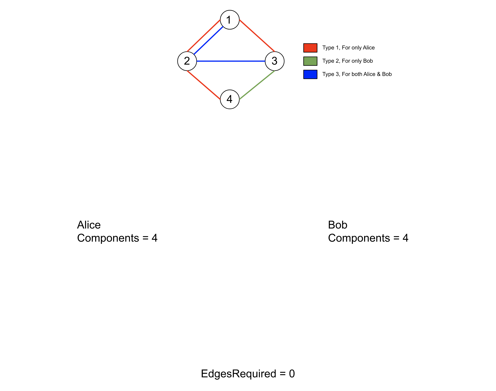
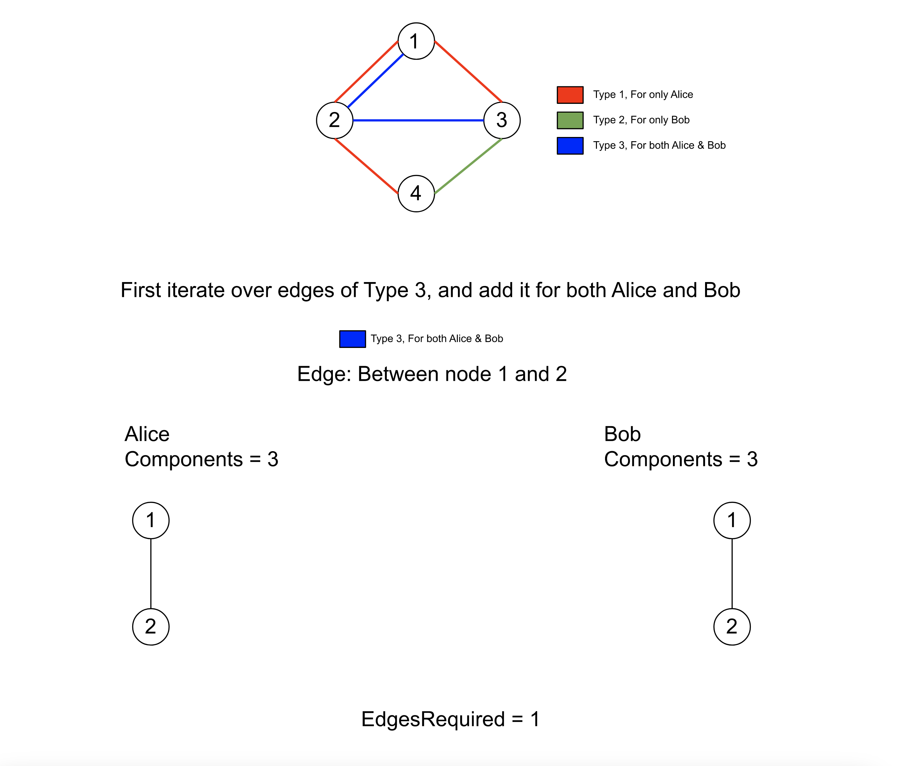
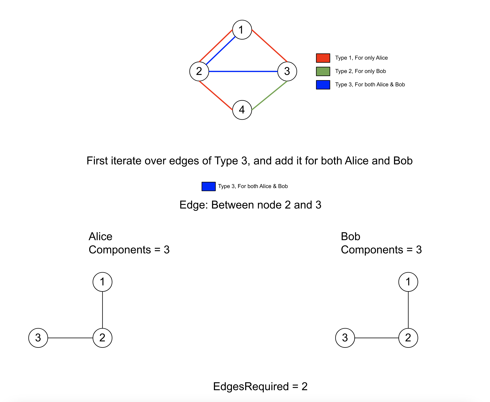
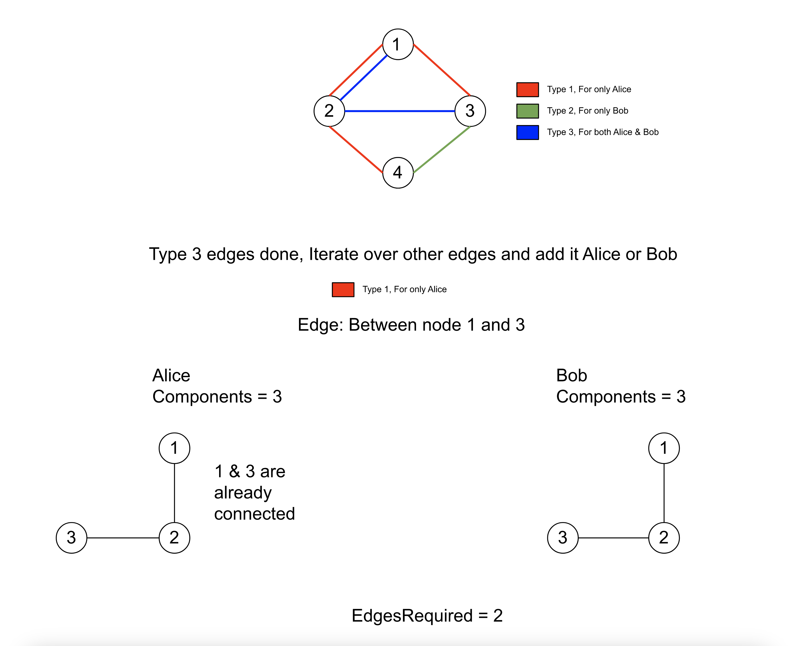
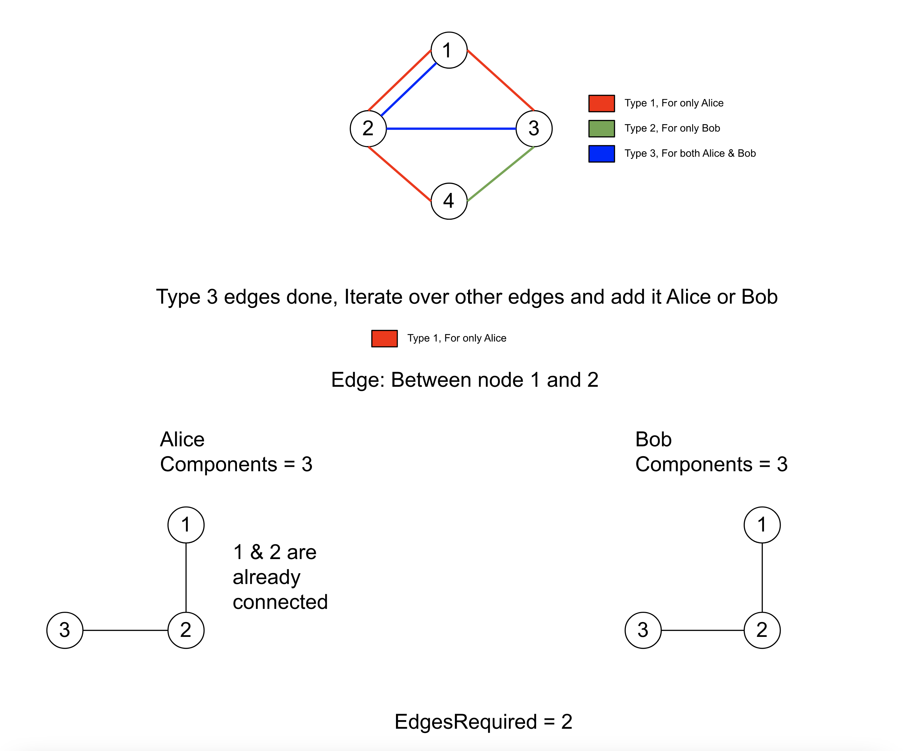
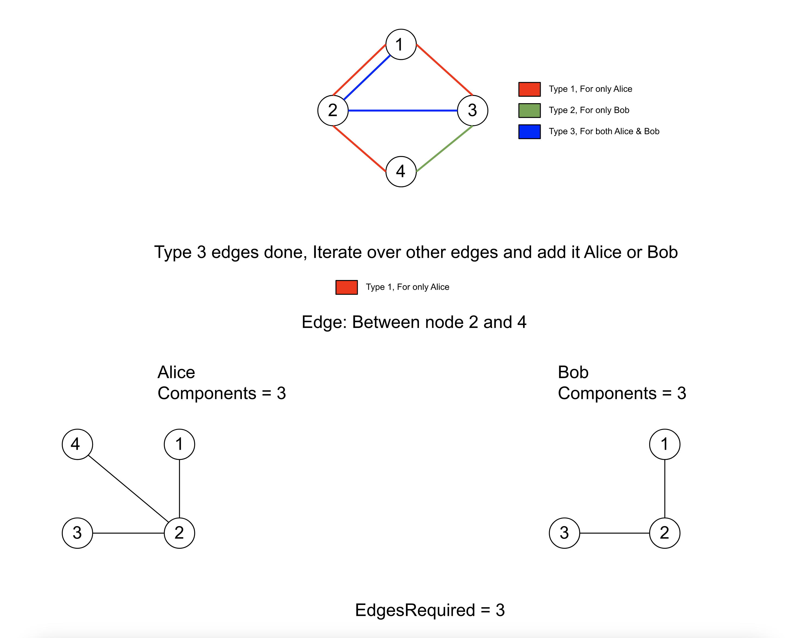
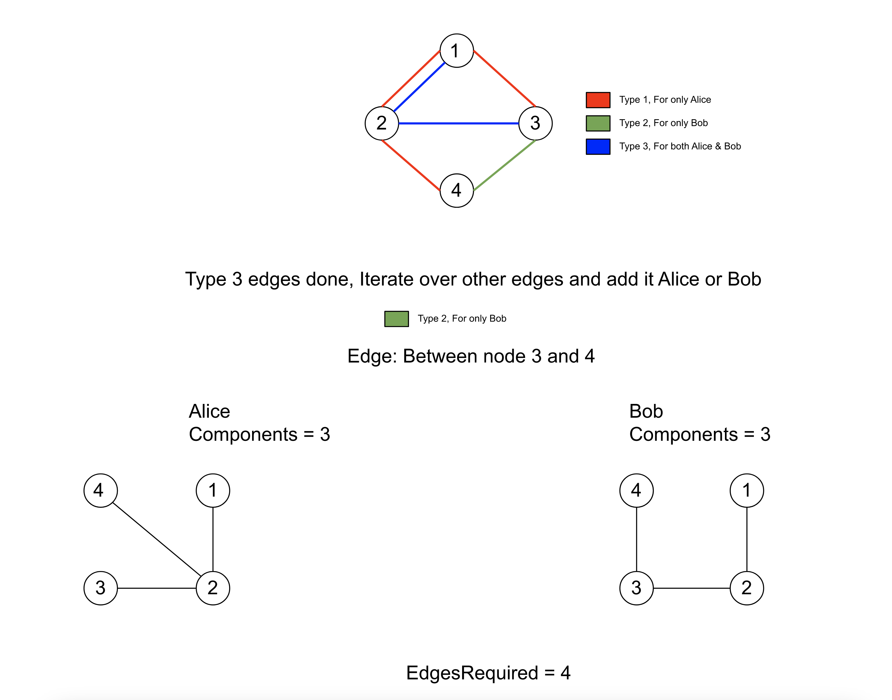
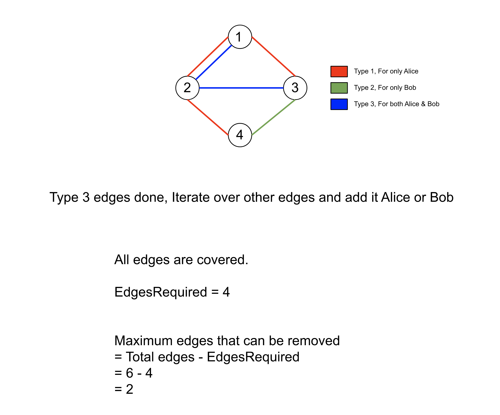

[TOC]

## Solution

---

### Approach 1: Disjoint Set Union (DSU)

**Intuition**

We have $N$ nodes connected via bidirectional edges; the edges can be of three types:

- Type 1: Can be traversed by Alice only.
- Type 2: Can be traversed by Bob only.
- Type 3: Can be traversed by both Alice and Bob

We need to find the maximum number of edges that can be removed and still both Alice and Bob can reach any node starting from any node via the remaining edges. We can assume that there are two graphs, one for Alice and another one for Bob, the first graph for Alice has edges only of Type 1 & 3 and the second graph for Bob will have edges only of Type 2 & 3.

An edge is useful only if it connects two nodes that are not already connected via some other edge or path. How can we find if an edge is useful? The Disjoint Set Union data structure is very useful in solving these kind of problems. If you are not familiar with DSU, please go through our [Explore Card](https://leetcode.com/explore/learn/card/graph/618/disjoint-set/). We will not talk about implementation details here and assume you are already familiar with the interface of DSU. The Disjoint Set Union can detect if two nodes are connected via some path or not in $O(\alpha (N))$. (Here, $\alpha (N)$ is the extremely fast inverse Ackermann function).

We can use DSU to perform the union of two nodes for an edge and if the nodes were not connected earlier i.e. they have a different representative then we will know this edge is needed. For every edge, if the two nodes were not connected earlier, we know this edge is required. To get the answer, we can subtract the number of required edges from the total number of edges.

Since we need the minimum number of edges to connect all the nodes, the Type 3 edges are the most useful as one Type 3 edge adds two edges, one for Alice and one for Bob. Hence, we will first iterate over the edges of Type 3, and for these edges we will add the edge to both graphs.

In the end, we need to check if the graph for both Alice and Bob is connected or not. If yes, we can say the edges that we didn't connect can be removed. To check if the individual graphs are connected we will check if the number of components in the graph is $1$ or not.

















 <br>

**Algorithm**

1. Create a class `UnionFind`, this will have the relevant data members and member functions to perform DSU operations:

1. Data member `representative` stores the immediate parent of nodes in the union find structure, initially each node will be it's own representative.
2. Data member `componentSize` stores the number of nodes in the components with the node as the root node, initially the size of component for each node is $1$
3. Data member `components` stores the number of components in the graph, initially it will be equal to $N$ as each node is considered
       a separate component.
4. Method `findRepresentative()` returns the root node in the `representative` hierarchy.
5. Method `performUnion()`, returns $1$ after performing the union between the components of the two nodes that were not connected before, otherwise returns $0$.
6. Method `isConnected()` returns `true` if the graph is connected, i.e. $components = 1$.
2. Create a `UnionFind` object for both Alice and Bob with $N$ nodes.
3. Initialize `edgesRequired` to $0$.
4. Perform union of all edges of Type $3$ for both Alice and Bob, and for each edge increment the value of `edgesRequired` if for any of them `performUnion()` returns $1$.
5. Perform union of all edges of Type $1$ & $2$ for Alice or Bob respectively and increment the `edgesRequired` if for any of them `performUnion()` returns $1$.
6. If `isConnected()` returns true for both Alice and Bob, then return $Total Edges - edgesRequired$, otherwise return `-1`.

**Implementation**

```cpp
class UnionFind {
    vector<int> representative;
    vector<int> componentSize;
    // Number of distinct components in the graph.
    int components;

public:
    // Initialize the list representative and componentSize
    // Each node is representative of itself with size 1.
    UnionFind(int n) {
        components = n;
        for (int i = 0; i <= n; i++) {
            representative.push_back(i);
            componentSize.push_back(1);
        }
    }

    // Get the root of a node.
    int findRepresentative(int x) {
        if (representative[x] == x) {
            return x;
        }

        // Path compression.
        return representative[x] = findRepresentative(representative[x]);
    }

    // Perform the union of two components that belongs to node x and node y.
    int performUnion(int x, int y) {
        x = findRepresentative(x); y = findRepresentative(y);

        if (x == y) {
            return 0;
        }

        if (componentSize[x] > componentSize[y]) {
            componentSize[x] += componentSize[y];
            representative[y] = x;
        } else {
            componentSize[y] += componentSize[x];
            representative[x] = y;
        }

        components--;
        return 1;
    }

    // Returns true if all nodes get merged to one.
    bool isConnected() {
        return components == 1;
    }
};

class Solution {
public:
    int maxNumEdgesToRemove(int n, vector<vector<int>>& edges) {
        // Different objects for Alice and Bob.
        UnionFind Alice(n), Bob(n);

        int edgesRequired = 0;
        // Perform union for edges of type = 3, for both Alice and Bob.
        for (vector<int>& edge : edges) {
            if (edge[0] == 3) {
                edgesRequired += (Alice.performUnion(edge[1], edge[2]) | Bob.performUnion(edge[1], edge[2]));
            }
        }

        // Perform union for Alice if type = 1 and for Bob if type = 2.
        for (vector<int>& edge : edges) {
            if (edge[0] == 1) {
                edgesRequired += Alice.performUnion(edge[1], edge[2]);
            } else if (edge[0] == 2) {
                edgesRequired += Bob.performUnion(edge[1], edge[2]);
            }
        }

        // Check if the Graphs for Alice and Bob have n - 1 edges or is a single component.
        if (Alice.isConnected() && Bob.isConnected()) {
            return edges.size() - edgesRequired;
        }

        return -1;
    }
};
```

**Complexity Analysis**

Here, $E$ is the number of edges in the list `edges` and $N$ is the number nodes.

* Time complexity: $O(E *\alpha(N))$.

  We iterate over edges, and for every edge we call the function `performUnion()`, whose time complexity is equal to $O(\alpha(N)$ as we have included union by size as well as path compression. Therefore, the total time complexity is equal to $O(E *\alpha(N))$. Note that $\alpha$ is the Inverse Ackermann function which grows so slowly that it can be considered as $O(1)$.

* Space complexity: $O(N)$.

  For both Alice and Bob we keep two lists in union find data structures, `representative` and `componentSize` of size both $N$. Therefore the total space complexity is equal to $O(N)$.

<br/>

---