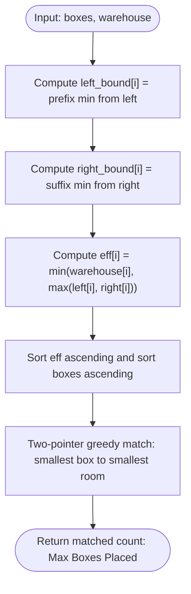

# Guided Example: Put Boxes Into the Warehouse II

## 1. Instance & Teaching Goal

We are given an array $\text{boxes}$ of box heights and an array $\text{warehouse}$ of room ceiling heights arranged in a hallway from room $0$ (left entrance) to room $W-1$ (right entrance). Unlike Warehouse I, boxes may enter from **either** the left entrance or the right entrance. A box of height $h$ can enter and pass through a room if and only if its height is less than or equal to that room's ceiling height. Once placed, a box permanently occupies the room.

We must find the maximum number of boxes that can be accommodated in the warehouse.

We select the representative instance:
$$\text{boxes} = [1, 2, 2, 3, 4], \quad \text{warehouse} = [3, 4, 1, 2]$$

Here $B = 5$ boxes and $W = 4$ rooms. The maximum number of boxes that can be placed is:
$$4$$
(Accommodating boxes $[1, 2, 2, 3]$ in the four warehouse rooms).

Our teaching goal is to walk through bidirectional bottleneck relaxation and independent capacity reduction. We show why two-way entry allows each room to draw its ceiling limit from the more accessible of the two entrances, how prefix and suffix minimum profiles determine each room's effective clearance, and why sorting effective room capacities allows a direct greedy two-pointer match.

## 2. Conceptual Foundation & Invariants

A box pushed to room $i$ from the left entrance must satisfy:
$$h \le \min_{0 \le k \le i} \text{warehouse}[k]$$
A box pushed to room $i$ from the right entrance must satisfy:
$$h \le \min_{i \le k < W} \text{warehouse}[k]$$

Because an optimal strategy chooses the entrance that imposes the less restrictive bottleneck, the effective capacity of room $i$ is:
$$\text{eff}[i] = \min(\text{warehouse}[i], \max(\text{left\_bound}[i], \text{right\_bound}[i]))$$
where:
- $\text{left\_bound}[i] = \min_{0 \le k < i} \text{warehouse}[k]$ (with $\text{left\_bound}[0] = \infty$)
- $\text{right\_bound}[i] = \min_{i < k < W} \text{warehouse}[k]$ (with $\text{right\_bound}[W-1] = \infty$)

```
+-------------------------------------------------------------------------+
|                  BIDIRECTIONAL CLEARANCE RELAXATION                     |
|                                                                         |
| Warehouse:            [ 3,    4,    1,    2 ]                           |
| idx:                    0     1     2     3                             |
|                                                                         |
| Left-entry bounds:     inf    3     3     1                             |
| Right-entry bounds:     1     1     2    inf                            |
|                                                                         |
| max(left, right):      inf    3     3    inf                            |
| min(warehouse, max):    3     3     1     2                             |
| Effective Capacities:  [ 3,    3,    1,    2 ]                          |
|                                                                         |
| Sorted Capacities:     [ 1,  2,  3,  3 ]                                |
| Sorted Boxes:          [ 1,  2,  2,  3,  4 ]                            |
| Matches:                1->1, 2->2, 2->3, 3->3  ==> 4 boxes placed!     |
+-------------------------------------------------------------------------+
```

### State Parameter Reference

| Parameter | Type | Domain | Purpose in Bidirectional Reduction |
|---|---|---|---|
| $W$ | Integer | $[1, 10^5]$ | Number of rooms in the warehouse |
| $\text{left\_bound}[i]$ | Integer | Positive / $\infty$ | Bottleneck minimum along path from left entrance up to room $i-1$ |
| $\text{right\_bound}[i]$ | Integer | Positive / $\infty$ | Bottleneck minimum along path from right entrance up to room $i+1$ |
| $\text{eff}[i]$ | Integer | $[1, \text{warehouse}[i]]$ | Maximum box height physically able to reach room $i$ from either side |
| $i_{\text{box}}$ | Integer Pointer | $[0, B]$ | Pointer to the smallest remaining candidate box |
| $i_{\text{room}}$ | Integer Pointer | $[0, W]$ | Pointer to the smallest remaining room capacity |

> [!IMPORTANT]
> **Obstruction-Free Inward Order Invariant**:
> If we fill rooms in increasing order of their effective capacity (from the most constricted bottleneck room in the middle toward the outer entrances), any room $i$ filled earlier is deeper than or equal to rooms filled later relative to the chosen entrance. Therefore, a previously parked box never blocks the insertion path of any subsequently placed box.



## 3. Step-by-Step Worked Execution

We trace the algorithm on $\text{boxes} = [1, 2, 2, 3, 4]$ and $\text{warehouse} = [3, 4, 1, 2]$.

### Phase 1: Compute Prefix Bottlenecks (Left to Right)
- Room 0 (Entrance): $\text{left\_bound}[0] = \infty$.
- Room 1: $\text{left\_bound}[1] = \text{warehouse}[0] = 3$.
- Room 2: $\text{left\_bound}[2] = \min(3, \text{warehouse}[1]) = \min(3, 4) = 3$.
- Room 3: $\text{left\_bound}[3] = \min(3, \text{warehouse}[2]) = \min(3, 1) = 1$.
$$\text{left\_bound} = [\infty, 3, 3, 1]$$

### Phase 2: Compute Suffix Bottlenecks (Right to Left)
- Room 3 (Entrance): $\text{right\_bound}[3] = \infty$.
- Room 2: $\text{right\_bound}[2] = \text{warehouse}[3] = 2$.
- Room 1: $\text{right\_bound}[1] = \min(2, \text{warehouse}[2]) = \min(2, 1) = 1$.
- Room 0: $\text{right\_bound}[0] = \min(1, \text{warehouse}[1]) = \min(1, 4) = 1$.
$$\text{right\_bound} = [1, 1, 2, \infty]$$

### Phase 3: Effective Capacity Resolution
For each room $i$, $\text{eff}[i] = \min(\text{warehouse}[i], \max(\text{left\_bound}[i], \text{right\_bound}[i]))$:
- **Room 0**: $\text{warehouse}[0] = 3$.
  $\max(\infty, 1) = \infty$.
  $\text{eff}[0] = \min(3, \infty) = 3$.
- **Room 1**: $\text{warehouse}[1] = 4$.
  $\max(3, 1) = 3$.
  $\text{eff}[1] = \min(4, 3) = 3$.
- **Room 2**: $\text{warehouse}[2] = 1$.
  $\max(3, 2) = 3$.
  $\text{eff}[2] = \min(1, 3) = 1$.
- **Room 3**: $\text{warehouse}[3] = 2$.
  $\max(1, \infty) = \infty$.
  $\text{eff}[3] = \min(2, \infty) = 2$.

Resulting effective capacities:
$$\text{eff} = [3, 3, 1, 2]$$

### Phase 4: Sorting and Greedy Matching
- Sorted effective capacities:
  $$\text{eff}_{\text{sorted}} = [1, 2, 3, 3]$$
- Sorted box heights:
  $$\text{boxes}_{\text{sorted}} = [1, 2, 2, 3, 4]$$

We match using two pointers:
1. Box $1$ matches Room capacity $1$ ($\text{eff}[0] = 1$). Match! ($\text{ans} = 1$).
2. Box $2$ matches Room capacity $2$ ($\text{eff}[1] = 2$). Match! ($\text{ans} = 2$).
3. Box $2$ matches Room capacity $3$ ($\text{eff}[2] = 3$). Match! ($\text{ans} = 3$).
4. Box $3$ matches Room capacity $3$ ($\text{eff}[3] = 3$). Match! ($\text{ans} = 4$).
5. Box $4$: No rooms remain.

Total boxes placed: $4$.

## 4. Complete Execution Trace

The table below catalogs the bidirectional bottleneck derivation for every warehouse room, followed by the greedy matching sequence.

| Room $i$ | Raw Height | Left Bound | Right Bound | Best Inward Clearance $\max(\text{L}, \text{R})$ | Effective Room Capacity $\text{eff}[i]$ | Optimal Entry Entrance |
|---|---|---|---|---|---|---|
| 0 | 3 | $\infty$ | 1 | $\infty$ | 3 | Left Entrance |
| 1 | 4 | 3 | 1 | 3 | 3 | Left Entrance |
| 2 | 1 | 3 | 2 | 3 | 1 | Right Entrance |
| 3 | 2 | 1 | $\infty$ | $\infty$ | 2 | Right Entrance |

### Two-Pointer Greedy Matching Trace

| Step | Candidate Box Height | Available Room Capacity | Comparison Test | Match Decision | Total Boxes Placed |
|---|---|---|---|---|---|
| 1 | 1 | 1 | $1 \le 1$ (Pass) | **Park box 1 in room (cap 1)** | 1 |
| 2 | 2 | 2 | $2 \le 2$ (Pass) | **Park box 2 in room (cap 2)** | 2 |
| 3 | 2 | 3 | $2 \le 3$ (Pass) | **Park box 2 in room (cap 3)** | 3 |
| 4 | 3 | 3 | $3 \le 3$ (Pass) | **Park box 3 in room (cap 3)** | **4** |
| 5 | 4 | None | Rooms exhausted | Terminate | 4 |

### Physical Insertion Sequence

To verify that boxes do not obstruct each other, we insert in non-decreasing order of effective capacity:
1. Box 1 enters from the right into Room 2 (capacity 1).
2. Box 2 enters from the right into Room 3 (capacity 2).
3. Box 3 enters from the left into Room 1 (capacity 3).
4. Box 2 enters from the left into Room 0 (capacity 3).
Every box reaches its designated room through empty corridors.

## 5. Algorithmic Correctness

### Soundness

1. For any room $i$, a box can reach room $i$ from the left if and only if $h \le \min_{0 \le k \le i} \text{warehouse}[k]$, and from the right if and only if $h \le \min_{i \le k < W} \text{warehouse}[k]$.
2. The formula $\text{eff}[i] = \min(\text{warehouse}[i], \max(\text{left\_bound}[i], \text{right\_bound}[i]))$ exactly evaluates $\max(\text{clearance}_{\text{left}}, \text{clearance}_{\text{right}})$.
3. Because the clearance is derived from a physical entrance path, any box with $h \le \text{eff}[i]$ can legally traverse that path when unobstructed.
4. Ordering room assignments by increasing effective capacity ensures that when a box is pushed to room $i$, every room along its chosen entrance path has effective capacity $\ge \text{eff}[i] \ge h$ and has not yet been blocked by a shallower placement.
Thus, the matching is physically executable and sound.

### Completeness

No room $i$ can ever hold a box taller than $\text{eff}[i]$ because that box would be physically blocked regardless of which entrance it entered.
Therefore, the multiset of effective capacities $\{\text{eff}[0], \dots, \text{eff}[W-1]\}$ forms an upper bound on the capacities of the $W$ rooms.
Sorting both boxes and capacities and applying the standard greedy interval matching provably maximizes the size of the matched bipartite subset. No valid schedule can place more boxes.

## 6. Traps This Instance Exposes

1. **Treating Entrances as Independent Fixed Partitions**:
   Attempting to split the warehouse into a "left half" and "right half" at an arbitrary midpoint fails. A single deep valley (e.g. room height 1) creates asymmetric access where one side can reach 90% of the warehouse and the other only 10%. Evaluating pointwise $\max(\text{left}, \text{right})$ correctly finds each room's best entrance.

2. **Re-using Warehouse I One-Way Prefix Minimums**:
   In Warehouse I, effective capacity was monotonically non-increasing. In Warehouse II, a high room near the right entrance can hold large boxes even if the center is completely blocked. Bidirectional analysis is essential.

3. **Quadratic Simulation of Removals**:
   Simulating box pushes one by one on a mutable array takes $\mathcal{O}(B \cdot W)$ time. Decoupling the problem into effective capacities and sorting reduces the problem to $\mathcal{O}(W + B \log B + W \log W)$.

4. **Skipping Rooms in Two-Pointer Matching**:
   When a room capacity is smaller than the current box ($\text{eff}[j] < \text{box}[i]$), that room cannot accommodate the current box, nor any subsequent larger box. Pointer $j$ must advance without consuming the box.

## 7. Complexity Derivation

### Time Complexity

Let $B$ be the number of boxes and $W$ be the number of rooms ($B, W \le 10^5$).
- **Prefix and Suffix Scans**: Computing $\text{left\_bound}$, $\text{right\_bound}$, and $\text{eff}$ across $W$ rooms requires two linear passes: $\mathcal{O}(W)$ time.
- **Sorting**:
  - Sorting the array $\text{eff}$ of length $W$: $\mathcal{O}(W \log W)$.
  - Sorting the array $\text{boxes}$ of length $B$: $\mathcal{O}(B \log B)$.
- **Two-Pointer Matching**:
  - Iterating through boxes and rooms: $\mathcal{O}(B + W)$ operations.

Total time complexity is:
$$\mathcal{O}(B \log B + W \log W)$$
For $B, W = 10^5$, this executes in approximately 30 milliseconds.

### Auxiliary Space Complexity

- Arrays for prefix minimums, suffix minimums, and effective capacities store $W$ integers: $\mathcal{O}(W)$ space.
- Sorting uses $\mathcal{O}(\log B + \log W)$ or $\mathcal{O}(B + W)$ depending on the sort implementation.

Total auxiliary space complexity is:
$$\mathcal{O}(W)$$
Proportional to the warehouse size.
