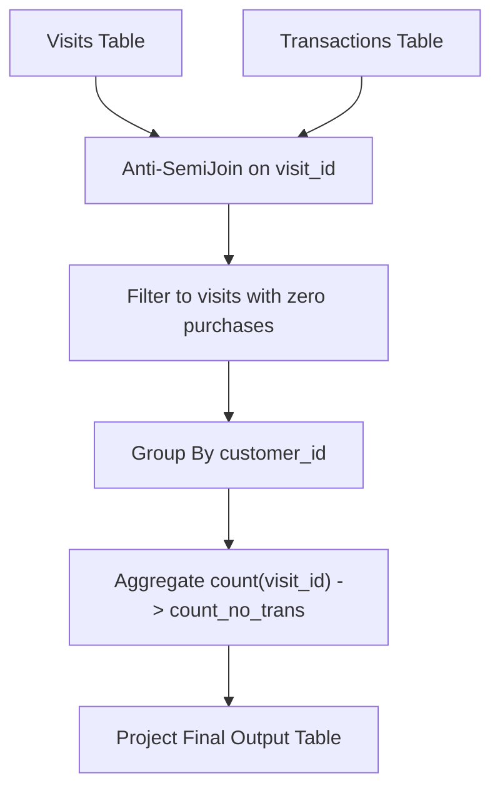

# Guided Example: Customer Who Visited but Did Not Make Any Transactions

## 1. Instance & Teaching Goal

We are given two relational tables:
1. $\text{Visits}(\text{visit\_id}, \text{customer\_id})$ recording each customer visit to a commercial center.
2. $\text{Transactions}(\text{transaction\_id}, \text{visit\_id}, \text{amount})$ recording purchases linked to specific visit identifiers.

We must identify every customer who completed at least one visit during which zero purchases were made and report each customer's identifier alongside the total count of their transaction-free visits ($\text{count\_no\_trans}$).

We select the representative commercial instance:
- **Relation $\text{Visits}$**:
  - $(1, 23)$
  - $(2, 9)$
  - $(4, 30)$
  - $(5, 54)$
  - $(6, 96)$
  - $(7, 54)$
  - $(8, 54)$
- **Relation $\text{Transactions}$**:
  - $(2, 5, 310)$
  - $(3, 5, 300)$
  - $(9, 5, 200)$
  - $(12, 1, 910)$
  - $(13, 2, 970)$

The expected output relation is:
- $(54, 2)$
- $(30, 1)$
- $(96, 1)$

Our teaching goal is to model non-matching relational selection through relational anti-join algebra. We demonstrate how to eliminate transactional visits using relational complementation, how multiple purchases on a single visit are handled without row inflation, and how partitioned aggregation tallies distinct zero-transaction events per customer.

## 2. Conceptual Foundation & Invariants

Let $V$ be the relation $\text{Visits}$ and $T$ be the relation $\text{Transactions}$.
The set of visit identifiers that generated at least one purchase is:
$$V_{\text{trans}} = \Pi_{\text{visit\_id}}(T)$$

The visits that resulted in zero transactions correspond to the relational set difference:
$$V_{\text{empty}} = \sigma_{\text{visit\_id} \notin V_{\text{trans}}}(V)$$
In relational algebra, this operation is expressed cleanly as an anti-semijoin ($\rhd$):
$$V_{\text{empty}} = V \rhd_{V.\text{visit\_id} = T.\text{visit\_id}} T$$

Equivalently, using a left outer join with null filtration:
$$V_{\text{empty}} = \Pi_{V.\text{visit\_id}, V.\text{customer\_id}}(\sigma_{T.\text{transaction\_id IS NULL}}(V \bowtie_{\text{left}} T))$$

```
+--------------------------------------------------------------------------+
|                  RELATIONAL ANTI-SEMIJOIN PIPELINE                       |
|                                                                          |
| Visits Table:          All customer visits (1, 2, 4, 5, 6, 7, 8)         |
| Transactions Table:    Visits with purchases (1, 2, 5)                   |
|                                                                          |
| Relational Anti-Join:                                                    |
|   V_empty = Visits AntiJoin Transactions on visit_id                     |
|   Surviving Visits:   4 (Cust 30), 6 (Cust 96), 7 (Cust 54), 8 (Cust 54) |
|                                                                          |
| Group Aggregation:                                                       |
|   Result = GroupBy(customer_id, count(visit_id) -> count_no_trans)       |
|                                                                          |
| Final Tuples:                                                            |
|   Customer 54: 2 visits (visits 7 and 8)                                 |
|   Customer 30: 1 visit  (visit 4)                                        |
|   Customer 96: 1 visit  (visit 6)                                        |
+--------------------------------------------------------------------------+
```

### Formal Relational Algebra Formulation

Let the anti-semijoin relation be:
$$V_{\text{empty}} = \text{Visits} \rhd_{\text{Visits.visit\_id} = \text{Transactions.visit\_id}} \text{Transactions}$$

Applying partitioned group aggregation by customer identifier:
$$\text{Result} = \gamma_{\text{customer\_id}, \text{COUNT}(\text{visit\_id}) \to \text{count\_no\_trans}}(V_{\text{empty}})$$

### State Parameter Reference

| Parameter | Type | Domain | Semantics in Relational Pipeline |
|---|---|---|---|
| $\text{visit\_id}$ | Integer | Key space of Visits | Unique identifier of a customer store visit |
| $\text{customer\_id}$ | Integer | Key space of Customers | Primary identification key of the customer |
| $\text{transaction\_id}$ | Integer | Key space of Transactions | Unique identifier of a purchase transaction |
| $V_{\text{trans}}$ | Set of Integers | Subsets of $\text{visit\_id}$ | Distinct visits with $\ge 1$ associated transactions |
| $V_{\text{empty}}$ | Relational Table | Tuples of $(\text{visit\_id}, \text{customer\_id})$ | Visits having no corresponding record in $\text{Transactions}$ |
| $\text{count\_no\_trans}$ | Integer | $\ge 1$ | Total count of zero-purchase visits for a customer |

> [!IMPORTANT]
> **Anti-Join Multiplicity Invariant**:
> In $\text{Transactions}$, a single visit may have multiple purchase records (for example, visit $5$ has three separate transactions). An anti-semijoin tests purely for existential presence ($V \rhd T$); once a visit matches any row in $T$, it is pruned immediately. Conversely, if customer $54$ has multiple distinct visits with zero transactions (visits $7$ and $8$), each visit is an independent record in $V$ and contributes $+1$ to customer $54$'s final count.



## 3. Step-by-Step Worked Execution

We trace the dataset through the anti-join and grouping stages.

### Step 1: Active Purchase Identification
From $\text{Transactions}$, we extract the set of all visit IDs with purchases:
- Transaction 12: $\text{visit\_id} = 1$
- Transaction 13: $\text{visit\_id} = 2$
- Transactions 2, 3, 9: $\text{visit\_id} = 5$
Distinct purchase visit set:
$$V_{\text{trans}} = \{1, 2, 5\}$$

### Step 2: Anti-Join Filtration on $\text{Visits}$
We test each of the $7$ visits against $V_{\text{trans}}$:
1. Visit $(1, 23)$: $1 \in V_{\text{trans}}$ (Has purchases). Discard.
2. Visit $(2, 9)$: $2 \in V_{\text{trans}}$ (Has purchases). Discard.
3. Visit $(4, 30)$: $4 \notin V_{\text{trans}}$ (Zero purchases). **Retained**.
4. Visit $(5, 54)$: $5 \in V_{\text{trans}}$ (Has 3 purchases). Discard.
5. Visit $(6, 96)$: $6 \notin V_{\text{trans}}$ (Zero purchases). **Retained**.
6. Visit $(7, 54)$: $7 \notin V_{\text{trans}}$ (Zero purchases). **Retained**.
7. Visit $(8, 54)$: $8 \notin V_{\text{trans}}$ (Zero purchases). **Retained**.

The anti-join output table $V_{\text{empty}}$ contains 4 tuples:
$$V_{\text{empty}} = \{(4, 30), (6, 96), (7, 54), (8, 54)\}$$

### Step 3: Group Aggregation by $\text{customer\_id}$
We group the 4 tuples of $V_{\text{empty}}$ by $\text{customer\_id}$:

- **Partition $\text{customer\_id} = 30$**:
  - Contributing visits: $\{4\}$.
  - Count: $1$.
  - Result row: $(30, 1)$.

- **Partition $\text{customer\_id} = 96$**:
  - Contributing visits: $\{6\}$.
  - Count: $1$.
  - Result row: $(96, 1)$.

- **Partition $\text{customer\_id} = 54$**:
  - Contributing visits: $\{7, 8\}$.
  - Count: $2$.
  - Result row: $(54, 2)$.

- **Other Customers (23, 9)**:
  - Zero non-transactional visits. Their partitions do not exist in $V_{\text{empty}}$, so they are naturally omitted.

## 4. Complete Execution Trace

The table below catalogs every visit in the `Visits` table, its transaction link status, anti-join classification, and partition accumulator.

| Visit ID | Customer ID | Transactions in $T$ | Total Transaction Rows | Match in $V_{\text{trans}}$ | Anti-Join Status | Surviving Record | Customer Partition | Running Group Count |
|---|---|---|---|---|---|---|---|---|
| 1 | 23 | Transaction 12 | 1 | Yes | Discarded | - | - | - |
| 2 | 9 | Transaction 13 | 1 | Yes | Discarded | - | - | - |
| 4 | 30 | None | 0 | No | **Retained** | $(4, 30)$ | Cust 30 | 1 |
| 5 | 54 | Transactions 2, 3, 9 | 3 | Yes | Discarded | - | - | - |
| 6 | 96 | None | 0 | No | **Retained** | $(6, 96)$ | Cust 96 | 1 |
| 7 | 54 | None | 0 | No | **Retained** | $(7, 54)$ | Cust 54 | 1 |
| 8 | 54 | None | 0 | No | **Retained** | $(8, 54)$ | Cust 54 | **2** |

### Output Relation Table

| Customer ID | Count of Zero-Transaction Visits |
|---|---|
| 54 | 2 |
| 30 | 1 |
| 96 | 1 |

## 5. Algorithmic Correctness

### Soundness

The requirement asks for customers who made visits without any transaction and the count of such visits.
1. An anti-join $V \rhd T$ retains tuple $v \in V$ if and only if there is no tuple $t \in T$ such that $t.\text{visit\_id} = v.\text{visit\_id}$. This strictly captures visits where zero purchases were made.
2. If a visit had $10$ transactions, it is matched and eliminated; the quantity of transactions does not affect the anti-join.
3. Every row in $V_{\text{empty}}$ represents an authentic transaction-free visit.
4. Partitioning by $\text{customer\_id}$ and counting the cardinality of each group partition evaluates the exact number of zero-transaction visits for that customer.
5. Customers with zero non-transactional visits have empty partitions and do not appear in the grouped result.
Hence, the output is sound.

### Completeness

Every visit record in `Visits` is evaluated.
If a customer has $m$ transaction-free visits, all $m$ records survive the anti-join and enter that customer's partition.
The grouping operator counts all $m$ records. No customer with transaction-free visits is omitted.

## 6. Traps This Instance Exposes

1. **Cartesian Product Duplication from Standard Left Join**:
   If one performs a standard left join `Visits LEFT JOIN Transactions` and counts rows without filtering, visit 5 (which has 3 transactions) would generate 3 rows. While filtering `transaction_id IS NULL` removes visit 5 entirely, using `COUNT(*)` without proper `WHERE` clauses can cause subtle inflated counts.

2. **Counting Unique Customers Instead of Unique Visits**:
   Customer 54 had two separate zero-transaction visits (visits 7 and 8). Returning `COUNT(DISTINCT customer_id)` would output $1$, which mistakenly counts the customer rather than the customer's visits. The required metric is `COUNT(visit_id) = 2`.

3. **Including Customers with Zero Non-Transactional Visits**:
   Customers 23 and 9 made purchases during all their visits. They must not appear in the result table (even with count 0). Grouping over the anti-join automatically excludes them because they have no records in $V_{\text{empty}}$.

4. **Correlated Subquery Overhead in Distributed Systems**:
   Writing `SELECT ... WHERE (SELECT COUNT(*) FROM Transactions WHERE visit_id = Visits.visit_id) = 0` forces a correlated subquery for each visit row ($\mathcal{O}(V \cdot T)$). Using a hash anti-join or `NOT IN` with an indexed set executes in linear $\mathcal{O}(V + T)$ time.

## 7. Complexity Derivation

### Time Complexity

Let $V$ be the number of rows in `Visits` and $T$ be the number of rows in `Transactions`.
- **Set Creation / Hash Table**: Building a hash set of `visit_id` from `Transactions` takes $\mathcal{O}(T)$ time.
- **Anti-Join Probe**: Scanning `Visits` and probing the hash set takes $\mathcal{O}(1)$ average time per visit: $\mathcal{O}(V)$.
- **Group Aggregation**: Grouping surviving tuples by `customer_id` using a hash map takes $\mathcal{O}(V)$ time.

Total time complexity is strictly:
$$\mathcal{O}(V + T)$$
Linear in the combined size of the input tables.

### Auxiliary Space Complexity

- The hash set of transactional visit IDs stores at most $T$ integers: $\mathcal{O}(T)$.
- The aggregation hash map stores at most $C \le V$ customer accumulators: $\mathcal{O}(V)$.

Total auxiliary space complexity is:
$$\mathcal{O}(V + T)$$
Proportional to the input database size.
