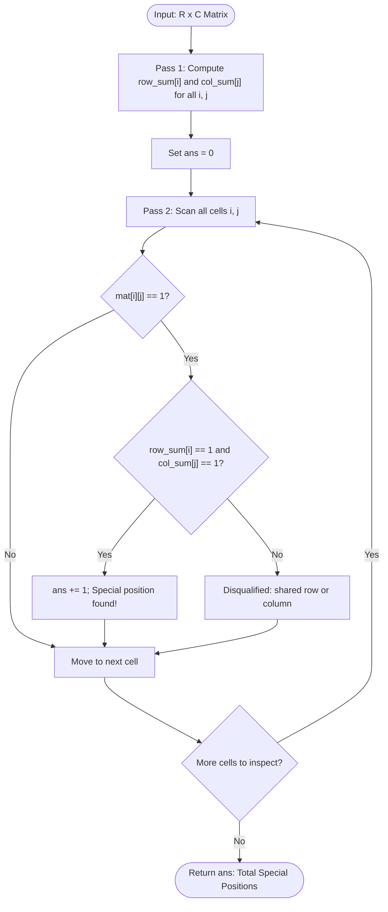

# Guided Example: Special Positions in a Binary Matrix

## 1. Instance & Teaching Goal

We are given an $R \times C$ binary matrix $\text{mat}$ where every entry is either `0` or `1`. A cell $(i, j)$ is designated as a **special position** if and only if:
1. $\text{mat}[i][j] = 1$
2. Every other cell in row $i$ contains `0`.
3. Every other cell in column $j$ contains `0`.

We must count and return the total number of special positions.

We select the representative $3 \times 3$ instance:
$$\text{mat} = \begin{bmatrix} 1 & 0 & 0 \\ 0 & 0 & 1 \\ 1 & 0 & 0 \end{bmatrix}$$

The total count of special positions is:
$$1$$
(Position $(1, 2)$ is the only special position; positions $(0, 0)$ and $(2, 0)$ share column $0$, which contains two ones).

Our teaching goal is to walk through marginal sum aggregation in binary grids. We show how the condition that all other elements in a row and column are zero reduces to checking that the total sum of that row and column equals exactly one, enabling an optimal two-pass $\mathcal{O}(R \cdot C)$ solution with $\mathcal{O}(R + C)$ auxiliary projection vectors.

## 2. Conceptual Foundation & Invariants

In a matrix with entries restricted to $\{0, 1\}$, the sum of all elements in row $i$ is:
$$\text{row\_sum}[i] = \sum_{c=0}^{C-1} \text{mat}[i][c]$$
and the sum of all elements in column $j$ is:
$$\text{col\_sum}[j] = \sum_{r=0}^{R-1} \text{mat}[r][j]$$

A cell $(i, j)$ with $\text{mat}[i][j] = 1$ has no other ones in row $i$ if and only if:
$$\text{row\_sum}[i] = 1$$
Similarly, it has no other ones in column $j$ if and only if:
$$\text{col\_sum}[j] = 1$$

Therefore, a position $(i, j)$ is special if and only if the three conditions hold simultaneously:
$$\text{mat}[i][j] = 1 \quad \land \quad \text{row\_sum}[i] = 1 \quad \land \quad \text{col\_sum}[j] = 1$$

```
+-------------------------------------------------------------------------+
|                  MARGINAL SUM PROJECTION ARCHITECTURE                   |
|                                                                         |
| Matrix mat:              Row Sums:                                      |
|   [ 1,  0,  0 ]  ----->     1                                           |
|   [ 0,  0,  1 ]  ----->     1                                           |
|   [ 1,  0,  0 ]  ----->     1                                           |
|     |   |   |                                                           |
|     v   v   v                                                           |
| Col:2   0   1                                                           |
|                                                                         |
| Evaluation of 1s:                                                       |
|   Cell (0,0): val=1, row_sum=1, col_sum=2 ==> col_sum != 1 (REJECT)     |
|   Cell (1,2): val=1, row_sum=1, col_sum=1 ==> ALL ONES (SPECIAL!)      |
|   Cell (2,0): val=1, row_sum=1, col_sum=2 ==> col_sum != 1 (REJECT)     |
|                                                                         |
| Total Special Positions = 1                                             |
+-------------------------------------------------------------------------+
```

### State Parameter Reference

| Parameter | Type | Domain | Role in Marginal Projection |
|---|---|---|---|
| $R, C$ | Integers | $[1, 100]$ | Number of rows and columns in the binary matrix |
| $\text{row\_sum}[i]$ | Integer Array | $[0, C]$ | Total number of ones present in row $i$ |
| $\text{col\_sum}[j]$ | Integer Array | $[0, R]$ | Total number of ones present in column $j$ |
| $(i, j)$ | Coordinates | $[0, R-1] \times [0, C-1]$ | Matrix coordinate being verified |
| $\text{ans}$ | Integer | $[0, \min(R, C)]$ | Accumulated count of verified special positions |

> [!IMPORTANT]
> **Marginal Projection Invariant**:
> In any binary matrix, precomputing row sums and column sums decouples cross-axial verification. Checking whether all other elements in row $i$ and column $j$ are zero requires only checking $\text{row\_sum}[i] == 1$ and $\text{col\_sum}[j] == 1$, replacing $\mathcal{O}(R + C)$ ray scans with $\mathcal{O}(1)$ array lookups per cell.



## 3. Step-by-Step Worked Execution

We trace the algorithm on the $3 \times 3$ matrix:
$$\text{mat} = \begin{bmatrix} 1 & 0 & 0 \\ 0 & 0 & 1 \\ 1 & 0 & 0 \end{bmatrix}$$

### Phase 1: Precomputing Marginal Vectors

We initialize arrays $\text{row\_sum}$ of length $3$ and $\text{col\_sum}$ of length $3$ with zeros.

1. **Row 0**: `[1, 0, 0]`
   - $\text{row\_sum}[0] = 1 + 0 + 0 = 1$.
   - $\text{col\_sum}[0] += 1$.
2. **Row 1**: `[0, 0, 1]`
   - $\text{row\_sum}[1] = 0 + 0 + 1 = 1$.
   - $\text{col\_sum}[2] += 1$.
3. **Row 2**: `[1, 0, 0]`
   - $\text{row\_sum}[2] = 1 + 0 + 0 = 1$.
   - $\text{col\_sum}[0] += 1$.

Final marginal vectors:
$$\text{row\_sum} = [1, 1, 1]$$
$$\text{col\_sum} = [2, 0, 1]$$

### Phase 2: Evaluating Candidate Ones

We scan all cells $(i, j)$ where $\text{mat}[i][j] = 1$:

#### Candidate 1: Cell $(0, 0)$
- $\text{mat}[0][0] = 1$.
- Row sum check: $\text{row\_sum}[0] = 1$. Passed.
- Column sum check: $\text{col\_sum}[0] = 2$.
- Evaluation: Column $0$ contains another one (at $(2, 0)$).
- Status: **Disqualified**.

#### Candidate 2: Cell $(1, 2)$
- $\text{mat}[1][2] = 1$.
- Row sum check: $\text{row\_sum}[1] = 1$. Passed.
- Column sum check: $\text{col\_sum}[2] = 1$. Passed.
- Evaluation: Cell $(1, 2)$ is the only one in row $1$ and the only one in column $2$.
- Status: **Special Position Verified**. $\text{ans} = 0 + 1 = 1$.

#### Candidate 3: Cell $(2, 0)$
- $\text{mat}[2][0] = 1$.
- Row sum check: $\text{row\_sum}[2] = 1$. Passed.
- Column sum check: $\text{col\_sum}[0] = 2$.
- Evaluation: Column $0$ contains another one (at $(0, 0)$).
- Status: **Disqualified**.

### Termination
All cells scanned. Total special positions found: $\text{ans} = 1$.

## 4. Complete Execution Trace

The table below catalogs every cell in the matrix, showing value, marginal projections, condition checks, and final determinations.

| Coordinate $(i, j)$ | Cell Value $\text{mat}[i][j]$ | Row Sum $\text{row\_sum}[i]$ | Column Sum $\text{col\_sum}[j]$ | Row Unique? ($\text{row\_sum} == 1$) | Col Unique? ($\text{col\_sum} == 1$) | Special Position? | Running Total $\text{ans}$ |
|---|---|---|---|---|---|---|---|
| $(0, 0)$ | 1 | 1 | 2 | True | **False** (Col has 2) | No | 0 |
| $(0, 1)$ | 0 | 1 | 0 | - | - | Skip (Zero) | 0 |
| $(0, 2)$ | 0 | 1 | 1 | - | - | Skip (Zero) | 0 |
| $(1, 0)$ | 0 | 1 | 2 | - | - | Skip (Zero) | 0 |
| $(1, 1)$ | 0 | 1 | 0 | - | - | Skip (Zero) | 0 |
| $(1, 2)$ | 1 | 1 | 1 | **True** | **True** | **YES (SPECIAL)** | **1** |
| $(2, 0)$ | 1 | 1 | 2 | True | **False** (Col has 2) | No | 1 |
| $(2, 1)$ | 0 | 1 | 0 | - | - | Skip (Zero) | 1 |
| $(2, 2)$ | 0 | 1 | 1 | - | - | Skip (Zero) | 1 |

### Summary of Disqualification Reasons

- Cell $(0, 0)$: Disqualified by column collision with $(2, 0)$.
- Cell $(2, 0)$: Disqualified by column collision with $(0, 0)$.
- Cell $(1, 2)$: Row 1 has sum 1, Col 2 has sum 1. Unique in both dimensions.

## 5. Algorithmic Correctness

### Soundness

A position $(i, j)$ is special if $\text{mat}[i][j] = 1$ and for all $c \neq j$, $\text{mat}[i][c] = 0$, and for all $r \neq i$, $\text{mat}[r][j] = 0$.
Because every entry is in $\{0, 1\}$:
$$\text{row\_sum}[i] = \text{mat}[i][j] + \sum_{c \neq j} \text{mat}[i][c] = 1 + \sum_{c \neq j} \text{mat}[i][c]$$
Since $\text{mat}[i][c] \ge 0$, the sum $\sum_{c \neq j} \text{mat}[i][c]$ equals $0$ if and only if every term $\text{mat}[i][c] = 0$.
This holds if and only if $\text{row\_sum}[i] = 1$.
By identical reasoning on the column, every other entry in column $j$ is $0$ if and only if $\text{col\_sum}[j] = 1$.
Therefore, $\text{mat}[i][j] == 1 \land \text{row\_sum}[i] == 1 \land \text{col\_sum}[j] == 1$ is mathematically equivalent to the problem definition, ensuring soundness.

### Completeness

Every matrix cell $(i, j)$ is inspected during the second pass.
Any position satisfying the special definition will have $\text{row\_sum}[i] = 1$ and $\text{col\_sum}[j] = 1$ and will be counted.
No valid special position can be skipped or rejected.

## 6. Traps This Instance Exposes

1. **Ray Scanning Every 1 ($\mathcal{O}(R + C)$ per Cell)**:
   For every cell containing a 1, scanning its entire row and column takes $\mathcal{O}(R + C)$ steps, leading to $\mathcal{O}(R \cdot C \cdot (R + C))$ time. Precomputing marginal vectors reduces each test to $\mathcal{O}(1)$, achieving $\mathcal{O}(R \cdot C)$ total time.

2. **Checking Only Row Uniqueness**:
   In Example 1, row 0 contains only a single 1 (at $(0, 0)$). If an algorithm checks only row uniqueness, it falsely identifies $(0, 0)$ as special, ignoring that column 0 contains another 1 at $(2, 0)$. Both row and column uniqueness must be enforced.

3. **Counting Zero Cells with Marginal Sums of One**:
   Cell $(0, 2)$ has $\text{row\_sum}[0] = 1$ and $\text{col\_sum}[2] = 1$. However, $\text{mat}[0][2] = 0$. One must strictly verify $\text{mat}[i][j] == 1$ before considering marginal sums.

4. **Matrix Dimensions Asymmetry ($R \neq C$)**:
   When matrices are rectangular ($R \neq C$), indexing row sums with column indices or vice-versa leads to out-of-bounds errors. Using separate sizes $R$ and $C$ prevents this.

## 7. Complexity Derivation

### Time Complexity

Let $R$ be the number of rows and $C$ be the number of columns ($R, C \le 100$).
- **Pass 1 (Marginal Accumulation)**: Iterates through all $R \cdot C$ entries to sum rows and columns: $\mathcal{O}(R \cdot C)$ time.
- **Pass 2 (Special Check)**: Iterates through all $R \cdot C$ entries, checking $\text{mat}[i][j] == 1$ and indexing $\text{row\_sum}$ and $\text{col\_sum}$ in $\mathcal{O}(1)$: $\mathcal{O}(R \cdot C)$ time.

Total time complexity is strictly:
$$\mathcal{O}(R \cdot C)$$
For $R, C \le 100$, total operations cannot exceed $20\,000$, executing in under 1 millisecond.

### Auxiliary Space Complexity

- $\text{row\_sum}$ stores $R$ integers: $\mathcal{O}(R)$ space.
- $\text{col\_sum}$ stores $C$ integers: $\mathcal{O}(C)$ space.

Total auxiliary space complexity is:
$$\mathcal{O}(R + C)$$
Minimal and optimal.
