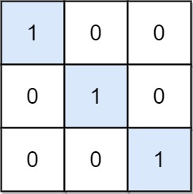

## Description

Given an `m x n` binary matrix `mat`, return *the number of special positions in *`mat`*.*

A position `(i, j)` is called **special** if $\text{mat}[i][j] = 1$ and all other elements in row `i` and column `j` are `0` (rows and columns are **0-indexed**).
### Function Contract

- `n`: Input parameter.
- Returns expected result.

### Examples

#### Example 1

- **Input:** $mat = [[1,0,0],[0,0,1],[1,0,0]]$
- **Output:** `1`
- **Explanation:** (1, 2) is a special position because mat[1][2] == 1 and all other elements in row 1 and column 2 are 0.
#### Example 2

- **Input:** $mat = [[1,0,0],[0,1,0],[0,0,1]]$
- **Output:** `3`
- **Explanation:** (0, 0), (1, 1) and (2, 2) are special positions.
### Constraints

- $m = \text{mat.length}$

- $n = \text{mat}[i].length$

- $1 \le m, n \le 100$

- $\text{mat}[i][j]$ is either `0` or `1`.