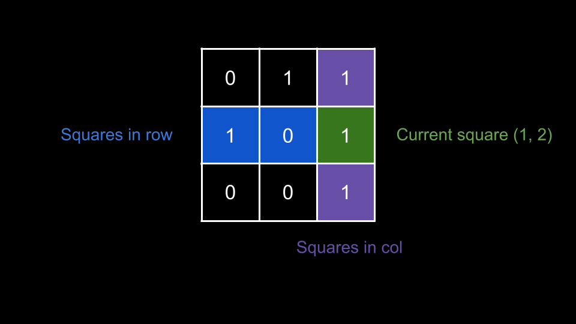
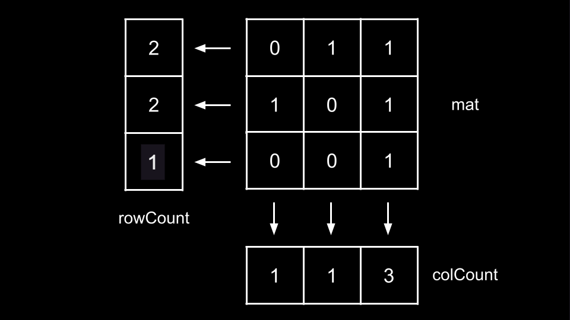

## Solution

---

### Approach 1: Brute Force

**Intuition**

For our first approach, we will apply a brute force search for each square in `mat`.

We iterate over every square `(row, col)` in `mat`. For each `(row, col)`, we first check if $\text{mat}[row][col] = 1$. If it is, then it could possibly be a special position. Next, we check if there are any squares with the same `row` or same `col` that have a value of `1`. If there are, then the current square `(row, col)` is not special, otherwise, `(row, col)` is special.

To perform this check, we initialize a boolean flag $good = true$ indicating that the current square is special. We then iterate over each row in the `mat` using another variable `r`. For each value of `r` other than `row`, we check if $\text{mat}[r][col] = 1$. If it is, it means that there is another cell with value 1 in the same column, so the current square is not special, and we set $good = false$.

Then, we do the same for the columns with a variable `c`. For each value of `c` other than `col`, we check if $\text{mat}[row][c] = 1$. If it is, we set $good = false$.


<br>

After checking the rows and columns, if `good` is still `true`, then the current square is special. We can increment our answer.

**Algorithm**

1. Set the answer $ans = 0$, and the size of the matrix $m = \text{mat.length}, n = \text{mat}[0].length$.
2. Iterate `row` from `0` until `m`:
- Iterate `col` from `0` until `n`:
- If $\text{mat}[row][col] = 0$, `continue` to the next iteration.
- Set $good = true$.
- Iterate `r` from `0` until `m`:
- If $r \neq row$ and $\text{mat}[r][col] = 1$, set $good = false$ and `break` from the loop.
- Iterate `c` from `0` until `n`:
- If $c \neq col$ and $\text{mat}[row][c] = 1$, set $good = false$ and `break` from the loop.
- If $good = true$, increment `ans`.
3. Return `ans`.

**Implementation**

```python
class Solution:
    def numSpecial(self, mat: List[List[int]]) -> int:
        ans = 0
        m = len(mat)
        n = len(mat[0])

        for row in range(m):
            for col in range(n):
                if mat[row][col] == 0:
                    continue

                good = True
                for r in range(m):
                    if r != row and mat[r][col] == 1:
                        good = False
                        break

                for c in range(n):
                    if c != col and mat[row][c] == 1:
                        good = False
                        break

                if good:
                    ans += 1

        return ans
```

**Complexity Analysis**

Given $m$ as the number of rows in `mat` and $n$ as the number of columns in `mat`,

* Time complexity: $O(m \cdot n \cdot (m + n))$

    There are $m \cdot n$ squares. For each square, in the worst case, we perform iterations over $m$ squares of the same column and $n$ squares of the same row. Thus, the time complexity is $O(m \cdot n \cdot (m + n))$.

* Space complexity: $O(1)$

    We aren't using any extra space other than a few integers.

<br/>

---

### Approach 2: Precompute the Number of Ones in each Row and Column

**Intuition**

In the previous approach, for each square `(row, col)`, we iterated over every other square that shared a `row` or `col` to determine if the current square was special, but you might have noticed that this involved a lot of repetitive traversals. Is there a more efficient way for us to determine if a square is special?

For a given `(row, col)`, we are trying to answer: "is there another square in this `row` or this `col` with a value of `1`?".

We can pre-process two arrays `rowCount` and `colCount` that tell us how many squares each row or column have with a value of `1`. For example, $\text{rowCount}[3]$ would tell us how many squares in the row with index `3` have a value of `1`. Similarly, $\text{colCount}[7]$ would tell us how many squares in the column with index `7` have a value of `1`.


<br>

Once we have these arrays, we iterate over every square `(row, col)` and first check if $\text{mat}[row][col] = 1$. If it is, we now check if there are any other squares that share a row or column with a value of `1`. Because `(row, col)` itself has a value of `1`, it is special if $\text{rowCount}[row] = 1$ and $\text{colCount}[col] = 1$.

If these values are both `1`, then it means `(row, col)` is the **only** square with either coordinate that has a value of `1`, and thus it is special.

**Algorithm**

1. Initialize the size of the matrix $m = \text{mat.length}, n = \text{mat}[0].length$.
2. Initialize two integer arrays `rowCount` of length `m` and `colCount` of length `n`.
3. Iterate `row` from `0` until `m`:
- Iterate `col` from `0` until `n`:
- If $\text{mat}[row][col] = 1$, increment $\text{rowCount}[row]$ and $\text{colCount}[col]$.
4. Initialize the answer $ans = 0$.
5. Iterate `row` from `0` until `m`:
- Iterate `col` from `0` until `n`:
- If $\text{mat}[row][col] = 1$:
- If $\text{rowCount}[row] = 1$ and $\text{colCount}[col] = 1$, increment `ans`.
6. Return `ans`.

**Implementation**

```python
class Solution:
    def numSpecial(self, mat: List[List[int]]) -> int:
        m = len(mat)
        n = len(mat[0])
        row_count = [0] * m
        col_count = [0] * n

        for row in range(m):
            for col in range(n):
                if mat[row][col] == 1:
                    row_count[row] += 1
                    col_count[col] += 1

        ans = 0
        for row in range(m):
            for col in range(n):
                if mat[row][col] == 1:
                    if row_count[row] == 1 and col_count[col] == 1:
                        ans += 1

        return ans
```

**Complexity Analysis**

Given $m$ as the number of rows in `mat` and $n$ as the number of columns in `mat`,

* Time complexity: $O(m \cdot n)$

    To calculate `rowCount` and `colCount`, we iterate over each square once, which costs $O(m \cdot n)$.

    Next, we iterate over each square again to determine if it is special. Each iteration costs $O(1)$, so in total we spend $O(m \cdot n)$ here.

* Space complexity: $O(m + n)$

    `rowCount` has a size of $m$ and `colCount` has a size of $n$.

<br/>

---