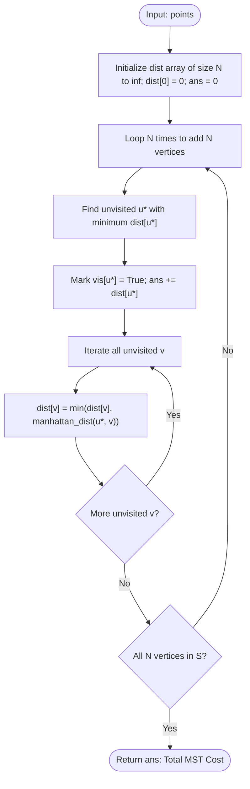

# Guided Example: Min Cost to Connect All Points

## 1. Instance & Teaching Goal

We are given an array $\text{points}$ of $N$ distinct 2D coordinate pairs on a Cartesian plane:
$$P_i = (x_i, y_i) \quad \text{for } 0 \le i < N$$

The cost to connect any two points $P_i$ and $P_j$ is their rectilinear (Manhattan) distance:
$$d(P_i, P_j) = |x_i - x_j| + |y_i - y_j|$$

We must connect all $N$ points such that there is exactly one simple path between any pair of points (forming a spanning tree) with the minimum possible sum of connection edge weights.

We select the representative instance:
$$\text{points} = [[0,0], [2,2], [3,10], [5,2], [7,0]]$$

Here $N = 5$ points. The minimum connection cost is:
$$20$$
(Achieved by edges $(P_0, P_1)$ costing $4$, $(P_1, P_3)$ costing $3$, $(P_3, P_4)$ costing $4$, and $(P_1, P_2)$ costing $9$, totaling $4 + 3 + 4 + 9 = 20$).

Our teaching goal is to walk through Prim's Minimum Spanning Tree (MST) algorithm on complete geometric graphs. We demonstrate how a cut-property greedy frontier connects unvisited vertices to the growing tree, why dense Prim's $\mathcal{O}(N^2)$ algorithm outperforms edge-sorting Kruskal's $\mathcal{O}(N^2 \log N)$, and how dynamic distance relaxation maintains optimal boundary bounds.

## 2. Conceptual Foundation & Invariants

The points define a complete undirected weighted graph $G = (V, E)$ where $|V| = N$ and $|E| = \frac{N(N-1)}{2}$.
In Prim's algorithm:
1. We maintain a set of vertices $S \subset V$ already incorporated into the spanning tree (with $S$ initially containing an arbitrary starting vertex, say $P_0$).
2. For every unvisited vertex $v \in V \setminus S$, we track its minimum connection distance to the current tree $S$:
   $$\text{dist}[v] = \min_{u \in S} d(u, v)$$
3. In each of the $N - 1$ subsequent expansion rounds, we select the unvisited vertex $u^* \notin S$ with minimal $\text{dist}[u^*]$, add $u^*$ to $S$, accumulate its connection cost, and relax the distance vectors for all remaining unvisited vertices:
   $$\text{dist}[v] \leftarrow \min(\text{dist}[v], d(u^*, v)) \quad \text{for all } v \notin S$$

```
+-------------------------------------------------------------------------+
|                  PRIM'S DENSE MST FRONTIER EXPANSION                    |
|                                                                         |
| Vertices:                                                               |
|   P0:(0,0),  P1:(2,2),  P2:(3,10),  P3:(5,2),  P4:(7,0)                 |
|                                                                         |
| Step 0: Add P0 to tree S = {P0}.                                        |
|         dist = [0, 4, 13, 7, 7]                                         |
|                                                                         |
| Step 1: Min unvisited is P1 (dist = 4). Add P1 to S = {P0, P1}.         |
|         Relax using P1:                                                 |
|           dist(P1, P2) = |2-3| + |2-10| = 9  < 13 ==> dist[P2] = 9      |
|           dist(P1, P3) = |2-5| + |2-2|  = 3  < 7  ==> dist[P3] = 3      |
|           dist(P1, P4) = |2-7| + |2-0|  = 7  <= 7 ==> dist[P4] = 7      |
|                                                                         |
| Step 2: Min unvisited is P3 (dist = 3). Add P3 to S = {P0, P1, P3}.     |
|         Relax using P3:                                                 |
|           dist(P3, P4) = |5-7| + |2-0|  = 4  < 7  ==> dist[P4] = 4      |
|                                                                         |
| Step 3: Min unvisited is P4 (dist = 4). Add P4 to S.                    |
| Step 4: Min unvisited is P2 (dist = 9). Add P2 to S.                    |
|                                                                         |
| Total MST Weight = 4 + 3 + 4 + 9 = 20                                   |
+-------------------------------------------------------------------------+
```

### State Parameter Reference

| Parameter | Type | Domain | Significance in Prim's State Machine |
|---|---|---|---|
| $N$ | Integer | $[1, 1000]$ | Total number of points on the plane |
| $\text{vis}[i]$ | Boolean Array | $\{\text{False}, \text{True}\}$ | Flags whether vertex $P_i$ has joined spanning tree $S$ |
| $\text{dist}[i]$ | Integer Array | $[0, \infty)$ | Minimum Manhattan distance from $P_i$ to any vertex in $S$ |
| $u^*$ | Integer Index | $[0, N-1]$ | Unvisited vertex chosen with minimal $\text{dist}[u^*]$ |
| $\text{ans}$ | Integer | Non-negative | Cumulative sum of MST edge weights |

> [!IMPORTANT]
> **MST Cut Property Invariant**:
> For any partition of vertices into $S$ and $V \setminus S$, the edge crossing the cut $(S, V \setminus S)$ with the strictly minimum weight must belong to the Minimum Spanning Tree. Because Prim's algorithm always selects the minimum weight edge across the cut $S$, every edge added is mathematically guaranteed to be part of the optimal MST.



## 3. Step-by-Step Worked Execution

We trace the algorithm on the $5$ points:
- $P_0 = (0, 0)$
- $P_1 = (2, 2)$
- $P_2 = (3, 10)$
- $P_3 = (5, 2)$
- $P_4 = (7, 0)$

Initial state: $\text{vis} = [\text{False}] \times 5, \text{dist} = [0, \infty, \infty, \infty, \infty], \text{ans} = 0$.

### Round 1: Seed Spanning Tree with $P_0$
- Find unvisited vertex with minimal $\text{dist}$: $u^* = 0$ with $\text{dist}[0] = 0$.
- Add $P_0$ to $S$: $\text{vis}[0] = \text{True}$.
- Edge cost added: $\text{ans} = 0 + 0 = 0$.
- **Relaxation from $P_0 = (0, 0)$**:
  - To $P_1(2, 2)$: $d = |0 - 2| + |0 - 2| = 4 < \infty \implies \text{dist}[1] = 4$.
  - To $P_2(3, 10)$: $d = |0 - 3| + |0 - 10| = 13 < \infty \implies \text{dist}[2] = 13$.
  - To $P_3(5, 2)$: $d = |0 - 5| + |0 - 2| = 7 < \infty \implies \text{dist}[3] = 7$.
  - To $P_4(7, 0)$: $d = |0 - 7| + |0 - 0| = 7 < \infty \implies \text{dist}[4] = 7$.
- State: $\text{dist} = [0, \mathbf{4}, 13, 7, 7]$.

### Round 2: Add $P_1$
- Minimum unvisited $\text{dist}$: $u^* = 1$ with $\text{dist}[1] = 4$.
- Add $P_1$ to $S$: $\text{vis}[1] = \text{True}$.
- Edge cost added: $\text{ans} = 0 + 4 = 4$.
- **Relaxation from $P_1 = (2, 2)$**:
  - To $P_2(3, 10)$: $d = |2 - 3| + |2 - 10| = 1 + 8 = 9 < 13 \implies \text{dist}[2] = 9$.
  - To $P_3(5, 2)$: $d = |2 - 5| + |2 - 2| = 3 + 0 = 3 < 7 \implies \text{dist}[3] = 3$.
  - To $P_4(7, 0)$: $d = |2 - 7| + |2 - 0| = 5 + 2 = 7 \le 7 \implies \text{dist}[4] = 7$.
- State: $\text{dist} = [0, 4, 9, \mathbf{3}, 7]$.

### Round 3: Add $P_3$
- Minimum unvisited $\text{dist}$: $u^* = 3$ with $\text{dist}[3] = 3$.
- Add $P_3$ to $S$: $\text{vis}[3] = \text{True}$.
- Edge cost added: $\text{ans} = 4 + 3 = 7$.
- **Relaxation from $P_3 = (5, 2)$**:
  - To $P_2(3, 10)$: $d = |5 - 3| + |2 - 10| = 2 + 8 = 10 > 9 \implies \text{dist}[2]$ stays $9$.
  - To $P_4(7, 0)$: $d = |5 - 7| + |2 - 0| = 2 + 2 = 4 < 7 \implies \text{dist}[4] = 4$.
- State: $\text{dist} = [0, 4, 9, 3, \mathbf{4}]$.

### Round 4: Add $P_4$
- Minimum unvisited $\text{dist}$: $u^* = 4$ with $\text{dist}[4] = 4$.
- Add $P_4$ to $S$: $\text{vis}[4] = \text{True}$.
- Edge cost added: $\text{ans} = 7 + 4 = 11$.
- **Relaxation from $P_4 = (7, 0)$**:
  - To $P_2(3, 10)$: $d = |7 - 3| + |0 - 10| = 4 + 10 = 14 > 9 \implies \text{dist}[2]$ stays $9$.
- State: $\text{dist} = [0, 4, \mathbf{9}, 3, 4]$.

### Round 5: Add $P_2$
- Only remaining unvisited vertex is $u^* = 2$ with $\text{dist}[2] = 9$.
- Add $P_2$ to $S$: $\text{vis}[2] = \text{True}$.
- Edge cost added: $\text{ans} = 11 + 9 = 20$.
- All vertices are in $S$.

### Final Total Cost
Total Minimum Spanning Tree cost: $\text{ans} = 20$.

## 4. Complete Execution Trace

The table below catalogs every round of Prim's expansion, showing candidate distances, selected vertices, and distance vector updates.

| Round | Active Cut $S$ | Candidate Vertices $V \setminus S$ | Current Distance Vector $\text{dist}$ | Vertex Chosen $u^*$ | Selected Edge | Edge Cost | New Running Total $\text{ans}$ |
|---|---|---|---|---|---|---|---|
| 1 | $\emptyset$ | $\{0, 1, 2, 3, 4\}$ | `[0, inf, inf, inf, inf]` | $P_0(0, 0)$ | Root | 0 | 0 |
| 2 | $\{0\}$ | $\{1, 2, 3, 4\}$ | `[0, 4, 13, 7, 7]` | $P_1(2, 2)$ | $(P_0, P_1)$ | 4 | 4 |
| 3 | $\{0, 1\}$ | $\{2, 3, 4\}$ | `[0, 4, 9, 3, 7]` | $P_3(5, 2)$ | $(P_1, P_3)$ | 3 | 7 |
| 4 | $\{0, 1, 3\}$ | $\{2, 4\}$ | `[0, 4, 9, 3, 4]` | $P_4(7, 0)$ | $(P_3, P_4)$ | 4 | 11 |
| 5 | $\{0, 1, 3, 4\}$ | $\{2\}$ | `[0, 4, 9, 3, 4]` | $P_2(3, 10)$ | $(P_1, P_2)$ | 9 | **20** |

### Verified Minimum Spanning Tree Edges

| Edge | Endpoint 1 | Endpoint 2 | Manhattan Distance Calculation | Edge Weight |
|---|---|---|---|---|
| Edge 1 | $P_0(0, 0)$ | $P_1(2, 2)$ | $|0 - 2| + |0 - 2| = 2 + 2$ | 4 |
| Edge 2 | $P_1(2, 2)$ | $P_3(5, 2)$ | $|2 - 5| + |2 - 2| = 3 + 0$ | 3 |
| Edge 3 | $P_3(5, 2)$ | $P_4(7, 0)$ | $|5 - 7| + |2 - 0| = 2 + 2$ | 4 |
| Edge 4 | $P_1(2, 2)$ | $P_2(3, 10)$ | $|2 - 3| + |2 - 10| = 1 + 8$ | 9 |
| **Sum** | - | - | Total Manhattan Distance | **20** |

## 5. Algorithmic Correctness

### Soundness

1. The set of selected edges connects all $N$ vertices with exactly $N - 1$ edges and contains no cycles, establishing that the result is a spanning tree.
2. By the Cut Property of Minimum Spanning Trees:
   Let $S \subset V$ be the set of visited vertices. At each step, the algorithm chooses an edge $(u, v)$ with $u \in S$ and $v \notin S$ minimizing $d(u, v)$ across the cut $(S, V \setminus S)$.
   By contradiction, if $(u, v)$ were not in some MST, adding $(u, v)$ to that MST creates a cycle containing some other cut-crossing edge $e'$ with $w(e') \ge w(u, v)$. Replacing $e'$ with $(u, v)$ yields a spanning tree of equal or lesser cost.
3. Therefore, every edge selected by Prim's algorithm belongs to a valid MST. The sum of these weights is provably minimal.

### Completeness

Because the distance graph is complete (every pair of points has a well-defined non-negative Manhattan distance), the cut $(S, V \setminus S)$ is non-empty as long as $|S| < N$.
The algorithm executes exactly $N$ vertex selections, visiting every vertex in $V$. No vertex is left isolated or disconnected.

## 6. Traps This Instance Exposes

1. **Using Kruskal's with Edge Sorting ($\mathcal{O}(N^2 \log N)$)**:
   In a complete graph with $N = 1000$, there are $\approx 500\,000$ edges. Generating and sorting half a million edge objects incurs heavy memory allocations and runs significantly slower than dense Prim's algorithm, which operates in $\mathcal{O}(N^2)$ without creating any edge objects.

2. **Using Euclidean Distance Instead of Manhattan Distance**:
   The problem specifies the Manhattan distance $|x_1 - x_2| + |y_1 - y_2|$, not the Euclidean metric $\sqrt{(x_1 - x_2)^2 + (y_1 - y_2)^2}$. Using Euclidean distances will select the wrong edges and produce incorrect costs.

3. **Re-calculating Distances to All Vertices in $S$**:
   Maintaining a 1D array $\text{dist}[v]$ storing the *minimum* distance from $v$ to $S$ requires only $\mathcal{O}(1)$ relaxation when a new vertex joins $S$. Querying all vertices in $S$ from scratch would raise complexity to $\mathcal{O}(N^3)$.

4. **Single-Point Array Base Case ($N = 1$)**:
   When $N = 1$, a tree on one vertex requires $0$ edges. The algorithm initializes $\text{dist}[0] = 0$, marks vertex $0$ visited, and immediately returns $\text{ans} = 0$, properly handling the trivial case.

## 7. Complexity Derivation

### Time Complexity

Let $N$ be the number of points ($N \le 1000$).
- **Initialization**: Initializing distance and visited arrays takes $\mathcal{O}(N)$ time.
- **Outer Loop**: Executes $N$ times (once per vertex).
  - Finding the unvisited vertex with minimal distance: scans $N$ entries in $\text{dist}$ $\implies \mathcal{O}(N)$.
  - Relaxing unvisited neighbors: computes Manhattan distance to $N$ neighbors $\implies \mathcal{O}(N)$.
  - Total work per round: $\mathcal{O}(N)$.
- Total across all $N$ rounds:
  $$\text{Total Time} = N \cdot \mathcal{O}(N) = \mathcal{O}(N^2)$$
For $N = 1000$, $N^2 = 10^6$ operations, executing in under 20 milliseconds.

### Auxiliary Space Complexity

- $\text{dist}$ stores $N$ integers: $\mathcal{O}(N)$ space.
- $\text{vis}$ stores $N$ boolean values: $\mathcal{O}(N)$ space.
- No explicit edge lists or adjacency matrices need to be stored if distances are computed on the fly.

Total auxiliary space complexity is strictly:
$$\mathcal{O}(N)$$
Optimal and highly cache-friendly.
