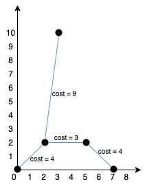

## Description

You are given an array `points` representing integer coordinates of some points on a 2D-plane, where $\text{points}[i] = [x_{i}, y_{i}]$.

The cost of connecting two points $[x_{i}, y_{i}]$ and $[x_{j}, y_{j}]$ is the **manhattan distance** between them: $|x_{i} - x_{j}| + |y_{i} - y_{j}|$, where `|val|` denotes the absolute value of `val`.

Return *the minimum cost to make all points connected.* All points are connected if there is **exactly one** simple path between any two points.
### Function Contract

- `n`: Input parameter.
- Returns expected result.

### Examples
#### Example 1

- **Input:** $points = [[0,0],[2,2],[3,10],[5,2],[7,0]]$
- **Output:** `20`
- **Explanation:**

We can connect the points as shown above to get the minimum cost of 20.
Notice that there is a unique path between every pair of points.
#### Example 2

- **Input:** $points = [[3,12],[-2,5],[-4,1]]$
- **Output:** `18`
### Constraints

- $1 \le \text{points.length} \le 1000$

- $-10^{6} \le x_{i}, y_{i} \le 10^{6}$

- All pairs $(x_{i}, y_{i})$ are distinct.