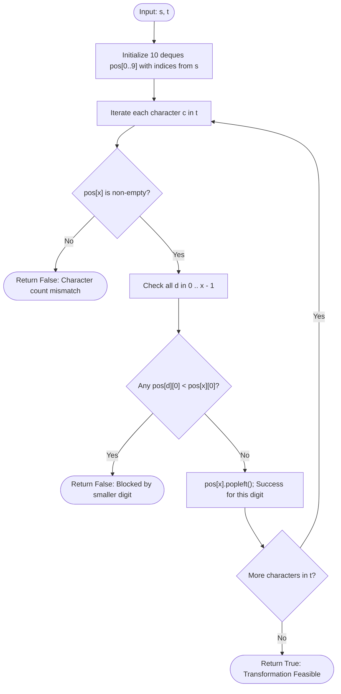

# Guided Example: Check If String Is Transformable With Substring Sort Operations

## 1. Instance & Teaching Goal

We are given two digit strings $s$ and $t$ of equal length $N$. In one operation, we may select any contiguous substring of $s$ and sort its characters in ascending order. We may apply this operation any number of times. We must determine whether $s$ can be transformed into $t$.

We select the representative instance:
$$s = \text{"84532"}, \quad t = \text{"34852"}$$

The algorithm returns:
$$\text{true}$$

Our teaching goal is to demonstrate the inversion-barrier principle of partial substring sorting. We show why sorting in ascending order allows a smaller digit to jump leftward over larger digits but strictly prohibits any larger digit from moving leftward over a smaller digit. We formalize this directional asymmetry into a queue-based simulation that verifies whether every target digit can be brought to the front without encountering smaller obstructing blockers.

## 2. Conceptual Foundation & Invariants

Let $a$ and $b$ be two adjacent characters in a string.
- If $a > b$ (such as `8` followed by `3`), sorting the substring $[a, b]$ yields $[b, a]$.
  The smaller digit $b$ moves to the left, and the larger digit $a$ moves to the right.
- If $a < b$ (such as `3` followed by `8`), sorting $[a, b]$ keeps $[a, b]$ unchanged.
  Ascending sort **cannot** move the larger digit $b$ to the left of the smaller digit $a$.

Therefore, any digit $x$ can slide leftward across any sequence of digits strictly greater than $x$. Conversely, a digit $x$ is permanently blocked from moving leftward past any unconsumed digit $d$ with $d < x$.

```
+-------------------------------------------------------------------------+
|                  DIRECTIONAL INVERSION BARRIER PRINCIPLE                |
|                                                                         |
| Sort operation rule:                                                    |
|   Smaller digits can move LEFT across larger digits:   [8, 3] -> [3, 8]  |
|   Larger digits CANNOT move LEFT across smaller digits: [3, 8] -> [3, 8] |
|                                                                         |
| Target matching for t = "34852" from s = "84532":                       |
|   Need '3' first:                                                       |
|     '3' is at index 3 in s ("845[3]2").                                 |
|     To its left are: '8' (idx 0), '4' (idx 1), '5' (idx 2).             |
|     All of {8, 4, 5} are STRICTLY GREATER than 3!                      |
|     '2' is at index 4 (to the right, so it does not block '3').         |
|     ==> '3' slides leftward unblocked: "84532" -> "34582" -> "34852"    |
|                                                                         |
| Queue State: 10 FIFO queues tracking original indices for digits 0..9.   |
| For each x in t:                                                        |
|   Must verify no digit d in [0, x-1] has pos[d][0] < pos[x][0].         |
+-------------------------------------------------------------------------+
```

### State Parameter Reference

| Parameter | Type | Domain | Purpose in Barrier Verification |
|---|---|---|---|
| $N$ | Integer | $[1, 10^5]$ | Length of strings $s$ and $t$ |
| $\text{pos}[d]$ | FIFO Queue | 0-indexed indices | Tracks remaining unconsumed positions of digit $d \in [0, 9]$ in $s$ |
| $x$ | Integer | $[0, 9]$ | Active target digit from $t$ required at the current position |
| $\text{curr\_idx}$ | Integer | $[0, N-1]$ | Index in $s$ of the earliest available instance of digit $x$ ($\text{pos}[x][0]$) |
| $d$ | Integer | $[0, x-1]$ | Smaller digit tested for blocking positions to the left of $\text{curr\_idx}$ |

> [!IMPORTANT]
> **Monotonic Leftward Barrier Invariant**:
> A digit $x$ can be brought to the active front if and only if every digit currently situated to its left in the remaining string is strictly greater than or equal to $x$. If any unconsumed digit $d < x$ appears before $x$ ($\text{pos}[d][0] < \text{pos}[x][0]$), no sequence of ascending substring sorts can ever move $x$ to the left of $d$.



## 3. Step-by-Step Worked Execution

We trace the algorithm on $s = \text{"84532"}$ and $t = \text{"34852"}$.

### Phase 1: Index Queue Initialization
We record the 0-based indices for each digit appearing in $s$:
- Digit 2: $\text{pos}[2] = [4]$
- Digit 3: $\text{pos}[3] = [3]$
- Digit 4: $\text{pos}[4] = [1]$
- Digit 5: $\text{pos}[5] = [2]$
- Digit 8: $\text{pos}[8] = [0]$
- Digits 0, 1, 6, 7, 9: $\text{pos}[d] = []$

### Phase 2: Sequential Target Verification across $t$

#### Target 1: $c = \text{'3'} \implies x = 3$
- Earliest position of $3$ in $s$: $\text{curr\_idx} = \text{pos}[3][0] = 3$.
- Check all smaller digits $d \in [0, 2]$:
  - $d = 0$: empty.
  - $d = 1$: empty.
  - $d = 2$: $\text{pos}[2] = [4]$. First index is $4$.
    Comparison: Is $4 < 3$? False! Digit $2$ lies to the right of $3$.
- Barrier check passed: No smaller digit precedes index $3$.
- Consume digit $3$: $\text{pos}[3].\text{popleft}() \implies \text{pos}[3] = []$.

#### Target 2: $c = \text{'4'} \implies x = 4$
- Earliest position of $4$ in $s$: $\text{curr\_idx} = \text{pos}[4][0] = 1$.
- Check all smaller digits $d \in [0, 3]$:
  - $d = 0, 1, 3$: empty.
  - $d = 2$: $\text{pos}[2][0] = 4$.
    Comparison: Is $4 < 1$? False.
- Barrier check passed: No smaller digit precedes index $1$.
- Consume digit $4$: $\text{pos}[4].\text{popleft}() \implies \text{pos}[4] = []$.

#### Target 3: $c = \text{'8'} \implies x = 8$
- Earliest position of $8$ in $s$: $\text{curr\_idx} = \text{pos}[8][0] = 0$.
- Check all smaller digits $d \in [0, 7]$:
  - No active index in any queue can be $< 0$ because $0$ is the minimum valid index.
- Barrier check passed.
- Consume digit $8$: $\text{pos}[8].\text{popleft}() \implies \text{pos}[8] = []$.

#### Target 4: $c = \text{'5'} \implies x = 5$
- Earliest position of $5$ in $s$: $\text{curr\_idx} = \text{pos}[5][0] = 2$.
- Check all smaller digits $d \in [0, 4]$:
  - $d = 2$: $\text{pos}[2][0] = 4$.
    Comparison: Is $4 < 2$? False.
- Barrier check passed.
- Consume digit $5$: $\text{pos}[5].\text{popleft}() \implies \text{pos}[5] = []$.

#### Target 5: $c = \text{'2'} \implies x = 2$
- Earliest position of $2$ in $s$: $\text{curr\_idx} = \text{pos}[2][0] = 4$.
- Check all smaller digits $d \in [0, 1]$:
  - Both empty.
- Barrier check passed.
- Consume digit $2$: $\text{pos}[2].\text{popleft}() \implies \text{pos}[2] = []$.

### Phase 3: Conclusion
All $5$ characters of $t$ matched successfully without encountering any blocking inversions. The algorithm returns $\text{true}$.

## 4. Complete Execution Trace

The table below catalogs every step of the verification across string $t$.

| Step in $t$ | Required Digit $x$ | Source Index in $s$ | Active Queues of Smaller Digits $d < x$ | Earliest Smaller Index | Blocker Check ($\text{pos}[d][0] < \text{pos}[x][0]$) | Decision | Updated Queue State for $x$ |
|---|---|---|---|---|---|---|---|
| 1 | 3 | 3 | $d = 2: [4]$ | 4 | $4 < 3$ (False) | **Clear** | `pos[3]` becomes empty |
| 2 | 4 | 1 | $d = 2: [4]$ | 4 | $4 < 1$ (False) | **Clear** | `pos[4]` becomes empty |
| 3 | 8 | 0 | $d = 2: [4], d = 5: [2]$ | 2 | $2 < 0$ (False) | **Clear** | `pos[8]` becomes empty |
| 4 | 5 | 2 | $d = 2: [4]$ | 4 | $4 < 2$ (False) | **Clear** | `pos[5]` becomes empty |
| 5 | 2 | 4 | None | None | None | **Clear** | `pos[2]` becomes empty |

### Counter-Example Failure Trace (Example 3: $s = \text{"12345"}, t = \text{"12435"}$)

To observe blocking detection in action:
- After matching `'1'` and `'2'`, the next required digit in $t$ is $x = 4$.
- In $s$, digit $4$ is at index $3$ ($\text{pos}[4][0] = 3$).
- Check smaller digit $d = 3$: $\text{pos}[3][0] = 2$.
- Test condition: $\text{pos}[3][0] < \text{pos}[4][0] \iff 2 < 3$. **True!**
- Blocker detected: Digit $3$ sits to the left of digit $4$. Because $3 < 4$, ascending sorting will always keep $3$ on the left, preventing $4$ from leaping over $3$.
- Immediate termination: returns $\text{false}$.

## 5. Algorithmic Correctness

### Soundness

Suppose the algorithm returns $\text{true}$.
This implies that for every position $k$ in $t$, the required digit $x = t[k]$ has no unconsumed digit $d < x$ preceding it in the remaining suffix of $s$.
- Every digit preceding $x$ in the current permutation is strictly $\ge x$.
- By choosing the substring from the current front up to the position of $x$ and sorting it in ascending order, $x$ will move to the front of this substring (since all other elements in the substring are $\ge x$).
- Therefore, $x$ can be physically brought to position $k$ without disturbing any already placed prefix.
By induction on $k$ from $0$ to $N - 1$, string $s$ can be transformed into $t$ via a finite sequence of legal ascending substring sorts.

### Completeness

Suppose there exists a valid sequence of substring sorts that transforms $s$ into $t$.
Consider any step where $t$ requires digit $x$ at the current prefix position, but in the remaining pool of characters, some smaller digit $d < x$ is positioned to the left of $x$.
Because an ascending sort on any substring containing both $d$ and $x$ will place $d$ before $x$, no ascending sort can ever cause $x$ to move left of $d$.
Thus, $x$ can never reach the front before $d$. Any instance that fails our queue test is mathematically impossible to transform. Thus, no valid transformation is rejected.

## 6. Traps This Instance Exposes

1. **Assuming Substring Sorting is Bidirectional (Bubble Sort Fallacy)**:
   In general sorting, adjacent swaps can move elements in both directions. In ascending substring sort, only larger-to-smaller inversions can be resolved. Swapping $a < b$ to put $b$ on the left is impossible. Assuming arbitrary permutations are possible fails immediately.

2. **Re-Scanning the Whole String on Each Target Digit ($\mathcal{O}(N^2)$)**:
   Searching $s$ linearly for the next occurrence of $x$ and scanning all preceding elements takes $\mathcal{O}(N)$ per character, leading to $\mathcal{O}(N^2)$ worst-case time. With $N = 10^5$, this causes TLE. Maintaining 10 FIFO deques reduces each check to testing only the heads of at most 10 queues: $\mathcal{O}(10) = \mathcal{O}(1)$ time per character.

3. **Ignoring Duplicate Identical Digits**:
   When $s$ contains multiple copies of the same digit (e.g. three `'2'`s), FIFO queue consumption ensures that identical digits maintain their relative order, which is always optimal because swapping identical digits produces no change.

4. **Missing Multiset Frequency Pre-check**:
   If $s$ and $t$ do not contain the exact same multiset of digits, transformation is impossible. The `if not pos[x]: return False` check catches character frequency mismatches immediately.

## 7. Complexity Derivation

### Time Complexity

Let $N$ be the length of strings $s$ and $t$ ($N \le 10^5$), with alphabet size $\Sigma = 10$ (digits $0 \dots 9$).
- **Queue Initialization**: A single pass over $s$ of length $N$ enqueues $N$ indices into the 10 deques: $\mathcal{O}(N)$ time.
- **Verification Scan**:
  - We iterate through each of the $N$ characters of $t$.
  - For each character $x$, we inspect the front of at most $x \le 9$ deques (digits $0 \dots x-1$). Each inspection takes $\mathcal{O}(1)$ time.
  - Deque `popleft` takes $\mathcal{O}(1)$ time.
  - Work per character in $t$: at most $10$ comparisons $\implies \mathcal{O}(\Sigma) = \mathcal{O}(1)$.
- Across all $N$ characters:
  $$\text{Total Time} = \mathcal{O}(N + N \cdot \Sigma) = \mathcal{O}(\Sigma \cdot N)$$
With $\Sigma = 10$ and $N = 10^5$, this requires at most $10^6$ operations, executing in under 20 milliseconds.

### Auxiliary Space Complexity

- The 10 deques collectively store exactly $N$ integer indices: $\mathcal{O}(N)$ space.
- Queue heads and loop variables take $\mathcal{O}(1)$ scalar space.

Total auxiliary space complexity is:
$$\mathcal{O}(N)$$
Proportional to the string length.
