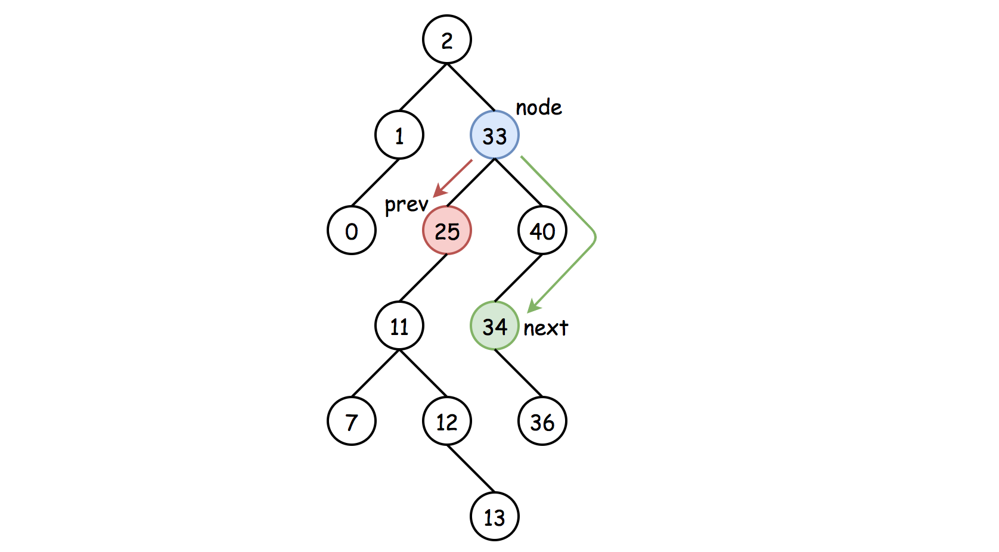
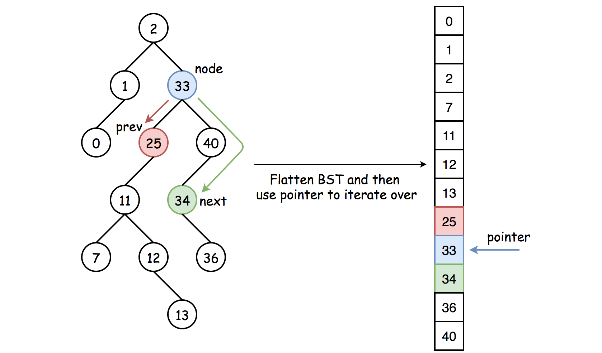
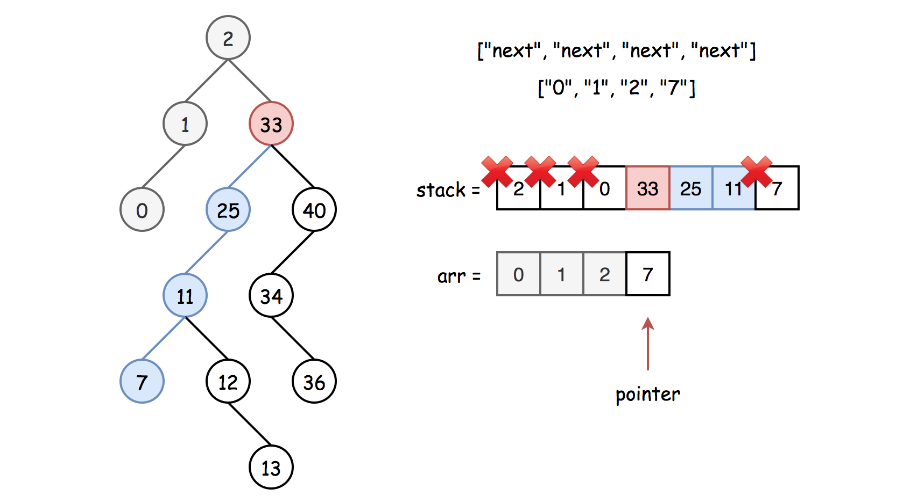
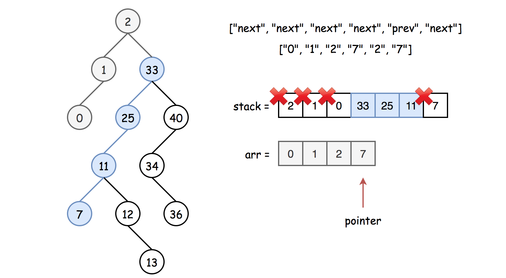

[TOC]

## Solution

---

### Overview

We're asked to implement an iterator, _i.e._, something that can be used to traverse a [container](https://en.wikipedia.org/wiki/Container_(abstract_data_type)) and access its elements without entering into the details of the container implementation.

There are two standard requirements for the iterators, to use them in code easily without impacting time complexity:

- To provide `next` and `prev` operations in a constant time (or in _average_ constant time).

- Do not perform any heavy operations during the iterator's initialization.

Here, the container object is a _binary search tree_ (BST). For the BST, the standard requirement is to return elements in an ascending order. _I.e._, `next` operator returns the smallest node _greater_ than the current one. `Prev` operator returns the largest node _less_ than the current one.


*Figure 1. BST iterator. The next operator returns the smallest node _greater_ than the current one. Prev operator returns the largest node _less_ than the current one.*

An essential property of BST is that _inorder_ traversal of BST is an array sorted in ascending order. Thus, the inorder traversal will be the core of the solution. As a prerequisite, you might want to check the article [Recover Binary Search Tree](https://leetcode.com/problems/recover-binary-search-tree/solution/), there all three types of inorder traversal: recursive, iterative, and Morris are discussed in detail.

<br />
<br />

---
### Approach 1: Flatten Binary Search Tree: Recursive Inorder Traversal

Let's start from the first requirement to the iterator: to provide `next` and `prev` operations in a constant time. For that, we could flatten the binary tree using recursive inorder traversal and then use a pointer to iterate over the elements. The drawback of this approach is that to initialize an iterator, one has to traverse the entire tree, which takes a linear time.


*Figure 2. Approach 1. Flatten BST and then use a pointer to iterate over.*

**Algorithm**

- Constructor: flatten BST into the `arr` list during the iterator initialization. Recursive inorder traversal is simple: follow `Left->Node->Right` direction, _i.e._ do the recursive call for the _left_ child, then do all the business with the node (_i.e._, to add node value into the list), and then do the recursive call for the _right_ child.

- Initialize list length `n` and pointer $pointer = -1$.

- `hasNext`: compare the pointer to the list length: $return pointer < n - 1$.

- `next`: increase the pointer by one and return $\text{arr}[pointer]$.

- `hasPrev`: compare the pointer to zero: `return pointer > 0`.

- `prev`: decrease the pointer by one and return $\text{arr}[pointer]$.

**Implementation**

```python
class BSTIterator:

    def __init__(self, root: TreeNode):
        def inorder(r):
            return inorder(r.left) + [r.val] + inorder(r.right) if r else []
        self.arr = inorder(root)
        self.n = len(self.arr)
        self.pointer = -1

    def hasNext(self) -> bool:
        return self.pointer < self.n - 1

    def next(self) -> int:
        self.pointer += 1
        return self.arr[self.pointer]

    def hasPrev(self) -> bool:
        return self.pointer > 0

    def prev(self) -> int:
        self.pointer -= 1
        return self.arr[self.pointer]
```

**Complexity Analysis**

* Time complexity: $\mathcal{O}(N)$ for the iterator constructor, and $\mathcal{O}(1)$ for `hasNext`, `next`, `hasPrev`, and `prev`.

* Space complexity: $\mathcal{O}(N)$ to store list `arr` with $N$ elements.
<br />
<br />

---
### Approach 2: Follow-up: Iterative Inorder Traversal

The drawback of Approach 1 is that the iterator constructor takes a linear time. For many practical applications, the initialization in constant time is mandatory.

So, the idea is to do almost nothing during the iterator initialization and parse the bare minimum number of nodes at each `next` call. This bare minimum in the worst-case situation is a complete leftmost subtree of the last node. Since we need to stop and then restart tree traversal at any moment, we could use _iterative inorder traversal_ here.


*Figure 3. The worst-case situation: one has to parse the leftmost subtree of the last processed node during the `next` call.*

That makes the time complexity of the `next` call equal to $\mathcal{O}(N)$ because in the worst-case of the skewed tree one has to parse the entire tree, all $N$ nodes.

> However, the important thing to note here is that it's the _worst-case_ time complexity. We only make such a call for the nodes which we've not yet parsed. We could save all parsed nodes in a list and then re-use them if we need to return `next` from the already parsed area of the tree.


*Figure 4. The _average_ situation: the node to return is in the parsed area.*

Thus, the _amortized_ (average) time complexity for the `next` call would still be $\mathcal{O}(1)$, which is perfectly fine for the practical applications.

**Algorithm**

- Constructor in $\mathcal{O}(1)$:

- Initialize the last processed node as root: $last = root$.

- Initialize a list to store already processed nodes: `arr`.

- Initialize service data structure `stack` to be used during the iterative inorder traversal.

- Initialize pointer: $pointer = -1$. This pointer serves as an indicator if we're in the already parsed area or not. We're in the parsed area if $pointer + 1 < len(arr)$.

- `hasNext`:

- Return true if the last node is not null, or the stack is not empty, or we're in the already parsed area: $pointer + 1 < len(arr)$.

- `next`:

- Increase the pointer by 1: `pointer += 1`.

- If we're _not_ in the precomputed part of the tree, parse the bare minimum: the leftmost subtree of the last node:

- Go left till you can, while the last node is not null:

- Push the last node into the stack: `stack.append(last)`.

- Go left: $last = \text{left.last}$.

- Pop the last node out of the stack: $curr = \text{stack.pop}()$.

- Append this node value to the list of the parsed nodes: `arr.append(curr.val)`.

- Go one step to the right: $last = \text{curr.right}$.

- Otherwise, return $\text{arr}[pointer]$.

- `hasPrev`:

- Compare the pointer to zero: `return pointer > 0`.

- `prev`: decrease the pointer by one and return $\text{arr}[pointer]$.

**Implementation**

Note, that [Javadocs recommends using ArrayDeque, and not Stack as a stack implementation](https://docs.oracle.com/javase/8/docs/api/java/util/ArrayDeque.html).

```python
class BSTIterator:

    def __init__(self, root: TreeNode):
        self.last = root
        self.stack, self.arr = [], []
        self.pointer = -1

    def hasNext(self) -> bool:
        return self.stack or self.last or self.pointer < len(self.arr) - 1

    def next(self) -> int:
        self.pointer += 1

        # if the pointer is out of precomputed range
        if self.pointer == len(self.arr):
            # process all predecessors of the last node:
            # go left till you can and then one step right
            while self.last:
                self.stack.append(self.last)
                self.last = self.last.left
            curr = self.stack.pop()
            self.last = curr.right

            self.arr.append(curr.val)

        return self.arr[self.pointer]

    def hasPrev(self) -> bool:
        return self.pointer > 0

    def prev(self) -> int:
        self.pointer -= 1
        return self.arr[self.pointer]
```

**Complexity Analysis**

* Time complexity. Let's look at the complexities one by one:

- $\mathcal{O}(1)$ for the constructor.

- $\mathcal{O}(1)$ for `hasPrev`.

- $\mathcal{O}(1)$ for `prev`.

- $\mathcal{O}(1)$ for `hasNext`.

- $\mathcal{O}(N)$ for `next`.
    In the worst-case of the skewed tree one has to parse the entire tree, all $N$ nodes.

    > However, the important thing to note here is that it's the _worst-case_ time complexity. We only make such a call for the nodes which we've not yet parsed. We save all parsed nodes in a list and then re-use them if we need to return `next` from the already parsed area of the tree.

    Thus, the _amortized_ (average) time complexity for the `next` call would still be $\mathcal{O}(1)$.

* Space complexity: $\mathcal{O}(N)$. The space is taken by `stack` and `arr`. `stack` contains up to $H$ elements, where $H$ is the tree height, and `arr` up to $N$ elements.
<br />
<br />

---