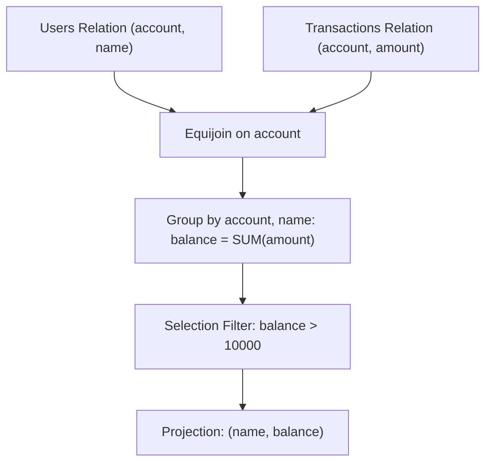

# Guided Example: Bank Account Summary II

This guide traces the aggregation, equijoin, and threshold filtration pipeline that computes current customer balances from atomic transaction logs.

- **Input Tables:**
  - `Users`: `(account, name)`
  - `Transactions`: `(trans_id, account, amount, transacted_on)`
- **Output Relation:** `(name, balance)` for all accounts where $\text{balance} > 10000$

---

## 1. Instance & Teaching Goal

Financial ledger systems record deposits as positive integers and withdrawals as negative integers. To derive a user's net liquidity, the system must sum all ledger entries associated with their account and verify whether their aggregated balance strictly exceeds $10000$.

| Account | Name | Transaction Amounts | Net Balance | Status |
|---|---|---|---|---|
| $900001$ | Alice | $+7000, +7000, -3000$ | $+11000$ | Qualified ($> 10000$) |
| $900002$ | Bob | $+1000$ | $+1000$ | Excluded ($\le 10000$) |
| $900003$ | Charlie | $+6000, +6000, -4000$ | $+8000$ | Excluded ($\le 10000$) |

Our pedagogical goal is to model this tabular consolidation using formal relational algebra, illustrating join alignment, group-wise accumulation, and post-aggregation predicate evaluation.

---

## 2. Conceptual Foundation & Invariants

```
+-------------------------------------------------------------------------+
|                  RELATIONAL ALGEBRA TRANSFORMATION FLOW                 |
|                                                                         |
|  Step 1: Equijoin                                                       |
|    R1 = Users ⋈_{Users.account = Transactions.account} Transactions     |
|                                                                         |
|  Step 2: Grouping & Accumulation                                        |
|    R2 = γ_{account, name; balance = SUM(amount)}(R1)                    |
|                                                                         |
|  Step 3: Post-Aggregation Threshold Selection                           |
|    R3 = σ_{balance > 10000}(R2)                                         |
|                                                                         |
|  Step 4: Final Schema Projection                                        |
|    R_final = Π_{name, balance}(R3)                                      |
+-------------------------------------------------------------------------+
```

| Relational Operator | Input Relations | Produced Attributes | Invariant Property |
|---|---|---|---|
| Equijoin ($\bowtie_{\text{account}}$) | $\text{Users}, \text{Transactions}$ | $\text{account}, \text{name}, \text{trans\_id}, \text{amount}, \text{transacted\_on}$ | Matches ledger events with user identity keys |
| Grouped Aggregate ($\gamma$) | Join tuples | $\text{account}, \text{name}, \text{balance}$ | Computes scalar sum of signed deltas per account |
| Selection ($\sigma$) | Grouped records | $\text{account}, \text{name}, \text{balance}$ | Filters tuples where $\text{balance} > 10000$ |
| Projection ($\Pi$) | Selected records | $\text{name}, \text{balance}$ | Formats output schema |

> **Threshold Filtration Invariant.** Any account whose net accumulated sum $\sum \text{amount}$ is less than or equal to $10000$ is strictly eliminated from the output. Inactive users with zero transactions are not emitted since an inner join discards accounts lacking corresponding transaction rows.



---

## 3. Step-by-Step Worked Execution

### Step 1: Relational Equijoin ($R_1 = \text{Users} \bowtie_{\text{account}} \text{Transactions}$)

We combine the user entity table with individual transaction records matching on primary-foreign key pair $\text{account}$.

| Account | Name | Trans ID | Amount | Transacted On |
|---|---|---|---|---|
| $900001$ | Alice | $1$ | $+7000$ | 2020-08-01 |
| $900001$ | Alice | $2$ | $+7000$ | 2020-09-01 |
| $900001$ | Alice | $3$ | $-3000$ | 2020-09-02 |
| $900002$ | Bob | $4$ | $+1000$ | 2020-09-12 |
| $900003$ | Charlie | $5$ | $+6000$ | 2020-08-07 |
| $900003$ | Charlie | $6$ | $+6000$ | 2020-09-07 |
| $900003$ | Charlie | $7$ | $-4000$ | 2020-09-11 |

---

### Step 2: Grouping and Accumulation ($R_2 = \gamma_{\text{account}, \text{name}; \text{balance} = \sum(\text{amount})}(R_1)$)

Tuples are partitioned by grouping key $(\text{account}, \text{name})$, computing the algebraic sum of all transaction amounts.

- For Alice ($900001$):
  $$\text{balance} = 7000 + 7000 + (-3000) = 11000$$
- For Bob ($900002$):
  $$\text{balance} = 1000$$
- For Charlie ($900003$):
  $$\text{balance} = 6000 + 6000 + (-4000) = 8000$$

| Account | Name | Partial Amounts | Net Balance |
|---|---|---|---|
| $900001$ | Alice | $\{+7000, +7000, -3000\}$ | $11000$ |
| $900002$ | Bob | $\{+1000\}$ | $1000$ |
| $900003$ | Charlie | $\{+6000, +6000, -4000\}$ | $8000$ |

---

### Step 3: Post-Aggregation Selection & Projection ($R_3 = \sigma_{\text{balance} > 10000}(R_2)$ and $R_{\text{final}} = \Pi_{\text{name}, \text{balance}}(R_3)$)

We evaluate the predicate $\text{balance} > 10000$:
- Alice: $11000 > 10000 \implies \text{True}$. Included.
- Bob: $1000 > 10000 \implies \text{False}$. Excluded.
- Charlie: $8000 > 10000 \implies \text{False}$. Excluded.

Projecting attributes $(\text{name}, \text{balance})$ yields the single qualifying record.

---

## 4. Complete Execution Trace

| Account ID | Customer Name | Transaction History List | Derived Balance | $\text{balance} > 10000$ | Emitted Record |
|---|---|---|---|---|---|
| $900001$ | Alice | $[+7000, +7000, -3000]$ | $11000$ | Yes ($11000 > 10000$) | `("Alice", 11000)` |
| $900002$ | Bob | $[+1000]$ | $1000$ | No ($1000 \le 10000$) | *Suppressed* |
| $900003$ | Charlie | $[+6000, +6000, -4000]$ | $8000$ | No ($8000 \le 10000$) | *Suppressed* |

---

## 5. Algorithmic Correctness

**Soundness.** Every customer emitted in the final relation corresponds to an account whose transaction sum strictly exceeds $10000$. Because the inner join enforces referential alignment on `account`, each transaction is mapped to its verified owner. The linear summation over integer amounts correctly reflects credit deposits and debit withdrawals according to standard additive identity. The predicate filter $\sigma_{\text{balance} > 10000}$ strictly rejects any balance equal to or below the cutoff.

**Completeness.** By aggregating across all matching rows in the `Transactions` relation, no ledger entries are omitted for any customer. Because the grouping partitions the relation exhaustively by account identifier, each user is evaluated exactly once, ensuring all accounts satisfying the qualification threshold are captured.

---

## 6. Traps This Instance Exposes

- **Strict vs. Non-Strict Inequality:** The problem specifies balance strictly greater than $10000$ ($> 10000$). Using greater-than-or-equal ($\ge 10000$) incorrectly retains boundary accounts with balance exactly $10000$.
- **Pre-aggregation vs. Post-aggregation Filtering:** Filtering amounts prior to grouping ($\sigma_{\text{amount} > 10000}$) would discard valid transactions like Alice's multiple $7000$ deposits, preventing their cumulative sum from reaching $11000$. Aggregation must precede threshold selection.
- **Negative Amount Handling:** Debit withdrawals reduce total balance; treating negative values as absolute additions would distort customer solvency.

---

## 7. Complexity Derivation

- **Time Complexity:** $\mathcal{O}(U + T)$ expected using hash-based equi-join and hash aggregation, where $U = |\text{Users}|$ is the number of user accounts and $T = |\text{Transactions}|$ is the number of ledger entries. With B-tree index scans on `account`, join and grouping take $\mathcal{O}(T \log U)$.
- **Auxiliary Space Complexity:** $\mathcal{O}(U)$ auxiliary memory to store hash table buckets for unique accounts during intermediate group consolidation.
