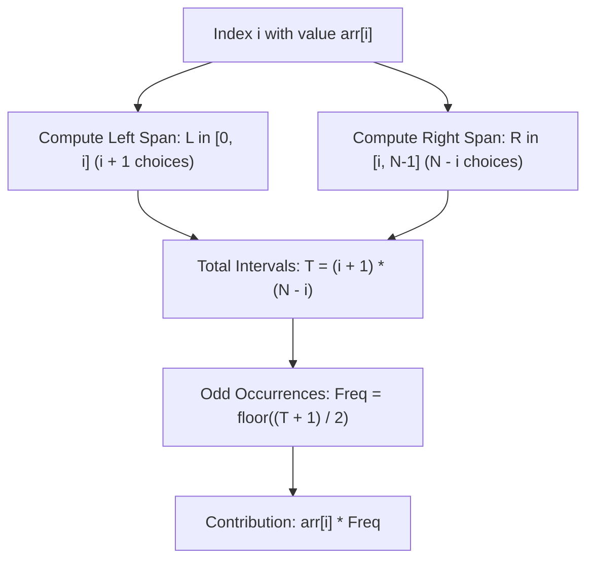

# Guided Example: Sum of All Odd Length Subarrays

This guide walks through both the combinatorial contribution counting and parity dynamic programming methods for accumulating the sum of all odd-length contiguous subarrays in linear time.

- **Input Array:** `arr = [1, 4, 2, 5, 3]`
- **Target Value:** `58`

---

## 1. Instance & Teaching Goal

A contiguous subarray is defined by an inclusive index interval $[L, R]$ where $0 \le L \le R < N$. The subarray length is $K = R - L + 1$. We seek the total sum of all subarrays where $K \equiv 1 \pmod 2$.

For `arr = [1, 4, 2, 5, 3]` ($N = 5$):
- **Length 1:** $[1], [4], [2], [5], [3] \implies 1 + 4 + 2 + 5 + 3 = 15$
- **Length 3:** $[1, 4, 2] (7) + [4, 2, 5] (11) + [2, 5, 3] (10) \implies 28$
- **Length 5:** $[1, 4, 2, 5, 3] (15) \implies 15$
- **Total Sum:** $15 + 28 + 15 = 58$

A brute-force evaluation inspects $\mathcal{O}(N^2)$ subarrays, taking $\mathcal{O}(N^3)$ or $\mathcal{O}(N^2)$ time. Our teaching goal is to demonstrate how element-level frequency aggregation determines the exact multiplier for each $\text{arr}[i]$ in $\mathcal{O}(1)$ operations per element.

---

## 2. Conceptual Foundation & Invariants

```
+-------------------------------------------------------------------------+
|                  COMBINATORIAL MULTIPLIER DERIVATION                    |
|                                                                         |
|  For index i in arr[0 .. N-1]:                                          |
|    Left endpoint choices:  L in [0, i]      => (i + 1) choices          |
|    Right endpoint choices: R in [i, N-1]    => (N - i) choices          |
|    Total subarrays containing arr[i]: T = (i + 1) * (N - i)             |
|                                                                         |
|  Parity Condition: Subarray length (R - L + 1) is ODD                   |
|                    <=> (R - L) is EVEN                                  |
|                    <=> R and L have identical parity                    |
|                                                                         |
|  Total Odd Subarrays containing arr[i]:                                 |
|    Count(i) = ceil( (i + 1) * (N - i) / 2 )                             |
|             = floor( ((i + 1) * (N - i) + 1) / 2 )                      |
+-------------------------------------------------------------------------+
```

| Parameter | Mathematical Formulation | Role for Element $\text{arr}[i]$ |
|---|---|---|
| Left Options ($C_L$) | $i + 1$ | Count of valid start indices $L \le i$ |
| Right Options ($C_R$) | $N - i$ | Count of valid end indices $R \ge i$ |
| Total Subarrays ($T_i$) | $(i + 1) \cdot (N - i)$ | All contiguous intervals covering index $i$ |
| Odd Subarrays ($\text{Freq}_i$) | $\lfloor (T_i + 1) / 2 \rfloor$ | Number of odd-length intervals covering index $i$ |
| Net Contribution | $\text{arr}[i] \cdot \text{Freq}_i$ | Total value added to global answer by $\text{arr}[i]$ |

> **Parity Equipartition Invariant.** For any interval of contiguous product combinations $(i + 1) \times (N - i)$, alternating parity of endpoints ensures that odd-length subarrays and even-length subarrays differ in count by at most $1$. Whenever the total product $T_i$ is odd, the odd-length count is strictly $(T_i + 1) / 2$; when $T_i$ is even, odd-length and even-length counts are each exactly $T_i / 2$.



---

## 3. Step-by-Step Worked Execution

We compute the odd-subarray frequency $\text{Freq}_i = \lfloor ((i + 1)(N - i) + 1) / 2 \rfloor$ across each index $i \in [0, 4]$ with $N = 5$:

### Index $0$: $\text{arr}[0] = 1$
- Left span choices: $L \in \{0\} \implies C_L = 1$.
- Right span choices: $R \in \{0, 1, 2, 3, 4\} \implies C_R = 5$.
- Total covering subarrays: $T_0 = 1 \times 5 = 5$.
- Odd-length occurrences: $\lfloor (5 + 1) / 2 \rfloor = 3$.
- Subarrays: $[1]$, $[1, 4, 2]$, $[1, 4, 2, 5, 3]$.
- Contribution: $1 \times 3 = 3$.

---

### Index $1$: $\text{arr}[1] = 4$
- Left span choices: $L \in \{0, 1\} \implies C_L = 2$.
- Right span choices: $R \in \{1, 2, 3, 4\} \implies C_R = 4$.
- Total covering subarrays: $T_1 = 2 \times 4 = 8$.
- Odd-length occurrences: $\lfloor (8 + 1) / 2 \rfloor = 4$.
- Subarrays: $[4]$, $[1, 4, 2]$, $[4, 2, 5]$, $[1, 4, 2, 5, 3]$.
- Contribution: $4 \times 4 = 16$.

---

### Index $2$: $\text{arr}[2] = 2$
- Left span choices: $L \in \{0, 1, 2\} \implies C_L = 3$.
- Right span choices: $R \in \{2, 3, 4\} \implies C_R = 3$.
- Total covering subarrays: $T_2 = 3 \times 3 = 9$.
- Odd-length occurrences: $\lfloor (9 + 1) / 2 \rfloor = 5$.
- Subarrays: $[2]$, $[1, 4, 2]$, $[4, 2, 5]$, $[2, 5, 3]$, $[1, 4, 2, 5, 3]$.
- Contribution: $2 \times 5 = 10$.

---

### Index $3$: $\text{arr}[3] = 5$
- Left span choices: $L \in \{0, 1, 2, 3\} \implies C_L = 4$.
- Right span choices: $R \in \{3, 4\} \implies C_R = 2$.
- Total covering subarrays: $T_3 = 4 \times 2 = 8$.
- Odd-length occurrences: $\lfloor (8 + 1) / 2 \rfloor = 4$.
- Contribution: $5 \times 4 = 20$.

---

### Index $4$: $\text{arr}[4] = 3$
- Left span choices: $L \in \{0, 1, 2, 3, 4\} \implies C_L = 5$.
- Right span choices: $R \in \{4\} \implies C_R = 1$.
- Total covering subarrays: $T_4 = 5 \times 1 = 5$.
- Odd-length occurrences: $\lfloor (5 + 1) / 2 \rfloor = 3$.
- Contribution: $3 \times 3 = 9$.

---

## 4. Complete Execution Trace

| Index $i$ | Value $\text{arr}[i]$ | $C_L = i + 1$ | $C_R = N - i$ | $T_i = C_L \cdot C_R$ | Odd Multiplier $\text{Freq}_i$ | Term Added | Cumulative Total |
|---|---|---|---|---|---|---|---|
| $0$ | $1$ | $1$ | $5$ | $5$ | $3$ | $1 \times 3 = 3$ | $3$ |
| $1$ | $4$ | $2$ | $4$ | $8$ | $4$ | $4 \times 4 = 16$ | $19$ |
| $2$ | $2$ | $3$ | $3$ | $9$ | $5$ | $2 \times 5 = 10$ | $29$ |
| $3$ | $5$ | $4$ | $2$ | $8$ | $4$ | $5 \times 4 = 20$ | $49$ |
| $4$ | $3$ | $5$ | $1$ | $5$ | $3$ | $3 \times 3 = 9$ | $58$ |

---

## 5. Algorithmic Correctness

**Soundness.** By the distributive law of addition over sums:
$$\sum_{\text{odd } [L, R]} \sum_{k=L}^R \text{arr}[k] = \sum_{k=0}^{N-1} \text{arr}[k] \cdot |\{[L, R] : L \le k \le R \text{ and } (R - L + 1) \equiv 1 \pmod 2\}|$$
Every subarray $[L, R]$ covering index $k$ corresponds to an independent choice of $L \in [0, k]$ and $R \in [k, N-1]$. The length $R - L + 1$ is odd if and only if $L$ and $R$ share the same parity. Because $L$ starts at $0$, the count of even $L$ choices is $\lfloor k/2 \rfloor + 1$ and odd $L$ choices is $\lfloor (k + 1)/2 \rfloor$. Similarly, $R$ choices partition into even and odd indices. The algebraic sum of matching parity pairs strictly evaluates to $\lfloor ((k+1)(N-k) + 1)/2 \rfloor$. Thus, each element $\text{arr}[k]$ is weighted by its exact occurrence frequency.

**Completeness.** Every contiguous odd-length subarray contains at least one index and has well-defined endpoints $0 \le L \le R < N$. Because the summation iterates over all indices $k \in [0, N-1]$ and accounts for all intervals covering each $k$, no subarray or element occurrence is omitted.

---

## 6. Traps This Instance Exposes

- **Integer Truncation Error:** When evaluating $\text{Freq}_i$, computing $(i + 1)(N - i) / 2$ with floor division without adding $1$ first drops $1$ occurrence whenever $(i + 1)(N - i)$ is odd. For example, at $i = 0$, $5 / 2 = 2$ instead of $3$, undercounting by $1$.
- **Redundant Nested Loop Accumulation:** Directly evaluating all triples $(L, R, k)$ leads to $\mathcal{O}(N^3)$ complexity, which triggers performance bottlenecks on large input arrays.
- **Prefix Sum Parity Off-by-One:** When implementing the DP parity variant, failing to distinguish between singleton odd lengths and extended even lengths causes incorrect state propagation at boundary step $i = 0$.

---

## 7. Complexity Derivation

- **Time Complexity:** $\mathcal{O}(N)$, where $N$ is the length of `arr`. A single sequential pass calculates the arithmetic multiplier for each index in $\mathcal{O}(1)$ basic mathematical operations.
- **Auxiliary Space Complexity:** $\mathcal{O}(1)$ beyond input storage, as only scalar accumulators (`ans`, index loop variables) are maintained throughout execution.
