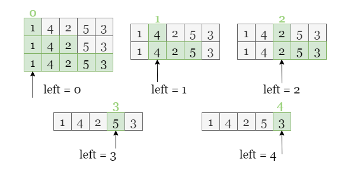
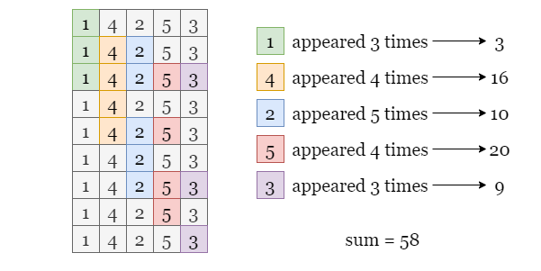
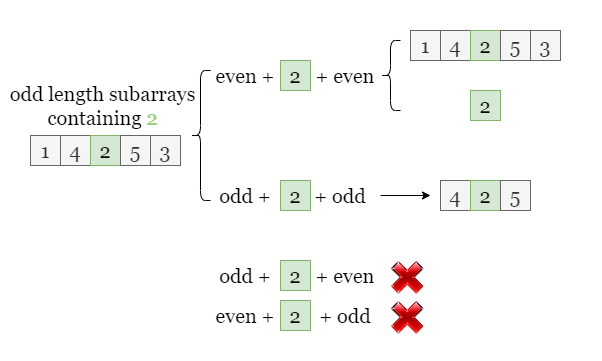
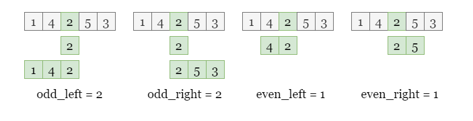

[TOC]

## Solution

---

### Approach 1: Brute Force

#### Intuition

Let's start with brute force, the most intuitive method. We find each of the subarrays one by one, and get the sum of the current subarray if it has an odd length.

<br>

#### Algorithm

1) Initialize $answer = 0$.
2) Iterate over the left index `left` of subarrays.
3) For every subarray start at index `left`, iterate over every index `right` to fix the end of subarray.
4) For each subarray `(left, right)`, if its length is odd:
- Iterate over this subarray and get its sum $\text{current}_{sum}$.
- Increment `answer` by $\text{current}_{sum}$.

#### Implementation

```python
class Solution:
    def sumOddLengthSubarrays(self, arr: List[int]) -> int:
        n = len(arr)
        answer = 0

        for left in range(n):
            for right in range(left, n):
                if (right - left + 1) % 2 == 1:
                    current_sum = 0
                    for index in range(left, right + 1):
                        current_sum += arr[index]
                    answer += current_sum

        return answer
```

#### Complexity Analysis

Let $n$ be the size of the input array `arr`.

* Time complexity: $O(n^3)$

- We have three nested loops, the first loop for the left index `left`, the second loop for the right index `right`, and the third loop for the index `currentIndex` between `left` and `right`.
- For each odd-length subarray, we need to get its sum and update `answer` after the third iteration.
- Therefore, the overall time complexity is $O(n^3)$.

* Space complexity: $O(1)$

- We only need to update two variables:
- $\text{current}_{sum}$ the sum of the current subarray.
- `answer`, the sum of all odd-length subarrays.

    which only takes constant space.

<br/>

---

### Approach 2: Two Loops

#### Intuition

Let's try a better method to reduce the workload!

For a starting index `left`, the difference between each of the two adjacent right indices is 1. In other words, if the current subarray is `[left, right]`, the next subarray (if it exists) is `[left, right + 1]`. Therefore, we can get the sum of the next subarray by adding $arr[right + 1]$ to the sum of the previous subarray. If the current subarray has an odd length, we can increment `answer` by its sum, as shown in the picture below.



<br>

#### Algorithm

1) Initialize `answer` as 0.
2) Iterate over `left`, the left index of the subarray.
3) For every subarray start at index `left`, we initialize $\text{current}_{sum} = 0$. We iterate over index `right` to fix the end of each subarray, and calculate the sum of this subarray ($\text{current}_{sum}$) by adding $\text{arr}[right]$ to the previous $\text{current}_{sum}$. If the current subarray has an odd length, we increment `answer` by $\text{current}_{sum}$.

#### Implementation

```python
class Solution:
    def sumOddLengthSubarrays(self, arr: List[int]) -> int:
        n = len(arr)
        answer = 0

        for left in range(n):
            current_sum = 0
            for right in range(left, n):
                current_sum += arr[right]
                answer += current_sum if (right - left + 1) % 2 == 1 else 0
        return answer
```

#### Complexity Analysis

Let $n$ be the size of the input array `arr`.

* Time complexity: $O(n^2)$

- We have two nested loops, the first loop for the left index `left`, the second loop for the right index `right`.
- For each odd-length subarray, we need to increment `answer` by its sum which takes constant time.
- Therefore, the overall time complexity is $O(n^2)$.

* Space complexity: $O(1)$

- We only need to update two variables:
- $\text{current}_{sum}$ the sum of the current subarray.
- `answer`, the sum of all odd-length subarrays.

    which only takes constant space.

<br/>

---

### Approach 3: Check the occurrence of each index

#### Intuition

Instead of finding all odd-length subarrays, we can count the number of occurrences of each integer in all odd-length subarrays. For example, if $\text{arr}[i]$ has appeared `k` times, it contributes to the total sum by $\text{arr}[i] * k$.



> How to calculate the occurrence of each index?

Let's find the pattern behind this: since the current subarray containing $\text{arr}[i]$ has an odd-length, the number of elements without $\text{arr}[i]$ must be even, indicating the number of elements to the left and right side of $\text{arr}[i]$ must be **both even** or **both odd**, as shown in the picture below.



Therefore, we are looking for:

- $\text{odd}_{left}$, the number of odd-length subarrays starting from `i` on `i`'s left.
- $\text{odd}_{right}$, the number of odd-length subarrays starting from `i` on `i`'s right.
- $\text{even}_{left}$, the number of even-length subarrays starting from `i` on `i`'s left.
- $\text{even}_{right}$, the number of even-length subarrays starting from `i` on `i`'s right.

Notice that:

- There are $i + 1$ such subarrays to its left where $(i + 1) / 2$ of them have odd-length and the rest have even-length.s
- There are $n - 1 - i$ such subarrays to its right where $(n - i) / 2$ of them have odd-length and the rest have even-length.



Once we find all the four numbers above, we can calculate the occurrence of $\text{arr}[i]$ in odd-length arrays as $\text{odd}_{left} * \text{odd}_{right} + \text{even}_{left} * \text{even}_{right}$.

<br>

#### Algorithm

1) Initialize `answer` as 0.
2) Iterate over `arr`, calculate the occurrence of each index `i`:

- $\text{odd}_{left} = left / 2 + 1$
- $\text{odd}_{right} = (n - i - 1) / 2 + 1$
- $\text{even}_{left} = (i + 1) / 2$
- $\text{even}_{right} = (n - i) / 2$

    Add the current element $\text{arr}[i]$ $(\text{odd}_{left} * \text{odd}_{right} + \text{even}_{left} * \text{even}_{right})$ times in `answer`.

#### Implementation

```python
class Solution:
    def sumOddLengthSubarrays(self, arr: List[int]) -> int:
        n = len(arr)
        answer = 0

        for i, a in enumerate(arr):
            left, right = i, n - i - 1
            answer += a * (left // 2 + 1) * (right // 2 + 1)
            answer += a * ((left + 1) // 2) * ((right + 1) // 2)
        return answer
```

#### Complexity Analysis

Let $n$ be the size of the input array `arr`.

* Time complexity: $O(n)$

- We only need one iteration over `arr`.
- At each step `i`, we need to calculate the occurrence of $\text{arr}[i]$ in all the odd-length subarrays, it takes constant time.
- Therefore, the overall time complexity is $O(n)$.

* Space complexity: $O(1)$

- We only need to update one variable `answer`.

<br/>