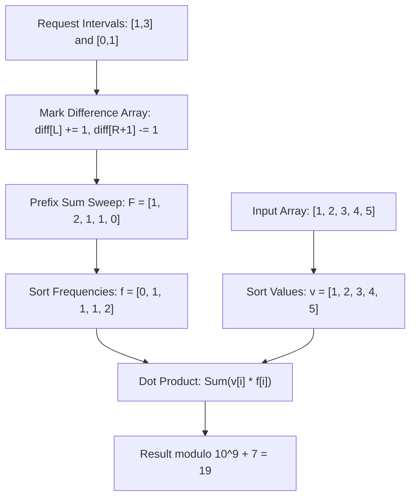

# Guided Example: Maximum Sum Obtained of Any Permutation

This guide demonstrates how difference-array interval accumulation and the Rearrangement Inequality find the optimal permutation to maximize total query sum over overlapping index requests.

- **Input Array:** `nums = [1, 2, 3, 4, 5]`
- **Request Intervals:** `requests = [[1, 3], [0, 1]]`
- **Modulo:** $10^9 + 7$
- **Target Value:** `19`

---

## 1. Instance & Teaching Goal

We are given an array of numbers and a set of inclusive index ranges $[L_k, R_k]$. Each request query sums the elements situated between $L_k$ and $R_k$. Because we are permitted to permute the elements of `nums` arbitrarily prior to query execution, each index $i$ acts as a multiplier weighted by how many query intervals contain it.

If index $i$ is covered $F_i$ times, placing value $v_i$ at index $i$ contributes $v_i \cdot F_i$ to the global total:
$$\text{Total Sum} = \sum_{i=0}^{N-1} v_i \cdot F_i$$

Our teaching goal is to trace:
1. Constructing query coverage frequencies in $\mathcal{O}(N + R)$ using a difference array.
2. Applying the Rearrangement Inequality by pairing the highest array values with the most frequently queried positions.

---

## 2. Conceptual Foundation & Invariants

```
+-------------------------------------------------------------------------+
|                DIFFERENCE ARRAY & REARRANGEMENT PIPELINE                |
|                                                                         |
|  1. Range Marking:                                                      |
|     For each [L, R]: diff[L] += 1; if R + 1 < N: diff[R + 1] -= 1       |
|                                                                         |
|  2. Prefix Accumulation:                                                |
|     freq[i] = diff[0] + ... + diff[i]                                   |
|                                                                         |
|  3. Greedy Sorting Pairing:                                             |
|     Sort nums:  v_0 <= v_1 <= ... <= v_{N-1}                            |
|     Sort freq:  f_0 <= f_1 <= ... <= f_{N-1}                            |
|                                                                         |
|  4. Dot Product:                                                        |
|     Max Sum = Sum(v_k * f_k) mod (10^9 + 7)                             |
+-------------------------------------------------------------------------+
```

| Component | Mathematical Representation | Operational Function |
|---|---|---|
| Difference Vector ($\Delta$) | $\Delta[L] \mathrel{+}= 1, \Delta[R+1] \mathrel{-}= 1$ | Records net rate changes of interval boundaries |
| Coverage Count ($F$) | $F[i] = \sum_{k=0}^i \Delta[k]$ | Total number of query requests covering index $i$ |
| Ordered Weights ($v$) | $\text{sort}(\text{nums})$ in non-decreasing order | Available values to distribute |
| Ordered Frequencies ($f$) | $\text{sort}(F)$ in non-decreasing order | Frequencies of all array slots |

> **Rearrangement Inequality Invariant.** For any two sequences sorted in identical monotonic order $x_0 \le x_1 \le \dots \le x_{N-1}$ and $y_0 \le y_1 \le \dots \le y_{N-1}$, the scalar product $\sum_{k=0}^{N-1} x_k y_k$ is strictly greater than or equal to any permuted product $\sum_{k=0}^{N-1} x_k y_{\pi(k)}$. Assigning the largest numeric values to positions with the greatest coverage frequency maximizes the sum.



---

## 3. Step-by-Step Worked Execution

### Step 1: Difference Array Range Updates

Initialize difference array $\Delta$ of length $N = 5$ with zeros: $\Delta = [0, 0, 0, 0, 0]$.

- Process request $[1, 3]$:
  - Increment at start: $\Delta[1] \leftarrow \Delta[1] + 1 = 1$.
  - Decrement past end ($R + 1 = 4 < 5$): $\Delta[4] \leftarrow \Delta[4] - 1 = -1$.
  - Current state: $\Delta = [0, 1, 0, 0, -1]$.

- Process request $[0, 1]$:
  - Increment at start: $\Delta[0] \leftarrow \Delta[0] + 1 = 1$.
  - Decrement past end ($R + 1 = 2 < 5$): $\Delta[2] \leftarrow \Delta[2] - 1 = -1$.
  - Final difference array: $\Delta = [1, 1, -1, 0, -1]$.

---

### Step 2: Prefix Integration to Compute Coverage Frequencies

Compute the running prefix sum $F[i] = F[i-1] + \Delta[i]$:
- $i = 0$: $F[0] = \Delta[0] = 1$.
- $i = 1$: $F[1] = F[0] + \Delta[1] = 1 + 1 = 2$.
- $i = 2$: $F[2] = F[1] + \Delta[2] = 2 + (-1) = 1$.
- $i = 3$: $F[3] = F[2] + \Delta[3] = 1 + 0 = 1$.
- $i = 4$: $F[4] = F[3] + \Delta[4] = 1 + (-1) = 0$.

Raw coverage array: $F = [1, 2, 1, 1, 0]$.

---

### Step 3: Sorting and Greedy Pairing

- Sorted coverage frequencies:
  $$f = [0, 1, 1, 1, 2]$$
- Sorted values from `nums`:
  $$v = [1, 2, 3, 4, 5]$$

By pairing element by element:
- Pair 0: $v_0 \times f_0 = 1 \times 0 = 0$
- Pair 1: $v_1 \times f_1 = 2 \times 1 = 2$
- Pair 2: $v_2 \times f_2 = 3 \times 1 = 3$
- Pair 3: $v_3 \times f_3 = 4 \times 1 = 4$
- Pair 4: $v_4 \times f_4 = 5 \times 2 = 10$

Summing all terms: $0 + 2 + 3 + 4 + 10 = 19$.
$19 \pmod{10^9 + 7} = 19$.

---

## 4. Complete Execution Trace

| Step | Operation / Element Pair | Active State / Indices | Multiplier / Term Added | Running Sum |
|---|---|---|---|---|
| 1 | Register Interval $[1, 3]$ | $\Delta[1] \mathrel{+}= 1, \Delta[4] \mathrel{-}= 1$ | Difference update | $0$ |
| 2 | Register Interval $[0, 1]$ | $\Delta[0] \mathrel{+}= 1, \Delta[2] \mathrel{-}= 1$ | Difference update | $0$ |
| 3 | Compute Prefix Sums | $F = [1, 2, 1, 1, 0]$ | Integrated frequencies | $0$ |
| 4 | Sort Arrays | $v = [1, 2, 3, 4, 5], f = [0, 1, 1, 1, 2]$ | Order established | $0$ |
| 5 | Pair $k = 0$ | $v_0 = 1, f_0 = 0$ | $1 \times 0 = 0$ | $0$ |
| 6 | Pair $k = 1$ | $v_1 = 2, f_1 = 1$ | $2 \times 1 = 2$ | $2$ |
| 7 | Pair $k = 2$ | $v_2 = 3, f_2 = 1$ | $3 \times 1 = 3$ | $5$ |
| 8 | Pair $k = 3$ | $v_3 = 4, f_3 = 1$ | $4 \times 1 = 4$ | $9$ |
| 9 | Pair $k = 4$ | $v_4 = 5, f_4 = 2$ | $5 \times 2 = 10$ | $19$ |
| 10 | Final Modulo | $19 \pmod{10^9 + 7}$ | Modular remainder | $19$ |

---

## 5. Algorithmic Correctness

**Soundness.** Let $F_i$ be the number of query intervals containing position $i$. For any permutation $\pi$, the total sum is given by $\sum_{i=0}^{N-1} \text{nums}[\pi(i)] \cdot F_i$. By the classical Rearrangement Inequality, for any two real sequences $a_0 \le a_1 \le \dots \le a_{N-1}$ and $b_0 \le b_1 \le \dots \le b_{N-1}$, the scalar dot product $\sum_{k=0}^{N-1} a_k b_{\sigma(k)}$ achieves its global maximum when permutation $\sigma$ is the identity permutation (monotonic sorting alignment). Any transposition of values that places a larger element at an index with lower frequency reduces the total product by $(a_j - a_i)(b_j - b_i) \ge 0$.

**Completeness.** The difference array method captures all interval boundaries. Incrementing at $L$ and decrementing at $R+1$ guarantees that the prefix sum at index $i$ includes $+1$ for every interval where $L \le i$ and eliminates that $+1$ when $i \ge R + 1$. Thus, every query contribution is accounted for with zero omission.

---

## 6. Traps This Instance Exposes

- **Boundary Decrement Offset:** In inclusive intervals $[L, R]$, the interval still covers index $R$. Decrementing at $R$ instead of $R + 1$ truncates the request coverage one position too early.
- **Index Out-of-Bounds on Terminal Boundary:** When $R = N - 1$, the decrement would land at index $N$. Attempting to write $\Delta[N]$ causes array out-of-bounds unless guarded by an explicit condition $R + 1 < N$.
- **Quadratic Point Updates:** Directly iterating across every index in $[L, R]$ for each request scales as $\mathcal{O}(R \cdot N)$, leading to execution timeouts on datasets where $N, R \approx 10^5$.

---

## 7. Complexity Derivation

- **Time Complexity:** $\mathcal{O}(R + N \log N)$, where $R$ is the number of request intervals and $N$ is the length of `nums`. Marking range boundaries takes $\mathcal{O}(R)$, prefix integration takes $\mathcal{O}(N)$, sorting both arrays takes $\mathcal{O}(N \log N)$, and the final dot product takes $\mathcal{O}(N)$.
- **Auxiliary Space Complexity:** $\mathcal{O}(N)$ to store the difference array $\Delta$ and the computed frequencies $F$.
