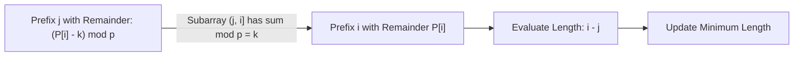

# Guided Example: Make Sum Divisible by P

This guide traces the modular arithmetic and prefix hash map technique used to locate the shortest contiguous subarray whose removal makes the remaining sum divisible by a modulus $p$.

- **Input Array:** `nums = [3, 1, 4, 2]`
- **Modulus:** $p = 6$
- **Target Value:** `1` (removing single element subarray `[4]`)

---

## 1. Instance & Teaching Goal

Given an array of positive integers and a divisor $p$, we aim to remove the shortest contiguous subarray such that the sum of the remaining elements is divisible by $p$. Removing the entire array is explicitly forbidden.

For `nums = [3, 1, 4, 2]`, the total sum is $S = 3 + 1 + 4 + 2 = 10$.
Evaluating the remainder modulo $p = 6$:
$$k = S \bmod p = 10 \bmod 6 = 4$$

To leave a remaining sum congruent to $0 \pmod p$, the removed subarray sum $X$ must satisfy:
$$(S - X) \equiv 0 \pmod p \iff X \equiv S \equiv 4 \pmod 6$$

Our teaching goal is to trace how prefix sum remainders and a hash table of latest occurrence indices identify the optimal subarray in $\mathcal{O}(N)$ time.

---

## 2. Conceptual Foundation & Invariants

```
+-------------------------------------------------------------------------+
|                  PREFIX MODULO DIFFERENCE RELATION                      |
|                                                                         |
|  Let P[i] = (nums[0] + ... + nums[i]) mod p                             |
|  The sum of subarray nums[j+1 .. i] is:                                 |
|      X = (P[i] - P[j]) mod p                                            |
|                                                                         |
|  We require X = k:                                                      |
|      (P[i] - P[j]) mod p = k                                            |
|      P[j] = (P[i] - k + p) mod p                                        |
|                                                                         |
|  To minimize removed length (i - j), we must maximize j.                |
|  Strategy: Store the LATEST index seen for each remainder in a map.     |
+-------------------------------------------------------------------------+
```

| Parameter | Mathematical Expression | Function in Search |
|---|---|---|
| Total Remainder ($k$) | $(\sum \text{nums}) \bmod p$ | Deficit remainder that must be evacuated |
| Current Remainder ($P[i]$) | $(\sum_{m=0}^i \text{nums}[m]) \bmod p$ | Cumulative remainder through index $i$ |
| Target Prior Remainder | $(P[i] - k + p) \bmod p$ | Remainder needed at prefix boundary $j$ |
| Candidate Length | $i - j$ | Size of contiguous window to remove |
| Sentinel Key | `map[0] = -1` | Enables valid prefix removals starting at index $0$ |

> **Greedy Recency Invariant.** Storing only the most recent index for each prefix remainder preserves the shortest candidate interval ending at any subsequent index $i$. For any fixed ending point $i$, a larger prefix boundary $j$ strictly minimizes the window length $i - j$.



---

## 3. Step-by-Step Worked Execution

### Initialization
- Total sum $S = 10 \implies k = 10 \bmod 6 = 4 \ne 0$.
- Prefix hash table initialized with sentinel: `last = {0: -1}`.
- Running remainder `cur = 0`, best length `ans = infinity`.

---

### Step 1: Process Index $0$ ($\text{nums}[0] = 3$)
- Update running remainder:
  $$\text{cur} = (0 + 3) \bmod 6 = 3$$
- Calculate target prior remainder:
  $$\text{target} = (3 - 4 + 6) \bmod 6 = 5$$
- Lookup in `last`: $5 \notin \text{last}$. No valid window ending at $0$.
- Record index: `last[3] = 0`.

| Variable | State |
|---|---|
| Current Index $i$ | $0$ ($\text{val} = 3$) |
| Running Remainder $\text{cur}$ | $3$ |
| Target Remainder | $5$ |
| Match Found | None |
| Map State | `{-1: 0, 3: 0}` |

---

### Step 2: Process Index $1$ ($\text{nums}[1] = 1$)
- Update running remainder:
  $$\text{cur} = (3 + 1) \bmod 6 = 4$$
- Calculate target prior remainder:
  $$\text{target} = (4 - 4 + 6) \bmod 6 = 0$$
- Lookup in `last`: $0 \in \text{last}$ with index $j = -1$.
- Candidate window length:
  $$i - j = 1 - (-1) = 2$$
  Subarray: $\text{nums}[0..1] = [3, 1]$, sum $= 4 \equiv 4 \pmod 6$.
- Update minimum: $\text{ans} = \min(\infty, 2) = 2$.
- Record index: `last[4] = 1`.

---

### Step 3: Process Index $2$ ($\text{nums}[2] = 4$)
- Update running remainder:
  $$\text{cur} = (4 + 4) \bmod 6 = 8 \bmod 6 = 2$$
- Calculate target prior remainder:
  $$\text{target} = (2 - 4 + 6) \bmod 6 = 4$$
- Lookup in `last`: $4 \in \text{last}$ with index $j = 1$.
- Candidate window length:
  $$i - j = 2 - 1 = 1$$
  Subarray: $\text{nums}[2..2] = [4]$, sum $= 4 \equiv 4 \pmod 6$.
- Update minimum: $\text{ans} = \min(2, 1) = 1$.
- Record index: `last[2] = 2`.

---

### Step 4: Process Index $3$ ($\text{nums}[3] = 2$)
- Update running remainder:
  $$\text{cur} = (2 + 2) \bmod 6 = 4$$
- Calculate target prior remainder:
  $$\text{target} = (4 - 4 + 6) \bmod 6 = 0$$
- Lookup in `last`: $0 \in \text{last}$ with index $j = -1$.
- Candidate window length:
  $$i - j = 3 - (-1) = 4$$
- Retain minimum: $\text{ans} = \min(1, 4) = 1$.
- Record index: `last[4] = 3`.

---

## 4. Complete Execution Trace

| Index $i$ | Value $\text{nums}[i]$ | Running Remainder $\text{cur}$ | Target $(	ext{cur} - k) \bmod p$ | Prior Index $j$ | Candidate Span $i - j$ | Active Minimum $\text{ans}$ |
|---|---|---|---|---|---|---|
| Init | — | $0$ | — | — | — | $\infty$ |
| $0$ | $3$ | $3$ | $5$ | Not found | — | $\infty$ |
| $1$ | $1$ | $4$ | $0$ | $-1$ | $1 - (-1) = 2$ | $2$ |
| $2$ | $4$ | $2$ | $4$ | $1$ | $2 - 1 = 1$ | $1$ |
| $3$ | $2$ | $4$ | $0$ | $-1$ | $3 - (-1) = 4$ | $1$ |

At conclusion, $\text{ans} = 1$. Because $1 < N = 4$, removing the subarray of length $1$ (namely $[4]$) leaves $[3, 1, 2]$ with sum $6$, which is divisible by $6$.

---

## 5. Algorithmic Correctness

**Soundness.** Let $P[m] = (\sum_{t=0}^m \text{nums}[t]) \bmod p$. A subarray covering indices $[j+1, i]$ has sum $X = \sum_{t=j+1}^i \text{nums}[t] \equiv (P[i] - P[j]) \pmod p$. If $P[j] \equiv (P[i] - k) \pmod p$, then $X \equiv P[i] - (P[i] - k) = k \pmod p$. Removing this subarray yields a remaining sum $S - X \equiv k - k = 0 \pmod p$. The remaining array is thus strictly divisible by $p$.

**Completeness.** Any valid contiguous subarray $[j+1, i]$ satisfying the removal criterion must fulfill $P[j] \equiv (P[i] - k) \pmod p$. Since the map maintains the latest occurrence of every remainder seen up to index $i - 1$, the retrieved boundary $j$ provides the shortest possible valid window ending at $i$. Checking every index $i \in [0, N-1]$ guarantees that no candidate right endpoint is skipped.

---

## 6. Traps This Instance Exposes

- **Disallowing Full-Array Deletion:** If the only qualifying subarray is the entire array ($i - j = N$), the problem statement forbids deleting all elements. The algorithm must verify $\text{ans} < N$; otherwise, it must return $-1$.
- **Negative Modulo Offset:** In modular arithmetic across languages, computing $(\text{cur} - k)$ can produce negative values (e.g. $3 - 4 = -1$). Adding $p$ before applying modulo guarantees a non-negative residue in $[0, p-1]$.
- **Sentinel Initialization Omission:** Failing to initialize `last[0] = -1` prevents detecting valid prefix subarrays starting at the very beginning of the array ($j = -1$).

---

## 7. Complexity Derivation

- **Time Complexity:** $\mathcal{O}(N)$, where $N$ is the length of `nums`. Computing the initial sum requires $\mathcal{O}(N)$ time. The single scan visits each element once, performing $\mathcal{O}(1)$ expected time hash table lookups and inserts.
- **Auxiliary Space Complexity:** $\mathcal{O}(\min(N, p))$ auxiliary space to store up to $\min(N, p)$ unique prefix remainders in the hash table.
