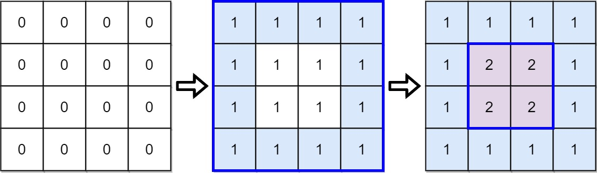
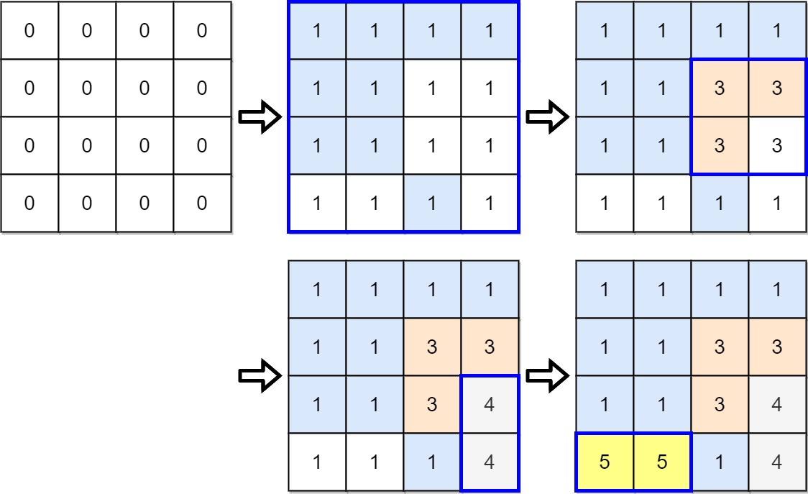

## Description

There is a strange printer with the following two special requirements:

- On each turn, the printer will print a solid rectangular pattern of a single color on the grid. This will cover up the existing colors in the rectangle.

- Once the printer has used a color for the above operation, **the same color cannot be used again**.

You are given a `m x n` matrix `targetGrid`, where $\text{targetGrid}[row][col]$ is the color in the position `(row, col)` of the grid.

Return `true`* if it is possible to print the matrix *`targetGrid`*,** otherwise, return *`false`.
### Function Contract

- `n`: Input parameter.
- Returns expected result.

### Examples
#### Example 1

- **Input:** $targetGrid = [[1,1,1,1],[1,2,2,1],[1,2,2,1],[1,1,1,1]]$
- **Output:** `true`
#### Example 2

- **Input:** $targetGrid = [[1,1,1,1],[1,1,3,3],[1,1,3,4],[5,5,1,4]]$
- **Output:** `true`
#### Example 3

- **Input:** $targetGrid = [[1,2,1],[2,1,2],[1,2,1]]$
- **Output:** `false`
- **Explanation:** It is impossible to form targetGrid because it is not allowed to print the same color in different turns.
### Constraints

- $m = \text{targetGrid.length}$

- $n = \text{targetGrid}[i].length$

- $1 \le m, n \le 60$

- $1 \le \text{targetGrid}[row][col] \le 60$