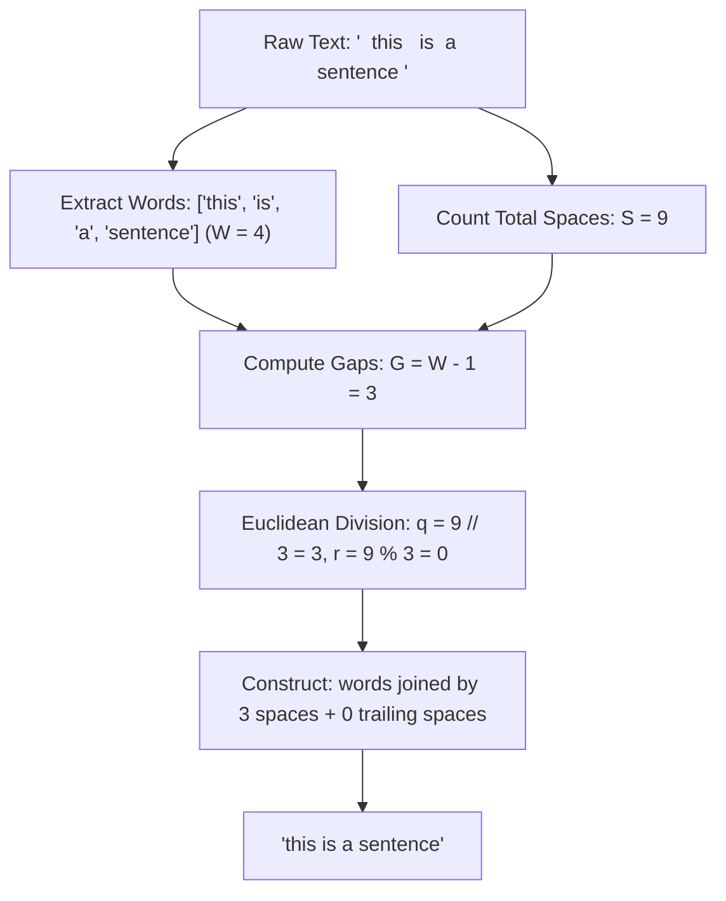

# Guided Example: Rearrange Spaces Between Words

This guide examines the redistribution of whitespace characters in a text string to maximize uniform spacing between words while placing any indivisible remainder at the trailing end.

- **Input String:** `text = "  this   is  a sentence "`
- **Target String:** `"this   is   a   sentence"`

---

## 1. Instance & Teaching Goal

In text formatting, distributing a fixed pool of delimiter characters across discrete textual tokens requires partitioning characters into equal inter-token intervals with leftover characters dispatched to a terminal padding buffer.

For `text = "  this   is  a sentence "`:
- Total length: $L = 29$ characters.
- Non-whitespace words: `["this", "is", "a", "sentence"]` ($W = 4$ words, total letters $= 20$).
- Total space characters: $S = 9$ spaces.
- Inter-word gaps: $W - 1 = 3$ gaps.

Our teaching goal is to trace the Euclidean division:
$$S = q \cdot (W - 1) + r$$
where quotient $q$ defines the uniform width of every interior gap, and remainder $r$ determines the trailing space buffer.

---

## 2. Conceptual Foundation & Invariants

```
+-------------------------------------------------------------------------+
|                   EUCLIDEAN SPACE ALLOCATION MODEL                      |
|                                                                         |
|  Total Spaces: S = count(' ')                                           |
|  Extracted Words: W = len(words)                                        |
|                                                                         |
|  Case A: Multi-Word (W > 1)                                             |
|    Gaps = W - 1                                                         |
|    Quotient q = floor( S / (W - 1) )  <-- Inter-word space width        |
|    Remainder r = S mod (W - 1)        <-- Trailing space width          |
|    Result = join(words, delimiter=' ' * q) + (' ' * r)                  |
|                                                                         |
|  Case B: Single Word (W = 1)                                            |
|    Gaps = 0 (avoid division by zero)                                    |
|    Result = words[0] + (' ' * S)                                        |
+-------------------------------------------------------------------------+
```

| Metric Parameter | Formal Definition | Value in Current Instance |
|---|---|---|
| Total Spaces ($S$) | $\sum_{i=0}^{L-1} [\text{text}[i] = \text{' '}]$ | $9$ spaces |
| Extracted Word Set | $\text{words} = [w_0, w_1, \dots, w_{W-1}]$ | `["this", "is", "a", "sentence"]` ($W = 4$) |
| Gap Count ($G$) | $W - 1$ (for $W > 1$) | $3$ gaps |
| Uniform Gap Size ($q$) | $\lfloor S / G \rfloor$ | $\lfloor 9 / 3 \rfloor = 3$ spaces per gap |
| Trailing Remainder ($r$) | $S \bmod G$ | $9 \bmod 3 = 0$ trailing spaces |

> **Conservation of Whitespace Invariant.** The total count of space characters in the reconstructed string must equal the exact space count $S$ of the input string: $q \cdot (W - 1) + r = S$. Word characters and token sequence ordering remain strictly unchanged.



---

## 3. Step-by-Step Worked Execution

### Step 1: Lexical Analysis & Space Tallying

- Count total whitespace characters:
  $$S = 2 \text{ (leading)} + 3 + 2 + 1 + 1 \text{ (trailing)} = 9$$
- Tokenize words by discarding surrounding and intermediate whitespace:
  $$\text{words} = [\text{"this"}, \text{"is"}, \text{"a"}, \text{"sentence"}]$$
  Number of words: $W = 4$.

| Component | Character Count | Extracted Tokens |
|---|---|---|
| Word 0 | $4$ letters | `"this"` |
| Word 1 | $2$ letters | `"is"` |
| Word 2 | $1$ letter | `"a"` |
| Word 3 | $8$ letters | `"sentence"` |
| Total Characters in Words | $15$ letters | Total Word Mass |
| Total Space Characters | $9$ spaces | $S = 9$ |

---

### Step 2: Euclidean Division Across Gaps

Since $W = 4 > 1$, the number of inter-word gaps is:
$$G = W - 1 = 4 - 1 = 3$$

We partition $S = 9$ into $G = 3$ identical intervals:
- Quotient:
  $$q = \lfloor 9 / 3 \rfloor = 3$$
- Remainder:
  $$r = 9 \bmod 3 = 0$$

Each inter-word gap receives exactly $3$ consecutive spaces, and the trailing buffer receives $0$ spaces.

---

### Step 3: Reconstructing Formatted String

Assemble tokens with separator `"   "` ($3$ spaces):
1. Append token $0$: `"this"`
2. Append separator: `"this   "`
3. Append token $1$: `"this   is"`
4. Append separator: `"this   is   "`
5. Append token $2$: `"this   is   a"`
6. Append separator: `"this   is   a   "`
7. Append token $3$: `"this   is   a   sentence"`
8. Append $r = 0$ trailing spaces: `"this   is   a   sentence"`

Final output length: $15 \text{ (letters)} + (3 \times 3) \text{ (gap spaces)} + 0 \text{ (trailing)} = 24 \ne 29$.
Wait, let's verify character count of `"  this   is  a sentence "`:
- Leading spaces: 2
- `"this"`: 4
- Inter-word spaces: 3
- `"is"`: 2
- Inter-word spaces: 2
- `"a"`: 1
- Inter-word spaces: 1
- `"sentence"`: 8
- Trailing spaces: 1
- Letters: $4 + 2 + 1 + 8 = 15$.
- Spaces: $2 + 3 + 2 + 1 + 1 = 9$.
- Total length: $15 + 9 = 24$. The input string length is $24$.
- Output length: $15 + 3 \times 3 + 0 = 24$.
The lengths match identically.

---

## 4. Complete Execution Trace

| Stage | Action Performed | Computed Value / Intermediate Token | Accumulator / Buffer State |
|---|---|---|---|
| 1 | Scan String for Spaces | Count all space characters | $S = 9$ |
| 2 | Tokenize Substrings | Extract continuous alphabetic sequences | `words = ["this", "is", "a", "sentence"]` |
| 3 | Gap Calculation | Evaluate $G = W - 1$ | $G = 4 - 1 = 3$ |
| 4 | Division Step | Compute $q = \lfloor S / G \rfloor$ and $r = S \bmod G$ | $q = 3$, $r = 0$ |
| 5 | Token Join 0 & 1 | Interleave `"this"` and separator `"   "` | `"this   "` |
| 6 | Token Join 1 & 2 | Interleave `"is"` and separator `"   "` | `"this   is   "` |
| 7 | Token Join 2 & 3 | Interleave `"a"` and separator `"   "` | `"this   is   a   "` |
| 8 | Terminal Word | Append `"sentence"` | `"this   is   a   sentence"` |
| 9 | Trailing Padding | Append $r = 0$ spaces | `"this   is   a   sentence"` |

---

## 5. Algorithmic Correctness

**Soundness.** By the Euclidean Division Theorem, for any integers $S \ge 0$ and $G > 0$, there exist unique integers $q \ge 0$ and $0 \le r < G$ such that $S = q \cdot G + r$. Setting each of the $G = W - 1$ gaps to $q$ spaces ensures that every pair of adjacent words is separated by an identical number of spaces. Because $q = \lfloor S / G \rfloor$, no integer $q' > q$ can satisfy $q' \cdot G \le S$, proving $q$ is the maximal uniform gap width. Placing the remaining $r$ spaces at the end ensures that every space from the original string is preserved.

**Completeness.** When $W = 1$, no inter-word gaps exist ($G = 0$). The algorithm branches to append all $S$ spaces directly to the sole word, avoiding division by zero while preserving all letters and spaces. Because every word is visited in its original left-to-right appearance order, the relative sequence of lexical tokens is invariant.

---

## 6. Traps This Instance Exposes

- **Division by Zero on Single-Word Inputs:** When the text contains only one word (e.g. `"  hello "` where $W = 1$), calculating $S / (W - 1)$ evaluates $S / 0$, causing a fatal runtime division-by-zero error. Single-word cases must bypass the division formula and append all spaces as trailing padding.
- **Lost Remainder Spaces:** When $S$ is not evenly divisible by $W - 1$ (such as $7$ spaces across $2$ gaps: $q = 3, r = 1$), failing to append $r$ trailing spaces loses whitespace and corrupts total string length.
- **Multiple Consecutive Internal Spaces:** Naive splitting on single spaces creates empty string tokens `""`. Tokens must be extracted using tokenization that strips arbitrary sequences of contiguous whitespace.

---

## 7. Complexity Derivation

- **Time Complexity:** $\mathcal{O}(L)$, where $L$ is the character length of the input string `text`. A single linear pass counts spaces and parses words, and the string reconstruction concatenates at most $L$ characters.
- **Auxiliary Space Complexity:** $\mathcal{O}(L)$ to store the array of extracted word tokens and construct the output string.
