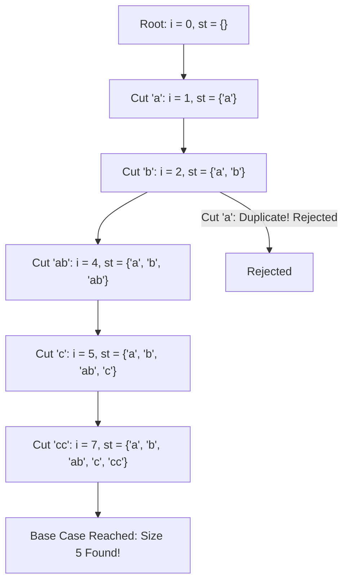

# Guided Example: Split a String Into the Max Number of Unique Substrings

This guide walks through depth-first search with backtracking and upper-bound branch pruning to partition a string into the maximum possible number of non-overlapping, unique non-empty substrings.

- **Input String:** `s = "ababccc"`
- **Target Maximum Count:** `5` (Partition: `["a", "b", "ab", "c", "cc"]`)

---

## 1. Instance & Teaching Goal

A valid partition of string $s$ of length $N$ divides $s$ into contiguous non-empty substrings $w_1, w_2, \dots, w_k$ such that:
1. Concatenation condition: $w_1 + w_2 + \dots + w_k = s$
2. Global uniqueness condition: $w_i \ne w_j$ for all $1 \le i < j \le k$

For `s = "ababccc"` ($N = 7$), partitioning into single characters `["a", "b", "a", "b", "c", "c", "c"]` yields 7 pieces but violates uniqueness because `"a"`, `"b"`, and `"c"` repeat. Grouping repeat occurrences creates distinct multi-character tokens:
$$[\text{"a"}, \text{"b"}, \text{"ab"}, \text{"c"}, \text{"cc"}]$$
Each piece is unique, achieving $k = 5$ parts.

Our teaching goal is to trace how recursive backtracking explores cut positions while using the optimistic upper bound $|st| + (N - i)$ to prune fruitless search subtrees.

---

## 2. Conceptual Foundation & Invariants

```
+-------------------------------------------------------------------------+
|                  BACKTRACKING STATE & PRUNING BOUND                     |
|                                                                         |
|  State: (index i, unique_set st)                                        |
|                                                                         |
|  Optimistic Upper Bound:                                                |
|    Max achievable pieces from this state: Bound = |st| + (N - i)        |
|    If Bound <= current_best_answer:                                     |
|        PRUNE SUBTREE IMMEDIATELY (cannot beat or improve current best)  |
|                                                                         |
|  Transitions:                                                           |
|    For each cut j from i + 1 to N:                                      |
|      candidate = s[i : j]                                               |
|      If candidate not in st:                                            |
|          Add candidate to st                                            |
|          Recurse to dfs(j)                                              |
|          Remove candidate from st (backtrack state restoration)         |
+-------------------------------------------------------------------------+
```

| Parameter | Mathematical Expression | Function in Search |
|---|---|---|
| Active Prefix Boundary ($i$) | $0 \le i \le N$ | Starting index of remaining suffix $s[i..N-1]$ |
| Substring Pool ($st$) | $\{w_1, \dots, w_m\}$ | Multiset of distinct tokens committed so far |
| Remaining Length | $N - i$ | Maximum additional singletons theoretically possible |
| Upper Bound | $\lvert st \rvert + (N - i)$ | Theoretical ceiling on total unique parts for current path |
| Global Maximum ($ans$) | $\max \lvert st \rvert$ at $i = N$ | Best verified partition size discovered |

> **Pruning Invariant.** At any search node $(i, st)$, the maximum number of additional non-empty substrings that can be formed from suffix $s[i..N-1]$ is strictly bounded by the number of remaining characters $N - i$. If $|st| + (N - i) \le ans$, no continuation can exceed the established best $ans$, so terminating the branch preserves global optimality.



---

## 3. Step-by-Step Worked Execution

### Branch 1: Tracing the Optimal 5-Split

1. **Start ($i = 0$):**
   - Explore cut $j = 1 \implies \text{token} = \text{"a"}$.
   - Add `"a"` to $st$. New state: $i = 1, st = \{\text{"a"}\}$.

2. **State ($i = 1$):**
   - Remaining characters: $7 - 1 = 6$. Upper bound: $1 + 6 = 7 > 0$.
   - Explore cut $j = 2 \implies \text{token} = \text{"b"}$.
   - Add `"b"` to $st$. New state: $i = 2, st = \{\text{"a"}, \text{"b"}\}$.

3. **State ($i = 2$):**
   - Remaining characters: $7 - 2 = 5$. Upper bound: $2 + 5 = 7$.
   - Suffix: `"abccc"`.
   - Candidate $j = 3 \implies \text{"a"}$. Already in $st$! Discarded.
   - Candidate $j = 4 \implies \text{"ab"}$. Not in $st$!
   - Add `"ab"` to $st$. New state: $i = 4, st = \{\text{"a"}, \text{"b"}, \text{"ab"}\}$.

4. **State ($i = 4$):**
   - Remaining characters: $7 - 4 = 3$. Upper bound: $3 + 3 = 6$.
   - Suffix: `"ccc"`.
   - Candidate $j = 5 \implies \text{"c"}$. Not in $st$!
   - Add `"c"` to $st$. New state: $i = 5, st = \{\text{"a"}, \text{"b"}, \text{"ab"}, \text{"c"}\}$.

5. **State ($i = 5$):**
   - Remaining characters: $7 - 5 = 2$. Upper bound: $4 + 2 = 6$.
   - Suffix: `"cc"`.
   - Candidate $j = 6 \implies \text{"c"}$. Already in $st$! Discarded.
   - Candidate $j = 7 \implies \text{"cc"}$. Not in $st$!
   - Add `"cc"` to $st$. New state: $i = 7, st = \{\text{"a"}, \text{"b"}, \text{"ab"}, \text{"c"}, \text{"cc"}\}$.

6. **Base Case ($i = 7 = N$):**
   - Reached end of string. All characters consumed.
   - Partition: `["a", "b", "ab", "c", "cc"]`.
   - Size: $|st| = 5$.
   - Update global maximum: $ans = \max(0, 5) = 5$.

---

### Branch 2: Illustrating Bound Pruning

Suppose the search backtracks to explore alternative initial cut $s[0..2] = \text{"aba"}$:
- State: $i = 3, st = \{\text{"aba"}\}$.
- Remaining characters: $N - i = 7 - 3 = 4$ (suffix `"bccc"`).
- Theoretical upper bound:
  $$\text{Bound} = |st| + (N - i) = 1 + 4 = 5$$
- Since current best $ans = 5$, condition $|st| + (N - i) \le ans$ ($5 \le 5$) triggers immediately.
- The entire subtree rooted at `"aba"` is pruned without scanning its children, saving exponential recursive calls.

---

## 4. Complete Execution Trace

| Step | Prefix Index $i$ | Candidate Slice $s[i:j]$ | Membership in $st$ | Action Taken | Active $st$ Size | Upper Bound $\lvert st \rvert + N - i$ | Global Best $ans$ |
|---|---|---|---|---|---|---|---|
| 1 | $0$ | `"a"` ($j=1$) | Absent | Push `"a"`, recurse $i=1$ | $1$ | $1 + 6 = 7$ | $0$ |
| 2 | $1$ | `"b"` ($j=2$) | Absent | Push `"b"`, recurse $i=2$ | $2$ | $2 + 5 = 7$ | $0$ |
| 3 | $2$ | `"a"` ($j=3$) | Present | Duplicate skipped | $2$ | $2 + 4 = 6$ | $0$ |
| 4 | $2$ | `"ab"` ($j=4$) | Absent | Push `"ab"`, recurse $i=4$ | $3$ | $3 + 3 = 6$ | $0$ |
| 5 | $4$ | `"c"` ($j=5$) | Absent | Push `"c"`, recurse $i=5$ | $4$ | $4 + 2 = 6$ | $0$ |
| 6 | $5$ | `"c"` ($j=6$) | Present | Duplicate skipped | $4$ | $4 + 1 = 5$ | $0$ |
| 7 | $5$ | `"cc"` ($j=7$) | Absent | Push `"cc"`, recurse $i=7$ | $5$ | $5 + 0 = 5$ | $0$ |
| 8 | $7$ | End of String | Base case | Update best answer | $5$ | — | $5$ |
| 9 | $0$ | `"ab"` ($j=2$) | Absent | Explore alternative | $1$ | $1 + 5 = 6$ | $5$ |
| 10 | $0$ | `"aba"` ($j=3$) | Absent | $1 + 4 = 5 \le 5$ | — | $5 \le 5$ (Pruned) | $5$ |

---

## 5. Algorithmic Correctness

**Soundness.** A candidate partition is recorded only when the recursion index $i$ reaches the end of the string ($i = N$). Because each recursive step advances the pointer from $i$ to $j > i$ using non-empty slices, the concatenated substrings reconstruct $s$ without gaps or overlaps. Before advancing to $j$, the algorithm tests $s[i:j] \notin st$. Thus, all committed tokens are strictly distinct. Every recorded count is the size of a verified valid partition.

**Completeness.** Depth-first search exhaustively considers all possible cut positions $j \in [i+1, N]$ for the next substring. A branch is pruned only if $|st| + (N - i) \le ans$. Because any partition of the remaining $N - i$ characters can produce at most $N - i$ distinct non-empty pieces (even assuming each character is unique and unused), no completion of the current prefix can yield more than $|st| + (N - i)$ total parts. Therefore, pruning discards only branches incapable of strictly improving upon $ans$, ensuring the true maximum is preserved.

---

## 6. Traps This Instance Exposes

- **Greedy Selection Hazard:** Always picking the shortest available unused substring can create severe conflicts later in the string, forcing suboptimal long groupings. A backtracking search that can reconsider cut lengths is essential.
- **State Leakage Across Branches:** Forgetting to remove $s[i:j]$ from the hash set after the recursive return will permanently taint the set, incorrectly treating valid substrings as duplicates in subsequent alternative search paths.
- **Strict vs. Non-Strict Pruning Bound:** Pruning when $|st| + (N - i) \le ans$ is valid because we only seek the *maximum* count. If the problem required enumerating all tied maximal splits, the condition would need to be strictly $< ans$.

---

## 7. Complexity Derivation

- **Time Complexity:** $\mathcal{O}(N \cdot 2^{N-1})$ in the theoretical unpruned worst-case, where $N \le 16$. There are $N - 1$ potential cut points, generating $2^{N-1}$ binary split choices. Slicing and set hashing take $\mathcal{O}(N)$ per decision. In practice, bound pruning terminates unpromising branches early, executing in milliseconds.
- **Auxiliary Space Complexity:** $\mathcal{O}(N)$ call stack frames, alongside $\mathcal{O}(N)$ auxiliary space for the hash set containing at most $N$ unique substrings of combined length $N$.
