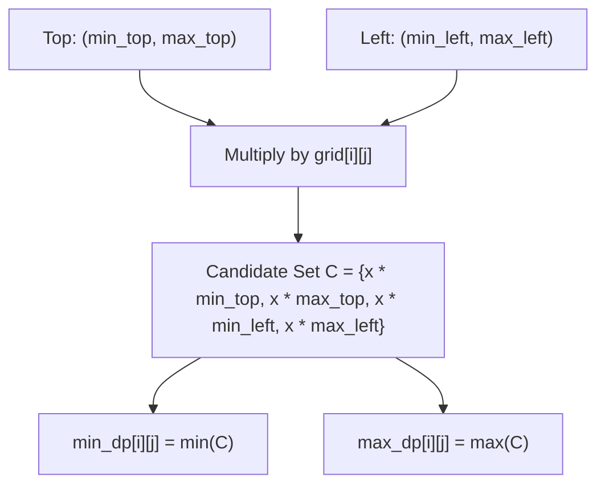

# Guided Example: Maximum Non Negative Product in a Matrix

This guide walks through dynamic programming tracking dual extreme products (both minimum and maximum) to navigate negative factor inversions across grid paths.

- **Input Grid:**
  ```text
  [[ 1, -2,  1],
   [ 1, -2,  1],
   [ 3, -4,  1]]
  ```
- **Target Value:** `8` (Optimal Path: $(0, 0) \to (1, 0) \to (1, 1) \to (2, 1) \to (2, 2)$)

---

## 1. Instance & Teaching Goal

A robot starts at cell $(0, 0)$ and must reach $(M-1, N-1)$ moving only right or down. The score of a path is the cumulative product of all cell values along the route. We seek the maximum non-negative product modulo $10^9 + 7$. If no path yields a non-negative product, the output is $-1$.

In standard additive grid paths, greedily maintaining the maximum prefix sum suffices. Under multiplication, however, multiplying by a negative number reverses numeric ordering:
$$\text{Large Negative} \times \text{Negative Number} = \text{Large Positive}$$

```
Grid Matrix:
  (0,0):  1 ---> (0,1): -2 ---> (0,2):  1
      |              |              |
      v              v              v
  (1,0):  1 ---> (1,1): -2 ---> (1,2):  1
      |              |              |
      v              v              v
  (2,0):  3 ---> (2,1): -4 ---> (2,2):  1
```

By traversing $(0, 0) [1] \to (1, 0) [1] \to (1, 1) [-2] \to (2, 1) [-4] \to (2, 2) [1]$, the product progresses:
$$1 \xrightarrow{\times 1} 1 \xrightarrow{\times (-2)} -2 \xrightarrow{\times (-4)} +8 \xrightarrow{\times 1} +8$$

Our teaching goal is to trace the simultaneous propagation of both minimum and maximum product states for every cell $(i, j)$ in $\mathcal{O}(M \cdot N)$ time without corrupting signs via intermediate modulo reductions.

---

## 2. Conceptual Foundation & Invariants

```
+-------------------------------------------------------------------------+
|                    DUAL-EXTREMA DP RECURRENCE                           |
|                                                                         |
|  At cell (i, j) with value x = grid[i][j]:                              |
|                                                                         |
|  Candidate pool C collected from valid predecessors:                    |
|    From Top  (i-1, j):  { x * min_dp[i-1][j],  x * max_dp[i-1][j] }     |
|    From Left (i, j-1):  { x * min_dp[i][j-1],  x * max_dp[i][j-1] }     |
|                                                                         |
|  Recurrence:                                                            |
|    min_dp[i][j] = min(C)                                                |
|    max_dp[i][j] = max(C)                                                |
|                                                                         |
|  Terminal Decision:                                                     |
|    If max_dp[M-1][N-1] < 0: return -1                                   |
|    Else: return max_dp[M-1][N-1] mod (10^9 + 7)                         |
+-------------------------------------------------------------------------+
```

| DP Parameter | Mathematical Formulation | Function in Search |
|---|---|---|
| Cell Coordinate | $(i, j) \in [0, M-1] \times [0, N-1]$ | Matrix position |
| $\text{min\_dp}[i][j]$ | Minimum path product from $(0, 0)$ to $(i, j)$ | Preserves negative extremes for future inversion |
| $\text{max\_dp}[i][j]$ | Maximum path product from $(0, 0)$ to $(i, j)$ | Tracks best positive candidates |
| Predecessor Set | $(i-1, j)$ (Top) and $(i, j-1)$ (Left) | Legal move sources |

> **Extremal Bounding Invariant.** For any cell $(i, j)$, multiplying the set of all possible path products from $(0, 0)$ to a predecessor by constant $x$ produces values strictly bounded within $[\min(x \cdot \text{pred}_{\min}, x \cdot \text{pred}_{\max}), \max(x \cdot \text{pred}_{\min}, x \cdot \text{pred}_{\max})]$. Thus, tracking solely the two scalar extremes per predecessor captures the true global extrema for $(i, j)$.



---

## 3. Step-by-Step Worked Execution

### Row 0
- **Cell $(0, 0)$ ($x = 1$):**
  - Base case: $\text{min\_dp}[0][0] = 1, \text{max\_dp}[0][0] = 1$.
- **Cell $(0, 1)$ ($x = -2$):**
  - Left only: candidates $\{(-2) \times 1\} = \{-2\}$.
  - $\text{min\_dp}[0][1] = -2, \text{max\_dp}[0][1] = -2$.
- **Cell $(0, 2)$ ($x = 1$):**
  - Left only: candidates $\{1 \times (-2)\} = \{-2\}$.
  - $\text{min\_dp}[0][2] = -2, \text{max\_dp}[0][2] = -2$.

---

### Row 1
- **Cell $(1, 0)$ ($x = 1$):**
  - Top only: candidates $\{1 \times 1\} = \{1\}$.
  - $\text{min\_dp}[1][0] = 1, \text{max\_dp}[1][0] = 1$.
- **Cell $(1, 1)$ ($x = -2$):**
  - From Top $(0, 1)$ with $[-2, -2]$: candidates $\{(-2) \times (-2)\} = \{4\}$.
  - From Left $(1, 0)$ with $[1, 1]$: candidates $\{(-2) \times 1\} = \{-2\}$.
  - Candidate pool: $\{-2, 4\}$.
  - $\text{min\_dp}[1][1] = -2, \text{max\_dp}[1][1] = 4$.
- **Cell $(1, 2)$ ($x = 1$):**
  - From Top $(0, 2)$ with $[-2, -2]$: candidates $\{1 \times (-2)\} = \{-2\}$.
  - From Left $(1, 1)$ with $[-2, 4]$: candidates $\{1 \times (-2), 1 \times 4\} = \{-2, 4\}$.
  - Candidate pool: $\{-2, 4\}$.
  - $\text{min\_dp}[1][2] = -2, \text{max\_dp}[1][2] = 4$.

---

### Row 2
- **Cell $(2, 0)$ ($x = 3$):**
  - Top only: candidates $\{3 \times 1\} = \{3\}$.
  - $\text{min\_dp}[2][0] = 3, \text{max\_dp}[2][0] = 3$.
- **Cell $(2, 1)$ ($x = -4$):**
  - From Top $(1, 1)$ with $[-2, 4]$: candidates $\{(-4) \times (-2), (-4) \times 4\} = \{8, -16\}$.
  - From Left $(2, 0)$ with $[3, 3]$: candidates $\{(-4) \times 3\} = \{-12\}$.
  - Candidate pool: $\{-16, -12, 8\}$.
  - $\text{min\_dp}[2][1] = -16, \text{max\_dp}[2][1] = 8$.
- **Cell $(2, 2)$ ($x = 1$):**
  - From Top $(1, 2)$ with $[-2, 4]$: candidates $\{1 \times (-2), 1 \times 4\} = \{-2, 4\}$.
  - From Left $(2, 1)$ with $[-16, 8]$: candidates $\{1 \times (-16), 1 \times 8\} = \{-16, 8\}$.
  - Candidate pool: $\{-16, -2, 4, 8\}$.
  - $\text{min\_dp}[2][2] = -16, \text{max\_dp}[2][2] = 8$.

---

## 4. Complete Execution Trace

| Coordinate $(i, j)$ | Cell Val $x$ | Predecessor Top $[\min, \max]$ | Predecessor Left $[\min, \max]$ | Candidate Set $C$ | Computed $[\text{min\_dp}, \text{max\_dp}]$ |
|---|---|---|---|---|---|
| $(0, 0)$ | $1$ | — | — | $\{1\}$ | $[1, 1]$ |
| $(0, 1)$ | $-2$ | — | $[1, 1]$ | $\{-2\}$ | $[-2, -2]$ |
| $(0, 2)$ | $1$ | — | $[-2, -2]$ | $\{-2\}$ | $[-2, -2]$ |
| $(1, 0)$ | $1$ | $[1, 1]$ | — | $\{1\}$ | $[1, 1]$ |
| $(1, 1)$ | $-2$ | $[-2, -2]$ | $[1, 1]$ | $\{-2, 4\}$ | $[-2, 4]$ |
| $(1, 2)$ | $1$ | $[-2, -2]$ | $[-2, 4]$ | $\{-2, 4\}$ | $[-2, 4]$ |
| $(2, 0)$ | $3$ | $[1, 1]$ | — | $\{3\}$ | $[3, 3]$ |
| $(2, 1)$ | $-4$ | $[-2, 4]$ | $[3, 3]$ | $\{-16, -12, 8\}$ | $[-16, 8]$ |
| $(2, 2)$ | $1$ | $[-2, 4]$ | $[-16, 8]$ | $\{-16, -2, 4, 8\}$ | $[-16, 8]$ |

Destination maximum: $\text{max\_dp}[2][2] = 8$. Since $8 \ge 0$, return $8 \pmod{10^9 + 7} = 8$.

---

## 5. Algorithmic Correctness

**Soundness.** Let $\mathcal{P}(i, j)$ be the set of all path products from $(0, 0)$ to $(i, j)$. Any path to $(i, j)$ extends a path to $(i-1, j)$ or $(i, j-1)$ by multiplying by $x = \text{grid}[i][j]$. For any real interval $[A, B]$ and real scalar $x$, the image $\{p \cdot x : p \in [A, B]\}$ is bounded by $\min(x A, x B)$ and $\max(x A, x B)$. By induction, since $\text{min\_dp}$ and $\text{max\_dp}$ correctly bound all path products for predecessors, testing all candidate products generated from predecessor extrema guarantees that $[\text{min\_dp}[i][j], \text{max\_dp}[i][j]]$ strictly covers the range of $\mathcal{P}(i, j)$.

**Completeness.** Every right/down path from $(0, 0)$ to $(M-1, N-1)$ corresponds to an alternating sequence of downward and rightward transitions. By visiting cells in row-major order, every predecessor's state is fully resolved before being referenced. Because candidate testing evaluates both directions whenever available, no valid path product can exceed $\text{max\_dp}[M-1][N-1]$.

---

## 6. Traps This Instance Exposes

- **Premature Modulo Reduction:** Applying modulo $10^9 + 7$ to intermediate values destroys numerical ordering and sign properties. For instance, $-2 \pmod{10^9+7} \approx 10^9+5$, which erroneously looks larger than positive values. Modulo reduction must be delayed strictly until after the terminal non-negativity test.
- **Dropping Negative Extrema:** Tracking only the maximum path product would lose the $-2$ product at $(1, 1)$, preventing discovery of the maximum product $8 = (-2) \times (-4)$ at $(2, 1)$.
- **Treating Zero as Infeasible:** A path product of $0$ is non-negative and valid ($0 \ge 0$). If all other paths yield negative products, returning $0$ is correct; returning $-1$ is a bug.

---

## 7. Complexity Derivation

- **Time Complexity:** $\mathcal{O}(M \cdot N)$, where $M$ and $N$ are the matrix dimensions. Each cell evaluates at most $4$ candidate multiplications and simple min/max selections in $\mathcal{O}(1)$ time.
- **Auxiliary Space Complexity:** $\mathcal{O}(M \cdot N)$ auxiliary space for the dynamic programming table storing two integer values per cell. This can be optimized to $\mathcal{O}(N)$ space using rolling-row vectors.