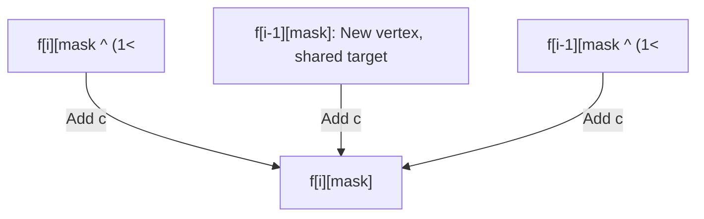

# Guided Example: Minimum Cost to Connect Two Groups of Points

This guide demonstrates bitmask dynamic programming over bipartite graphs, coordinating multi-connection transitions to ensure complete bidirectional point coverage at minimum total edge cost.

- **Input Cost Matrix:**
  ```text
  [[15, 96],
   [36,  2]]
  ```
- **Target Minimum Cost:** `17` (Edges: $(0, 0)$ with cost $15$, and $(1, 1)$ with cost $2$)

---

## 1. Instance & Teaching Goal

We are given two disjoint sets of points: Group 1 with $M$ vertices and Group 2 with $N$ vertices ($N \le 12$). Connecting point $i \in \text{Group 1}$ to point $j \in \text{Group 2}$ incurs cost $\text{cost}[i][j]$. Every point in both groups must be incident to at least one selected edge. Unlike standard bipartite matching, points may have degree $\ge 1$ (one point can connect to multiple targets in the opposite group).

For `cost = [[15, 96], [36, 2]]`:
- $M = 2, N = 2$.
- Group 1 vertices: $\{0, 1\}$.
- Group 2 vertices: $\{0, 1\}$.

```
Group 1                 Group 2
   (0) ---- 15 ----> (0)
   (1) ----  2 ----> (1)

Total Cost: 15 + 2 = 17
All 4 points have degree >= 1.
```

Our teaching goal is to trace how an $(M+1) \times 2^N$ dynamic programming table uses three structural edge transitions to build the optimal connectivity state.

---

## 2. Conceptual Foundation & Invariants

```
+-------------------------------------------------------------------------+
|                  TRIPARTITE TRANSITION BITMASK DP                       |
|                                                                         |
|  State: f[i][mask]                                                      |
|    i:    First i vertices of Group 1 are processed (each with degree>=1)|
|    mask: Subset of Group 2 vertices covered so far (bit k is 1)         |
|                                                                         |
|  For vertex (i-1) in Group 1 and bit k in mask (cost c = cost[i-1][k]):  |
|                                                                         |
|  Transition 1 (Extend current vertex):                                  |
|    f[i][mask ^ (1 << k)] + c                                            |
|    (Vertex i-1 was already connected; add another edge to cover k)      |
|                                                                         |
|  Transition 2 (Connect to already covered target):                      |
|    f[i - 1][mask] + c                                                   |
|    (Target k was already covered; edge satisfies vertex i-1)            |
|                                                                         |
|  Transition 3 (Simultaneous new coverage):                              |
|    f[i - 1][mask ^ (1 << k)] + c                                        |
|    (Edge connects previously uncovered i-1 and uncovered k)             |
+-------------------------------------------------------------------------+
```

| State Variable | Mathematical Domain | Semantics in Bipartite Coverage |
|---|---|---|
| Prefix Index $i$ | $0 \le i \le M$ | Number of Group 1 points satisfied with $\ge 1$ incident edge |
| Bitmask $\text{mask}$ | $0 \le \text{mask} < 2^N$ | Bitvector recording which Group 2 vertices have $\ge 1$ edge |
| Edge Cost $c$ | $\text{cost}[i-1][k]$ | Weight of connecting Group 1 point $i-1$ to Group 2 point $k$ |
| Base Condition | $f[0][0] = 0$, all others $\infty$ | Zero points connected at zero cost |

> **Coverage Monotonicity Invariant.** In row $i$, every vertex $0, \dots, i-1$ in Group 1 possesses at least one incident edge. Bitmask transitions strictly preserve or expand Group 2 coverage. Because intra-row transitions clear a set bit ($mask \oplus 2^k < mask$), evaluating masks in increasing numerical order guarantees all sub-mask states are finalized before reference.



---

## 3. Step-by-Step Worked Execution

### Initialization
- Table $f$ of dimensions $(2 + 1) \times 2^2 = 3 \times 4$.
- $f[0][0] = 0$; all other entries initialized to $\infty$.

---

### Step 1: Processing Group 1 Point $0$ ($i = 1$)
Costs from point $0$: to $0$ is $15$, to $1$ is $96$.

- **Mask $1$ (`01`, covers Group 2 vertex $0$):**
  - Choose $k = 0$, $c = 15$.
  - Transition 3 from $f[0][0]$: $0 + 15 = 15$.
  - $f[1][1] = 15$.
- **Mask $2$ (`10`, covers Group 2 vertex $1$):**
  - Choose $k = 1$, $c = 96$.
  - Transition 3 from $f[0][0]$: $0 + 96 = 96$.
  - $f[1][2] = 96$.
- **Mask $3$ (`11`, covers Group 2 vertices $\{0, 1\}$):**
  - Via $k = 0$: Transition 1 from $f[1][2]$: $96 + 15 = 111$.
  - Via $k = 1$: Transition 1 from $f[1][1]$: $15 + 96 = 111$.
  - $f[1][3] = 111$.

---

### Step 2: Processing Group 1 Point $1$ ($i = 2$)
Costs from point $1$: to $0$ is $36$, to $1$ is $2$.

- **Mask $1$ (`01`):**
  - Choose $k = 0$, $c = 36$.
  - Transition 2 from $f[1][1]$: $15 + 36 = 51$.
  - $f[2][1] = 51$.
- **Mask $2$ (`10`):**
  - Choose $k = 1$, $c = 2$.
  - Transition 2 from $f[1][2]$: $96 + 2 = 98$.
  - $f[2][2] = 98$.
- **Mask $3$ (`11`):**
  - Testing $k = 0$ ($c = 36$):
    - Transition 1 from $f[2][2]$: $98 + 36 = 134$.
    - Transition 2 from $f[1][3]$: $111 + 36 = 147$.
    - Transition 3 from $f[1][2]$: $96 + 36 = 132$.
    - Best for $k = 0$ is $132$.
  - Testing $k = 1$ ($c = 2$):
    - Transition 1 from $f[2][1]$: $51 + 2 = 53$.
    - Transition 2 from $f[1][3]$: $111 + 2 = 113$.
    - Transition 3 from $f[1][1]$: $15 + 2 = 17$!
    - Best for $k = 1$ is $17$.
  - Global minimum for state $(2, 3)$:
    $$f[2][3] = \min(132, 17) = 17$$

Target reached: $f[M][2^N - 1] = f[2][3] = 17$.

---

## 4. Complete Execution Trace

| Group 1 Index $i$ | Mask Value (Binary) | Bit Tested $k$ | Predecessor States Checked | Candidate Costs | Optimal $f[i][\text{mask}]$ |
|---|---|---|---|---|---|
| $0$ (Init) | $0$ (`00`) | — | Base configuration | $\{0\}$ | $0$ |
| $1$ | $1$ (`01`) | $0$ | $f[0][0] + 15$ | $\{15\}$ | $15$ |
| $1$ | $2$ (`10`) | $1$ | $f[0][0] + 96$ | $\{96\}$ | $96$ |
| $1$ | $3$ (`11`) | $0, 1$ | $f[1][2]+15, f[1][1]+96$ | $\{111, 111\}$ | $111$ |
| $2$ | $1$ (`01`) | $0$ | $f[1][1] + 36$ | $\{51\}$ | $51$ |
| $2$ | $2$ (`10`) | $1$ | $f[1][2] + 2$ | $\{98\}$ | $98$ |
| $2$ | $3$ (`11`) | $0$ | $f[2][2]+36, f[1][3]+36, f[1][2]+36$ | $\{134, 147, 132\}$ | $132$ |
| $2$ | $3$ (`11`) | $1$ | $f[2][1]+2, f[1][3]+2, f[1][1]+2$ | $\{53, 113, 17\}$ | $17$ |

---

## 5. Algorithmic Correctness

**Soundness.** Every valid assignment of edges covering all points can be decomposed into an ordered sequence of edge choices. For any edge $(i-1, k)$, it either:
1. Adds a secondary connection to Group 1 point $i-1$, matching Transition 1 ($f[i][\text{mask} \oplus 2^k] + c$).
2. Acts as the primary connection for point $i-1$ where target $k$ is already covered by an earlier vertex, matching Transition 2 ($f[i-1][\text{mask}] + c$).
3. Acts as the primary connection for point $i-1$ while newly introducing coverage for target $k$, matching Transition 3 ($f[i-1][\text{mask} \oplus 2^k] + c$).
Because every transition strictly adds non-negative edge costs to verified valid predecessor configurations, $f[M][2^N - 1]$ represents a legitimate, fully covered bipartite graph state.

**Completeness.** By iterating across all possible mask subsets $0 \le \text{mask} < 2^N$ and all incident edges $k$, the recurrence tests all topological combinations of degree distribution. The base case $f[0][0] = 0$ is exact, and topological evaluation in ascending mask order guarantees that no valid path to full coverage is missed.

---

## 6. Traps This Instance Exposes

- **Omission of Intra-Row Transitions:** Restricting each Group 1 vertex to a single outgoing edge prevents solutions where one point in Group 1 connects to multiple points in Group 2 (as often occurs when $M < N$). Transition 1 within the same row is required for degree $> 1$.
- **Exponential Explosion on Large Group:** Attempting to assign bitmasks to Group 1 when $M > N$ produces $2^M$ states, which fails for $M > 12$. Bitmasking must strictly target the smaller set ($\le 12$).
- **Unreachable Mask Initialization:** Initializing non-base states with $0$ instead of $\infty$ causes invalid partial coverage configurations to appear cost-free, corrupting the search.

---

## 7. Complexity Derivation

- **Time Complexity:** $\mathcal{O}(M \cdot N \cdot 2^N)$, where $M \le 12$ is the size of Group 1 and $N \le 12$ is the size of Group 2. There are $(M+1) \cdot 2^N$ total states, each evaluated across $N$ possible incident edges in constant time. For $M = 12, N = 12$, $(12)(12)(4096) \approx 5.9 \times 10^5$ operations, well within interactive execution thresholds.
- **Auxiliary Space Complexity:** $\mathcal{O}(M \cdot 2^N)$ auxiliary table space, which can be reduced to $\mathcal{O}(2^N)$ by maintaining only the current and preceding rows.