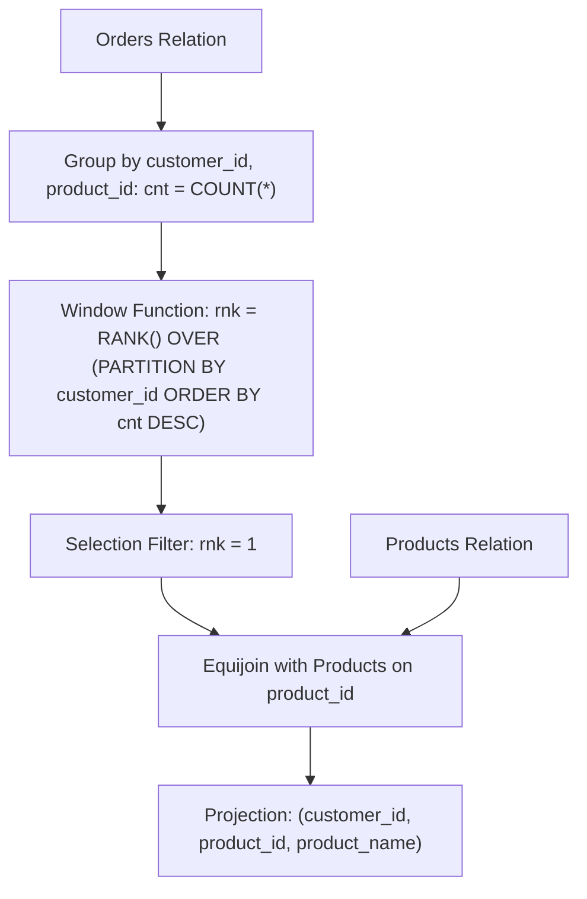

# Guided Example: The Most Frequently Ordered Products for Each Customer

This guide details the relational algebra grouping, window-based rank partitioning, and equi-join operations used to identify all maximal-frequency products ordered by each customer, including multi-way ties.

- **Input Relations:**
  - `Customers`: `(customer_id, name)`
  - `Orders`: `(order_id, order_date, customer_id, product_id)`
  - `Products`: `(product_id, product_name, price)`
- **Output Relation:** `(customer_id, product_id, product_name)`

---

## 1. Instance & Teaching Goal

E-commerce analytics often requires identifying user purchase preferences by calculating product order frequencies per customer. If a customer orders multiple products with equal maximal frequency (a tie), all tied products must be retained in the report. Customers who have never placed an order are excluded.

In our sample dataset:
- Customer $1$ ordered product $1$ once, and product $2$ three times $\implies$ Product $2$ (`"mouse"`).
- Customer $2$ ordered product $1$ once, product $2$ once, and product $3$ once $\implies$ Three-way tie; all three products emitted.
- Customer $3$ ordered product $3$ twice $\implies$ Product $3$ (`"screen"`).
- Customer $4$ ordered product $1$ once $\implies$ Product $1$ (`"keyboard"`).
- Customer $5$ placed zero orders $\implies$ Excluded.

Our teaching goal is to model this sequence using formal relational algebra, window ranking $\text{RANK}()$, and dimension table equi-joins without code leaks.

---

## 2. Conceptual Foundation & Invariants

```
+-------------------------------------------------------------------------+
|                  RELATIONAL ALGEBRA ORDER FREQUENCY FLOW                |
|                                                                         |
|  Step 1: Group & Tally Frequencies                                      |
|    R1 = γ_{customer_id, product_id; cnt = COUNT(*)}(Orders)             |
|                                                                         |
|  Step 2: Partitioned Window Ranking                                     |
|    R2 = ω_{rnk = RANK() OVER (PARTITION BY customer_id                  |
|                               ORDER BY cnt DESC)}(R1)                   |
|                                                                         |
|  Step 3: Filter Maximal Ranks                                           |
|    R3 = σ_{rnk = 1}(R2)                                                 |
|                                                                         |
|  Step 4: Dimension Lookup & Final Projection                            |
|    R4 = R3 ⋈_{product_id} Products                                      |
|    R_final = Π_{customer_id, product_id, product_name}(R4)              |
+-------------------------------------------------------------------------+
```

| Relational Operator | Input Schema | Result Attributes | Semantic Function |
|---|---|---|---|
| Aggregation ($\gamma$) | `Orders` | `customer_id`, `product_id`, `cnt` | Counts purchase events per customer-product pair |
| Window Function ($\omega$) | $R_1$ | `customer_id`, `product_id`, `cnt`, `rnk` | Computes descending frequency rank within each customer |
| Selection ($\sigma$) | $R_2$ | Filtered tuples with `rnk = 1` | Retains all products achieving the customer's peak frequency |
| Equijoin ($\bowtie$) | $R_3, \text{Products}$ | Joined attributes on `product_id` | Attaches human-readable product names |
| Projection ($\Pi$) | $R_4$ | `customer_id`, `product_id`, `product_name` | Formats final schema |

> **Rank Equivalence Invariant.** The window function $\text{RANK}()$ assigns identical rank $1$ to all items sharing the maximum order count within a customer's partition. Applying $\sigma_{\text{rnk} = 1}$ preserves every member of a tie while strictly eliminating products with order frequency below the partition maximum.



---

## 3. Step-by-Step Worked Execution

### Step 1: Count Order Frequency ($R_1 = \gamma_{\text{customer\_id}, \text{product\_id}; \text{cnt} = \text{COUNT}(*)}(\text{Orders})$)

Scanning the $10$ rows of `Orders` partitions transactions by $(\text{customer\_id}, \text{product\_id})$:

| Customer ID | Product ID | Order IDs Observed | Total Count $\text{cnt}$ |
|---|---|---|---|
| $1$ | $1$ | $\{1\}$ | $1$ |
| $1$ | $2$ | $\{5, 8, 10\}$ | $3$ |
| $2$ | $1$ | $\{6\}$ | $1$ |
| $2$ | $2$ | $\{2\}$ | $1$ |
| $2$ | $3$ | $\{9\}$ | $1$ |
| $3$ | $3$ | $\{3, 7\}$ | $2$ |
| $4$ | $1$ | $\{4\}$ | $1$ |

---

### Step 2: Evaluate Window Ranking ($R_2$)

We evaluate $\text{rnk} = \text{RANK}()$ within each customer partition, sorting counts in descending order:
- **Customer 1:**
  - Product $2$ ($\text{cnt} = 3$): Rank $1$
  - Product $1$ ($\text{cnt} = 1$): Rank $2$
- **Customer 2:**
  - Product $1$ ($\text{cnt} = 1$): Rank $1$ (Tie)
  - Product $2$ ($\text{cnt} = 1$): Rank $1$ (Tie)
  - Product $3$ ($\text{cnt} = 1$): Rank $1$ (Tie)
- **Customer 3:**
  - Product $3$ ($\text{cnt} = 2$): Rank $1$
- **Customer 4:**
  - Product $1$ ($\text{cnt} = 1$): Rank $1$

---

### Step 3: Filter Top Ranks ($R_3 = \sigma_{\text{rnk} = 1}(R_2)$)

Selecting tuples with $\text{rnk} = 1$ filters out Customer 1's Product 1 ($\text{rnk} = 2$). All other items survive.

---

### Step 4: Equijoin with Products & Final Projection ($R_{\text{final}}$)

Match surviving tuples with `Products` on `product_id`:
- $(1, 2) \bowtie (2, \text{"mouse"}) \implies (1, 2, \text{"mouse"})$
- $(2, 1) \bowtie (1, \text{"keyboard"}) \implies (2, 1, \text{"keyboard"})$
- $(2, 2) \bowtie (2, \text{"mouse"}) \implies (2, 2, \text{"mouse"})$
- $(2, 3) \bowtie (3, \text{"screen"}) \implies (2, 3, \text{"screen"})$
- $(3, 3) \bowtie (3, \text{"screen"}) \implies (3, 3, \text{"screen"})$
- $(4, 1) \bowtie (1, \text{"keyboard"}) \implies (4, 1, \text{"keyboard"})$

---

## 4. Complete Execution Trace

| Customer ID | Product ID | Order Count $\text{cnt}$ | Window Rank $\text{rnk}$ | $\text{rnk} = 1$ Filter | Product Name Looked Up | Emitted Output Tuple |
|---|---|---|---|---|---|---|
| $1$ | $2$ | $3$ | $1$ | Pass | `"mouse"` | `(1, 2, "mouse")` |
| $1$ | $1$ | $1$ | $2$ | Discarded | — | *Suppressed* |
| $2$ | $1$ | $1$ | $1$ | Pass (Tie) | `"keyboard"` | `(2, 1, "keyboard")` |
| $2$ | $2$ | $1$ | $1$ | Pass (Tie) | `"mouse"` | `(2, 2, "mouse")` |
| $2$ | $3$ | $1$ | $1$ | Pass (Tie) | `"screen"` | `(2, 3, "screen")` |
| $3$ | $3$ | $2$ | $1$ | Pass | `"screen"` | `(3, 3, "screen")` |
| $4$ | $1$ | $1$ | $1$ | Pass | `"keyboard"` | `(4, 1, "keyboard")` |

---

## 5. Algorithmic Correctness

**Soundness.** For every customer $c$, let $M(c) = \max_{p} \text{cnt}(c, p)$ be their highest observed product order count. The ranking function $\text{RANK}()$ orders tuples by $\text{cnt}$ descending; thus, $\text{rnk} = 1$ if and only if $\text{cnt}(c, p) = M(c)$. The predicate $\sigma_{\text{rnk} = 1}$ strictly selects tuples matching this maximal frequency. The inner equi-join with `Products` retrieves the exact canonical product name corresponding to each foreign key `product_id`.

**Completeness.** Grouping over the entire `Orders` relation evaluates every recorded purchase event. By using $\text{RANK}()$ rather than $\text{ROW\_NUMBER}()$, all products tied for peak frequency within a customer partition receive rank $1$ simultaneously. No tied items are dropped, and all customers with at least one order are represented.

---

## 6. Traps This Instance Exposes

- **Arbitrary Tie Discard with `ROW_NUMBER()`:** Using `ROW_NUMBER() OVER (PARTITION BY customer_id ORDER BY cnt DESC)` arbitrarily assigns consecutive ranks $1, 2, 3$ to tied products, illegally discarding valid top products for Customer 2. `RANK()` or `DENSE_RANK()` is mathematically required.
- **Empty Order Customer Inclusion:** Joining `Customers` before aggregation with a left join could create null product records for customers with zero orders (such as Customer 5). Grouping directly on `Orders` naturally omits inactive accounts.
- **Premature Dimension Join:** Joining `Products` with `Orders` before aggregation increases the row size processed during grouping. Aggregating on compact integer keys first and joining `Products` only on surviving rank-1 tuples is optimal.

---

## 7. Complexity Derivation

- **Time Complexity:** $\mathcal{O}(O \log O + P)$, where $O = |\text{Orders}|$ and $P = |\text{Products}|$. Counting pairs with hash aggregation takes $\mathcal{O}(O)$ time. Partition sorting for window ranking takes $\mathcal{O}(O \log O)$. Equi-joining surviving rows with the indexed `Products` dimension table takes $\mathcal{O}(P + K)$ where $K \le O$.
- **Auxiliary Space Complexity:** $\mathcal{O}(O)$ auxiliary memory to store intermediate aggregation buckets and window ranking buffers.
