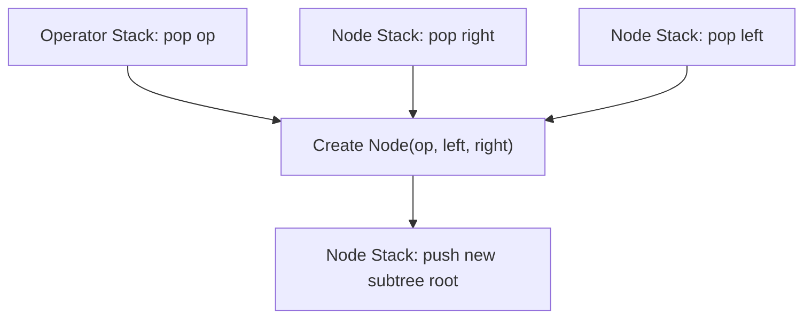

# Guided Example: Build Binary Expression Tree From Infix Expression

This guide demonstrates the two-stack Shunting-Yard parsing algorithm adapted to construct an abstract syntax tree directly from an infix arithmetic expression respecting operator precedence and left associativity.

- **Input Expression:** `s = "3*4-2*5"`
- **Target Tree Level-Order Output:** `["-", "*", "*", "3", "4", "2", "5"]`

---

## 1. Instance & Teaching Goal

In an infix arithmetic expression, operators appear between operands (e.g. $A \times B - C \times D$). Because multiplication takes precedence over subtraction, operations cannot simply be nested strictly left-to-right. Instead, high-precedence operators must form deeper child subtrees, while lower-precedence operators govern broader ancestor subtrees.

```
                  [-]
                /     \
             [*]       [*]
            /   \     /   \
          [3]   [4] [2]   [5]
```

An in-order traversal of this binary expression tree reproduces the token sequence $3 \times 4 - 2 \times 5$, while its structural hierarchy enforces the correct mathematical order of operations:
$$(3 \times 4) - (2 \times 5) = 12 - 10 = 2$$

Our teaching goal is to trace how a dual-stack machine (one stack for subtree root nodes, one stack for pending operators) orchestrates reduction steps in $\mathcal{O}(N)$ time.

---

## 2. Conceptual Foundation & Invariants

```
+-------------------------------------------------------------------------+
|                  DUAL-STACK SHUNTING-YARD PARSER                        |
|                                                                         |
|  Operand Node Stack (nodes): Stores roots of assembled subtrees         |
|  Operator Stack (ops):       Stores pending operators and '(' barriers  |
|                                                                         |
|  Precedence Levels:                                                     |
|    prec('*') = prec('/') = 2                                            |
|    prec('+') = prec('-') = 1                                            |
|                                                                         |
|  Reduction Rule (combine):                                              |
|    op    = ops.pop()                                                    |
|    right = nodes.pop()  <-- Top of stack was encountered later          |
|    left  = nodes.pop()  <-- Second from top was encountered earlier     |
|    nodes.push( new Node(op, left, right) )                              |
|                                                                         |
|  Operator Ingestion Rule:                                               |
|    While ops not empty and top != '(' and prec(top) >= prec(incoming):  |
|        combine()                                                        |
|    ops.push(incoming)                                                   |
+-------------------------------------------------------------------------+
```

| Token Class | Processing Action | Role in Syntax Tree |
|---|---|---|
| Digit (`'0'`–`'9'`) | Create leaf `Node(token)` and push to `nodes` | Atomic operand leaf |
| Opening Parenthesis `'('` | Push directly to `ops` | Precedence boundary fence |
| Closing Parenthesis `')'` | Repeatedly `combine()` until `'('` popped | Collapses parenthesized sub-expression |
| Operator (`+`, `-`, `*`, `/`) | Reduce while $\text{prec}(\text{top}) \ge \text{prec}(\text{curr})$, then push | Forms internal binary operator node |

> **Left-Associativity Invariant.** The comparison condition $\text{prec}(\text{top}) \ge \text{prec}(\text{incoming})$ enforces left-associativity for equal-precedence operators. For an expression like $A - B - C$, encountering the second `'-'` immediately reduces $A - B$ first, ensuring $(A - B)$ becomes the left child of the subsequent subtraction node.



---

## 3. Step-by-Step Worked Execution

### Token 0: `'3'`
- Character is a digit.
- Create leaf `Node('3')`.
- Push to `nodes`. Stack state: `nodes = [3]`, `ops = []`.

---

### Token 1: `'*'`
- Operator with precedence $2$.
- Stack `ops` is empty; push `'*'`.
- Stack state: `nodes = [3]`, `ops = ['*']`.

---

### Token 2: `'4'`
- Character is a digit.
- Create leaf `Node('4')`.
- Push to `nodes`. Stack state: `nodes = [3, 4]`, `ops = ['*']`.

---

### Token 3: `'-'`
- Incoming operator `'-'` with precedence $1$.
- Inspect top of `ops`: `'*'` has precedence $2$.
- Since $2 \ge 1$, trigger reduction:
  - Pop `op = '*'`.
  - Pop `right = Node('4')`.
  - Pop `left = Node('3')`.
  - Create subtree root `Node('*', left=3, right=4)`.
  - Push back to `nodes`.
- `ops` is now empty. Push incoming `'-'`.
- Stack state: `nodes = [*(3, 4)]`, `ops = ['-']`.

---

### Token 4: `'2'`
- Character is a digit.
- Create leaf `Node('2')`.
- Push to `nodes`. Stack state: `nodes = [*(3, 4), 2]`, `ops = ['-']`.

---

### Token 5: `'*'`
- Incoming operator `'*'` with precedence $2$.
- Inspect top of `ops`: `'-'` has precedence $1$.
- Since $1 < 2$, no reduction occurs.
- Push incoming `'*'`.
- Stack state: `nodes = [*(3, 4), 2]`, `ops = ['-', '*']`.

---

### Token 6: `'5'`
- Character is a digit.
- Create leaf `Node('5')`.
- Push to `nodes`. Stack state: `nodes = [*(3, 4), 2, 5]`, `ops = ['-', '*']`.

---

### Finalization Phase (Drain Remaining Operators)
String scan complete. Drain pending operators from `ops`:

1. Pop `op = '*'`:
   - Pop `right = Node('5')`.
   - Pop `left = Node('2')`.
   - Create subtree `Node('*', left=2, right=5)`.
   - Push to `nodes`. Stack state: `nodes = [*(3, 4), *(2, 5)]`, `ops = ['-']`.

2. Pop `op = '-'`:
   - Pop `right = *(2, 5)`.
   - Pop `left = *(3, 4)`.
   - Create root `Node('-', left=*(3, 4), right=*(2, 5))`.
   - Push to `nodes`. Stack state: `nodes = [ -(*(3,4), *(2,5)) ]`, `ops = []`.

Tree construction complete. The sole node on `nodes` is the expression root.

---

## 4. Complete Execution Trace

| Step | Token | Type | Action Triggered | Operator Stack `ops` | Node Stack `nodes` (Subtree Roots) |
|---|---|---|---|---|---|
| 1 | `'3'` | Digit | Push leaf node | `[]` | `[ 3 ]` |
| 2 | `'*'` | Operator | Push (precedence 2) | `[ '*' ]` | `[ 3 ]` |
| 3 | `'4'` | Digit | Push leaf node | `[ '*' ]` | `[ 3, 4 ]` |
| 4 | `'-'` | Operator | Precedence check $2 \ge 1$: reduce `*` | `[]` | `[ *(3, 4) ]` |
| 5 | `'-'` | Operator | Push (precedence 1) | `[ '-' ]` | `[ *(3, 4) ]` |
| 6 | `'2'` | Digit | Push leaf node | `[ '-' ]` | `[ *(3, 4), 2 ]` |
| 7 | `'*'` | Operator | Precedence check $1 < 2$: push | `[ '-', '*' ]` | `[ *(3, 4), 2 ]` |
| 8 | `'5'` | Digit | Push leaf node | `[ '-', '*' ]` | `[ *(3, 4), 2, 5 ]` |
| 9 | End | Drain | Reduce `'*'` | `[ '-' ]` | `[ *(3, 4), *(2, 5) ]` |
| 10 | End | Drain | Reduce `'-'` | `[]` | `[ -(*(3, 4), *(2, 5)) ]` |

---

## 5. Algorithmic Correctness

**Soundness.** Every reduction step removes one operator $op$ and exactly two subtree roots $R$ and $L$. By setting $L$ as the left child and $R$ as the right child, the in-order traversal of the new node preserves the exact textual order $\text{InOrder}(L) + [op] + \text{InOrder}(R)$. Because reduction occurs only when all higher-precedence or earlier left-associative operations have completed, the tree nesting matches the standard grammar of arithmetic precedence.

**Completeness.** Since the input expression is guaranteed to be syntactically valid with balanced parentheses, every binary operator has two operands. Each token is visited exactly once, pushed to its respective stack, and reduced either upon encountering lower-precedence operators, matching parentheses, or during final stack drainage. No token is left unconsumed, and exactly one composite root node remains.

---

## 6. Traps This Instance Exposes

- **Inverted Operand Pop Sequence:** Because stacks operate in last-in-first-out order, the first popped node is the *right* operand, and the second is the *left* operand. Swapping this order reverses non-commutative operations, converting $3 - 2$ into $2 - 3$ or $6 / 2$ into $2 / 6$.
- **Strict Inequality on Precedence:** Testing strictly greater precedence ($\text{prec}(\text{top}) > \text{prec}(\text{curr})$) instead of greater-than-or-equal ($\ge$) breaks left-associativity, incorrectly treating $8 - 3 - 2$ as $8 - (3 - 2) = 7$ instead of $(8 - 3) - 2 = 3$.
- **Parenthesis Leakage:** An opening parenthesis `'('` pushed to `ops` must act as an impenetrable barrier. Precedence comparisons must stop immediately upon reaching `'('` so that operators outside the parenthesis do not greedily swallow operands from inside.

---

## 7. Complexity Derivation

- **Time Complexity:** $\mathcal{O}(N)$, where $N$ is the number of characters in expression `s`. Each character is pushed onto a stack once. Each operator causes exactly one `combine()` operation during the entire run. Thus, total stack operations scale strictly linearly.
- **Auxiliary Space Complexity:** $\mathcal{O}(N)$ auxiliary memory for the two stacks (`nodes` and `ops`) and the tree node allocations, bounded by the length of the string.
