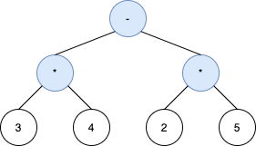
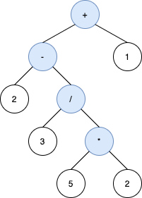
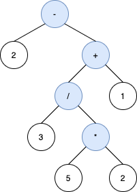
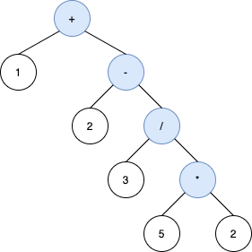

## Description

A **<a href="https://en.wikipedia.org/wiki/Binary_expression_tree" target="_blank">binary expression tree</a>** is a kind of binary tree used to represent arithmetic expressions. Each node of a binary expression tree has either zero or two children. Leaf nodes (nodes with 0 children) correspond to operands (numbers), and internal nodes (nodes with 2 children) correspond to the operators `'+'` (addition), `'-'` (subtraction), `'*'` (multiplication), and `'/'` (division).

For each internal node with operator `o`, the <a href="https://en.wikipedia.org/wiki/Infix_notation" target="_blank">**infix expression**</a> it represents is `(A o B)`, where `A` is the expression the left subtree represents and `B` is the expression the right subtree represents.

You are given a string `s`, an **infix expression** containing operands, the operators described above, and parentheses `'('` and `')'`.

Return *any valid **binary expression tree**, whose **<a href="https://en.wikipedia.org/wiki/Tree_traversal#In-order_(LNR)" target="_blank">in-order traversal</a>** reproduces *`s` *after omitting the parenthesis from it.*

**Please note that order of operations applies in **`s`**.** That is, expressions in parentheses are evaluated first, and multiplication and division happen before addition and subtraction.

Operands must also appear in the **same order** in both `s` and the in-order traversal of the tree.
### Function Contract

**Inputs**

- `s`: A valid infix arithmetic expression string containing single-digit operands (`'0'`-`'9'`), binary operators (`'+'`, `'-'`, `'*'`, `'/'`), and balanced parentheses (`'('`, `')'`).

**Return value**

Return the root `Node` of the constructed binary expression tree. Operands are leaf nodes and operators are internal nodes with left and right children.

### Examples
#### Example 1

- **Input:** `s = "3*4-2*5"`
- **Output:** `[-,*,*,3,4,2,5]`
- **Explanation:** The tree above is the only valid tree whose inorder traversal produces s.
#### Example 2

- **Input:** `s = "2-3/(5*2)+1"`
- **Output:** `[+,-,1,2,/,null,null,null,null,3,*,null,null,5,2]`
- **Explanation:** The inorder traversal of the tree above is 2-3/5*2+1 which is the same as s without the parenthesis. The tree also produces the correct result and its operands are in the same order as they appear in s.
The tree below is also a valid binary expression tree with the same inorder traversal as s, but it not a valid answer because it does not evaluate to the same value.

The third tree below is also not valid. Although it produces the same result and is equivalent to the above trees, its inorder traversal does not produce s and its operands are not in the same order as s.

#### Example 3

- **Input:** `s = "1+2+3+4+5"`
- **Output:** `[+,+,5,+,4,null,null,+,3,null,null,1,2]`
- **Explanation:** The tree [+,+,5,+,+,null,null,1,2,3,4] is also one of many other valid trees.
### Constraints

- $1 \le \text{s.length} \le 100$

- `s` consists of digits and the characters `'('`, `')'`, `'+'`, `'-'`, `'*'`, and `'/'`.

- Operands in `s` are **exactly** 1 digit.

- It is guaranteed that `s` is a valid expression.