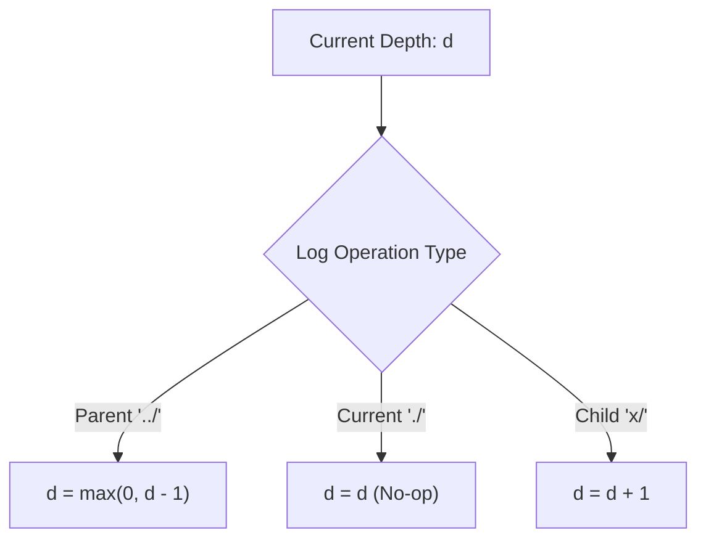

# Guided Example: Crawler Log Folder

This guide traces file-system depth tracking across directory navigation logs, demonstrating state-invariant clamping to calculate the minimum number of steps needed to return to the main folder.

- **Input Logs:** `logs = ["d1/", "d2/", "../", "d21/", "./"]`
- **Target Value:** `2`

---

## 1. Instance & Teaching Goal

File system navigation operations move between nested folder levels:
- `"../"`: Move to the parent folder of the current folder. If already at the main (root) folder, remain there.
- `"./"`: Remain in the current directory (no-op).
- `"x/"`: Move into child folder named `x`.

The minimum number of `"../"` operations required to return to the root folder corresponds directly to the terminal tree depth of the crawler relative to root level $0$.

```
Root (Depth 0)
└── d1/ (Depth 1)
    └── d2/ (Depth 2)  <-- "../" moves back to d1/ (Depth 1)
    └── d21/ (Depth 2) <-- "./" keeps crawler at d21/ (Depth 2)
```

For `logs = ["d1/", "d2/", "../", "d21/", "./"]`, the final location is depth $2$, requiring exactly $2$ parent steps to reach the main directory.

Our teaching goal is to model directory depth as a bounded scalar accumulator operating in $\mathcal{O}(N)$ time and $\mathcal{O}(1)$ auxiliary space.

---

## 2. Conceptual Foundation & Invariants

```
+-------------------------------------------------------------------------+
|                  BOUNDED DEPTH STATE TRANSITIONS                        |
|                                                                         |
|  Depth state: d >= 0 (starts at d = 0 for root)                         |
|                                                                         |
|  Operation 1: "../"  (Parent step)                                      |
|    d' = max(0, d - 1)  <-- Clamped at 0 (cannot ascend above root)      |
|                                                                         |
|  Operation 2: "./"   (Identity step)                                    |
|    d' = d              <-- Preserves current depth                      |
|                                                                         |
|  Operation 3: "x/"   (Child step)                                       |
|    d' = d + 1          <-- Enters new nested folder                     |
+-------------------------------------------------------------------------+
```

| Log Pattern | Formal Rule | State Transition | Physical File System Meaning |
|---|---|---|---|
| `"../"` | Ascend to parent | $d \leftarrow \max(0, d - 1)$ | Pop current folder; stay at root if already at $0$ |
| `"./"` | Self-reference | $d \leftarrow d$ | Idempotent touch within current working directory |
| `"x/"` | Descend to child | $d \leftarrow d + 1$ | Push child folder onto active directory path |

> **Non-Negative Depth Invariant.** The depth $d$ of any valid directory path relative to the root cannot be negative ($d \ge 0$). Ascending while at the root ($d = 0$) leaves the position invariant at $d = 0$. Clamping the subtraction via $\max(0, d - 1)$ prevents phantom deficits that would distort subsequent child traversals.



---

## 3. Step-by-Step Worked Execution

### Initialization
- Start at main directory: $\text{depth} = 0$.

---

### Step 1: Process `"d1/"`
- Category: Child directory descent.
- Depth increment:
  $$\text{depth} \leftarrow 0 + 1 = 1$$
- Current position: `/d1/`.

---

### Step 2: Process `"d2/"`
- Category: Child directory descent.
- Depth increment:
  $$\text{depth} \leftarrow 1 + 1 = 2$$
- Current position: `/d1/d2/`.

---

### Step 3: Process `"../"`
- Category: Parent directory ascent.
- Depth decrement with lower bound clamp:
  $$\text{depth} \leftarrow \max(0, 2 - 1) = 1$$
- Current position: `/d1/`.

---

### Step 4: Process `"d21/"`
- Category: Child directory descent.
- Depth increment:
  $$\text{depth} \leftarrow 1 + 1 = 2$$
- Current position: `/d1/d21/`.

---

### Step 5: Process `"./"`
- Category: Self-directory reference.
- Depth invariant:
  $$\text{depth} \leftarrow 2$$
- Current position remains `/d1/d21/`.

Log stream exhausted. Terminal depth is $2$.

---

## 4. Complete Execution Trace

| Step | Log Token | Operation Class | Action Taken | Previous Depth | Resulting Depth |
|---|---|---|---|---|---|
| Init | — | Start | Initialize root state | — | $0$ |
| 1 | `"d1/"` | Child | Increment depth | $0$ | $1$ |
| 2 | `"d2/"` | Child | Increment depth | $1$ | $2$ |
| 3 | `"../"` | Parent | Decrement with clamp $\max(0, d-1)$ | $2$ | $1$ |
| 4 | `"d21/"` | Child | Increment depth | $1$ | $2$ |
| 5 | `"./"` | Stay | No change | $2$ | $2$ |

At termination, the crawler sits at depth $2$. Navigating back to the main directory requires exactly $2$ successive `"../"` commands.

---

## 5. Algorithmic Correctness

**Soundness.** Let $P$ be the path from the root folder to the current working directory. The length of $P$ (excluding the root) corresponds to the integer depth $d$. Each step `"x/"` appends a folder to $P$, increasing length by $1$. Each step `"./"` preserves $P$. Each step `"../"` pops the deepest folder from $P$ if $P$ is non-empty, and leaves $P$ empty if already at the root. Therefore, the scalar update $d \leftarrow \max(0, d - 1)$ faithfully tracks $|P|$. Because each parent operation reduces non-zero depth by at most $1$, at least $d$ steps are necessary to reach $d = 0$, and executing `"../"` $d$ times is sufficient.

**Completeness.** Every operation in `logs` belongs to one of three mutually exclusive formats: `"../"`, `"./"`, or `"x/"`. The sequential scan processes each token without skipping, and clamping prevents any spurious underflow. Thus, the final value of $d$ is exact.

---

## 6. Traps This Instance Exposes

- **Unclamped Negative Net Depth:** Simply subtracting $1$ for `"../"` without clamping can lead to negative depth (e.g. `logs = ["../", "../", "d1/"]`). A simple sum $(-1) + (-1) + 1 = -1$ would yield an invalid depth, whereas the true depth is $\max(0, 0-1) \to 0$, $\max(0, 0-1) \to 0$, $0 + 1 = 1$.
- **Redundant Stack Overhead:** Maintaining an explicit stack of folder names (`["d1", "d21"]`) consumes unnecessary dynamic memory ($\mathcal{O}(N)$ space) when only the numeric depth is requested.
- **Prefix Collision in Log Classification:** Both `"../"` and `"./"` start with a dot (`'.'`). Condition checks must explicitly test for `"../"` first before using dot-prefix shortcuts to identify `"./"`.

---

## 7. Complexity Derivation

- **Time Complexity:** $\mathcal{O}(N)$, where $N$ is the number of logs. Each log string is inspected and parsed in $\mathcal{O}(1)$ time, as string lengths are bounded by $10$ characters.
- **Auxiliary Space Complexity:** $\mathcal{O}(1)$ auxiliary space, as only a single scalar integer accumulator `depth` is maintained in memory.
