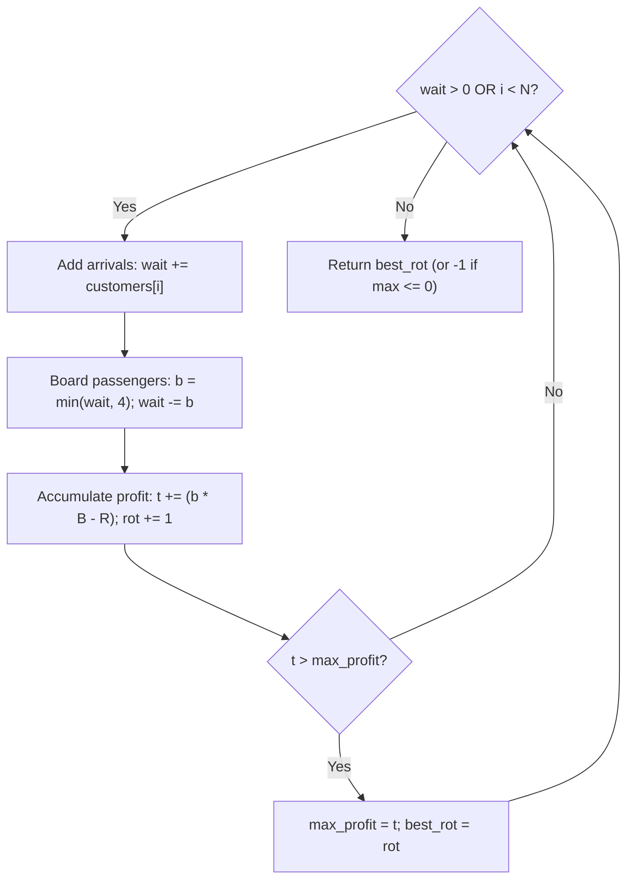

# Guided Example: Maximum Profit of Operating a Centennial Wheel

This guide traces the discrete queue simulation and cumulative profit tracking used to identify the optimal stopping rotation for operating a Ferris wheel under queue capacity constraints and operation fees.

- **Arrival Schedule:** `customers = [8, 3]`
- **Boarding Revenue:** `boardingCost = 5` per customer
- **Running Fee:** `runningCost = 6` per rotation
- **Target Value:** `3` rotations (Yielding maximum profit of $37$)

---

## 1. Instance & Teaching Goal

A Ferris wheel operates under mechanical and business rules:
1. Each rotation brings a new 4-seat gondola to the boarding platform. At most $4$ waiting passengers board per rotation.
2. Passengers in `customers[i]` arrive just before rotation $i+1$. Unboarded passengers wait in a FIFO backlog queue.
3. Every boarded passenger yields `boardingCost`, while every rotation incurs a fixed `runningCost`.
4. If the wheel stops operating, passengers currently on the wheel ride for free until they exit. We seek the rotation count that achieves the maximum cumulative net profit. If no positive profit can be made, return $-1$. In the event of ties, return the smallest rotation count.

```
Rotation 1: 8 arrive -> 4 board (wait: 4) -> Net: +14, Profit: 14
Rotation 2: 3 arrive -> 4 board (wait: 3) -> Net: +14, Profit: 28
Rotation 3: 0 arrive -> 3 board (wait: 0) -> Net:  +9, Profit: 37 (Max)
```

Our teaching goal is to simulate queue accumulation and drainage, evaluating profit sequentially in $\mathcal{O}(N)$ time and $\mathcal{O}(1)$ auxiliary space.

---

## 2. Conceptual Foundation & Invariants

```
+-------------------------------------------------------------------------+
|                  FERRIS WHEEL REVENUE SIMULATION MODEL                  |
|                                                                         |
|  Loop Condition: While arrivals remain OR waiting backlog > 0           |
|                                                                         |
|  Step 1: Arrival & Queue Accumulation                                   |
|    wait += (customers[i] if i < len else 0)                             |
|                                                                         |
|  Step 2: Gondola Boarding (Capacity 4)                                  |
|    boarded = min(wait, 4)                                               |
|    wait   -= boarded                                                    |
|                                                                         |
|  Step 3: Incremental & Cumulative Accounting                            |
|    net_gain = boarded * boardingCost - runningCost                      |
|    current_profit += net_gain                                           |
|                                                                         |
|  Step 4: Strict Tie-Breaking Max Update                                |
|    if current_profit > max_profit:                                      |
|        max_profit = current_profit                                      |
|        best_rotation = current_rotation                                 |
+-------------------------------------------------------------------------+
```

| Parameter | Mathematical Formulation | Role in Decision Process |
|---|---|---|
| Waiting Backlog (`wait`) | $\sum \text{arrivals} - \sum \text{boarded}$ | Customers queued for future rotations |
| Boarded Count | $\min(\text{wait}, 4)$ | Customers loaded onto the incoming 4-seat gondola |
| Marginal Profit | $\text{boarded} \cdot B - R$ | Net revenue change for the active rotation |
| Cumulative Profit ($t$) | $\sum (\text{boarded} \cdot B - R)$ | Total earnings if operator ceases service after rotation $k$ |
| Peak Tracker (`mx`) | $\max(0, \max t)$ | Highest strictly positive profit discovered |
| Minimum Rotations (`ans`) | Earliest rotation achieving `mx` | Required return value (defaults to $-1$) |

> **Strict Monotonicity Invariant.** Updating the record stopping point only when $t > \text{mx}$ strictly preserves the smallest rotation count whenever multiple rotations achieve identical maximum cumulative profit. Starting `mx` at $0$ guarantees that non-positive outcomes return $-1$.



---

## 3. Step-by-Step Worked Execution

### Rotation 1 ($i = 0$)
- Arrival: $\text{customers}[0] = 8$. Backlog becomes $\text{wait} = 0 + 8 = 8$.
- Capacity check: $\text{boarded} = \min(8, 4) = 4$.
- Backlog remaining: $\text{wait} = 8 - 4 = 4$.
- Marginal calculation:
  $$\text{gain} = 4 \times 5 - 6 = 20 - 6 = 14$$
- Cumulative profit: $t = 0 + 14 = 14$.
- Profit check: $14 > 0 \implies \text{mx} = 14, \text{ans} = 1$.

---

### Rotation 2 ($i = 1$)
- Arrival: $\text{customers}[1] = 3$. Backlog becomes $\text{wait} = 4 + 3 = 7$.
- Capacity check: $\text{boarded} = \min(7, 4) = 4$.
- Backlog remaining: $\text{wait} = 7 - 4 = 3$.
- Marginal calculation:
  $$\text{gain} = 4 \times 5 - 6 = 20 - 6 = 14$$
- Cumulative profit: $t = 14 + 14 = 28$.
- Profit check: $28 > 14 \implies \text{mx} = 28, \text{ans} = 2$.

---

### Rotation 3 ($i = 2 \ge N$)
- Arrival: No scheduled arrivals ($0$). Backlog: $\text{wait} = 3$.
- Capacity check: $\text{boarded} = \min(3, 4) = 3$.
- Backlog remaining: $\text{wait} = 3 - 3 = 0$.
- Marginal calculation:
  $$\text{gain} = 3 \times 5 - 6 = 15 - 6 = 9$$
- Cumulative profit: $t = 28 + 9 = 37$.
- Profit check: $37 > 28 \implies \text{mx} = 37, \text{ans} = 3$.

---

### Loop Termination
Arrivals exhausted ($i = 2 \ge 2$) and backlog is empty ($\text{wait} = 0$). Any further rotation would board $0$ customers and incur $-6$ profit. Simulation halts. Result is $\text{ans} = 3$.

---

## 4. Complete Execution Trace

| Rotation | New Arrivals | Queue Before Boarding | Boarded Count | Remaining Queue | Marginal Profit ($b \cdot 5 - 6$) | Cumulative Profit $t$ | Best Profit $\text{mx}$ | Best Rotation $\text{ans}$ |
|---|---|---|---|---|---|---|---|---|
| Init | — | — | — | $0$ | — | $0$ | $0$ | $-1$ |
| 1 | $8$ | $8$ | $4$ | $4$ | $20 - 6 = +14$ | $14$ | $14$ | $1$ |
| 2 | $3$ | $7$ | $4$ | $3$ | $20 - 6 = +14$ | $28$ | $28$ | $2$ |
| 3 | $0$ | $3$ | $3$ | $0$ | $15 - 6 = +9$ | $37$ | $37$ | $3$ |

---

## 5. Algorithmic Correctness

**Soundness.** At every rotation $k$, the simulation accurately applies the problem constraints: incoming arrivals join the queue, up to $4$ passengers board the next gondola, and operating revenues and costs are credited. Since operating zero rotations gives profit $0$, a viable stopping plan must yield cumulative profit $> 0$. Initializing $\text{mx} = 0$ ensures only strictly positive profits update $\text{ans}$. Updating $\text{ans}$ strictly when $t > \text{mx}$ ensures that when two rotations tie for peak earnings, the smaller rotation number is retained.

**Completeness.** Any rotation performed after both scheduled arrivals have finished and the waiting queue has emptied incurs running cost without boarding passengers ($0 \cdot B - R = -R < 0$), strictly decreasing cumulative profit. Thus, stopping the simulation the moment both $\text{wait} = 0$ and $i \ge N$ ensures no potentially profitable stopping point is omitted.

---

## 6. Traps This Instance Exposes

- **Premature Halting on Arrival Exhaustion:** Terminating the loop immediately when $i = \text{len}(\text{customers})$ abandons passengers still waiting in the queue. In this instance, halting after rotation 2 would miss rotation 3 and sacrifice $9$ additional profit.
- **Tied Maximum Rotation Overwrite:** Using $\ge$ instead of $>$ replaces the earliest optimal rotation with a later rotation that merely ties it in profit, violating the requirement to minimize total rotations.
- **Negative Profit Acceptance:** If running costs consistently exceed boarding revenue (e.g. $B = 1, R = 10$), total profit will be negative. Starting $\text{mx}$ at a large negative value would erroneously return a rotation count resulting in financial loss instead of $-1$.

---

## 7. Complexity Derivation

- **Time Complexity:** $\mathcal{O}(N + \text{Queue Drain Rotations}) = \mathcal{O}(N + \sum A / 4) = \mathcal{O}(N)$, where $N$ is the length of `customers` and $A$ is the total number of arriving customers. Since each entry $\text{customers}[i] \le 50$, the backlog drains in at most $\lceil 50N / 4 \rceil = \mathcal{O}(N)$ additional iterations.
- **Auxiliary Space Complexity:** $\mathcal{O}(1)$ auxiliary space, maintaining only scalar accumulators for backlog, cumulative profit, and optimal rotation index.
