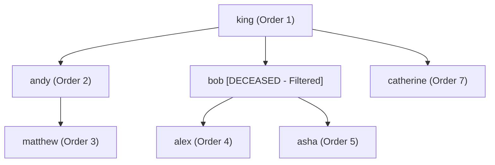

# Guided Example: Throne Inheritance

This guide demonstrates family-tree preorder traversal modeling and tombstone death markers to compute dynamic dynastic succession in real time.

- **King Root:** `"king"`
- **Events:** Multiple births, death of `"bob"`, and inheritance order queries
- **Target Successions:**
  - Before death: `["king", "andy", "matthew", "bob", "alex", "asha", "catherine"]`
  - After death of `"bob"`: `["king", "andy", "matthew", "alex", "asha", "catherine"]`

---

## 1. Instance & Teaching Goal

Dynastic succession follows strict lineage precedence:
1. An individual precedes all of their descendants.
2. An older child and all of that child's descendants precede any younger sibling and the younger sibling's descendants.
3. If an individual in the line of succession dies, their living descendants retain their exact position in the line, but the deceased individual is omitted from the royal roster.

```
                    [king]
          /           |           \
      [andy]        [bob]†      [catherine]
        |           /    \
    [matthew]   [alex]  [asha]
```
*(† denotes deceased individual retained as an structural routing node)*

Our teaching goal is to model royal succession as an ordered $N$-ary tree preorder depth-first traversal with a tombstone death set, executing births and deaths in $\mathcal{O}(1)$ time and succession queries in $\mathcal{O}(P)$ time.

---

## 2. Conceptual Foundation & Invariants

```
+-------------------------------------------------------------------------+
|                  DYNASTIC PREORDER SUCCESSION MODEL                     |
|                                                                         |
|  Data Structures:                                                       |
|    root:       Name of the founding monarch ("king")                    |
|    children:   Map from parent -> ordered list of children [c1, c2, ...] |
|    dead:       Hash set of deceased individuals                         |
|                                                                         |
|  Preorder DFS Routine: dfs(person):                                     |
|    1. If person not in dead:                                            |
|         append person to result                                         |
|    2. For each child in children[person] (birth order):                 |
|         dfs(child)                                                      |
+-------------------------------------------------------------------------+
```

| Component | Formal Type | Algorithmic Responsibility |
|---|---|---|
| Dynastic Adjacency Map | $\text{children}: \text{Name} \to [\text{Name}]$ | Preserves chronological birth order of siblings |
| Tombstone Set | $\text{dead} \subset \text{Names}$ | $\mathcal{O}(1)$ query exclusion without tree mutation |
| Query Generator | $\text{DFS}(\text{root})$ | Generates instantaneous snapshot of living heirs |

> **Tombstone Invariant.** When an individual dies, they must never be severed or removed from the family tree. Deleting a deceased node orphans their children or disrupts the structural branch order. Marking a name in a separate `dead` set allows traversal to pass through deceased ancestors seamlessly while excluding their names from the returned succession list.



---

## 3. Step-by-Step Worked Execution

### Step 1: Birth Events Construction
Execute chronological births:
- `birth("king", "andy")` $\implies \text{children}[\text{"king"}] = [\text{"andy"}]$
- `birth("king", "bob")` $\implies \text{children}[\text{"king"}] = [\text{"andy"}, \text{"bob"}]$
- `birth("king", "catherine")` $\implies \text{children}[\text{"king"}] = [\text{"andy"}, \text{"bob"}, \text{"catherine"}]$
- `birth("andy", "matthew")` $\implies \text{children}[\text{"andy"}] = [\text{"matthew"}]$
- `birth("bob", "alex")` $\implies \text{children}[\text{"bob"}] = [\text{"alex"}]$
- `birth("bob", "asha")` $\implies \text{children}[\text{"bob"}] = [\text{"alex"}, \text{"asha"}]$

---

### Step 2: First Succession Query (`getInheritanceOrder()`)
Traverse dynastic tree rooted at `"king"` via Preorder DFS:
1. Visit `"king"`: alive $\implies$ Emit `"king"`.
2. First child of `"king"` is `"andy"`:
   - Visit `"andy"`: alive $\implies$ Emit `"andy"`.
   - First child of `"andy"` is `"matthew"`:
     - Visit `"matthew"`: alive $\implies$ Emit `"matthew"`.
     - `"matthew"` has no children; return to `"andy"`.
   - `"andy"` has no further children; return to `"king"`.
3. Second child of `"king"` is `"bob"`:
   - Visit `"bob"`: alive $\implies$ Emit `"bob"`.
   - First child of `"bob"` is `"alex"`:
     - Visit `"alex"`: alive $\implies$ Emit `"alex"`.
   - Second child of `"bob"` is `"asha"`:
     - Visit `"asha"`: alive $\implies$ Emit `"asha"`.
   - Return to `"king"`.
4. Third child of `"king"` is `"catherine"`:
   - Visit `"catherine"`: alive $\implies$ Emit `"catherine"`.

Order 1: `["king", "andy", "matthew", "bob", "alex", "asha", "catherine"]`.

---

### Step 3: Death Event (`death("bob")`)
- Insert `"bob"` into `dead`: `dead = {"bob"}`.
- Graph topology is strictly preserved; no pointers or lists are altered.

---

### Step 4: Second Succession Query (`getInheritanceOrder()`)
Preorder DFS repeated from `"king"`:
1. Emit `"king"`.
2. Visit `"andy"` $\implies$ Emit `"andy"`.
3. Visit `"matthew"` $\implies$ Emit `"matthew"`.
4. Visit `"bob"`:
   - Check membership: `"bob" \in \text{dead}`.
   - Suppress emission of `"bob"`.
   - Continue traversal into children of `"bob"` in birth order:
     - Visit `"alex"`: not in `dead` $\implies$ Emit `"alex"`.
     - Visit `"asha"`: not in `dead` $\implies$ Emit `"asha"`.
5. Visit `"catherine"` $\implies$ Emit `"catherine"`.

Order 2: `["king", "andy", "matthew", "alex", "asha", "catherine"]`.

---

## 4. Complete Execution Trace

| Traversal Sequence | Active Node | Node Status | Action Taken | Current Output Roster |
|---|---|---|---|---|
| 1 | `"king"` | Alive | Emit root | `["king"]` |
| 2 | `"andy"` | Alive | Emit first child of king | `["king", "andy"]` |
| 3 | `"matthew"` | Alive | Emit child of andy | `["king", "andy", "matthew"]` |
| 4 | `"bob"` | **Dead** | Filtered; traverse children | `["king", "andy", "matthew"]` |
| 5 | `"alex"` | Alive | Emit first child of bob | `["king", "andy", "matthew", "alex"]` |
| 6 | `"asha"` | Alive | Emit second child of bob | `["king", "andy", "matthew", "alex", "asha"]` |
| 7 | `"catherine"` | Alive | Emit third child of king | `["king", "andy", "matthew", "alex", "asha", "catherine"]` |

---

## 5. Algorithmic Correctness

**Soundness.** Preorder traversal visits a parent node before any of its children, and visits children in the order they were inserted into the adjacency list. Because `birth()` appends each new child to the end of the parent's list, insertion order matches chronological birth order. Filtering living individuals through the condition `person not in dead` ensures that only living family members enter the returned sequence without disturbing the relative ordering of any descendants.

**Completeness.** Every birth registers an directed edge from an existing parent to a new child, creating an acyclic tree rooted at the monarch. Because DFS exhaustively visits all reachable nodes from the monarch, every living person in the royal lineage is reached and appended.

---

## 6. Traps This Instance Exposes

- **Structural Pruning Hazard on Death:** Deleting a node when a person dies disconnects their subtree from the root, inadvertently eliminating all of their living descendants from succession. Deaths must be recorded as tombstones.
- **Eager List Maintenance Pitfall:** Attempting to maintain a flattened dynamic array of living heirs on every birth or death requires expensive mid-array insertions ($\mathcal{O}(P)$) to locate the correct branch. Storing the hierarchy as an adjacency tree keeps `birth` and `death` $\mathcal{O}(1)$.
- **Deep Lineage Recursion Limits:** In languages with low recursion depth limits, deep linear generational chains (e.g. $10^5$ single-child descendants) can cause stack overflow. An iterative preorder DFS using an explicit stack where children are pushed in reverse birth order guarantees memory safety.

---

## 7. Complexity Derivation

- **Time Complexity:**
  - `birth(parent, child)`: $\mathcal{O}(1)$ amortized time to append to the adjacency list.
  - `death(person)`: $\mathcal{O}(1)$ expected time to insert into the hash set.
  - `getInheritanceOrder()`: $\mathcal{O}(P)$ time, where $P$ is the total number of people in the dynasty. Every node in the family tree is visited once during the depth-first search.
- **Auxiliary Space Complexity:** $\mathcal{O}(P)$ auxiliary space to store the child adjacency lists, tombstone set, call stack (or explicit traversal stack), and output roster.
