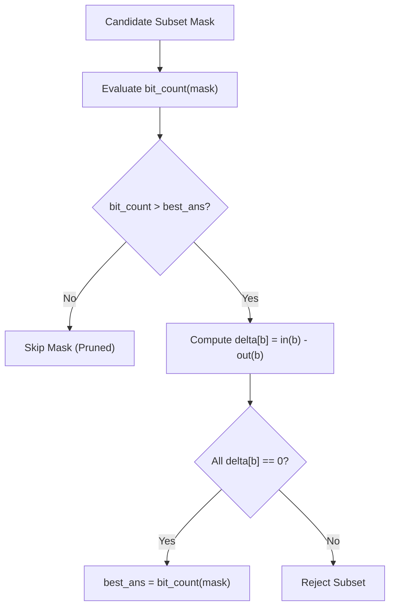

# Guided Example: Maximum Number of Achievable Transfer Requests

This guide demonstrates bitmask subset enumeration and graph flow divergence checking to determine the maximum subset of employee building transfer requests that preserves exact occupancy balance.

- **Number of Buildings:** $n = 5$ (Indices $0$ to $4$)
- **Transfer Requests:** `[[0, 1], [1, 0], [0, 1], [1, 2], [2, 0], [3, 4]]` ($M = 6$ requests)
- **Target Value:** `5` achievable requests (Selecting indices $\{0, 1, 2, 3, 4\}$)

---

## 1. Instance & Teaching Goal

Each transfer request $[u, v]$ moves an employee from building $u$ to building $v$. The total number of employees in each building after all accepted transfers must remain identical to the initial occupancy. Mathematically, for every building $b \in \{0, \dots, n-1\}$, the net divergence must be zero:
$$\Delta(b) = \text{deg}_{\text{in}}(b) - \text{deg}_{\text{out}}(b) = 0$$

In graph-theoretic terms, accepted requests form a set of directed edges where every connected component is Eulerian (in-degree equals out-degree at every vertex), decomposing into directed cycles.

```
Cycle A (Requests 0 & 1):
  [0] <=======> [1]     (Net delta: 0 for both)

Cycle B (Requests 2, 3, & 4):
  [0] -------> [1]
   ^            |
   |            v
   +---------- [2]      (Net delta: 0 for all three)

Unbalanced Edge (Request 5):
  [3] -------> [4]      (Delta: -1 for [3], +1 for [4] -> Rejected)
```

Combining Cycle A and Cycle B accepts $2 + 3 = 5$ requests while maintaining perfect net balance across all buildings.

Our teaching goal is to trace bitmask subset exploration, size pruning, and net-flow verification across $2^M$ subsets.

---

## 2. Conceptual Foundation & Invariants

```
+-------------------------------------------------------------------------+
|                  BITMASK EULERIAN FLOW CONSERVATION                     |
|                                                                         |
|  Subset Mask: Integer mask in [0, 2^M - 1]                              |
|    Bit i = 1: Request i is accepted                                     |
|    Bit i = 0: Request i is rejected                                     |
|                                                                         |
|  Pruning Guard:                                                         |
|    If bit_count(mask) <= current_best_answer:                           |
|        Skip flow verification (cannot strictly improve answer)          |
|                                                                         |
|  Balance Evaluation (check):                                            |
|    Initialize delta[0..n-1] = 0                                         |
|    For each accepted request i with edge (u, v):                        |
|        delta[u] -= 1  (Employee departs u)                              |
|        delta[v] += 1  (Employee enters v)                               |
|    Feasible <=> for all b in [0..n-1], delta[b] == 0                    |
+-------------------------------------------------------------------------+
```

| Component | Mathematical Definition | Role in Feasibility Analysis |
|---|---|---|
| Request Pool | $\mathcal{R} = \{e_0, \dots, e_{M-1}\}$ | Candidate directed edges $u \to v$ |
| Candidate Mask | $S \subseteq \mathcal{R}$ | Subgraph of selected transfer requests |
| Divergence Vector $\Delta$ | $\Delta[b] = \lvert \{e \in S : \text{to}(e) = b\} \rvert - \lvert \{e \in S : \text{from}(e) = b\} \rvert$ | Net employee change per building |
| Zero-Net Constraint | $\Delta[b] = 0 \quad \forall b \in \{0, \dots, n-1\}$ | Mandatory condition for request achievability |

> **Zero-Divergence Conservation Invariant.** A request subset $S$ is achievable if and only if $\sum_{e \in S} (\mathbf{e}_{\text{to}(e)} - \mathbf{e}_{\text{from}(e)}) = \mathbf{0}$, where $\mathbf{e}_b$ is the standard basis vector for building $b$. Summing divergences across all buildings is always identically zero ($\sum \Delta[b] = 0$), but feasibility strictly requires that every individual coordinate satisfies $\Delta[b] = 0$.



---

## 3. Step-by-Step Worked Execution

### Inspecting Candidate Subsets

With $M = 6$ requests, there are $2^6 = 64$ possible bitmasks.

---

### Candidate 1: Full Set (Mask `111111`$_2 = 63$, Size 6)
- Includes all requests $\{0, 1, 2, 3, 4, 5\}$.
- Size: $6 > 0$.
- Evaluate divergence vector $\Delta$:
  - Req 0: $0 \to 1 \implies \Delta[0] = -1, \Delta[1] = +1$.
  - Req 1: $1 \to 0 \implies \Delta[0] = 0, \Delta[1] = 0$.
  - Req 2: $0 \to 1 \implies \Delta[0] = -1, \Delta[1] = +1$.
  - Req 3: $1 \to 2 \implies \Delta[1] = 0, \Delta[2] = +1$.
  - Req 4: $2 \to 0 \implies \Delta[2] = 0, \Delta[0] = 0$.
  - Req 5: $3 \to 4 \implies \Delta[3] = -1, \Delta[4] = +1$.
- Resulting vector: $\Delta = [0, 0, 0, -1, 1]$.
- Buildings $3$ and $4$ are unbalanced ($\Delta[3] \ne 0, \Delta[4] \ne 0$).
- Mask $63$ fails. Current best remains $ans = 0$.

---

### Candidate 2: Optimal Subset (Mask `011111`$_2 = 31$, Size 5)
- Includes requests $\{0, 1, 2, 3, 4\}$ (omits request 5).
- Size: $5 > 0$.
- Evaluate divergence vector $\Delta$:
  - Request 0 ($0 \to 1$): $\Delta[0] \leftarrow -1, \Delta[1] \leftarrow +1$
  - Request 1 ($1 \to 0$): $\Delta[1] \leftarrow 0, \Delta[0] \leftarrow 0$
  - Request 2 ($0 \to 1$): $\Delta[0] \leftarrow -1, \Delta[1] \leftarrow +1$
  - Request 3 ($1 \to 2$): $\Delta[1] \leftarrow 0, \Delta[2] \leftarrow +1$
  - Request 4 ($2 \to 0$): $\Delta[2] \leftarrow 0, \Delta[0] \leftarrow 0$
- Final vector:
  $$\Delta = [0, 0, 0, 0, 0]$$
- Every building satisfies $\Delta[b] = 0$.
- Feasible! Update best answer: $ans = \max(0, 5) = 5$.

---

### Pruning Subsets with Size $\le 5$
Any subsequent mask with $\text{bit\_count} \le 5$ is automatically skipped by the size guard `ans < cnt`, avoiding redundant flow verification for remaining sub-optimal masks. Since no 6-element subset is balanced, $ans = 5$ is certified maximal.

---

## 4. Complete Execution Trace

| Subset Mask (Binary) | Bit Count | Prune Guard ($\text{count} > ans$) | Included Requests | Divergence Vector $\Delta[0..4]$ | Feasibility Decision | Best Answer $ans$ |
|---|---|---|---|---|---|---|
| `000000` ($0$) | $0$ | $0 > 0$ (False) | $\emptyset$ | $[0, 0, 0, 0, 0]$ | Base state | $0$ |
| `000011` ($3$) | $2$ | $2 > 0$ (True) | $\{0, 1\}$ | $[0, 0, 0, 0, 0]$ | Balanced (2-cycle) | $2$ |
| `011100` ($28$) | $3$ | $3 > 2$ (True) | $\{2, 3, 4\}$ | $[0, 0, 0, 0, 0]$ | Balanced (3-cycle) | $3$ |
| `100000` ($32$) | $1$ | $1 > 3$ (False) | $\{5\}$ | $[0, 0, 0, -1, 1]$ | Skipped by size | $3$ |
| `011111` ($31$) | $5$ | $5 > 3$ (True) | $\{0, 1, 2, 3, 4\}$ | $[0, 0, 0, 0, 0]$ | **Balanced (Optimal)** | $5$ |
| `111111` ($63$) | $6$ | $6 > 5$ (True) | All $6$ requests | $[0, 0, 0, -1, 1]$ | Unbalanced ($\Delta[3]\ne 0$) | $5$ |
| All other masks | $\le 5$ | $\text{count} \le 5$ | Various subsets | — | Pruned by size | $5$ |

---

## 5. Algorithmic Correctness

**Soundness.** A subset of requests is accepted only if the divergence vector satisfies $\Delta[b] = 0$ for all $b \in \{0, \dots, n-1\}$. By definition, $\Delta[b]$ computes the exact difference between employees entering and leaving building $b$. When $\Delta[b] = 0$ everywhere, the net occupancy change of every building is zero, which satisfies the problem contract.

**Completeness.** Since $M \le 16$, the algorithm iterates through all $2^M$ binary combinations. The pruning condition tests $\text{bit\_count} > ans$; because any subset with fewer or equal requests cannot yield a strictly greater answer, skipping its divergence calculation cannot overlook a superior solution. The maximum valid size found is globally optimal.

---

## 6. Traps This Instance Exposes

- **Global Net Zero vs. Local Net Zero:** The sum of all elements in $\Delta$ is always zero ($\sum \Delta[b] = 0$) because every transfer has exactly one origin and one destination. Checking only the sum would erroneously validate unbalanced pairs (such as request 5 alone). Every building must be checked independently ($\Delta[b] = 0$).
- **Self-Loop Requests:** A request where $u = v$ decrements and increments the same building ($\Delta[u] \mathrel{-}= 1, \Delta[u] \mathrel{+}= 1$), net zero change. Self-transfers are always achievable and should always be counted toward the maximum.
- **Premature Halting:** Finding an Eulerian component of size $k$ does not imply that all larger subsets are invalid; multiple disjoint or overlapping cycles can combine to form a larger feasible configuration.

---

## 7. Complexity Derivation

- **Time Complexity:** $\mathcal{O}(2^M \cdot (M + N))$, where $M \le 16$ is the number of transfer requests and $N \le 20$ is the number of buildings. There are $2^M$ subsets. For each subset examined, computing the net divergence requires $\mathcal{O}(M)$ operations and verifying zero divergence takes $\mathcal{O}(N)$ operations. For $M = 16$, $2^{16} \cdot 36 \approx 2.3 \times 10^6$ operations, executing within tenths of a second.
- **Auxiliary Space Complexity:** $\mathcal{O}(N)$ auxiliary space for the divergence array tracking building net changes.
