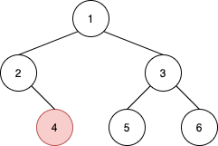
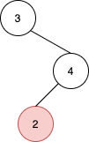

## Description

Given the `root` of a binary tree and a node `u` in the tree, return *the **nearest** node on the **same level** that is to the **right** of* `u`*, or return* `null` *if *`u` *is the rightmost node in its level*.
### Function Contract

**Inputs**

- `root`: The root `TreeNode` of a binary tree ($1 \le n \le 10^5$).
- `u`: A `TreeNode` object existing within the tree rooted at `root`.

**Return value**

Return the nearest `TreeNode` to the right of `u` at the same depth level, or `null` if `u` is the rightmost node on its level.

### Examples

#### Example 1

- **Input:** `root = [1,2,3,null,4,5,6], u = 4`
- **Output:** `5`
- **Explanation:** The nearest node on the same level to the right of node 4 is node 5.
#### Example 2

- **Input:** `root = [3,null,4,2], u = 2`
- **Output:** `null`
- **Explanation:** There are no nodes to the right of 2.
### Constraints

- The number of nodes in the tree is in the range $[1, 10^{5}]$.

- $1 \le \text{Node.val} \le 10^{5}$

- All values in the tree are **distinct**.

- `u` is a node in the binary tree rooted at `root`.