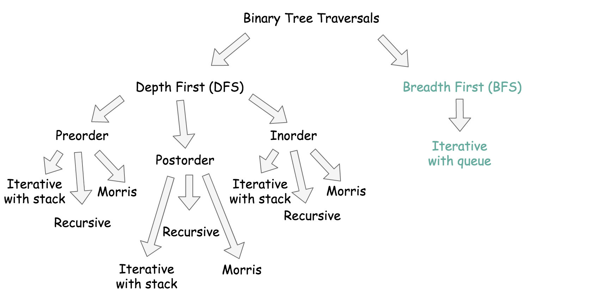
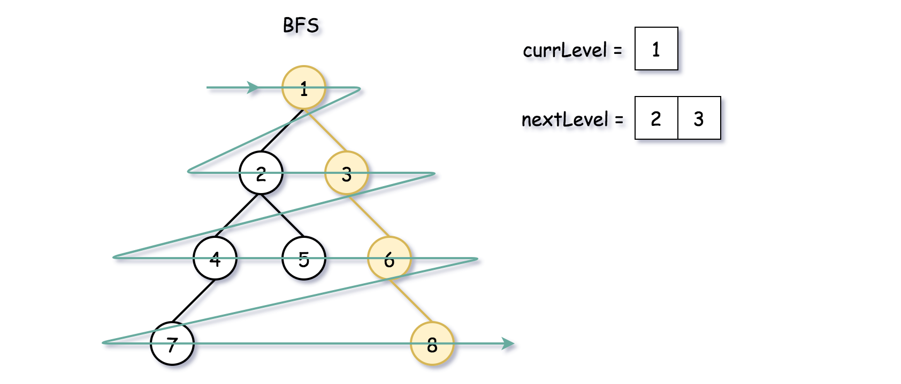
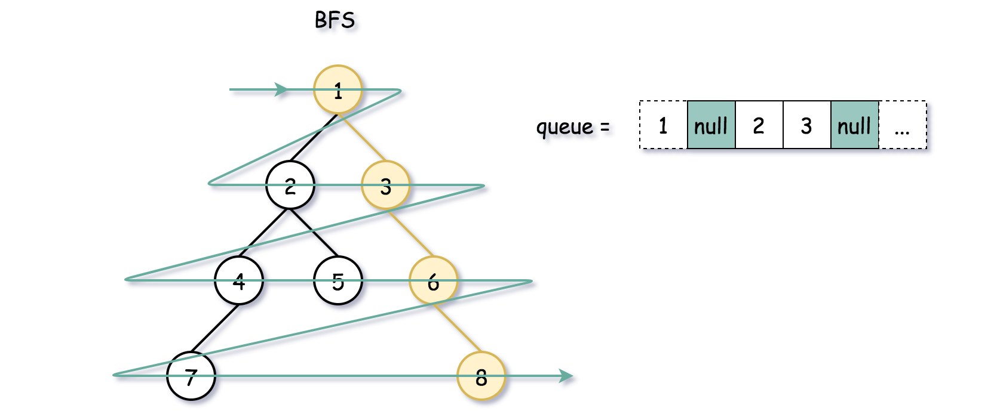
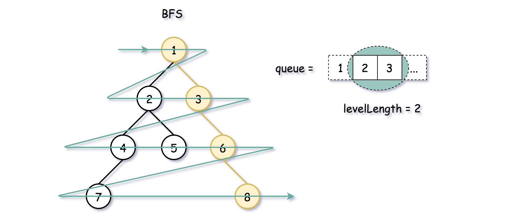

## Solution Article

---

### Overview

**DFS vs. BFS**

There are two ways to traverse the tree: DFS _depth first search_ and BFS _breadth first search_. Here is a small summary



BFS traverses level by level, and DFS first goes to the leaves.


> Which approach to choose, BFS or DFS?

- The problem is to return the nearest node on the same level that is to the right of `u`, so it's way more natural to implement BFS here.

- Time complexity is the same $\mathcal{O}(N)$ both for DFS and BFS since one has to visit all nodes.

- Space complexity is $\mathcal{O}(H)$ for DFS and $\mathcal{O}(D)$ for BFS, where $H$ is a tree height, and $D$ is a tree diameter. They both result in $\mathcal{O}(N)$ space in the worst-case scenarios: skewed tree for DFS and complete tree for BFS.

Let's use the opportunity to check out three different BFS implementations with the queue, Approach 1 - Approach 3.

If you prefer to use DFS on the interviews - check Approach 4.

**BFS implementation**

All three implementations use the queue in a standard BFS way:

- Push the root into the queue.

- Pop-out a node from the _left_.

- Push the _left_ child into the queue, and then push the _right_ child.


**Three BFS approaches**

The difference is how to identify the end of the level:

- Two queues, one for the previous level and one for the current.

- One queue with a sentinel to mark the end of the level.

- One queue + level size measurement.

<br />
<br />

---
### Approach 1: BFS: Two Queues

Let's use two queues: one for the current level, and one for the next. The idea is to pop the nodes one by one from the current level and push their children into the next level queue.



**Algorithm**

- Initiate two queues: one for the current level, and one for the next. Add root into `nextLevel` queue.

- While `nextLevel` queue is not empty:

- Initiate the current level: $currLevel = nextLevel$, and empty the next level `nextLevel`.

- While the current level queue is not empty:

- Pop-out a node from the current level queue.

- If this node is `u`, return the next node from the queue. If there are no more nodes in `nextLevel` queue, return `null`.

- Add first _left_ and then _right_ child node into `nextLevel` queue.

**Implementation**

```python
class Solution:
    def findNearestRightNode(self, root: TreeNode, u: TreeNode) -> TreeNode:
        if root is None:
            return []

        next_level = deque([root,])
        while next_level:
            # prepare for the next level
            curr_level = next_level
            next_level = deque()

            while curr_level:
                node = curr_level.popleft()

                if node == u:
                    return curr_level.popleft() if curr_level else None
                # add child nodes of the current level
                # in the queue for the next level
                if node.left:
                    next_level.append(node.left)
                if node.right:
                    next_level.append(node.right)
```

**Complexity Analysis**

* Time complexity: $\mathcal{O}(N)$ since one has to visit each node.

* Space complexity: $\mathcal{O}(D)$ to keep the queues, where $D$ is a tree diameter. Let's use the last level to estimate the queue size. This level could contain up to $N/2$ tree nodes in the case of [complete binary tree](https://leetcode.com/problems/count-complete-tree-nodes/).
<br />
<br />

---
### Approach 2: BFS: One Queue + Sentinel

Another approach is to push all the nodes in one queue and to use a [sentinel node](https://en.wikipedia.org/wiki/Sentinel_node) to separate the levels. Typically, one could use `null` as a sentinel.



The first step is to initiate the first level: `root` + `null` as a sentinel. Once it's done, continue to pop the nodes one by one from the left and push their children to the right. Stop each time the current node is `null` because it means we hit the end of the current level. Each stop is a time to push `null` in the queue to mark the end of the next level.

**Algorithm**

- Initiate the queue by adding a root. Add `null` sentinel to mark the end of the first level.

- Initiate the current node as `root`.

- While the queue is not empty:

- Pop the current node from the queue $curr = \text{queue.poll}()$.

- If this node is `u`, return the next node from the queue. If there are no more nodes in the queue, return `null`.

- If the current node is not `null`:

- Add first _left_ and then _right_ child node into the queue.

- Update the current node: $curr = \text{queue.poll}()$.

- Now, the current node is null, _i.e._ we reached the end of the current level. If the queue is not empty, push the null node as a sentinel, to mark the end of the next level.

**Implementation**

Note that `ArrayDeque` in Java doesn't support null elements, and hence the data structure to use here is `LinkedList`.

```python
class Solution:
    def findNearestRightNode(self, root: TreeNode, u: TreeNode) -> TreeNode:
        if root is None:
            return None

        queue = deque([root, None,])
        while queue:
            curr = queue.popleft()

            # if it's the given node
            if curr == u:
                return queue.popleft()

            if curr:
                # add child nodes in the queue
                if curr.left:
                    queue.append(curr.left)
                if curr.right:
                    queue.append(curr.right)
            else:
                # once the level is finished,
                # add a sentinel to mark end of level
                if queue:
                    queue.append(None)
```

**Complexity Analysis**

* Time complexity: $\mathcal{O}(N)$ since one has to visit each node.

* Space complexity: $\mathcal{O}(D)$ to keep the queues, where $D$ is a tree diameter. Let's use the last level to estimate the queue size. This level could contain up to $N/2$ tree nodes in the case of [complete binary tree](https://leetcode.com/problems/count-complete-tree-nodes/).
<br />
<br />

---
### Approach 3: BFS: One Queue + Level Size Measurements

Instead of using the sentinel, we could write down the length of the current level.



**Algorithm**

- Initiate the queue by adding a root.

- While the queue is not empty:

- Write down the length of the current level: $levelLength = \text{queue.size}()$.

- Iterate over `i` from `0` to $\text{level}_{length} - 1$:

- Pop the current node from the queue: $node = \text{queue.poll}()$.

- If this node is `u`, return the next node from the queue. Check that the next node is on the same level: $i \neq levelLength - 1$, otherwise return `null`.

- Add first _left_ and then _right_ child node into the queue.

**Implementation**

```python
class Solution:
    def findNearestRightNode(self, root: TreeNode, u: TreeNode) -> TreeNode:
        if root is None:
            return None

        queue = deque([root,])
        while queue:
            level_length = len(queue)

            for i in range(level_length):
                node = queue.popleft()
                # if it's the given node
                if node == u:
                    return queue.popleft() if i != level_length - 1 else None

                # add child nodes in the queue
                if node.left:
                    queue.append(node.left)
                if node.right:
                    queue.append(node.right)
```

**Complexity Analysis**

* Time complexity: $\mathcal{O}(N)$ since one has to visit each node.

* Space complexity: $\mathcal{O}(D)$ to keep the queues, where $D$ is a tree diameter. Let's use the last level to estimate the queue size. This level could contain up to $N/2$ tree nodes in the case of [complete binary tree](https://leetcode.com/problems/count-complete-tree-nodes/).
<br />
<br />

___
### Approach 4: Recursive DFS: Preorder Traversal

Everyone likes recursive DFS because of its simplicity, so let's add it here as well. The idea is straightforward: to perform a standard preorder traversal of the tree, starting each time from the leftmost child.

**Implementation**

```python
class Solution:
    def findNearestRightNode(self, root: TreeNode, u: TreeNode) -> TreeNode:
        def dfs(current_node, depth):
            nonlocal u_depth, next_node
            # the depth to look for next node is identified
            if current_node == u:
                u_depth = depth
                return
            # we're on the level to look for the next node
            if depth == u_depth:
                # if this next node is not identified yet
                if next_node is None:
                    next_node = current_node
                return
            # continue to traverse the tree
            if current_node.left:
                dfs(current_node.left, depth + 1)
            if current_node.right:
                dfs(current_node.right, depth + 1)

        u_depth, next_node = -1, None
        dfs(root, 0)
        return next_node
```

**Complexity Analysis**

* Time complexity: $\mathcal{O}(N)$ since one has to visit each node.

* Space complexity: $\mathcal{O}(H)$ to keep the recursion stack, where $H$ is the tree height. The worst-case situation is a skewed tree when $H = N$.