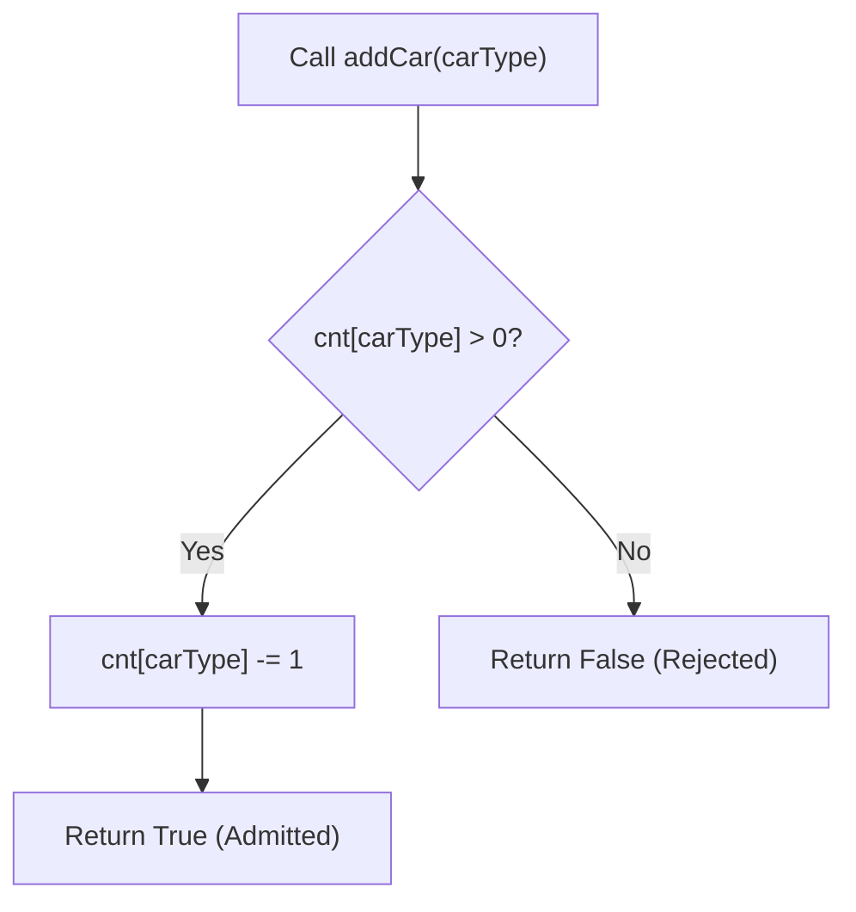

# Guided Example: Design Parking System

This guide demonstrates stateful capacity decrement tracking and constant-time boundary checking to manage a multi-tiered vehicle parking garage.

- **Initial Capacities:** `big = 1, medium = 1, small = 0`
- **Operation Calls:**
  - `addCar(1)` (Big)
  - `addCar(2)` (Medium)
  - `addCar(3)` (Small)
  - `addCar(1)` (Big)
- **Target Output Sequence:** `[null, true, true, false, false]`

---

## 1. Instance & Teaching Goal

A parking facility maintains a fixed allocation of slots across three independent car types:
- Type $1$: Big
- Type $2$: Medium
- Type $3$: Small

A car of type $t$ can park if and only if there is at least one remaining slot for type $t$. Slots cannot be substituted (a big car cannot park in a medium slot, nor vice versa). When a car parks successfully, the available count for that type decreases by $1$, and the system returns `true`. If no slots remain, no state changes occur and the system returns `false`.

```
Initial Capacity:
  [Type 1: Big]    -> (1 slot available)
  [Type 2: Medium] -> (1 slot available)
  [Type 3: Small]  -> (0 slots available)

Events:
  Car 1 (Big) arrives    --> Parks! (0 Big slots remain) -> Returns true
  Car 2 (Medium) arrives --> Parks! (0 Medium remain)    -> Returns true
  Car 3 (Small) arrives  --> Rejected! (Capacity full)   -> Returns false
  Car 1 (Big) arrives    --> Rejected! (Capacity full)   -> Returns false
```

Our teaching goal is to model category-isolated quota tracking in $\mathcal{O}(1)$ time per operation and $\mathcal{O}(1)$ persistent auxiliary memory.

---

## 2. Conceptual Foundation & Invariants

```
+-------------------------------------------------------------------------+
|                  1-INDEXED CAPACITY ARRAY TRANSITION                    |
|                                                                         |
|  State Vector: cnt = [0, big, medium, small]                            |
|    Index 0: Unused sentinel                                             |
|    Index 1: Remaining Big capacity                                      |
|    Index 2: Remaining Medium capacity                                   |
|    Index 3: Remaining Small capacity                                    |
|                                                                         |
|  Admission Decision (addCar(carType)):                                  |
|    If cnt[carType] == 0:                                                |
|        Return False (Zero slots available; state invariant preserved)   |
|    Else:                                                                |
|        cnt[carType] -= 1                                                |
|        Return True                                                      |
+-------------------------------------------------------------------------+
```

| Type Code | Category | Initial Capacity Variable | Permissible Admission Condition |
|---|---|---|---|
| $1$ | Big | `big` | $\text{cnt}[1] > 0$ |
| $2$ | Medium | `medium` | $\text{cnt}[2] > 0$ |
| $3$ | Small | `small` | $\text{cnt}[3] > 0$ |

> **Non-Negative Capacity Invariant.** For all car types $t \in \{1, 2, 3\}$, the remaining capacity satisfies $\text{cnt}[t] \ge 0$ at all times. Decrementing occurs strictly after verifying $\text{cnt}[t] > 0$. When a request is rejected ($\text{cnt}[t] = 0$), the count remains unchanged at $0$, preventing negative underflow.



---

## 3. Step-by-Step Worked Execution

### Initialization (`ParkingSystem(1, 1, 0)`)
- State initialized as 1-based array:
  $$\text{cnt} = [0, 1, 1, 0]$$
- Constructor returns `null`.

---

### Call 1: `addCar(1)` (Big)
- Inspect $\text{cnt}[1] = 1$.
- Condition $\text{cnt}[1] > 0$ holds ($1 > 0$).
- Decrement slot: $\text{cnt}[1] \leftarrow 1 - 1 = 0$.
- Updated state: $\text{cnt} = [0, 0, 1, 0]$.
- Returns `true`.

---

### Call 2: `addCar(2)` (Medium)
- Inspect $\text{cnt}[2] = 1$.
- Condition $\text{cnt}[2] > 0$ holds ($1 > 0$).
- Decrement slot: $\text{cnt}[2] \leftarrow 1 - 1 = 0$.
- Updated state: $\text{cnt} = [0, 0, 0, 0]$.
- Returns `true`.

---

### Call 3: `addCar(3)` (Small)
- Inspect $\text{cnt}[3] = 0$.
- Condition $\text{cnt}[3] > 0$ fails ($0 = 0$).
- No modification permitted. State remains $\text{cnt} = [0, 0, 0, 0]$.
- Returns `false`.

---

### Call 4: `addCar(1)` (Big)
- Inspect $\text{cnt}[1] = 0$.
- Condition $\text{cnt}[1] > 0$ fails ($0 = 0$).
- State remains $\text{cnt} = [0, 0, 0, 0]$.
- Returns `false`.

---

## 4. Complete Execution Trace

| Call Sequence | Invocation | Target Category | Pre-Call Capacity $\text{cnt}[t]$ | Availability Check | Post-Call Capacity $\text{cnt}[t]$ | Return Value |
|---|---|---|---|---|---|---|
| Init | `ParkingSystem(1, 1, 0)` | All Types | — | Setup | $[0, 1, 1, 0]$ | `null` |
| 1 | `addCar(1)` | Big | $1$ | $1 > 0$ (Pass) | $0$ | `true` |
| 2 | `addCar(2)` | Medium | $1$ | $1 > 0$ (Pass) | $0$ | `true` |
| 3 | `addCar(3)` | Small | $0$ | $0 > 0$ (Fail) | $0$ | `false` |
| 4 | `addCar(1)` | Big | $0$ | $0 > 0$ (Fail) | $0$ | `false` |

---

## 5. Algorithmic Correctness

**Soundness.** A car of type $t$ is admitted if and only if $\text{cnt}[t] > 0$. By induction, $\text{cnt}[t]$ equals the initial capacity minus the number of previously admitted cars of type $t$. When $\text{cnt}[t] = 0$, all initial slots for type $t$ are occupied. Since no cars leave the system, the parking garage is genuinely full for that vehicle category, and returning `false` is exact.

**Completeness.** Operations mutate only index $t = \text{carType}$. Because vehicle types are mutually independent, admission or rejection of cars in one category has zero side-effects on the capacities of other categories. Every valid query is processed without state corruption.

---

## 6. Traps This Instance Exposes

- **Underflow on Failed Requests:** Decrementing before checking capacity (e.g. `cnt[t] -= 1; if cnt[t] < 0: return False`) requires rollback arithmetic and risks concurrency issues or corrupting subsequent counts if not restored. Checking for zero first ensures safety.
- **Index Off-by-One Mismatch:** The platform encodes vehicle categories as $1, 2, 3$. Using a 0-indexed 3-element list without shifting (`carType - 1`) causes index-out-of-range errors when accessing index $3$. A 4-element 1-indexed array resolves this with direct addressing.
- **Cross-Type Substitution:** Allocating a larger available slot (e.g. putting a small car into an empty big spot) violates the problem contract. Slots are strictly non-interchangeable.

---

## 7. Complexity Derivation

- **Time Complexity:**
  - `ParkingSystem(...)`: $\mathcal{O}(1)$ time to allocate and initialize a 4-element array.
  - `addCar(...)`: $\mathcal{O}(1)$ time consisting of a single array lookup, comparison, and optional decrement.
- **Auxiliary Space Complexity:** $\mathcal{O}(1)$ auxiliary space, as the internal storage is a fixed 4-element integer array regardless of the number of queries $Q$.
