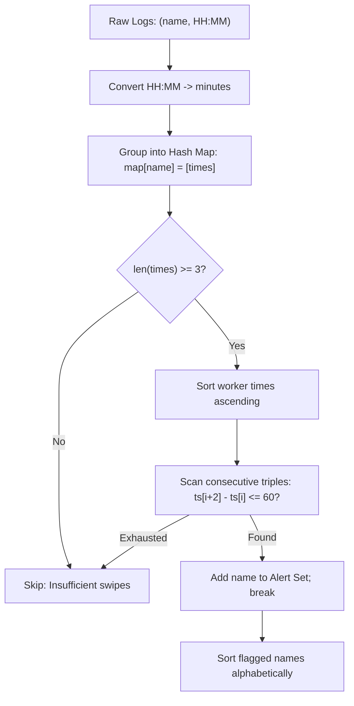

# Guided Example: Alert Using Same Key-Card Three or More Times in a One Hour Period

This guide demonstrates timestamp normalization, hash-based timeline grouping, and sliding consecutive triple window analysis to detect security key-card alert conditions within one-hour sliding intervals.

- **Key Names:** `["daniel", "daniel", "daniel", "luis", "luis", "luis", "luis"]`
- **Key Times:** `["10:00", "10:40", "11:00", "09:00", "11:00", "13:00", "15:00"]`
- **Target Output:** `["daniel"]`

---

## 1. Instance & Teaching Goal

A security system logs employee key-card badge swipes throughout a single 24-hour day. A key-card violation occurs if a single employee uses their card three or more times within any rolling 60-minute window $[T, T + 60]$ (inclusive). For example, access times `10:00` and `11:00` span exactly $60$ minutes and belong to the same valid one-hour interval.

We must return a list of all distinct employee names who triggered an alert, sorted in ascending alphabetical order.

```
Daniel's Timeline:
  10:00 (600m) ──[+40m]──> 10:40 (640m) ──[+20m]──> 11:00 (660m)
  Span from 1st to 3rd swipe: 660 - 600 = 60 minutes <= 60  [ALERT TRIGGERED]

Luis's Timeline:
  09:00 (540m) ──────────> 11:00 (660m) ──────────> 13:00 (780m) ──────────> 15:00 (900m)
  Window 1 [09:00 - 13:00]: 780 - 540 = 240 minutes > 60    [OK]
  Window 2 [11:00 - 15:00]: 900 - 660 = 240 minutes > 60    [OK]
```

Our teaching goal is to model clock conversion ($HH:MM \to \text{minutes}$) and prove why checking adjacent triples $t_{i+2} - t_i \le 60$ on sorted personal timestamps is both necessary and sufficient in $\mathcal{O}(N \log N)$ time.

---

## 2. Conceptual Foundation & Invariants

```
+-------------------------------------------------------------------------+
|                  TIMELINE PARTITION & TRIPLE SCAN                       |
|                                                                         |
|  Step 1: Clock Normalization                                            |
|    minute(HH:MM) = int(HH) * 60 + int(MM)                               |
|                                                                         |
|  Step 2: Partition by Worker                                            |
|    group[name].append(minute(time))                                     |
|                                                                         |
|  Step 3: Per-Worker Monotonic Sort                                      |
|    ts = sorted(group[name])                                             |
|                                                                         |
|  Step 4: Adjacent Triple Sliding Window                                 |
|    For index i from 0 to len(ts) - 3:                                   |
|        if ts[i + 2] - ts[i] <= 60:                                      |
|            alert(name); break                                           |
|                                                                         |
|  Step 5: Lexicographical Final Sort                                     |
|    return sorted(alerts)                                                |
+-------------------------------------------------------------------------+
```

| Component | Mathematical Representation | Algorithmic Role |
|---|---|---|
| Normalized Timestamp | $t = 60 \cdot H + M \in [0, 1439]$ | Maps clock strings to linear integer minutes |
| Personal Access List | $T_w = [t_{(0)}, t_{(1)}, \dots, t_{(k-1)}]$ | Monotonically ascending order of worker $w$'s card uses |
| Triple Interval Span | $\Delta_i = t_{(i+2)} - t_{(i)}$ | Time elapsed across three consecutive uses |
| Alert Criterion | $\exists i : \Delta_i \le 60$ | Confirms $\ge 3$ accesses within a 60-minute period |

> **Consecutive Triple Sufficiency Invariant.** If any subset of three or more timestamps $t_a \le t_b \le t_c$ satisfies $t_c - t_a \le 60$, then the two timestamps immediately succeeding $t_a$ in the sorted array, $t_{a+1}$ and $t_{a+2}$, must satisfy $t_{a+2} \le t_c$. Consequently, $t_{a+2} - t_a \le t_c - t_a \le 60$. Thus, inspecting only consecutive triples $t_{i+2} - t_i$ is guaranteed to discover every qualifying window without combinatorial search.



---

## 3. Step-by-Step Worked Execution

### Step 1: Clock Normalization and Grouping
Convert each time string to integer minutes from midnight:
- `"10:00"` $\to 10 \times 60 + 0 = 600$
- `"10:40"` $\to 10 \times 60 + 40 = 640$
- `"11:00"` $\to 11 \times 60 + 0 = 660$
- `"09:00"` $\to 9 \times 60 + 0 = 540$
- `"13:00"` $\to 13 \times 60 + 0 = 780$
- `"15:00"` $\to 15 \times 60 + 0 = 900$

Hash map populated:
- `group["daniel"] = [600, 640, 660]`
- `group["luis"] = [540, 660, 780, 900]`

---

### Step 2: Evaluating `"daniel"`
- Number of accesses: $3 \ge 3$. Candidate for inspection.
- Already sorted: $T_{\text{daniel}} = [600, 640, 660]$.
- Check consecutive triple at $i = 0$:
  $$\Delta_0 = T_{\text{daniel}}[2] - T_{\text{daniel}}[0] = 660 - 600 = 60$$
- Comparison: $60 \le 60$ is **True**.
- Alert condition satisfied! Add `"daniel"` to alerts and break.

---

### Step 3: Evaluating `"luis"`
- Number of accesses: $4 \ge 3$. Candidate for inspection.
- Already sorted: $T_{\text{luis}} = [540, 660, 780, 900]$.
- Check consecutive triple at $i = 0$:
  $$\Delta_0 = T_{\text{luis}}[2] - T_{\text{luis}}[0] = 780 - 540 = 240 > 60 \implies \text{False}$$
- Check consecutive triple at $i = 1$:
  $$\Delta_1 = T_{\text{luis}}[3] - T_{\text{luis}}[1] = 900 - 660 = 240 > 60 \implies \text{False}$$
- No qualifying window. `"luis"` is not alerted.

---

### Step 4: Lexicographical Output Formatting
- Alerted names set: `["daniel"]`.
- Sorted lexicographically: `["daniel"]`.

---

## 4. Complete Execution Trace

| Worker Name | Raw Timestamps | Converted Minutes $T_w$ | Window Tested $(i, i+1, i+2)$ | Span $\Delta = t_{i+2} - t_i$ | $\le 60$ Min Check | Alert Status |
|---|---|---|---|---|---|---|
| `"daniel"` | `10:00`, `10:40`, `11:00` | $[600, 640, 660]$ | $(600, 640, 660)$ | $660 - 600 = 60$ | **Pass** ($60 \le 60$) | **Flagged** |
| `"luis"` | `09:00`, `11:00`, `13:00`, `15:00` | $[540, 660, 780, 900]$ | $(540, 660, 780)$ | $780 - 540 = 240$ | Fail ($240 > 60$) | Safe |
| `"luis"` | — | — | $(660, 780, 900)$ | $900 - 660 = 240$ | Fail ($240 > 60$) | Safe |

Final output array: `["daniel"]`.

---

## 5. Algorithmic Correctness

**Soundness.** A worker is added to the alert list only if there exists an index $i$ in their chronologically sorted timeline such that $t_{i+2} - t_i \le 60$. The three timestamps $t_i, t_{i+1}, t_{i+2}$ represent three genuine, distinct key-card usages occurring in the closed interval $[t_i, t_i + 60]$, which satisfies the problem definition.

**Completeness.** Suppose an employee used their card three or more times in some arbitrary one-hour window $[S, S + 60]$. Let $t_a$ be the earliest use in that window, and let $t_c$ be any third use in that window ($t_c \le S + 60$). In the employee's sorted timeline, the timestamp two positions ahead of $t_a$ is $t_{a+2}$. Because all entries between $t_a$ and $t_c$ fall within $[t_a, t_c]$, we have $t_{a+2} \le t_c$, meaning $t_{a+2} - t_a \le t_c - t_a \le 60$. Hence, scanning consecutive triples guarantees that at least one triple will satisfy the alert criterion.

---

## 6. Traps This Instance Exposes

- **Strict Inequality on the 60-Minute Boundary:** Using `< 60` instead of `\le 60` incorrectly rejects standard one-hour intervals like `10:00` to `11:00` (which span exactly 60 minutes).
- **Redundant Combinatorial Triples:** Generating all $\binom{k}{3}$ triples per worker causes $\mathcal{O}(k^3)$ time per person. Sorting in $\mathcal{O}(k \log k)$ and testing only adjacent triples reduces the inspection to $\mathcal{O}(k)$ linear time.
- **Duplicate Output Names:** An employee who triggers multiple alert windows throughout the day must be returned exactly once. Breaking out of the triple scan upon the first detected alert prevents duplicates.

---

## 7. Complexity Derivation

- **Time Complexity:** $\mathcal{O}(N \log N)$, where $N$ is the total number of key-card records. Converting and grouping timestamps takes $\mathcal{O}(N)$ time. Sorting the timestamps for each individual employee takes $\sum \mathcal{O}(k_w \log k_w) \le \mathcal{O}(N \log N)$ time. Scanning consecutive triples takes $\mathcal{O}(N)$ total time. Sorting the final list of alerted names takes $\mathcal{O}(W \log W) \le \mathcal{O}(N \log N)$, where $W \le N$ is the number of distinct employees.
- **Auxiliary Space Complexity:** $\mathcal{O}(N)$ auxiliary space to store the hash map of normalized integer timestamps and the list of alerted names.
