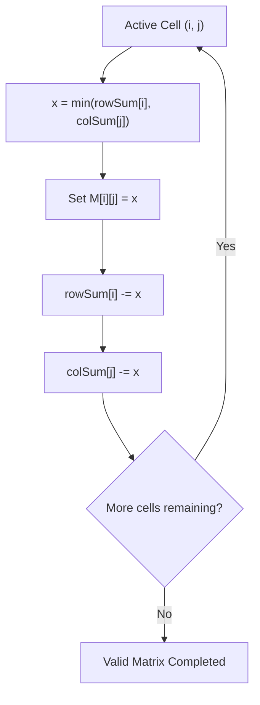

# Guided Example: Find Valid Matrix Given Row and Column Sums

This guide details the greedy Northwest-Corner transportation method used to construct a non-negative matrix satisfying prescribed row and column marginal sums.

- **Row Sum Targets:** `rowSum = [3, 8]` ($R = 2$)
- **Column Sum Targets:** `colSum = [4, 7]` ($C = 2$)
- **Total Sum Invariant:** $\sum \text{rowSum} = 3 + 8 = 11 = 4 + 7 = \sum \text{colSum}$
- **Target Matrix:**
  ```text
  [[3, 0],
   [1, 7]]
  ```

---

## 1. Instance & Teaching Goal

We must generate a 2D matrix $M$ of size $R \times C$ containing non-negative integers such that:
$$\sum_{j=0}^{C-1} M[i][j] = \text{rowSum}[i] \quad \forall i \in [0, R-1]$$
$$\sum_{i=0}^{R-1} M[i][j] = \text{colSum}[j] \quad \forall j \in [0, C-1]$$

While multiple valid matrices may exist, any configuration meeting both marginal constraints and non-negativity is valid.

```
            colSum:   4     7
rowSum:
   3                [ 3     0 ]  --> Row 0 Sum: 3 + 0 = 3
   8                [ 1     7 ]  --> Row 1 Sum: 1 + 7 = 8
                    -----------
Col Sums:             4     7
```

Our teaching goal is to trace how greedily assigning $M[i][j] = \min(\text{rowSum}[i], \text{colSum}[j])$ guarantees satisfaction of all marginal constraints without backtrack search.

---

## 2. Conceptual Foundation & Invariants

```
+-------------------------------------------------------------------------+
|                  GREEDY NORTHWEST-CORNER ALLOCATION                     |
|                                                                         |
|  At each cell (i, j) in row-major order:                                |
|                                                                         |
|  1. Determine Max Legal Assignment:                                     |
|       x = min(rowSum[i], colSum[j])                                     |
|                                                                         |
|  2. Assign Value:                                                       |
|       M[i][j] = x                                                       |
|                                                                         |
|  3. Deduct Allocated Margin:                                            |
|       rowSum[i] -= x                                                    |
|       colSum[j] -= x                                                    |
|                                                                         |
|  Outcome: At least one margin (row or col) is reduced to exactly 0.     |
+-------------------------------------------------------------------------+
```

| Parameter | Mathematical Domain | Operational Meaning |
|---|---|---|
| Row Remainder $\text{rowSum}[i]$ | $\ge 0$ | Unallocated capacity required in row $i$ |
| Column Remainder $\text{colSum}[j]$ | $\ge 0$ | Unallocated capacity required in column $j$ |
| Cell Value $M[i][j]$ | $\min(\text{rowSum}[i], \text{colSum}[j])$ | Maximum non-negative value satisfying both margins |

> **Marginal Balance Invariant.** After every cell assignment, the sum of remaining row requirements equals the sum of remaining column requirements: $\sum_{i} \text{rowSum}[i] = \sum_{j} \text{colSum}[j]$. Because $x = \min(\text{rowSum}[i], \text{colSum}[j]) \ge 0$, no requirement becomes negative, and exhausting one side leaves the residual balance strictly feasible for subsequent cells.



---

## 3. Step-by-Step Worked Execution

### Initialization
- Target matrix $M$ of size $2 \times 2$ filled with $0$.
- Working copies: $\text{rowSum} = [3, 8]$, $\text{colSum} = [4, 7]$.

---

### Step 1: Cell $(0, 0)$
- Available: $\text{rowSum}[0] = 3$, $\text{colSum}[0] = 4$.
- Greedy selection:
  $$x = \min(3, 4) = 3$$
- Assign: $M[0][0] = 3$.
- Margin updates:
  - $\text{rowSum}[0] \leftarrow 3 - 3 = 0$
  - $\text{colSum}[0] \leftarrow 4 - 3 = 1$
- State: $\text{rowSum} = [0, 8]$, $\text{colSum} = [1, 7]$.

---

### Step 2: Cell $(0, 1)$
- Available: $\text{rowSum}[0] = 0$, $\text{colSum}[1] = 7$.
- Greedy selection:
  $$x = \min(0, 7) = 0$$
- Assign: $M[0][1] = 0$.
- Margin updates:
  - $\text{rowSum}[0] \leftarrow 0 - 0 = 0$
  - $\text{colSum}[1] \leftarrow 7 - 0 = 7$
- State: $\text{rowSum} = [0, 8]$, $\text{colSum} = [1, 7]$. Row $0$ is completely fulfilled.

---

### Step 3: Cell $(1, 0)$
- Available: $\text{rowSum}[1] = 8$, $\text{colSum}[0] = 1$.
- Greedy selection:
  $$x = \min(8, 1) = 1$$
- Assign: $M[1][0] = 1$.
- Margin updates:
  - $\text{rowSum}[1] \leftarrow 8 - 1 = 7$
  - $\text{colSum}[0] \leftarrow 1 - 1 = 0$
- State: $\text{rowSum} = [0, 7]$, $\text{colSum} = [0, 7]$. Column $0$ is completely fulfilled.

---

### Step 4: Cell $(1, 1)$
- Available: $\text{rowSum}[1] = 7$, $\text{colSum}[1] = 7$.
- Greedy selection:
  $$x = \min(7, 7) = 7$$
- Assign: $M[1][1] = 7$.
- Margin updates:
  - $\text{rowSum}[1] \leftarrow 7 - 7 = 0$
  - $\text{colSum}[1] \leftarrow 7 - 7 = 0$
- Final state: $\text{rowSum} = [0, 0]$, $\text{colSum} = [0, 0]$.

All margins exhausted to zero.

---

## 4. Complete Execution Trace

| Coordinate $(i, j)$ | Row Margin $\text{rowSum}[i]$ | Col Margin $\text{colSum}[j]$ | Chosen $x = \min(\text{row}, \text{col})$ | Updated $\text{rowSum}$ | Updated $\text{colSum}$ | Matrix Cell Assigned |
|---|---|---|---|---|---|---|
| $(0, 0)$ | $3$ | $4$ | $3$ | $[0, 8]$ | $[1, 7]$ | $M[0][0] = 3$ |
| $(0, 1)$ | $0$ | $7$ | $0$ | $[0, 8]$ | $[1, 7]$ | $M[0][1] = 0$ |
| $(1, 0)$ | $8$ | $1$ | $1$ | $[0, 7]$ | $[0, 7]$ | $M[1][0] = 1$ |
| $(1, 1)$ | $7$ | $7$ | $7$ | $[0, 0]$ | $[0, 0]$ | $M[1][1] = 7$ |

Verification:
- Row $0$: $3 + 0 = 3$ (Matches original $\text{rowSum}[0]$)
- Row $1$: $1 + 7 = 8$ (Matches original $\text{rowSum}[1]$)
- Col $0$: $3 + 1 = 4$ (Matches original $\text{colSum}[0]$)
- Col $1$: $0 + 7 = 7$ (Matches original $\text{colSum}[1]$)

---

## 5. Algorithmic Correctness

**Soundness.** Since $x = \min(\text{rowSum}[i], \text{colSum}[j])$ and all remaining margins begin and remain non-negative, every assigned matrix entry $M[i][j]$ is non-negative ($M[i][j] \ge 0$). Because the exact value $x$ is subtracted simultaneously from both $\text{rowSum}[i]$ and $\text{colSum}[j]$, the sum of values placed in row $i$ cannot exceed the initial target, nor can the sum of values in column $j$.

**Completeness.** Since the sum of row requirements equals the sum of column requirements initially ($\sum \text{rowSum}[i] = \sum \text{colSum}[j]$), and each step subtracts identical amounts from both total sums, the remaining sums stay equal throughout the process. When the final cell $(R-1, C-1)$ is reached, all other rows and columns have been drained to zero, leaving $\text{rowSum}[R-1] = \text{colSum}[C-1]$. Setting $M[R-1][C-1]$ to this common value exhausts both margins to $0$ simultaneously.

---

## 6. Traps This Instance Exposes

- **Over-Allocation Violations:** Assigning a value larger than $\min(\text{rowSum}[i], \text{colSum}[j])$ to satisfy a row requirement immediately forces a column requirement to become negative, which violates the problem's non-negativity constraint.
- **Input Array Destruction:** In-place decrements directly mutate the caller's arrays. If the caller requires the original row and column sums for verification, shallow copies must be cloned first.
- **Unequal Sum Infeasibility:** The greedy strategy relies strictly on the mathematical guarantee that $\sum \text{rowSum} = \sum \text{colSum}$. If inputs violate this condition, no non-negative solution matrix can exist.

---

## 7. Complexity Derivation

- **Time Complexity:** $\mathcal{O}(R \cdot C)$, where $R$ is the number of rows and $C$ is the number of columns. Every cell in the $R \times C$ matrix is visited exactly once, performing constant-time comparisons and subtractions.
- **Auxiliary Space Complexity:** $\mathcal{O}(1)$ auxiliary space excluding the returned $R \times C$ output matrix.
