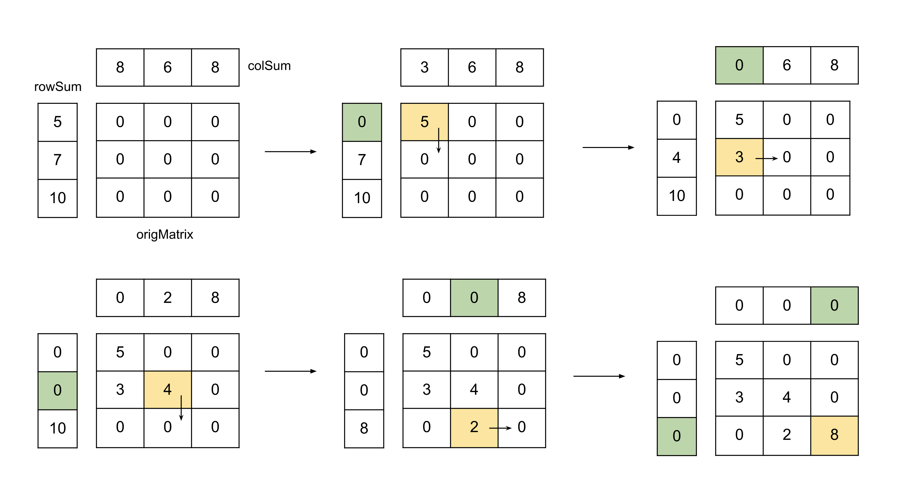

## Solution

---

### Approach 1: Greedy

#### Intuition

Imagine there is a non-negative integer matrix `origMatrix` with dimensions $N \times M$. We have performed a sum operation on each row and column of the matrix, storing the results in two lists: `rowSum` and `colSum`. The list `rowSum` of size $N$ contains the sum of each row of the original matrix, while the list `colSum` of size $M$ contains the sum of each column. Given these two lists, `rowSum` and `colSum`, we need to reconstruct the original matrix `origMatrix`. The inputs are guaranteed to be valid, meaning at least one solution exists, and any valid matrix can be returned in the case of multiple solutions.

Let's think about the value we can assign to a particular cell at row `r` and column `c`. We need to assign such a value that the total sum in the row doesn't exceed $\text{rowSum}[r]$ and total sum in the column doesn't exceed $\text{colSum}[c]$. This is because we can only have non-negative integers in the matrix and hence we cannot exceed the total sum. We can greedily choose the maximum number we can assign to a cell and what should it be? The maximum value we can assign considering only the rows will be $\text{rowSum}[r] - sum of all cells we have filled in row r so far$, similarly the maximum value we can assign considering only the columns will be $\text{colSum}[c] - sum of all cells we have filled in the column c so far$. As just discussed we cannot exceed the total sum in any of the two constraints (row and column) we will choose the minimum of these two values to assign to the cell at `(r, c)`.

To achieve this, we iterate over the elements of the matrix, maintaining the cumulative sums of the rows and columns processed so far. Let $\text{currRowSum}[i]$ represent the sum of the elements in the $i$-th row up to the current element, and $\text{currColSum}[j]$ represent the sum of the elements in the $j$-th column up to the current element. For the cell `(i, j)`, the value can be determined as:

$K = \min(\text{rowSum}[i] - \text{currRowSum}[i], \text{colSum}[j] - \text{currColSum}[j])$

This ensures that the sum of the $i$-th row does not exceed $\text{rowSum}[i]$ and the sum of the $j$-th column does not exceed $\text{colSum}[j]$. After determining $K$, we update $\text{currRowSum}[i]$ and $\text{currColSum}[j]$ by adding $K$.

We initialize `currRowSum` and `currColSum` to zero and proceed from the top left to the bottom right of the matrix, filling in the values and storing them in `origMatrix`.

#### Algorithm

1. Initialize the number of rows and number of columns as $N$ and $M$ respectively.
2. Initialize two lists `currRowSum` and `currColSum` of size $N$ and $M$ respectively with values as zero.
3. Initialize the answer matrix `origMatrix` of size $N * M$ with all values as zero.
4. Iterate over all cells in the matrix and for each cell `(i, j)`, do the following:

- Store the value in $\text{origMatrix}[i][j]$ as $min(\text{rowSum}[i] - \text{currRowSum}[i], \text{colSum}[j] - \text{currColSum}[j])$.
- Add the above value to $\text{currRowSum}[i]$ and $\text{currColSum}[j]$.
5. Return `origMatrix`.

#### Implementation

```python
class Solution:
    def restoreMatrix(self, rowSum, colSum):
        N = len(rowSum)
        M = len(colSum)

        curr_row_sum = [0] * N
        curr_col_sum = [0] * M

        orig_matrix = [[0] * M for _ in range(N)]
        for i in range(N):
            for j in range(M):
                orig_matrix[i][j] = min(
                    rowSum[i] - curr_row_sum[i], colSum[j] - curr_col_sum[j]
                )

                curr_row_sum[i] += orig_matrix[i][j]
                curr_col_sum[j] += orig_matrix[i][j]

        return orig_matrix
```

#### Complexity Analysis

Here,$N$ is the number size of the list `rowSum` and $M$ is the size of the list `colSum`.

* Time complexity: $O(N \times M)$.

    Initializing the answer matrix `origMatrix` takes $O(N \times M)$ time. Also, we iterate over each of the $N \times M$ cells to find the values. Hence, the total time complexity is equal to $O(N \times M)$.

* Space complexity: $O(N + M)$.

    The space required to store the answer is not considered part of the space complexity. Therefore, the space required for this approach is the two lists to store the current sum of rows and columns. Hence, the total space complexity is equal to $O(N + M)$.

---

### Approach 2: Space Optimized Greedy

#### Intuition

> Note: In an interview setting, an approach that involves changing the input is generally not recommended. This and the next approach will change the input matrix and are added for the sake of completion. While suggesting these approaches in an interview the downside of the changing input must be called out.

In the previous approach, we used two lists, `currRowSum` and `currColSum`, to keep track of the cumulative sums of elements for each row and column. However, we can eliminate the need for these lists by directly updating the given `rowSum` and `colSum` lists.

Instead of maintaining the cumulative sums, we will now keep track of the remaining sums. For each cell `(i, j)`, we assign a value equal to $min(\text{rowSum}[i], \text{colSum}[j])$. After assigning this value to $\text{origMatrix}[i][j]$, we subtract it from both $\text{rowSum}[i]$ and $\text{colSum}[j]$.

By updating $\text{rowSum}[i]$ and $\text{colSum}[j]$ in this manner, they will always represent the maximum possible value that can be assigned to the current cell `(i, j)`. This approach eliminates the need for additional space to store cumulative sums and simplifies the implementation.

#### Algorithm

1. Initialize the number of rows and number of columns as $N$ and $M$ respectively.
2. Initialize the answer matrix `origMatrix` of size $N * M$ with all values as zero.
3. Iterate over all cells in the matrix and for each cell `(i, j)`, do the following:

- Store the value in $\text{origMatrix}[i][j]$ as $min(\text{rowSum}[i], \text{colSum}[j])$.
- Subtract the above value from $\text{rowSum}[i]$ and $\text{colSum}[j]$.
4. Return `origMatrix`.

#### Implementation

```python
class Solution:
    def restoreMatrix(self, rowSum, colSum):
        N = len(rowSum)
        M = len(colSum)

        orig_matrix = [[0] * M for _ in range(N)]
        for i in range(N):
            for j in range(M):
                orig_matrix[i][j] = min(rowSum[i], colSum[j])

                rowSum[i] -= orig_matrix[i][j]
                colSum[j] -= orig_matrix[i][j]

        return orig_matrix
```

#### Complexity Analysis

Here, $N$ is the number size of the list `rowSum` and $M$ is the size of the list `colSum`.

* Time complexity: $O(N * M)$.

    Initializing the answer matrix `origMatrix` takes $O(N \times M)$ time. Also, we iterate over each of the $N \times M$ cells to find the values. Hence, the total time complexity is equal to $O(N \times M)$.

* Space complexity: $O(1)$.

    The space required to store the answer is not considered part of the space complexity. We don't require any extra space other than the matrix to store the answer. Hence, the total space complexity is constant.

---

### Approach 3: Time + Space Optimized Greedy

#### Intuition

If we observe the previous approach closely, we are assigning the minimum of $(\text{rowSum}[i], \text{colSum}[j])$ to the cell `(i, j)` and then subtracting this minimum value from both $\text{rowSum}[i]$ and $\text{colSum}[j]$. This implies that at each iteration, one of $\text{rowSum}[i]$ or $\text{colSum}[j]$ will become zero, i.e., whichever is the minimum will become zero.

When $\text{rowSum}[i]$ becomes zero, all future operations involving `i` as the row index will have $min(\text{rowSum}[i], \text{colSum}[j])$ equal to zero. Similarly, when $\text{colSum}[j]$ becomes zero, all future operations involving `j` as the column index will also have $min(\text{rowSum}[i], \text{colSum}[j])$ equal to zero.

This means that we need only one operation for a pair of row and column `(i, j)`. When iterating over the cells, for each pair `(i, j)`, we will either make $\text{rowSum}[i]$ or $\text{colSum}[j]$ zero, allowing us to skip subsequent operations for that row or column respectively.

We will implement this with a while loop that runs while the row index `i` and column index `j` are within their respective sizes. In each iteration, we find the value to assign to the current cell as $min(\text{rowSum}[i], \text{colSum}[j])$, and subtract this from both $\text{rowSum}[i]$ and $\text{colSum}[j]$. If $\text{rowSum}[i]$ becomes zero, we increment `i`; otherwise, we increment `j`. Finally, we return the matrix `origMatrix`.



#### Algorithm

1. Initialize the number of rows and number of columns as $N$ and $M$ respectively.
2. Initialize the answer matrix `origMatrix` of size $N * M$ with all values as zero.
3. Initialize the row index `i` and column index `j` to `0`.
4. Iterate over all cells`(i, j)` while both `i` and `j` are within the boundary, do the following:

- Store the value in $\text{origMatrix}[i][j]$ as $min(\text{rowSum}[i], \text{colSum}[j])$.
- Subtract the above value from $\text{rowSum}[i]$ and $\text{colSum}[j]$.
- If $\text{rowSum}[i]$ becomes `0`, increment `i` otherwise increment the variable `j`.
5. Return `origMatrix`.

#### Implementation

```python
class Solution:
    def restoreMatrix(self, rowSum, colSum):
        N = len(rowSum)
        M = len(colSum)

        orig_matrix = [[0] * M for _ in range(N)]
        i, j = 0, 0

        while i < N and j < M:
            orig_matrix[i][j] = min(rowSum[i], colSum[j])

            rowSum[i] -= orig_matrix[i][j]
            colSum[j] -= orig_matrix[i][j]

            if rowSum[i] == 0:
                i += 1
            else:
                j += 1

        return orig_matrix
```

#### Complexity Analysis

Here, $N$ is the number size of the list `rowSum` and $M$ is the size of the list `colSum`.

* Time complexity: $O(N \times M)$.

    Initializing the answer matrix `origMatrix` takes $O(N \times M)$ time. To store the values in the answer matrix we performed $O(N + M)$ operations as we skipped either the row or column at each iteration. Hence, the total time complexity is equal to $O(N \times M)$.

* Space complexity: $O(1)$.

    The space required to store the answer is not considered part of the space complexity. We don't require any extra space other than the matrix to store the answer. Hence, the total space complexity is constant.

---